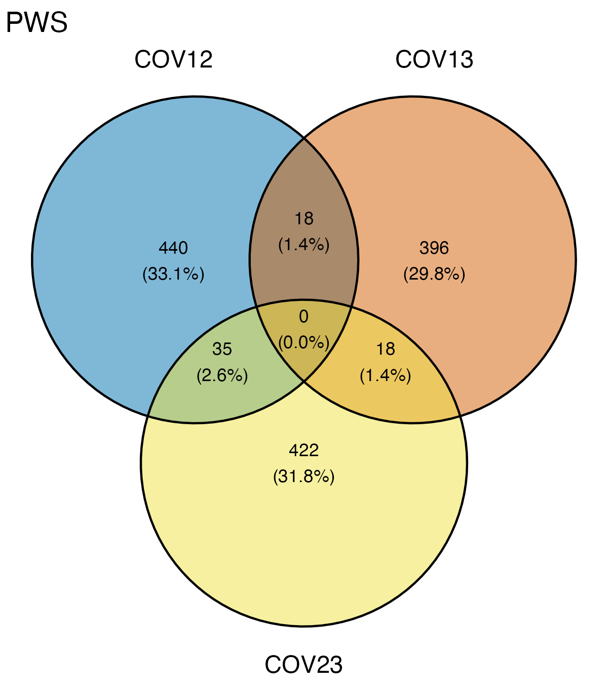

* This notebook summarizes the results from cvtkpy (Genome-wide temporal covariances of allele frequencies).  
* The covariance window size used is 100k (but the window sizes did not affect the results) 

```{r eval=FALSE, message=FALSE, warning=FALSE, include=FALSE}
source("BaseScripts.R")
library(tidyverse)
library(dplyr)
library(cowplot)
library(scales)
library(ggvenn)
```


# Plots COVs results
* CIs from the 'standard' bootstrap method

```{r eval=FALSE, message=FALSE, warning=FALSE}
pops<-c("PWS","TB","SS")
covs<-data.frame()
for (p in 1: length(pops)){
    #covariance output file
    cov<-read.csv(paste0("../cvtk_analysis/MD2000_3pops_maf05_temp_cov_matrix_",pops[p],"_100k.csv"))
    cov<-cov[,-1]
        
    #reshape the matrix
    mat1<-cov[1:3,]
    mat2<-cov[4:6,]
        
    covdf<-data.frame()
    k=1
    for (i in 1:nrow(mat1)){
        for (j in 1:ncol(mat1)){
            covdf[k,1]<-mat2[i,j]
            covdf[k,2]<-mat1[i,j]
            k=k+1
        }
    }
    colnames(covdf)<-c("label","value")
    covdf$value<-as.numeric(covdf$value)
    covar<-covdf[grep("cov",covdf$label),]
        
    #remove the redundant values
    if (pops[p]!="SS") covar<-covar[!duplicated(covar[, 2]),] 
    if (pops[p]=="SS") covar<-covar[c(1,2,4),]
        
    #assign the starting time period and covering period values
    covar$year<-c(1,2,2)
    covar$series<-c("1991","1991","1996")
        
    #assign population name
    covar$location<-pops[p]
    
    #combine in to one matrix
    covs<-rbind(covs, covar)
}

covs$time<-rep(c("cov12","cov13","cov23"), 3)
colnames(covs)[2]<-"cov"

# 95% confidence intervals (calculated from the 'straps' returned from bootstrap_cov2() ci=1.96*sd(straps))
time<-c("cov12","cov13","cov23")

covs$ci<-NA
for (i in 1:length(pops)){  
     if (i!=3){
        df<-read.csv(paste0("../cvtk_analysis/MD2000_",pops[i],"_CIs_100kwindow.csv"), header=F)
        covs$ci[covs$location==pops[i]&time=='cov12']<-df[1,2]
        covs$ci[covs$location==pops[i]&time=='cov13']<-df[1,3]
        covs$ci[covs$location==pops[i]&time=='cov23']<-df[2,3]
    }
    if (p==3) {
        df<-read.csv(paste0("../cvtk_analysis/MD2000_",pops[i],"_CIs_100kwindow.csv"), header=F)
        covs$ci[covs$location==pops[i]&time=='cov23']<-df[1,2] 
    }
}

write.csv(covs,"../Output/COV_analysis/MD2000_GW_covariance_CIs.csv")

xtexts<-c("\u03941991-1996\n ~ \u03941996-2006", "\n  ~ \u03942006-2017")

ggplot(data=covs, aes(x=year, y=cov, color=location, shape=series, group=interaction(location, series)))+
        geom_point(size=3, position=position_dodge(width = 0.1,preserve ="total"))+
        geom_line(data=covs, aes(x=year, y=cov,color=location, group=interaction(location, series)), position=position_dodge(width = 0.1,preserve ="total"))+
        ylab("Covariance")+xlab('')+theme_classic()+
        theme(legend.title = element_blank())+
        geom_hline(yintercept = 0,color="gray70", size=0.3)+
        geom_errorbar(aes(ymin=cov-ci, ymax=cov+ci), width=.2, size=.2, position=position_dodge(width = 0.1,preserve ="total"))+
        scale_shape_manual(values=c(16,17),labels=c("\u0394'91-'96~","\u0394'96-'06~"))+
        scale_x_continuous(breaks = c(1,2), labels=xtexts)+
        scale_color_manual(values=cols[c(2,3,1)])+ylim(-0.0037,0.0013)
ggsave(paste0("../Output/COV_analysis/MD2000_3Pops_Cov_overtime_CIestimated.png"),width = 4.7, height = 3, dpi=300)
    
covs$time<-factor(covs$time, levels=c("cov12","cov23","cov13"))
xtexts<-c("\u0394'91-'96\n ~ \u0394'96-'06", "\u0394'96-'06\n  ~ \u0394'06-'17", "\u0394'91-'96\n  ~ \u0394'06-'17")

ggplot(data=covs, aes(x=time, y=cov, color=location))+
        geom_point(size=3, position=position_dodge(width = 0.1,preserve ="total"))+
        ylab("Covariance")+xlab('')+theme_classic()+
        theme(legend.title = element_blank(), axis.text.x = element_text(size=9))+
        geom_hline(yintercept = 0,color="gray70", size=0.3)+
        geom_errorbar(aes(ymin=cov-ci, ymax=cov+ci), width=.2, size=.2, position=position_dodge(width = 0.1,preserve ="total"))+
        scale_x_discrete(labels=xtexts)+
    scale_color_manual(values=cols[c(2,3,1)])+
    geom_vline(xintercept = c(1.5,2.5), color="gray", size=0.2)+ylim(-0.0038,0.0014)
ggsave(paste0("../Output/COV_analysis/MD2000_3Pops_Cov_CI_3timepoints.png"),width = 4.57, height = 3, dpi=300)

```


* Same results but plot differently 

  


# Find regions with high covariances (outlier regions) in each population

## Plot the covariances across the genome  

```{r eval=FALSE, message=FALSE, warning=FALSE}

#Find the regions with a high temporal covariance 
pops<-c("PWS","TB","SS")
evens<-paste0("chr",seq(2,26, by=2))
cov.list<-list()
covs_all<-list()
k=1
for (p in 1: length(pops)){
    pop<-pops[p]
    iv<-read.csv(paste0("../cvtk_analysis/3pops_intervals_100kwindow.csv"), row.names = 1)
    if (p==3) {
        cov23<-read.csv(paste0("../cvtk_analysis/",pop,"_cov23_MD2000_100kwindow.csv"), header = F)
        covs<-cbind(iv, cov23)
        colnames(covs)[4]<-c("cov23")
        covs$index=1:nrow(covs)
        covs$color<-"col1"
        covs$color[covs$chrom %in% evens]<-"col2"

        covs[sapply(covs, is.infinite)] <- NA
        covs[sapply(covs, is.nan)] <- NA
        
        cov.list[[k]]<-covs
        names(cov.list)[k]<-pop
        k=k+1
            
        y<-min(covs$cov23, na.rm=T)
        ymin<-ifelse (y<=-0.1,-0.1, y) 
        ymax<-max(covs$cov23, na.rm=T)
        ggplot(covs, aes(x=index, y=cov23, color=color))+
            geom_point(size=1, alpha=0.5)+
            theme_classic()+
            ylim(ymin,ymax)+
            scale_color_manual(values=c("gray70","steelblue"), guide="none")+
            ylab("Covariance")+xlab('Chromosome')+
            theme(axis.text.x = element_blank())+
            ggtitle(pop)
        ggsave(paste0("../Output/COV_analysis/",pop,"_MD2000_tempCovs_acrossGenome_100kWindow.png"), width = 8, height = 2.7, dpi=300) 
        }
    else {
        cov12<-read.csv(paste0("../cvtk_analysis/",pop,"_cov12_MD2000_100kwindow.csv"), header = F)
        cov23<-read.csv(paste0("../cvtk_analysis/",pop,"_cov23_MD2000_100kwindow.csv"), header = F)
        cov13<-read.csv(paste0("../cvtk_analysis/",pop,"_cov13_MD2000_100kwindow.csv"), header = F)
        covs<-cbind(iv, cov12, cov23,cov13)
        colnames(covs)[4:6]<-c("cov12","cov23","cov13")
        covs$index=1:nrow(covs)
    
        covs$color<-"col1"
        covs$color[covs$chrom %in% evens]<-"col2"
    
        covs[sapply(covs, is.infinite)] <- NA
        covs[sapply(covs, is.nan)] <- NA
        
        cov.list[[k]]<-covs
        names(cov.list)[k]<-pop
        k=k+1
        covsm<-melt(covs[,c("index","color","cov12","cov23","cov13")], id.vars = c("index", "color"))
        ymax<-max(covsm$value, na.rm=T)
        y<-min(covsm$value, na.rm=T)
        ymin<-ifelse (y<=-0.1,-0.1, y) 
        ggplot(covsm, aes(x=index, y=value, color=color))+
            facet_wrap(~variable, nrow=3)+
            geom_point(size=1, alpha=0.5)+
            theme_classic()+
            ylim(ymin,ymax)+
            scale_color_manual(values=c("gray70","steelblue"), guide="none")+
            ylab("Covariance")+xlab('Chromosome')+
            theme(axis.text.x = element_blank())+
            ggtitle(paste0(pop))
        ggsave(paste0("../Output/COV_analysis/",pop,"_MD2000_tempCovs_acrossGenome_100kWindow.png"), width = 8, height = 8, dpi=300)    
    }
}
```

{width=75%}

{width=75%}

{width=75%}


# Find the covariance lower cut off values for outlier analysis (top1%)
## Plot the outlier ranges  
```{r eval=FALSE, message=FALSE, warning=FALSE}

# Top 1% covariance values for all Pop x Time points
cv<-c("cov12","cov13","cov23")
cvrange<-data.frame(pop=c(paste0(pops[1:2],"_", cv[1]),paste0(pops[1:2],"_", cv[2]),paste0(pops,"_", cv[3])))
k=1
for (i in 1:length(cv)){
    if (i==1|i==2){
        if (i==1) k=1
        if (i==2) k=3
        #PWS
        df1<-cov.list[[paste0("PWS")]]
        df1<-df1[order(df1[,cv[i]], decreasing=T),]
        n<-ceiling(nrow(df1)*0.01) #top1% region
        df1$top1<-"N"
        df1$top1[1:n]<-"PWS"
        rg<-range(df1[df1$top1=="PWS",cv[i]], na.rm=T)
        cvrange[k,"100k"]<-paste0(rg[1],"-",rg[2])
          
        #tb
        df2<-cov.list[["TB"]]
        df2<-df2[order(df2[,cv[i]], decreasing=T),]
        df2$top1<-"N"
        df2$top1[1:n]<-"TB"
        rg2<-range(df2[df2$top1=="TB", cv[i]], na.rm=T)
        cvrange[(k+1),"100k"]<-paste0(rg2[1],"-",rg2[2])
    }
   
    if (i==3){
        k=5
        #pws
        df1<-cov.list[["PWS"]]
        df1<-df1[,c("chrom","start","end","cov23")]
        df1<-df1[order(df1$cov23, decreasing=T),]
        n<-ceiling(nrow(df1)*0.01) #top1% region
        df1$top1<-"N"
        df1$top1[1:n]<-"PWS"
        
        rg<-range(df1[df1$top1=="PWS",cv[i]], na.rm=T)
        cvrange[k,"100k"]<-paste0(rg[1],"-",rg[2])
           
        #tb
        df2<-cov.list[["TB"]]
        df2<-df2[,c("chrom","start","end","cov23")]
        df2<-df2[order(df2$cov23, decreasing=T),]
        df2$top1<-"N"
        df2$top1[1:n]<-"TB"
        rg2<-range(df2[df2$top1=="TB", cv[i]], na.rm=T)
        cvrange[(k+1),"100k"]<-paste0(rg2[1],"-",rg2[2])
    
        #ss
        df3<-cov.list[["SS"]]
        df3<-df3[,c("chrom","start","end","cov23")]
        df3<-df3[order(df3$cov23, decreasing=T),]
        df3$top1<-"N"
        df3$top1[1:n]<-"SS"
        rg3<-range(df3[df3$top1=="SS", cv[i]], na.rm=T)
        cvrange[(k+2),"100k"]<-paste0(rg3[1],"-",rg3[2])
    }
}


cvs<-melt(cvrange, id.vars = "pop")
cvs<-cvs %>%
  separate(value, c("low", "high"), "-")
cvs$low<-as.numeric(cvs$low)
cvs$high<-as.numeric(cvs$high)
cvs<-cvs%>%
  separate(pop, c("pop", "cov"), "_")

ggplot(cvs, aes(x=cov, y=low, color=pop))+
    geom_point(size=3)+
    ylab("Lower limit of top 1% covariance")+
    theme_light()+xlab("")+
    geom_vline(xintercept=c(1.5,2.5), color="gray")+scale_color_manual(values=cols[c(2,3,1)])+
    theme(panel.grid.major = element_blank(), panel.grid.minor = element_blank(), legend.title=element_blank())
ggsave("../Output/COV_analysis/TempCov_Range_lowLimit_comparison_MD2000.png", width = 5, height = 3, dpi=300)

```


## Use the highest values for each time period to define outlier regions 

```{r eval=FALSE, message=FALSE, warning=FALSE}

lows<-aggregate(cvs$low, by=list(cvs$cov), max)
names(lows)<-c("cov","low")
#low cutoff for each time period (100k-window)
#   cov        low
#1 cov12 0.02985278
#2 cov13 0.03558964
#3 cov23 0.03419953
write.csv(lows, "../Output/COV_analysis/Cutoff_covs_max.csv", row.names = F)

# Outliers based on the new low cut-off values 100k window. 
cov12<-data.frame()
cov23<-data.frame()
cov13<-data.frame()

for (i in 1:length(cov.list)){
 #PWS and TB
  if (i==1|i==2){
    covs<-cov.list[[i]]
    pop<-names(cov.list)[i]
  
    #outlier cutoff value
    x<-lows$low[lows$cov=="cov12"]
    covs12_top<-subset(covs, cov12>=x)
    covs12_top<-covs12_top[order(covs12_top$chrom, covs12_top$start),]
    covs12_top$pop<-pop
    cov12<-rbind(cov12, covs12_top)
    
    covs<-covs[order(covs$cov13, decreasing=T),]
    x<-lows$low[lows$cov=="cov13"]
    covs13_top<-subset(covs, cov13>=x)
    covs13_top<-covs13_top[order(covs13_top$chrom, covs13_top$start),]
    covs13_top$pop<-pop
    cov13<-rbind(cov13, covs13_top)
    
    covs<-covs[order(covs$cov23, decreasing=T),]
    x<-lows$low[lows$cov=="cov23"]
    covs23_top<-subset(covs[,c("chrom","start","end","cov23","index","color")], cov23>=x)
    covs23_top<-covs23_top[order(covs23_top$chrom, covs23_top$start),]
    covs23_top$pop<-pop
    cov23<-rbind(cov23, covs23_top)
 }
 if (grepl("SS",names(cov.list)[i])){
    covs<-cov.list[[i]]
    
    pop<-gsub("_.+",'', names(cov.list)[i])
    win<-gsub(paste0(pop,"_"), '', names(cov.list)[i])
    
    covs<-covs[order(covs$cov23, decreasing=T),]
    x<-lows$low[lows$cov=="cov23"]
    covs23_top<-subset(covs, cov23>=x)
    covs23_top<-covs23_top[order(covs23_top$chrom, covs23_top$start),]
    covs23_top$pop<-pop
    cov23<-rbind(cov23, covs23_top)
    }
}

write.csv(cov12, "../Output/COV_analysis/3pops_top1percent_outlier_cutoff.cov12.csv",row.names = F)
write.csv(cov23, "../Output/COV_analysis/3pops_top1percent_outlier_cutoff.cov23.csv",row.names = F)
write.csv(cov13, "../Output/COV_analysis/3pops_top1percent_outlier_cutoff.cov13.csv",row.names = F)
```


## Create plots with different colors for outliers
### Each time period  

```{r eval=FALSE, message=FALSE, warning=FALSE}
#for COV12 and COV13 for TB and PWS (100K)
cv<-c("cov12","cov13","cov23")
for (i in 1:length(cv)){
    if (i==1|i==2){
        #cutoff value
        x<-lows$low[lows$cov==cv[i]]
        #PWS
        df1<-cov.list[["PWS"]]
        df1<-df1[order(df1[,cv[i]], decreasing=T),]
        df1$top1<-"N"
        df1$top1[df1[,cv[i]]>=x]<-"PWS"
        
        #tb
        df2<-cov.list[["TB"]]
        df2<-df2[order(df2[,cv[i]], decreasing=T),]
        df2$top1<-"N"
        df2$top1[df2[,cv[i]]>=x]<-"TB"
        
        #Combine PWS and TB tables
        co<-rbind(df1, df2)
        co$chrom<-factor(co$chrom, levels=paste0("chr", 1:26))
        co$top1<-factor(co$top1, levels=c("PWS","TB","N"))
        colnames(co)[which(colnames(co)==cv[i])]<-"cov"
    
        ymax<-max(co$cov, na.rm=T)
        #assign colors
        co$top1<-apply(co, 1, function(x) {ifelse (x['top1']=="N", x['color'], x['top1'])} )
        co$top1<-factor(co$top1, levels=c("PWS","TB","col1","col2"))
        
        #count the number of sites per chromosomes
        poss<-data.frame(chr=paste0("chr",1:26))
        k=1
        for (j in 1:26){
            df<-df1[df1$chr==paste0("chr",j),]
            poss$start[j]<-k
            poss$end[j]<-k+nrow(df)-1
            k=k+nrow(df)
        }
        poss$x<-poss$start+(poss$end-poss$start)/2
        ymax<-max(co$cov, na.rm=T)
        ggplot(co, aes(x=index, y=cov, color=top1))+
            geom_point(size=0.5)+
            theme_classic()+ylim(-0.1,ymax)+
            scale_color_manual(values=c(paste0(cols[2],"B3"),paste0(cols[1],"B3"),"#A8BBCD66","#D6D6D666"), labels=c("PWS", "TB", "",""))+
            ylab("Covariance")+
            ggtitle(paste0("100k window ",cv[i]))+
            guides(color = guide_legend(override.aes = list(color=c(cols[2], cols[1],"white","white"), size=2), title=element_text("Outlier Region", size=10)))+
            scale_x_continuous(name="Chromosome", breaks=poss$x, labels=1:26)
        ggsave(paste0("../Output/COV_analysis/3Pops.",cv[i],"_100k_Window_Outliers.png"), width = 10, height = 3.5, dpi=300)
    }
   
    if (i==3){
       #cutoff value
        x<-lows$low[lows$cov==cv[i]]
        #PWS
        df1<-cov.list[["PWS"]]
        df1<-df1[,c("chrom","start","end","cov23","index","color")]
        df1<-df1[order(df1$cov23, decreasing=T),]
        df1$top1<-"N"
        df1$top1[df1[,cv[i]]>=x]<-"PWS"
        
        #tb
        df2<-cov.list[["TB"]]
        df2<-df2[,c("chrom","start","end","cov23","index","color")]
        df2<-df2[order(df2$cov23, decreasing=T),]
        df2$top1<-"N"
        df2$top1[df2[,cv[i]]>=x]<-"TB"
    
        #ss
        df3<-cov.list[["SS"]]
        df3<-df3[,c("chrom","start","end","cov23","index","color")]
        df3<-df3[order(df3$cov23, decreasing=T),]
        df3$top1<-"N"
        df3$top1[df3[,cv[i]]>=x]<-"SS"

        co<-rbind(df1,df2,df3)

        co$chrom<-factor(co$chrom, levels=paste0("chr", 1:26))
        co$top1<-factor(co$top1, levels=c("PWS","TB","SS","N"))
        ymax<-max(co$cov23, na.rm=T)
        
        #assign colors
        co$top1<-apply(co, 1, function(x) {ifelse (x['top1']=="N", x['color'], x['top1'])} )
        co$top1<-factor(co$top1, levels=c("PWS","TB","SS","col1","col2"))
        #count the number of sites per chromosomes
        poss<-data.frame(chr=paste0("chr",1:26))
        k=1
        for (j in 1:26){
            df<-df1[df1$chr==paste0("chr",j),]
            poss$start[j]<-k
            poss$end[j]<-k+nrow(df)-1
            k=k+nrow(df)
        }
        poss$x<-poss$start+(poss$end-poss$start)/2
        ymax<-max(co$cov, na.rm=T)
        ggplot(co, aes(x=index, y=cov23, color=top1))+
            geom_point(size=0.5)+
            theme_classic()+ylim(-0.1,ymax)+
            scale_color_manual(values=c(paste0(cols[c(2,1,3)],"B3"),"#A8BBCD66","#D6D6D666"), labels=c("PWS", "TB","SS", "",""))+
                ylab("Covariance")+
                ggtitle(paste0(" 100k window ",cv[i]))+
                guides(color = guide_legend(override.aes = list(color=c(cols[c(2,1,3)],"white","white"), size=2), title=element_text("Outlier (1%)")))+
            scale_x_continuous(name="Chromosome", breaks=poss$x, labels=1:26)+
            theme(legend.title = element_text(size=10))
        ggsave(paste0("../Output/COV_analysis/3Pops.cov23_100k_Window_Outliers.png"), width = 10, height = 3.5, dpi=300)
        }
}

```


### All time priods for PWS and TB

```{r eval=FALSE, message=FALSE, warning=FALSE}
## Plot 3 time periods together for PWS and TB
Cov<-data.frame()
for (i in 1:length(cv)){
    #cutoff value
    x<-lows$low[lows$cov==cv[i]]
    #PWS
    df1<-cov.list[["PWS"]]
    df1<-df1[order(df1[,cv[i]], decreasing=T),]
    df1$top1<-"N"
    df1$top1[df1[,cv[i]]>=x]<-"PWS"
    
    #tb
    df2<-cov.list[["TB"]]
    df2<-df2[order(df2[,cv[i]], decreasing=T),]
    df2$top1<-"N"
    df2$top1[df2[,cv[i]]>=x]<-"TB"
    
    #Combine PWS and TB tables
    co<-rbind(df1, df2)
    co$chrom<-factor(co$chrom, levels=paste0("chr", 1:26))
    colnames(co)[which(colnames(co)==cv[i])]<-"cov"
    #assgin colors
    co$top1<-apply(co, 1, function(x) {ifelse (x['top1']=="N", x['color'], x['top1'])} )
    co$top1<-factor(co$top1, levels=c("PWS","TB","col1","col2"))
    co$time<-cv[i]
    
    Cov<-rbind(Cov, co[,c("index", "cov","top1","time")])
}

#count the number of sites per chromosomes
df1<-cov.list[["PWS"]]
poss<-data.frame(chr=paste0("chr",1:26))
k=1
for (j in 1:26){
        df<-df1[df1$chr==paste0("chr",j),]
        poss$start[j]<-k
        poss$end[j]<-k+nrow(df)-1
        k=k+nrow(df)
}
poss$x<-poss$start+(poss$end-poss$start)/2
ymax<-max(co$cov, na.rm=T)
ggplot(Cov, aes(x=index, y=cov, color=top1))+
    facet_wrap(~time, ncol=1)+
    geom_point(size=0.5)+
    theme_classic()+ylim(-0.1,ymax)+
    scale_color_manual(values=c(paste0(cols[c(2,1)],"B3"),"#A8BBCD66","#D6D6D666"), labels=c("PWS", "TB", "",""))+
    ylab("Covariance")+
    guides(color = guide_legend(override.aes = list(color=c(cols[c(2,1)],"white","white"), size=2), title=element_text("Outlier", size=10)))+
    scale_x_continuous(name="Chromosome", breaks=poss$x, labels=1:26)

ggsave(paste0("../Output/COV_analysis/PWS_TB_100k_Window_Outliers.png"), width = 11, height = 5, dpi=300)
```


# Run the snpEff pipeline to find annotation in the outlier regions (window+-100k)  

## Create a script to run SnpEff 

* Create VCF files with selected regions
```{r eval=FALSE, message=FALSE, warning=FALSE}
#Create bed files
cv<-c("cov12","cov13","cov23")
#Prevent scientific notation in bed files
options(scipen=999)

chrsize<-read.table("../Data/vcf/chr_sizes.bed")


#The first line of bed files is often not red by vcftools so be careful
for (i in 1:3){
    df<-read.csv(paste0("../Output/COV_analysis/3pops_top1percent_outlier_cutoff.", cv[i], ".csv"))
    #add 100k
    df$start<-df$start-100000
    df$end<-df$end+100000

    # if less than 0, make it to start at 1
    df$start[df$start<0]<-1
    # adjust the end to each chr size
    for (j in 1:nrow(df)){
        ch.end<-chrsize$V3[chrsize$V1==df$chrom[j]]
        if (df$end[j]>ch.end) df$end[j]<-ch.end
    }
    
    dfp<-df[df$pop=="PWS",1:3]
    colnames(dfp)<-c('track type=bedGraph', '1','1')
    write.table(dfp, paste0("../Output/COV_analysis/PWS_outliers_",cv[i],"_new.bed"),quote = F, row.names = F, col.names = T,sep = "\t")
    dft<-df[df$pop=="TB",1:3]
    colnames(dft)<-c('track type=bedGraph', '1','1')
    write.table(dft, paste0("../Output/COV_analysis/TB_outliers_",cv[i],"_new.bed"),quote = F, row.names = F, col.names = F,sep = "\t")
    
    if (i==3){
        dfs<-df[df$pop=="SS",1:3]
        colnames(dfs)<-c('track type=bedGraph', '1','1')
        write.table(dfs, paste0("../Output/COV_analysis/SS_outliers_",cv[i],"_new.bed"),quote = F, row.names = F, col.names = F,sep = "\t")
    }
}

# Create a bash script to create vcf files with selected regions
bedfiles<-list.files("../Output/COV_analysis/", pattern="*_new.bed")

sink("../Scripts/COVscan_createVCFs.sh")
cat("#!/bin/bash \n\n")
for (i in 1:length(bedfiles)){
    fname<-gsub(".bed",'', bedfiles[i])
    cat(paste0("vcftools --gzvcf Data/new_vcf/3pops.MD2000_new.maf05.vcf.gz --bed Output/COV_analysis/", bedfiles[i], " --out Output/COV_analysis/", fname," --recode --keep-INFO-all \n"))
}
sink(NULL)  

# run the bash script 
#bash COVscan_createVCFs.sh

```


### Run snpEff 
```{r eval=FALSE, message=FALSE, warning=FALSE}
#create a bash script to run snpEff

vfiles<-list.files("../Output/COV_analysis/", pattern="new.recode.vcf")

sink("~/programs/snpEff/runsnpEff_newMD2000.sh")
cat("#!/bin/bash \n\n")
for (i in 1:length(vfiles)){
    fname<-gsub("_new.recode.vcf","",vfiles[i])
    cat(paste0("java -Xmx8g -jar snpEff.jar Ch_v2.0.2.99 ~/Projects/PacHerring/Output/COV_analysis/",vfiles[i], " -stats ~/Projects/PacHerring/Output/COV_analysis/",fname,".html >  ~/Projects/PacHerring/Output/COV_analysis/Anno.",fname,".vcf \n"))
    
    #extract the annotation information
    cat(paste0("bcftools query -f '%CHROM %POS %INFO/AF %INFO/ANN\\n' ~/Projects/PacHerring/Output/COV_analysis/Anno.",fname,".vcf > ~/Projects/PacHerring/Output/COV_analysis/",fname,"_annotation \n\n"))

}
sink(NULL)  
```


```{bash eval=FALSE, include=FALSE}
cd ~/programs/snpEff
bash runsnpEff_newMD2000.sh
```


## Create summary gene files from snpEff and check overlapping genes

```{r eval=FALSE, message=FALSE, warning=FALSE}
## Create summary files of snpEff results (gene annotations in the regions of interest) and reformat as a ShinyGo input 

#create gene list 
gfiles<-list.files("../Output/COV_analysis/", pattern="\\d.genes.txt")

for (i in 1:length(gfiles)){
    df<-read.table(paste0("../Output/COV_analysis/",gfiles[i]), sep="\t")
    df<-df[,1:7]
    colnames(df)<-c("GeneName","GeneId","TranscriptId","BioType","variants_impact_HIGH","variants_impact_LOW",	"variants_impact_MODERATE")
    
    fname<-gsub(".genes.txt","",gfiles[i])
    df<-df[df$BioType=="protein_coding",]
    genes<-unique(df$GeneId)
    sink(paste0("../Output/COV_analysis/geneIDlist_",fname,".txt"))
    cat(paste0(genes,"; "))
    sink(NULL)
}


#Annotation info from SnpEff
cv<-c("cov12","cov13","cov23")

for (c in 1:3){
    if (c!=3){
        for (p in 1:2){
            ano<-read.table(paste0("../Output/COV_analysis/",pops[p],"_outliers_",cv[c],"_annotation"), header = F)
            annotations<-data.frame()
            for (i in 1: nrow(ano)){
                anns<-unlist(strsplit(ano$V4[i], "\\,|\\|"))
                annm<-data.frame(matrix(anns,ncol = 16, byrow = TRUE))
                annm<-annm[,c(2,3,4,5,8)]
                colnames(annm)<-c("Effect","Putative_impact","Gene_name","Gene_ID","Feature type")
                annm<-annm[!duplicated(annm), ]
                annm$chr<-ano$V1[i]
                annm$pos<-ano$V2[i]
                annm$AF<- ano$V3[i]
                annotations<-rbind(annotations, annm)
            }     
            annotations<-annotations[,c(6:8,1:5)]
            annotations<-annotations[!duplicated(annotations[,c("chr","pos","Gene_ID")]),]
            write.csv(annotations, paste0("../Output/COV_analysis/GeneList_",pops[p],"_outliers_100k_",cv[c],".csv"), row.names = F)
        }
    }
    
    if (c==3){
        for (p in 1:3){
            ano<-read.table(paste0("../Output/COV_analysis/",pops[p],"_outliers_",cv[c],"_annotation"), header = F)
            annotations<-data.frame()
            for (i in 1: nrow(ano)){
                anns<-unlist(strsplit(ano$V4[i], "\\,|\\|"))
                annm<-data.frame(matrix(anns,ncol = 16, byrow = TRUE))
                annm<-annm[,c(2,3,4,5,8)]
                colnames(annm)<-c("Effect","Putative_impact","Gene_name","Gene_ID","Feature type")
                annm<-annm[!duplicated(annm), ]
                annm$chr<-ano$V1[i]
                annm$pos<-ano$V2[i]
                annm$AF<- ano$V3[i]
                annotations<-rbind(annotations, annm)
            }     
        annotations<-annotations[,c(6:8,1:5)]
        annotations<-annotations[!duplicated(annotations[,1:2]),]
        write.csv(annotations, paste0("../Output/COV_analysis/GeneList_",pops[p],"_outliers_100k_",cv[c],".csv"), row.names = F)
        }
    }
}

```


* Background genes for annotation
```{r}
# Run snpEff with non MAF filtered files (snpEff_background.sh)

#!/bin/bash 

#java -Xmx8g -jar snpEff.jar Ch_v2.0.2.99 /Users/kahotisthammer/Projects/PacHerring/Data/new_vcf/ MD2000/3pops_MD3000_NS0.5.vcf -stats ~/Projects/PacHerring/Data/new_vcf/background/PH_background.html >  ~/Projects/PacHerring/Data/new_vcf/background/Anno.PH_background.vcf 


#create the background gene list for annotation
df<-read.table("../Data/vcf/background/PH_background.genes.txt", sep="\t")
df<-df[,1:3]
colnames(df)<-c("GeneName","GeneId","TranscriptId")
genes<-unique(df$GeneId)
sink(paste0("../Data/vcf/background/PH_background_geneIDlist.txt"))
cat(paste0(genes,"; "))
sink(NULL)
#27743 genes

```

<br>
<br>

# Find the overlapping gene names  
## Between population within the same time period  

```{r eval=FALSE, message=FALSE, warning=FALSE}
# Output from snpEff
genefiles<-list.files("../Output/COV_analysis/", pattern="genes.txt")
Genes<-list()
all_gene_names<-data.frame()
for (i in 1:length(genefiles)){
    df<-read.table(paste0("../Output/COV_analysis/",genefiles[i]), skip=1, sep="\t")
    df<-df[,c(1:2)]
    colnames(df)<-c("Gene_Name","Gene_ID")
    df<-df[!duplicated(df),]
    
    fname<-gsub(".genes.txt","", genefiles[i])
    Genes[[i]]<-df
    names(Genes)[i]<-fname
    all_gene_names<-rbind(all_gene_names, df)
    write.csv(df, paste0("../Output/COV_analysis/Genenames_", fname,".csv"))
}
all_gene_names<-all_gene_names[!duplicated(all_gene_names$Gene_ID),]   
 
#1. Between populations
times<-c("cov12","cov13","cov23")
common<-list()
common_summary<-data.frame(time=times)
for (i in 1:3){
    tlist<-Genes[grep(times[i], names(Genes))]
    if (i !=3){
        common_genes<-intersect(tlist[[1]]["Gene_Name"], tlist[[2]]["Gene_Name"])
        common[[i]]<-common_genes
        names(common)[[i]]<-times[i]
        common_summary$PWS[i]<-nrow(tlist[[grep("PWS", names(tlist))]])
        common_summary$TB[i]<-nrow(tlist[[grep("TB", names(tlist))]])
        common_summary$SS[i]<-NA
        common_summary$common_PWS.TB[i]<-nrow(common_genes)
        
        pws<-tlist[[1]]["Gene_Name"]
        tb<-tlist[[2]]["Gene_Name"]
        x<-list(PWS=pws$Gene_Name,TB=tb$Gene_Name)
        ggvenn(x, fill_color = cols[c(2,1)], stroke_size = 0.5, set_name_size = 3,text_size=3)+ggtitle(times[i])
        ggsave(paste0("../Output/COV_analysis/OverlappingGenes_",times[i],".png"), width = 3, height=4.5, dpi=300)
    }
    if (i==3){
        common_summary$PWS[i]<-nrow(tlist[[grep("PWS", names(tlist))]])
        common_summary$TB[i]<- nrow(tlist[[grep("TB", names(tlist))]])
        common_summary$SS[i]<- nrow(tlist[[grep("SS", names(tlist))]])
        
        genes1<-intersect(tlist[[1]]["Gene_Name"], tlist[[3]]["Gene_Name"])
        genes2<-intersect(tlist[[1]]["Gene_Name"], tlist[[2]]["Gene_Name"])
        genes3<-intersect(tlist[[2]]["Gene_Name"], tlist[[3]]["Gene_Name"])
        genes4<-intersect(tlist[[1]]["Gene_Name"],intersect(tlist[[2]]["Gene_Name"], tlist[[3]]["Gene_Name"]))
        common_summary$common_PWS.TB[i]<-nrow(genes1)
        common_summary$common_PWS.SS[i]<-nrow(genes2)
        common_summary$common_SS.TB[i]<-nrow(genes3)
        common_summary$common3[i]<-nrow(genes4)
        k=i
        common[[k]]<-genes2
        names(common)[[k]]<-paste0(times[i],"_PWS.SS")
        k=k+1
        common[[k]]<-genes1
        names(common)[[k]]<-paste0(times[i],"_PWS.TB")
        k=k+1
        common[[k]]<-genes3
        names(common)[[k]]<-paste0(times[i],"_SS.TB")
        k=k+1
        common[[k]]<-genes4
        names(common)[[k]]<-paste0(times[i],"_3pops")
        
        pws<-tlist[[1]]["Gene_Name"]
        tb<- tlist[[3]]["Gene_Name"]
        ss<- tlist[[2]]["Gene_Name"]
        x<-list(PWS=pws$Gene_Name,TB=tb$Gene_Name, SS=ss$Gene_Name)
        ggvenn(x, fill_color = cols[c(2,1,3)], stroke_size = 0.5, set_name_size = 4,text_size=3)+ggtitle(times[i])
        ggsave(paste0("../Output/COV_analysis/OverlappingGenes_",times[i],".png"), width = 4, height=4.5, dpi=300)
        
        x1<-list(PWS=pws$Gene_Name,TB=tb$Gene_Name)
        ggvenn(x1, fill_color = cols[c(2,1)], stroke_size = 0.5, set_name_size = 3,text_size=3)+ggtitle(times[i])
        ggsave(paste0("../Output/COV_analysis/OverlappingGenes_PWS_TB_",times[i],".png"), width = 3, height=4.5, dpi=300)
        x2<-list(PWS=pws$Gene_Name,SS=ss$Gene_Name)
        ggvenn(x2, fill_color = cols[c(2,3)], stroke_size = 0.5, set_name_size = 3,text_size=3)+ggtitle(times[i])
        ggsave(paste0("../Output/COV_analysis/OverlappingGenes_PWS_SS_",times[i],".png"), width = 3, height=4.5, dpi=300)
         x3<-list(SS=ss$Gene_Name, TB=tb$Gene_Name)
        ggvenn(x3, fill_color = cols[c(3,1)], stroke_size = 0.5, set_name_size = 3,text_size=3)+ggtitle(times[i])
        ggsave(paste0("../Output/COV_analysis/OverlappingGenes_SS_TB_",times[i],".png"), width = 3, height=4.5, dpi=300)
        }
}
write.csv(common_summary, "../Output/COV_analysis/Overlapping_genes_withIntergenes_3pops_100kpad.csv")

#What are the overlapping gene IDs between populations (for ShinyGo)
for (i in 1: length(common)){
    gids<-common[[i]]
    df<-data.frame(Gene_name=gids)
    df<-merge(df, all_gene_names, by="Gene_Name")
    sink(paste0("../Output/COV_analysis/Overlapping_geneIDs_",names(common)[i],".txt"))
    cat(paste0(df$Gene_ID, ";"))
    sink(NULL)
}

```

{width=50%} 

{width=50%} 

{width=65%} 


## Between time points within a population  

```{r eval=FALSE, message=FALSE, warning=FALSE}
#2. Between Time-Points within a population
times<-c("cov12","cov13","cov23")
pops<-c("PWS","TB")
common2<-list()
common_summary2<-data.frame(pop=rep(pops[1:2], each=4))
for (i in 1:length(pops)){
    plist<-Genes[grep(pops[i], names(Genes))]
    k=4*i-3
    #common genes between COV12 and COV13
    common_genes1<-intersect(plist[[1]]["Gene_Name"], plist[[2]]["Gene_Name"])
    common2[[k]]<-common_genes1
    names(common2)[[k]]<-paste0(pops[i],".", times[1],"_",times[2])
    common_summary2$Time[k]<-paste0(times[1],"_",times[2])
    common_summary2$no.of.genes[k]<-nrow(common_genes1) 
    
    c12<-plist[[1]]["Gene_Name"]
    c13<-plist[[2]]["Gene_Name"]
    c23<-plist[[3]]["Gene_Name"]
    x<-list(COV12=c12$Gene_Name,COV13=c13$Gene_Name, COV23=c23$Gene_Name)
    ggvenn(x, fill_color = cols[c(4,5,7)], stroke_size = 0.5, set_name_size = 4,text_size=3)+ggtitle(pops[i])
    ggsave(paste0("../Output/COV_analysis/OverlappingGenes_100kpad_",pops[i],".png"), width = 4, height=4.5, dpi=300)

    
    k=k+1
    #common genes between COV12 and COV23
    common_genes2<-intersect(plist[[1]]["Gene_Name"], plist[[3]]["Gene_Name"])
    common2[[k]]<-common_genes2
    names(common2)[[k]]<-paste0(pops[i],".", times[1],"_",times[3])
    common_summary2$Time[k]<-paste0(times[1],"_",times[3])
    common_summary2$no.of.genes[k]<-nrow(common_genes2) 
 
    k=k+1
    #common genes between COV13 and COV23
    common_genes3<-intersect(plist[[2]]["Gene_Name"], plist[[3]]["Gene_Name"])
    common2[[k]]<-common_genes3
    names(common2)[[k]]<-paste0(pops[i],".", times[2],"_",times[3])
    common_summary2$Time[k]<-paste0(times[2],"_",times[3])
    common_summary2$no.of.genes[k]<-nrow(common_genes3) 
 
    k=k+1
    #common genes among all time periods
    common_genes4<-intersect(plist[[1]]["Gene_Name"], (intersect(plist[[2]]["Gene_Name"], plist[[3]]["Gene_Name"])))
    common2[[k]]<-common_genes4
    names(common2)[[k]]<-paste0(pops[i],".all")
    common_summary2$Time[k]<-"All"
    common_summary2$no.of.genes[k]<-nrow(common_genes4) 
}
write.csv(common_summary2, "../Output/COV_analysis/Overlapping_genes_betweenTimePoints_summary.csv")


#Common gene names between time points

for (i in 1:2){
    CommonGenes<-data.frame()
    glist<-common2[grep(pops[i], names(common2))]
    for(j in 1:length(glist)){
        gids<-glist[[j]]
        if(nrow(gids)>0){
            df<-data.frame(Gene_Name=gids)
            df2<-merge(df, all_gene_names, by="Gene_Name", all.x=T)
            df2$Time<-names(glist)[j]
            sink(paste0("../Output/COV_analysis/",pops[i],"_overlap_", names(glist)[j],".txt"))
            cat(paste0(df2$Gene_ID, ";"))
            sink(NULL)
            CommonGenes<-rbind(CommonGenes, df2)
        }
    }
    write.csv(CommonGenes, paste0("../Output/COV_analysis/Overlapping_genes_100kpad_",pops[i] ,".csv"), row.names = F)
}

```

{width=65%}
{width=65%}


** The Numbers of overlapping genes between time points

```{r echo=TRUE, message=FALSE, warning=FALSE}
# Summary table
common_genes2<-read.csv("../Output/COV_analysis/Overlapping_genes_betweenTimePoints_summary.csv", row.names = 1)
knitr::kable(common_genes2)

```


