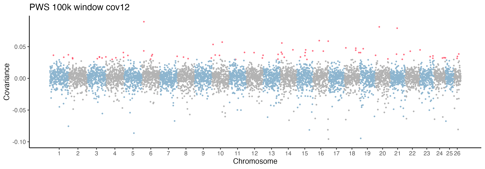
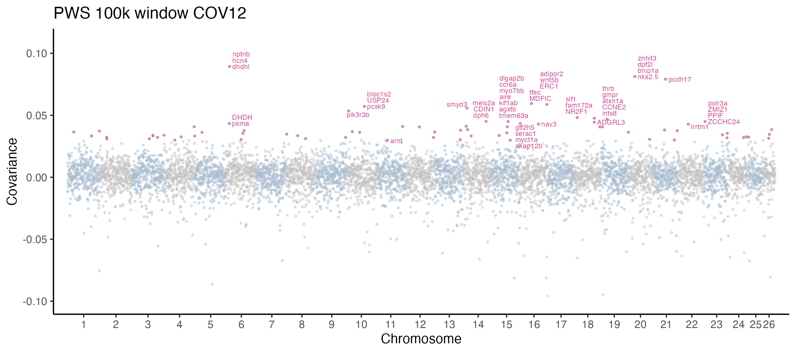
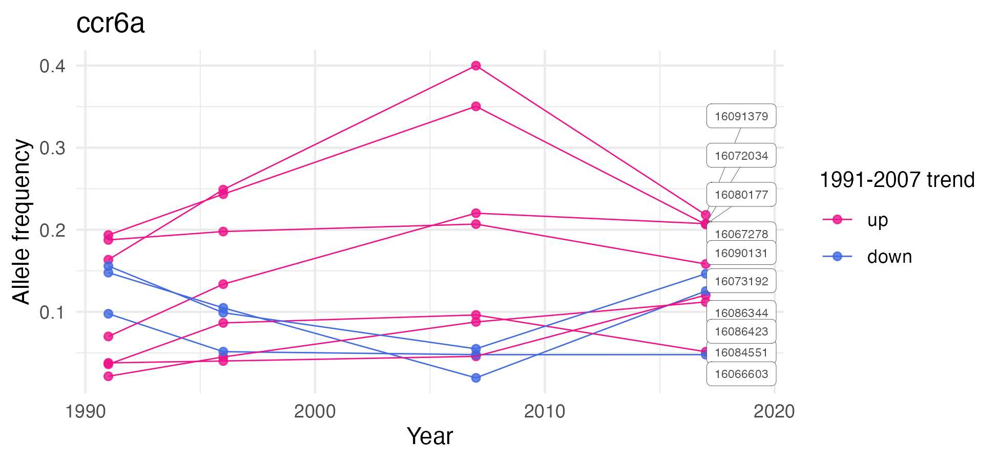
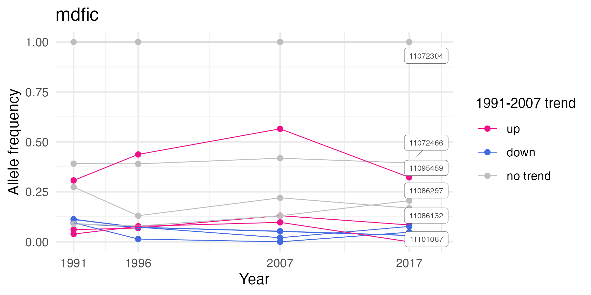
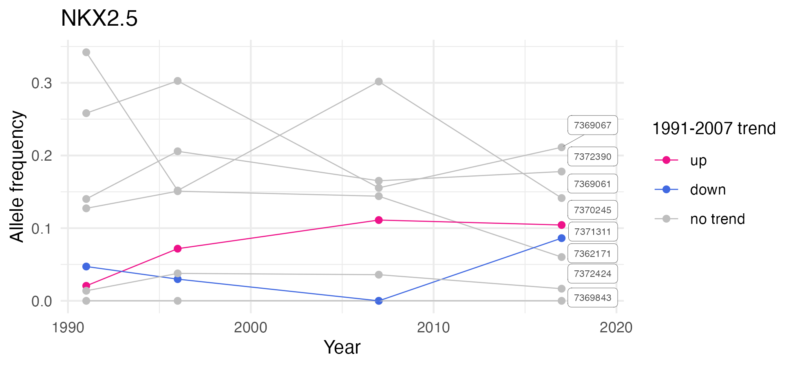
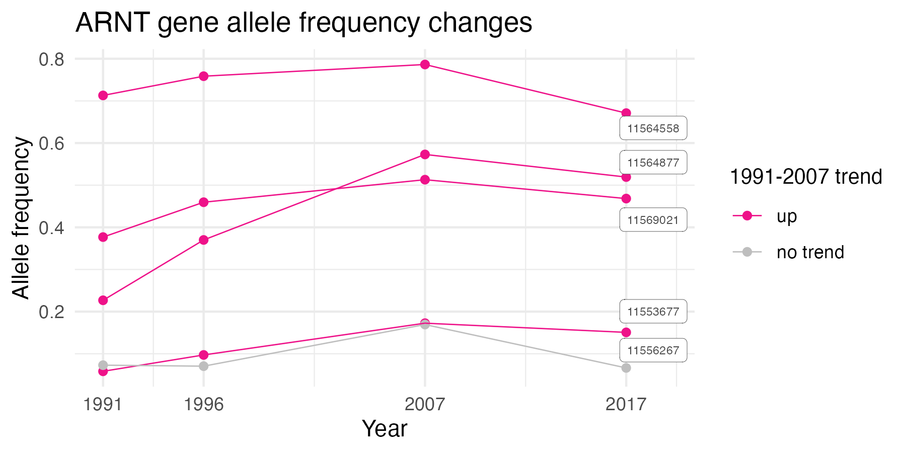

* This notebook reports the results from temporal covariance analysis from CVTKPY (Part 2).  
* The covariance window size used was 100k (but the window sizes did not affect the results) 

* This is the most updated results for the COV analysis

```{r eval=FALSE, message=FALSE, warning=FALSE, include=FALSE}
source("BaseScripts.R")
library(tidyverse)
library(dplyr)
library(cowplot)
library(scales)
library(data.table)
library(ggrepel)
library(ggpubr)
```


# Read the output files from COVscan Part1

```{r eval=FALSE, message=FALSE, warning=FALSE}

# Read files for downstream analysis
pops<-c("PWS","TB","SS")
evens<-paste0("chr",seq(2,26, by=2))
cov.list<-list()
covs_all<-list()
k=1
iv<-read.csv(paste0("../cvtk_analysis/3pops_intervals_100kwindow.csv"), row.names = 1)
for (p in 1: length(pops)){
    pop<-pops[p]
    if (p==3) {
        cov23<-read.csv(paste0("../cvtk_analysis/",pop,"_cov23_MD2000_100kwindow.csv"), header = F)
    
        covs<-cbind(iv, cov23)
        colnames(covs)[4]<-c("cov23")
        covs$index=1:nrow(covs)
        covs$color<-"col1"
        covs$color[covs$chrom %in% evens]<-"col2"
        covs[sapply(covs, is.infinite)] <- NA
        covs[sapply(covs, is.nan)] <- NA
        cov.list[[k]]<-covs
        names(cov.list)[k]<-pop
        k=k+1
        }
    else {
         cov12<-read.csv(paste0("../cvtk_analysis/",pop,"_cov12_MD2000_100kwindow.csv"), header = F)
        cov23<-read.csv(paste0("../cvtk_analysis/",pop,"_cov23_MD2000_100kwindow.csv"), header = F)
        cov13<-read.csv(paste0("../cvtk_analysis/",pop,"_cov13_MD2000_100kwindow.csv"), header = F)
        covs<-cbind(iv, cov12, cov23,cov13)
        colnames(covs)[4:6]<-c("cov12","cov23","cov13")
        covs$index=1:nrow(covs)
    
        covs$color<-"col1"
        covs$color[covs$chrom %in% evens]<-"col2"
    
        covs[sapply(covs, is.infinite)] <- NA
        covs[sapply(covs, is.nan)] <- NA
        cov.list[[k]]<-covs
        names(cov.list)[k]<-pop    
        k=k+1
    }
}

# Read the cutoff values set:
lows<-read.csv("../Output/COV_analysis/Cutoff_covs_max.csv")

# Top1pecert outlier positions
cov12<- read.csv("../Output/COV_analysis/3pops_top1percent_outlier_cutoff.cov12.csv")
cov23<- read.csv("../Output/COV_analysis/3pops_top1percent_outlier_cutoff.cov23.csv")
cov13<- read.csv("../Output/COV_analysis/3pops_top1percent_outlier_cutoff.cov13.csv")

```


# Create plots for each population/time point with genes annotated   

## Outlier for each time point per population  
```{r eval=FALSE, message=FALSE, warning=FALSE}
cv<-c("cov12","cov13","cov23")
pops<-c("PWS","TB","SS")

for (i in 1:length(cv)){
    if (i==1|i==2){
        #cutoff value
        x<-lows$low[lows$cov==cv[i]]
        
        for (p in 1:2){
            pop<-pops[p]
            df1<-cov.list[[pop]]
            df1<-df1[order(df1[,cv[i]], decreasing=T),]
            df1$top1<-"N"
            df1$top1[df1[,cv[i]]>=x]<-"Y"
            df1$chrom<-factor(df1$chrom, levels=paste0("chr", 1:26))
            df1$top1<-factor(df1$top1, levels=c("Y","N"))
            colnames(df1)[which(colnames(df1)==cv[i])]<-"cov"
            
            #assign colors
            df1$top1<-apply(df1, 1, function(x) {ifelse (x['top1']=="N", x['color'], x['top1'])} )
            df1$top1<-factor(df1$top1, levels=c("Y","col1","col2"))
        
            #count the number of sites per chromosomes
            poss<-data.frame(chr=paste0("chr",1:26))
            k=1
            for (j in 1:26){
                df<-df1[df1$chr==paste0("chr",j),]
                poss$start[j]<-k
                poss$end[j]<-k+nrow(df)-1
                k=k+nrow(df)
            }
            poss$x<-poss$start+(poss$end-poss$start)/2
            
            ymax<-max(df1$cov, na.rm=T)
            ggplot(df1, aes(x=index, y=cov, color=top1))+
                geom_point(size=0.5)+
                theme_classic()+ylim(-0.1,ymax)+
                scale_color_manual(values=c("#FF2F4D99","#8DB5CF","gray70"), guide="none")+
                ylab("Covariance")+
                ggtitle(paste0(pop," 100k window ",cv[i]))+
                #guides(color = guide_legend(override.aes = list(color=c("#FF2F4D99", "white","white"), size=2)))+
                scale_x_continuous(name="Chromosome", breaks=poss$x, labels=1:26)+
                theme(legend.title = element_blank())
            ggsave(paste0("../Output/COV_analysis/",pop,"_",cv[i],"_Outliers.png"), width = 10, height = 3.5, dpi=300)
        }
    }
    if (i==3){
        x<-lows$low[lows$cov==cv[i]]
        for (p in 1:3){
            pop<-pops[p]
            df1<-cov.list[[pop]]
            df1<-df1[order(df1[,cv[i]], decreasing=T),]
            df1$top1<-"N"
            df1$top1[df1[,cv[i]]>=x]<-"Y"
            df1$chrom<-factor(df1$chrom, levels=paste0("chr", 1:26))
            df1$top1<-factor(df1$top1, levels=c("Y","N"))
            colnames(df1)[which(colnames(df1)==cv[i])]<-"cov"
            
            #assign colors
            df1$top1<-apply(df1, 1, function(x) {ifelse (x['top1']=="N", x['color'], x['top1'])} )
            df1$top1<-factor(df1$top1, levels=c("Y","col1","col2"))
        
            #count the number of sites per chromosomes
            poss<-data.frame(chr=paste0("chr",1:26))
            k=1
            for (j in 1:26){
                df<-df1[df1$chr==paste0("chr",j),]
                poss$start[j]<-k
                poss$end[j]<-k+nrow(df)-1
                k=k+nrow(df)
            }
            poss$x<-poss$start+(poss$end-poss$start)/2
            
            ymax<-max(df1$cov, na.rm=T)
            ggplot(df1, aes(x=index, y=cov, color=top1))+
                geom_point(size=0.5)+
                theme_classic()+ylim(-0.1,ymax)+
                 scale_color_manual(values=c("#FF2F4D99","#8DB5CF","gray70"), guide="none")+
                ylab("Covariance")+
                ggtitle(paste0(pop," 100k window ",cv[i]))+
                scale_x_continuous(name="Chromosome", breaks=poss$x, labels=1:26)+
                theme(legend.title = element_blank())
            ggsave(paste0("../Output/COV_analysis/",pop,"_",cv[i],"_Outliers.png"), width = 10, height = 3.5, dpi=300)
        }
    }
}
```   



  
## Add gene names for PWS COV12 Results
        
```{r eval=FALSE, message=FALSE, warning=FALSE}

## Output from ShinyGo (Most updated annotations)
genes1<-read.csv("../Output/COV_analysis/ShinyGO0.77_annotatedOnly/PWS_cov12/PWS_cov12_geneInfo.csv")
genes1<-genes1[genes1$Symbol!=" ",]
genes1$Symbol<-gsub(" ",'', genes1$Symbol)

length(unique(genes1$Chr)) #across 25 chromosomes
length(unique(genes1$Symbol)) #289 annotated genes
genenames<-unique(genes1$Symbol)

#remove genes not clearly annotated
genenames1<-genenames[!grepl(":", genenames)]  #272


# Subset to annotated genes only
genes2<-genes1[genes1$Symbol %in% genenames1,] 
genes2<-genes2[!duplicated(genes2$Symbol),] #272

#Attach the cov12 values
#Find the nearest window index numbers for these genes, as
pw1<-cov.list[["PWS"]]
pw1<-pw1[order(pw1$cov12, decreasing=T),]
pw1$top1<-"N"
pw1$top1[pw1$cov12>= lows$low[1]]<-"Y"


pw1<-pw1[order(pw1$chrom, pw1$start),]
for(i in 1:nrow(genes2)){
    loc<-pw1[pw1$chrom==paste0("chr",genes2$Chr[i]) & pw1$start<=(genes2$Position..Mbp.[i]*1000000) & pw1$end>=(genes2$Position..Mbp.[i]*1000000),]
    if (nrow(loc)>0){
        x<-which(pw1$chrom==paste0("chr",genes2$Chr[i]) & pw1$start<=(genes2$Position..Mbp.[i]*1000000) & pw1$end>=(genes2$Position..Mbp.[i]*1000000)) 
        if(pw1$chrom[(x-1)]==paste0("chr",genes2$Chr[i]) & pw1$chrom[(x+1)]==paste0("chr",genes2$Chr[i])) locs<-pw1[(x-1):(x+1),]
        if(pw1$chrom[(x-1)]==paste0("chr",genes2$Chr[i]) & pw1$chrom[(x+1)]!=paste0("chr",genes2$Chr[i])) locs<-pw1[(x-1):x,]
        if(pw1$chrom[(x-1)]!=paste0("chr",genes2$Chr[i]) & pw1$chrom[(x+1)]==paste0("chr",genes2$Chr[i])) locs<-pw1[x:(x+1),]        
        
        genes2$index[i]<-loc$index[1]
        genes2$cov12[i]<-max(locs$cov12, na.rm=T) 
    }
    
    if(nrow(loc)==0){
        genes2$index[i]<-NA
        genes2$cov12[i]<-NA
        
    }
}


#assign colors
pw1$top1<-apply(pw1, 1, function(x) {ifelse (x['top1']=="N", x['color'], x['top1'])} )
pw1$top1<-factor(pw1$top1, levels=c("Y","col1","col2"))

#count the number of sites per chromosomes
poss<-data.frame(chr=paste0("chr",1:26))
k=1
for (j in 1:26){
    df<-pw1[pw1$chr==paste0("chr",j),]
    poss$start[j]<-k
    poss$end[j]<-k+nrow(df)-1
    k=k+nrow(df)
}
poss$x<-poss$start+(poss$end-poss$start)/2

ymax<-max(pw1$cov12, na.rm=T)
write.csv(genes2, "../Output/COV_analysis/outlier_genes_in_PWS_cov12.csv")

ggplot(pw1, aes(x=index, y=cov12))+
    geom_point(aes(x=index, y=cov12, color=top1),size=0.5)+
    theme_classic()+ylim(-0.1,ymax+0.02)+
    scale_color_manual(values=c("#FF2F4D99","#8DB5CF","gray70"), guide="none")+    
    ylab("Covariance")+
    ggtitle(paste0("PWS 100k window COV12"))+
    scale_x_continuous(name="Chromosome", breaks=poss$x, labels=1:26)+
    theme(legend.title = element_blank())+
    geom_text(data=genes2, aes(x=index, y=cov12, label=Symbol), 
              position=position_jitter(width=1.5,height=0.01), hjust=0, size=1.5, color="gray50" )
#ggsave(paste0("../Output/COV_analysis/PWS_COV12_outliers_withGeneNames_all.png"), width = 11, height = 3.5, dpi=300)
#Too busy

# Plot gene names for those with cov >0.042 only
genes3<-genes2[genes2$cov12>=0.042,] #50 genes
#write.csv(genes5, "../Output/COV_analysis/PWS12_outlier_genes_over0.04.csv")

#Manually adjust some overlapping gene names in genes2 for better plotting
gpositions<-read.csv("../Output/COV_analysis/PWS12_outlier_genes_over0.042_adjusted.csv")
ggplot(pw1, aes(x=index, y=cov12))+
    geom_point(aes(x=index, y=cov12, color=top1),size=0.5)+
    theme_classic()+ylim(-0.1,ymax+0.02)+
    scale_color_manual(values=c(paste0(cols[2],"CC"),"#A8BBCD66","#C0C0C066"), guide="none")+ 
    ylab("Covariance")+
    ggtitle(paste0("PWS 100k window COV12"))+
    scale_x_continuous(name="Chromosome", breaks=poss$x, labels=1:26,expand = c(0.02, 0.02))+
    geom_text(data=gpositions, aes(x=index+30, y=cov12, label=Symbol), hjust=0, size=2,color="#CC3F89") 
ggsave("../Output/COV_analysis/PWS_COV12_outliers_GeneNames_over0.042.png", width = 9, height = 4, dpi=300)
```

<br>
<br>
<br>

# Focused freq analysis


## Create gene names and locations files for pull out gene information
```{r eval=FALSE, message=FALSE, warning=FALSE, include=FALSE}
# Create gene names and locations files 
# Genome files available at https://osf.io/3cmkr/ in 'annotations' folder
gff <- read.delim("/Volumes/Kaho_Data/PacHerring/Data/annotations/Clupea_harengus.Ch_v2.0.2.100.gff3",header = FALSE, sep = "\t",comment.char = '#')
#head(gff)
colnames(gff) <- c("seqnames","source","type","start","end","score","strand","phase","attributes")
#gff$seqnames <- paste("chr" , as.character(gff$seqnames),sep = "")

genes <- gff[gff$type=="gene",]
genes2 <- genes %>% separate(attributes, c("at1","at2"), remove = FALSE,sep = "Name=") %>% separate(at2, c("gene_name","at3"), extra = "drop",sep = ";")
genes2 <- select(genes2, -at1,-at3)

genes3 <- genes2 %>% separate(attributes, c("at4","at5"), remove = FALSE,sep = "description=") %>% separate(at5, c("gene_description","at6"), extra = "drop",sep = ";")
genes3 <- select(genes3, -at4,-at6)
g3<-genes3[, c('seqnames','type','start','end','gene_name','gene_description')]
write.csv(g3, "../Data/gene_names.and.locatios.csv", row.names = F)
```


## ccr6a (chr15: 16,066,502 - 16,091,639)
```{r eval=FALSE, message=FALSE, warning=FALSE}
pops<-c("PWS91","PWS96","PWS07","PWS17")
yr<-c(1991,1996,2007,2017)
maf<-data.frame()
st<-16066502-5000
ed<-16091639+5000
for (i in 1:4){
    af<-fread(paste0("../Data/vcf/AF/",pops[i],"_MD2000_maf05.mafs.gz"))
    af<-af[af$chromo=="chr15"&af$position>=st&af$position<=ed,]
    af$year<-yr[i]
    maf<-rbind(maf,af)
}

positions<-unique(maf$position)
for (i in 1:length(positions)){
    df<-maf[maf$position==positions[i],]
    #AF both decreased
    if (df$knownEM[df$year==1991]>df$knownEM[df$year==1996] & df$knownEM[df$year==1996]>df$knownEM[df$year==2007]){
        maf$trend[maf$position==positions[i]]<-"down"
    }
    else if (df$knownEM[df$year==1991]<df$knownEM[df$year==1996] & df$knownEM[df$year==1996]<df$knownEM[df$year==2007]){
        maf$trend[maf$position==positions[i]]<-"up"
    }
    
    else maf$trend[maf$position==positions[i]]<-"none"
}


length(unique(maf$position))
#31 loci

length(unique(maf$position[maf$trend=="up"])) #7
length(unique(maf$position[maf$trend=="down"])) #3
 
#color by trend
maf$trend<-factor(maf$trend, levels=c("up","down","none"))
ggplot(maf, aes(x=year, y=knownEM, color=trend))+
    geom_point(size=1.5)+
    geom_path(aes(group=position), size=0.3)+ggtitle("ccr6a")+
    ylab("Allele frequency")+xlab('Year')+
    theme_minimal()+
    scale_color_manual(values=c("deeppink2","royalblue", "gray") ,labels=c("up","down", 'no trend'), name="1991-2007 trend")+theme(legend.title = element_text(size=10))+
    scale_x_continuous(breaks=c(1991,1996,2007,2017))
#ggsave("../Output/COV_analysis/PWS_ccr6a_AFchange_trend.png", width = 6, height=3, dpi=300)

# Plot only Up and Down loci
up<-maf[maf$trend=="up",]
down<-maf[maf$trend=="down",]

up<-up %>% mutate(label = if_else(year == max(year), as.character(position), NA_character_))
down<-down %>% mutate(label = if_else(year == max(year), as.character(position), NA_character_))
df<-rbind(up,down)
ggplot(df, aes(x=year, y=knownEM,color=trend))+
    geom_point(size=1.5, alpha=0.8)+
    geom_path(aes(group=position), size=0.3, )+ggtitle("ccr6a")+
    ylab("Allele frequency")+xlab('Year')+
    theme_minimal()+theme(legend.title=element_blank())+
      scale_color_manual(values=c("deeppink2","royalblue", "gray") ,labels=c("up","down", 'no trend'), name="1991-2007 trend")+theme(legend.title = element_text(size=10))+
    geom_label_repel(aes(label = label), label.size=0.1, size = 2,nudge_x = 2,na.rm = TRUE,segment.size=0.1, color="gray30")
ggsave("../Output/COV_analysis/PWS_ccr6a_AFchange_updown.png", width = 6.5, height=3, dpi=300)

```


##BNIP1A (chr20: around 7.3Mb 7367207-7371569	) 
* The gene position can be found by lookking into Data/annotations/annotation_byChromosome/'X' (chromosome number) 

```{r eval=FALSE, message=FALSE, warning=FALSE}
pops<-c("PWS91","PWS96","PWS07","PWS17")
yr<-c(1991,1996,2007,2017)
maf<-data.frame()
for (i in 1:length(pops)){
    af<-fread(paste0("../Data/vcf/AF/",pops[i],"_MD2000_maf05.mafs.gz"),sep="\t", header = T)
    af<-af[af$chromo=="chr20"&af$position>=7362207&af$position<=(7371569+5000),]
    af$year<-yr[i]
    af$pop<-sub("\\d\\d","", pops[i])
    maf<-rbind(maf,af)
}

positions<-unique(maf$position)
for (i in 1:length(positions)){
    df<-maf[maf$position==positions[i],]
    #AF both decreased
    if (df$knownEM[df$year==1991]>df$knownEM[df$year==1996] & df$knownEM[df$year==1996]>df$knownEM[df$year==2007]){
        maf$trend[maf$position==positions[i]]<-"down"
    }
    else if (df$knownEM[df$year==1991]<df$knownEM[df$year==1996] & df$knownEM[df$year==1996]<df$knownEM[df$year==2007]){
        maf$trend[maf$position==positions[i]]<-"up"
    }
    
    else maf$trend[maf$position==positions[i]]<-"none"
}

#color by trend
maf$trend<-factor(maf$trend, levels=c("up","down","none"))
maf<-maf %>% mutate(label = if_else(year == max(year), as.character(position), NA_character_))
ggplot(maf, aes(x=year, y=knownEM, color=trend))+
    geom_point(size=1.5)+
    geom_path(aes(group=position), size=0.3)+ggtitle("bnip1a")+
    ylab("Allele frequency")+xlab('Year')+
    theme_minimal()+
    scale_color_manual(values=c("deeppink2","royalblue", "gray") ,labels=c("up","down", 'no trend'), name="1991-2007 trend")+theme(legend.title = element_text(size=10))+
     geom_label_repel(aes(label = label), color="gray30", label.size=0.1, size = 2,nudge_x = 2,na.rm = TRUE,segment.size=0.1)+
     scale_x_continuous(breaks=c(1991,1996,2007,2017))
ggsave("../Output/COV_analysis/PWS_bnip1a_AFchange_trend.png", width = 6, height=3, dpi=300)
```


## MDFIC (chr16: around 11Mb 11,065,405 -11,096,085) 
```{r eval=FALSE, message=FALSE, warning=FALSE}
# find the exact gene location
genes<-read.csv("/Volumes/Kaho_Data/PacHerring/Data/annotations/gene_names.and.locatios.csv", fill=T)
g1<-genes[grep("MDFIC",genes$gene_name),]
start=g1$start
# 11065405
end=g1$V5
# 11096085

pops<-c("PWS91","PWS96","PWS07","PWS17")
yr<-c(1991,1996,2007,2017)
maf<-data.frame()
for (i in 1:length(pops)){
    af<-fread(paste0("../Data/vcf/AF/",pops[i],"_MD2000_maf05.mafs.gz"),sep="\t", header = T)
    af<-af[af$chromo=="chr16"&af$position>=(start-5000)&af$position<=(end+5000),]
    af$year<-yr[i]
    af$pop<-sub("\\d\\d","", pops[i])
    maf<-rbind(maf,af)
}

positions<-unique(maf$position)
for (i in 1:length(positions)){
    df<-maf[maf$position==positions[i],]
    #AF both decreased
    if (df$knownEM[df$year==1991]>df$knownEM[df$year==1996] & df$knownEM[df$year==1996]>df$knownEM[df$year==2007]){
        maf$trend[maf$position==positions[i]]<-"down"
    }
    else if (df$knownEM[df$year==1991]<df$knownEM[df$year==1996] & df$knownEM[df$year==1996]<df$knownEM[df$year==2007]){
        maf$trend[maf$position==positions[i]]<-"up"
    }
    
    else maf$trend[maf$position==positions[i]]<-"none"
}

#color by trend
maf$trend<-factor(maf$trend, levels=c("up","down","none"))
maf<-maf %>% mutate(label = if_else(year == max(year), as.character(position), NA_character_))
ggplot(maf, aes(x=year, y=knownEM, color=trend))+
    geom_point(size=1.5)+
    geom_path(aes(group=position), size=0.3)+ggtitle("mdfic")+
    ylab("Allele frequency")+xlab('Year')+
    theme(legend.title=element_blank())+
    theme_minimal()+theme(legend.title=element_blank())+
    scale_color_manual(values=c("deeppink2","royalblue", "gray") ,labels=c("up","down", 'no trend'), name="1991-2007 trend")+theme(legend.title = element_text(size=10))+
    geom_label_repel(aes(label = label), label.size=0.1, size = 2,nudge_x = 2,na.rm = TRUE, color="gray30", segment.size=0.1)+
     scale_x_continuous(breaks=c(1991,1996,2007,2017))
ggsave("../Output/COV_analysis/PWS_mdfic_AFchange_trend.png", width = 6, height=3, dpi=300)

```



##NKX2.5 (chr20: around 7.36Mb) 

```{r eval=FALSE, message=FALSE, warning=FALSE}
#find the exact gene location
genes<-read.csv("/Volumes/Kaho_Data/PacHerring/Data/annotations/gene_names.and.locatios.csv", fill=T)
nkx<-genes[grep("nkx2.5",genes$gene_name),]

pops<-c("PWS91","PWS96","PWS07","PWS17")
yr<-c(1991,1996,2007,2017)

#only 1 loci for +-5000, so pad 10000
start=nkx$start[1]-10000
end=nkx$end[1]+10000
maf<-data.frame()
for (i in 1:length(pops)){
    af<-fread(paste0("../Data/vcf/AF/",pops[i],"_MD2000_maf05.mafs.gz"),sep="\t", header = T)
    af<-af[af$chromo=="chr20"&af$position>=start&af$position<=end,]
    af$year<-yr[i]
    af$pop<-sub("\\d\\d","", pops[i])
    maf<-rbind(maf,af)
}

positions<-unique(maf$position)
for (i in 1:length(positions)){
    df<-maf[maf$position==positions[i],]
    #AF both decreased
    if (df$knownEM[df$year==1991]>df$knownEM[df$year==1996] & df$knownEM[df$year==1996]>df$knownEM[df$year==2007]){
        maf$trend[maf$position==positions[i]]<-"down"
    }
    else if (df$knownEM[df$year==1991]<df$knownEM[df$year==1996] & df$knownEM[df$year==1996]<df$knownEM[df$year==2007]){
        maf$trend[maf$position==positions[i]]<-"up"
    }
    
    else maf$trend[maf$position==positions[i]]<-"none"
}

maf$trend<-factor(maf$trend, levels=c("up","down","none"))
maf<-maf %>% mutate(label = if_else(year == max(year), as.character(position), NA_character_))
ggplot(maf, aes(x=year, y=knownEM, color=trend))+
    geom_point(size=1.5)+
    geom_path(aes(group=position), size=0.3)+ggtitle("NKX2.5")+
    ylab("Allele frequency")+xlab('Year')+
    theme_minimal()+
    scale_color_manual(values=c("deeppink2","royalblue", "gray") ,labels=c("up","down", 'no trend'), name="1991-2007 trend")+theme(legend.title = element_text(size=10))+
     geom_label_repel(aes(label = label), color="gray30", label.size=0.1, size = 2,nudge_x = 2,na.rm = TRUE,segment.size=0.1)
ggsave("../Output/COV_analysis/PWS_nks2.5_AFchange_trend.png", width = 6.5, height=3, dpi=300)

```



# Make a similar plot of AF changes in arnt gene 

## Identify genes in the AhR Pathway
```{r eval=FALSE, message=FALSE, warning=FALSE, include=FALSE}
# Create gene names and locations files 
gff <- read.delim("/Volumes/Kaho_Data/PacHerring/Data/annotations/Clupea_harengus.Ch_v2.0.2.100.gff3",header = FALSE, sep = "\t",comment.char = '#')
#head(gff)
colnames(gff) <- c("seqnames","source","type","start","end","score","strand","phase","attributes")
#gff$seqnames <- paste("chr" , as.character(gff$seqnames),sep = "")

genes <- gff[gff$type=="gene",]
genes2 <- genes %>% separate(attributes, c("at1","at2"), remove = FALSE,sep = "Name=") %>% separate(at2, c("gene_name","at3"), extra = "drop",sep = ";")
genes2 <- select(genes2, -at1,-at3)

genes3 <- genes2 %>% separate(attributes, c("at4","at5"), remove = FALSE,sep = "description=") %>% separate(at5, c("gene_description","at6"), extra = "drop",sep = ";")
genes3 <- select(genes3, -at4,-at6)
g3<-genes3[, c('seqnames','type','start','end','gene_name','gene_description')]
write.csv(g3, "../Data/annotations/gene_names.and.locatios.csv", row.names = F)

#genes in human Arylhydrocarbon Receptor (AhR) Signaling Pathway (https://maayanlab.cloud/Harmonizome/gene_set/Arylhydrocarbon+receptor+%28AhR%29+signaling+pathway%28Homo+sapiens%29/Wikipathways+Pathways)
ahr<-read.csv("../Data/ahR/ahRsigPathway_geneset.csv")
ahrgenes<-tolower(ahr$Symbol)
ahrgenes
#remove the 1 from cyp
ahrgenes[ahrgenes=="cyp1a1"]<-"cyp1a"
ahrgenes[ahrgenes=="cyp1b1"]<-"cyp1b"

ahrgenes<-c(ahrgenes, toupper(ahrgenes)) #add the upper capital names just in case
ahrgenes<-unique(ahrgenes)

geneset<-data.frame()
for (i in 1:length(ahrgenes)){
    df<-genes3[grep(paste0('^',ahrgenes[i]), genes3$gene_name),]
    geneset<-rbind(geneset, df)
}

#which chromosomes?
unique(geneset$seqnames)
# [1]  2 22 20  9 11  3  6  1 12 24 25 15 10 13 16

#remove the duplicates
geneset<-geneset[!duplicated(geneset),]

#Find those that are missing gene names using description
geneset2<-data.frame()
for (i in 1:nrow(ahr)){
    df<-genes3[grep(paste0('^',ahr$Name[i]), genes3$gene_description),]
    geneset2<-rbind(geneset2, df)
}
geneset2<-geneset2[!duplicated(geneset2),]
 
geneset<-rbind(geneset, geneset2)
geneset<-geneset[!duplicated(geneset),] #31 entry

write.csv(geneset,"../Data/ahR/AhRgenes_list.csv",row.names = F)

```


## find ARNT (chr11: 11,554,758)

```{r eval=FALSE, message=FALSE, warning=FALSE, include=FALSE}

arnt<-geneset[grep("arnt", geneset$gene_name),]

#seqnames  type    start      end gene_name
#       11 gene 11554758 11569458      arnt
#        3 gene  2821762  2835685   arntl1a
#        3 gene  3750654  3768756    arntl2
#        6 gene 30321788 30362555     arnt2
#                                                                               gene_description
#           aryl hydrocarbon receptor nuclear translocator-like [Source:NCBI gene%3BAcc:105912992]
# aryl hydrocarbon receptor nuclear translocator-like protein 1 [Source:NCBI gene%3BAcc:105895625]
#      aryl hydrocarbon receptor nuclear translocator-like 2 [Source:ZFIN%3BAcc:ZDB-GENE-000509-2]
#                  aryl-hydrocarbon receptor nuclear translocator 2 [Source:NCBI gene%3BAcc:64277]
> 

```


```{r eval=FALSE, message=FALSE, warning=FALSE}
pops<-c("PWS91","PWS96","PWS07","PWS17")
yr<-c(1991,1996,2007,2017)
maf<-data.frame()
for (i in 1:4){
    af<-fread(paste0("../Data/vcf/AF/",pops[i],"_MD2000_maf05.mafs.gz"),sep="\t", header = T)
    af<-af[af$chromo=="chr11"&af$position>=(11554758-5000)&af$position<=(11569458+5000),]
    af$year<-yr[i]
    maf<-rbind(maf,af)
}
#write.csv(maf,"../Output/ahR/arnt_MAFchange_chr11.csv")

positions<-unique(maf$position)
for (i in 1:length(positions)){
    df<-maf[maf$position==positions[i],]
    #AF both decreased
    if (df$knownEM[df$year==1991]>df$knownEM[df$year==1996] & df$knownEM[df$year==1996]>df$knownEM[df$year==2007]){
        maf$trend[maf$position==positions[i]]<-"down"
    }
    else if (df$knownEM[df$year==1991]<df$knownEM[df$year==1996] & df$knownEM[df$year==1996]<df$knownEM[df$year==2007]){
        maf$trend[maf$position==positions[i]]<-"up"
    }
    
    else maf$trend[maf$position==positions[i]]<-"none"
}

#color by trend
maf$trend<-factor(maf$trend, levels=c("up","none"))
maf2<-maf %>% mutate(label = if_else(year == max(year), as.character(position), NA_character_))
ggplot(maf2, aes(x=year, y=knownEM, color=trend))+
    geom_point(size=1.5)+
    geom_path(aes(group=position), size=0.3 )+ggtitle(paste0("ARNT gene allele frequency changes"))+
      ylab("Allele frequency")+xlab('Year')+
    scale_color_manual(values=c("deeppink2", "gray"), labels=c("up", 'no trend'), name="1991-2007 trend")+
    theme_minimal()+
    theme(legend.title = element_text(size=10))+
    geom_label_repel(aes(label = label),color="gray30", label.size=0.1, size = 2,
                  nudge_x = 2,
                  na.rm = TRUE)+
     scale_x_continuous(breaks=c(1991,1996,2007,2017))
ggsave("../Output/ahR/arnt_AFchange_PWS.png", width = 6, height=3, dpi=300)

```




