* This notebook shows the sensitivity analysis of temporal covariance analysis from CVTKPY.  

```{r eval=FALSE, message=FALSE, warning=FALSE, include=FALSE}
source("BaseScripts.R")
library(tidyverse)
library(dplyr)
library(cowplot)
library(scales)
 cols<-c("#56b4e9", "#cc79a7","#009e73","#0072b2","#d55e00","#e69f00","#f0e442")
```


# How Temporal Covariacnes change with depth filtering  

## Create VCF files with different maximum depth filtering  
* Filter by depth from the MD7000 VCF file using bcftools:
* Depths are based on 14 populations

```{bash eval=FALSE, message=FALSE, warning=FALSE}
# Use bcftools to filter by Max Depth
bcftools filter -i 'INFO/DP<2000' 3pops.MD7000_NS0.5_maf05.vcf.gz > 3pops.MD2000.maf05.vcf
bcftools filter -i 'INFO/DP<3000' 3pops.MD7000_NS0.5_maf05.vcf.gz > 3pops.MD3000.maf05.vcf
bcftools filter -i 'INFO/DP<4000' 3pops.MD7000_NS0.5_maf05.vcf.gz > 3pops.MD4000.maf05.vcf
bcftools filter -i 'INFO/DP<5000' 3pops.MD7000_NS0.5_maf05.vcf.gz > 3pops.MD5000.maf05.vcf
bcftools filter -i 'INFO/DP<6000' 3pops.MD7000_NS0.5_maf05.vcf.gz > 3pops.MD6000.maf05.vcf

gzip 3pops.MD2000.maf05.vcf
gzip 3pops.MD3000.maf05.vcf
gzip 3pops.MD4000.maf05.vcf
gzip 3pops.MD5000.maf05.vcf
gzip 3pops.MD6000.maf05.vcf

```


## Run CVTKPY on data with different filtering (Max Depth 2000-7000)
* Covariances from Max Depth 2000 ~ 7000   
* 1M window for MD2000-6000, 100k for MD7000

### Max Depth = 2000 (1M-window)

```{r eval=FALSE, message=FALSE, warning=FALSE}
pops<-c("PWS","TB","SS")
covs<-data.frame()
Variance<-data.frame()
for (p in 1: length(pops)){
    #covariance output file
    cov<-read.csv(paste0("../cvtk_analysis/MD2000_maf05_temp_cov_matrix_",pops[p],"_1M.csv"))
    cov<-cov[,-1]
    #CI file
    ci<-read.csv(paste0("../cvtk_analysis/MD2000_maf05_",pops[p],"_Cov_CIs_bootstrap5000_1Mwindow.csv"))
    ci<-ci[,-1]
        
    #reshape the matrix
    mat1<-cov[1:3,]
    mat2<-cov[4:6,]
        
    covdf<-data.frame()
    k=1
    for (i in 1:nrow(mat1)){
        for (j in 1:ncol(mat1)){
            covdf[k,1]<-mat2[i,j]
            covdf[k,2]<-mat1[i,j]
            k=k+1
        }
    }
    colnames(covdf)<-c("label","value")
    covdf$value<-as.numeric(covdf$value)
    covar<-covdf[grep("cov",covdf$label),]
    vars<-covdf[grep("var",covdf$label),]
        
    #remove the redundant values
    if (pops[p]!="SS") covar<-covar[!duplicated(covar[, 2]),] 
    if (pops[p]=="SS") covar<-covar[c(1,2,4),]
        
    #assign the starting time period and covering period values
    covar$year<-c(1,2,2)
    covar$series<-c("1991","1991","1996")
        
    vars$year<-c("1991-1996","1996-2006","2006-2017")
    #vars$series<-c("1991","1991","1996")
        
    #assign population name
    covar$location<-pops[p]
    vars$location<-pops[p]
        
    #attach ci info
    covar$ci_l<-as.numeric(c(ci[1,2], ci[1,3],ci[2,3]))
    covar$ci_u<-as.numeric(c(ci[4,2], ci[4,3],ci[5,3]))
        
    #combine in to one matrix
    covs<-rbind(covs, covar)
    Variance<-rbind(Variance, vars)
}
Variance$depth<-"MD2000"
Variances<-Variance
xtexts<-c("\u03941991-1996\n ~ \u03941996-2006", "\n  ~ \u03942006-2017")

ggplot(data=covs, aes(x=year, y=value, color=location, shape=series, group=interaction(location, series)))+
        geom_point(size=3, position=position_dodge(width = 0.1,preserve ="total"))+
        geom_line(data=covs, aes(x=year, y=value,color=location, group=interaction(location, series)), position=position_dodge(width = 0.1,preserve ="total"))+
        ylab("Covariance")+xlab('')+theme_classic()+ggtitle("Max Depth = 2000")+
        theme(legend.title = element_blank())+
        geom_hline(yintercept = 0,color="gray70", size=0.3)+
        geom_errorbar(aes(ymin=ci_l, ymax=ci_u), width=.2, size=.2, position=position_dodge(width = 0.1,preserve ="total"))+
        scale_shape_manual(values=c(16,17),labels=c("1991-","1996-"))+
        scale_x_continuous(breaks = c(1,2), labels=xtexts)+
        scale_color_manual(values=cols[c(2,3,1)])
ggsave(paste0("../Output/COV_analysis/MD2000_covs.png"),width = 4.7, height = 3, dpi=300)
  
```

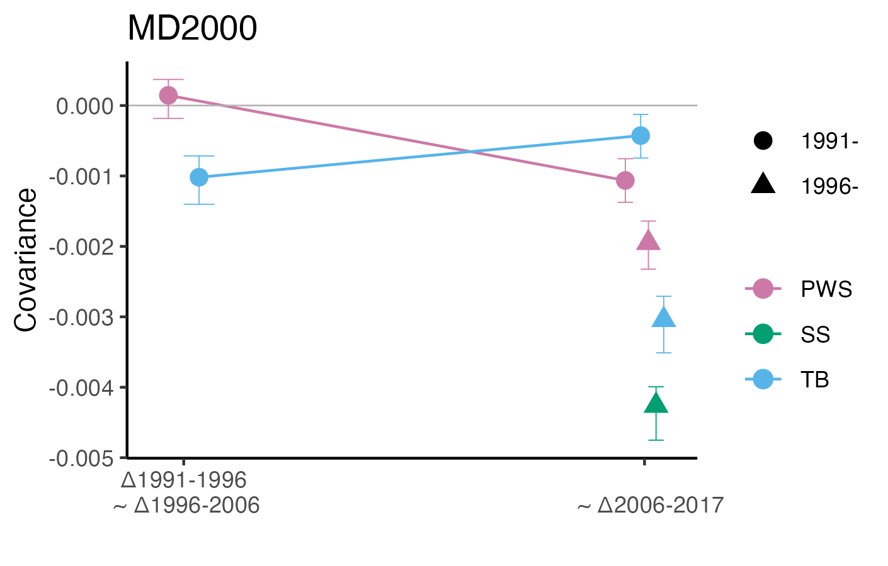

### MD3000-MD7000
```{r eval=FALSE, message=FALSE, warning=FALSE}
pops<-c("PWS","TB","SS")
mds<-c("MD3000","MD4000","MD5000","MD6000","MD7000")
xtexts<-c("\u03941991-1996\n ~ \u03941996-2006", "\n  ~ \u03942006-2017")

for (m in 1: length(mds)){
    covs<-data.frame()
    Variance<-data.frame()
    if(m==5){
        for (p in 1: length(pops)){
            cov<-read.csv(paste0("../cvtk_analysis/",mds[m],"_maf05_temp_cov_matrix_",pops[p],".csv"))
            cov<-cov[,-1]
            ci<-read.csv(paste0("../cvtk_analysis/",mds[m],"_maf05_",pops[p],"_Cov_CIs_bootstrap5000.csv"))
            ci<-ci[,-1]
        
            mat1<-cov[1:3,]
            mat2<-cov[4:6,]
            
            covdf<-data.frame()
            k=1
            for (i in 1:nrow(mat1)){
                for (j in 1:ncol(mat1)){
                    covdf[k,1]<-mat2[i,j]
                    covdf[k,2]<-mat1[i,j]
                    k=k+1
                    }
            }
            colnames(covdf)<-c("label","value")
        covdf$value<-as.numeric(covdf$value)
        covar<-covdf[grep("cov",covdf$label),]
        vars<-covdf[grep("var",covdf$label),]
            
        if (pops[p]!="SS") covar<-covar[!duplicated(covar[, 2]),] 
        if (pops[p]=="SS") covar<-covar[c(1,2,4),]
            
        #assign the starting time period and covering period values
        covar$year<-c(1,2,2)
        covar$series<-c("1991","1991","1996")
            
        vars$year<-c("1991-1996","1996-2006","2006-2017")
            
        #assign population name
        covar$location<-pops[p]
        vars$location<-pops[p]
            
        #attach ci info
        covar$ci_l<-as.numeric(c(ci[1,2], ci[1,3],ci[2,3]))
        covar$ci_u<-as.numeric(c(ci[4,2], ci[4,3],ci[5,3]))
            
        #combine in to one matrix
        covs<-rbind(covs, covar)
        Variance<-rbind(Variance, vars)
        }
    }
    else{
        for (p in 1: length(pops)){
        cov<-read.csv(paste0("../cvtk_analysis/",mds[m],"_maf05_temp_cov_matrix_",pops[p],"_1M.csv"))
        cov<-cov[,-1]
        ci<-read.csv(paste0("../cvtk_analysis/",mds[m],"_maf05_",pops[p],"_Cov_CIs_bootstrap5000_1Mwindow.csv"))
        ci<-ci[,-1]
        
        mat1<-cov[1:3,]
        mat2<-cov[4:6,]
        
        covdf<-data.frame()
        k=1
        for (i in 1:nrow(mat1)){
            for (j in 1:ncol(mat1)){
                covdf[k,1]<-mat2[i,j]
                covdf[k,2]<-mat1[i,j]
                k=k+1
            }
        }
        
        colnames(covdf)<-c("label","value")
        covdf$value<-as.numeric(covdf$value)
        covar<-covdf[grep("cov",covdf$label),]
        vars<-covdf[grep("var",covdf$label),]
            
        if (pops[p]!="SS") covar<-covar[!duplicated(covar[, 2]),] 
        if (pops[p]=="SS") covar<-covar[c(1,2,4),]
            
        #assign the starting time period and covering period values
        covar$year<-c(1,2,2)
        covar$series<-c("1991","1991","1996")
            
        vars$year<-c("1991-1996","1996-2006","2006-2017")
            
        #assign population name
        covar$location<-pops[p]
        vars$location<-pops[p]
            
        #attach ci info
        covar$ci_l<-as.numeric(c(ci[1,2], ci[1,3],ci[2,3]))
        covar$ci_u<-as.numeric(c(ci[4,2], ci[4,3],ci[5,3]))
            
        #combine in to one matrix
        covs<-rbind(covs, covar)
        Variance<-rbind(Variance, vars)
        }
    }
        
    Variance$depth<-mds[m]
    Variances<-rbind(Variances,Variance)
    ggplot(data=covs, aes(x=year, y=value, color=location, shape=series, group=interaction(location, series)))+
        geom_point(size=3, position=position_dodge(width = 0.1,preserve ="total"))+
        geom_line(data=covs, aes(x=year, y=value,color=location, group=interaction(location, series)), position=position_dodge(width = 0.1,preserve ="total"))+
        ylab("Covariance")+xlab('')+theme_classic()+ggtitle(mds[m])+
        theme(legend.title = element_blank())+
        geom_hline(yintercept = 0,color="gray70", size=0.3)+
        geom_errorbar(aes(ymin=ci_l, ymax=ci_u), width=.2, size=.2, position=position_dodge(width = 0.1,preserve ="total"))+
        scale_shape_manual(values=c(16,17),labels=c("1991-","1996-"))+
        scale_x_continuous(breaks = c(1,2), labels=xtexts)+
        scale_color_manual(values=cols[c(2,3,1)])
    ggsave(paste0("../Output/COV_analysis/",mds[m],"_covs.png"),width = 4.7, height = 3, dpi=300)    
}

Variances_org<-Variances
```

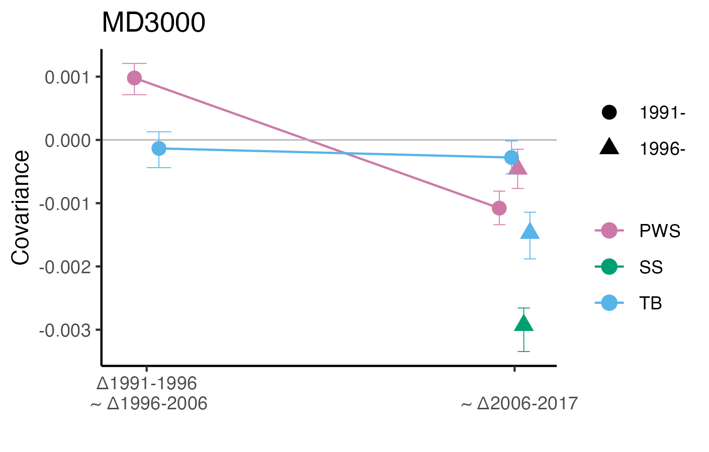

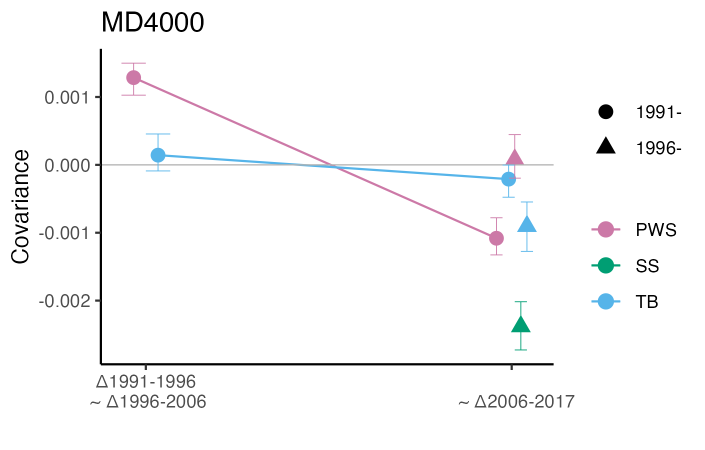

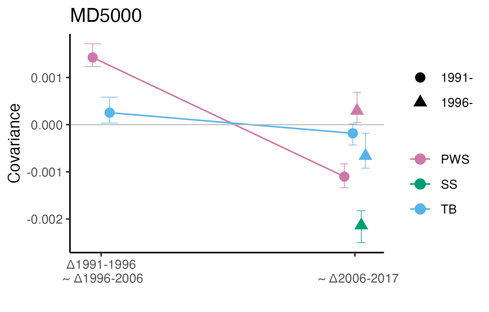

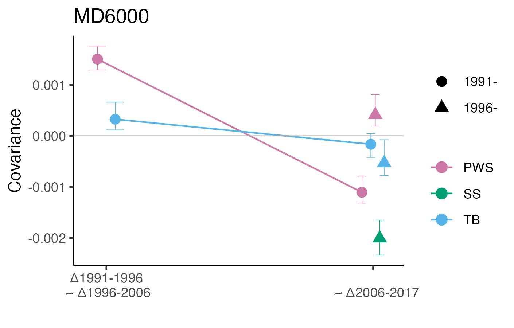


## Plot Variances
```{r eval=FALSE, message=FALSE, warning=FALSE}
seqcols<-sequential_hcl(6, palette="Red-Blue")
#reverse the order
seqcols<-rev(seqcols)
colnames(Variances)[2]<-"Variance"
ggplot(Variances, aes(x=year, y=Variance, fill=depth))+
    facet_wrap(~location, ncol=1)+
    geom_bar(stat="identity", position=position_dodge(width=0.8))+
    theme_bw()+geom_hline(yintercept = 0, color="gray30", size=0.3)+
    scale_fill_manual(values=seqcols, name="Max depth")
ggsave("../Output/COV_analysis/variances_byMaxDepthFilter.png", width = 7, height=6, dpi=300)

```

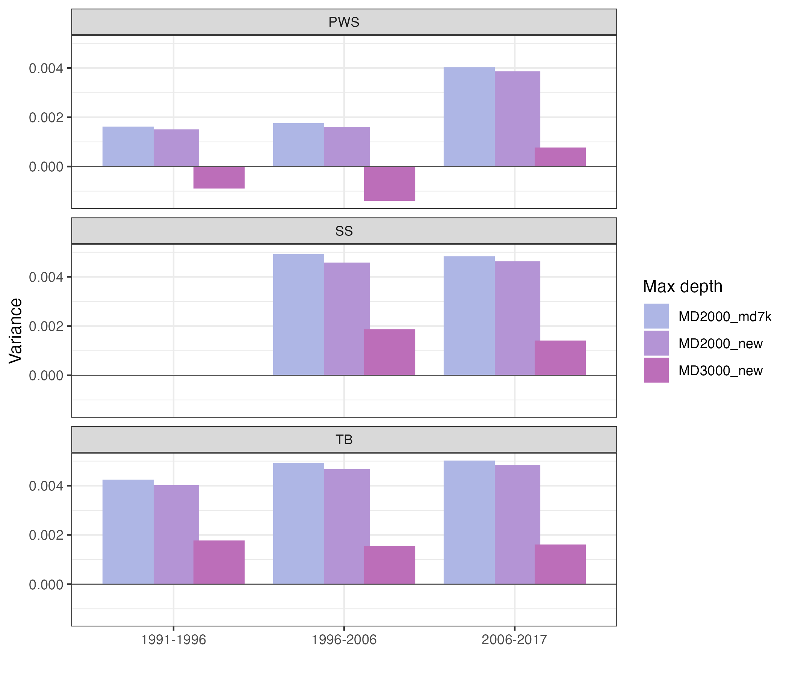

## Diagnostic plots from CVTKPY

### MD7000 original diagnostic plots (correction vs. none)  
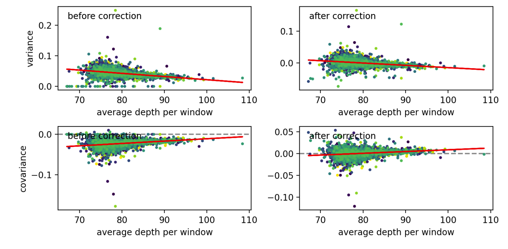


### MD2000  
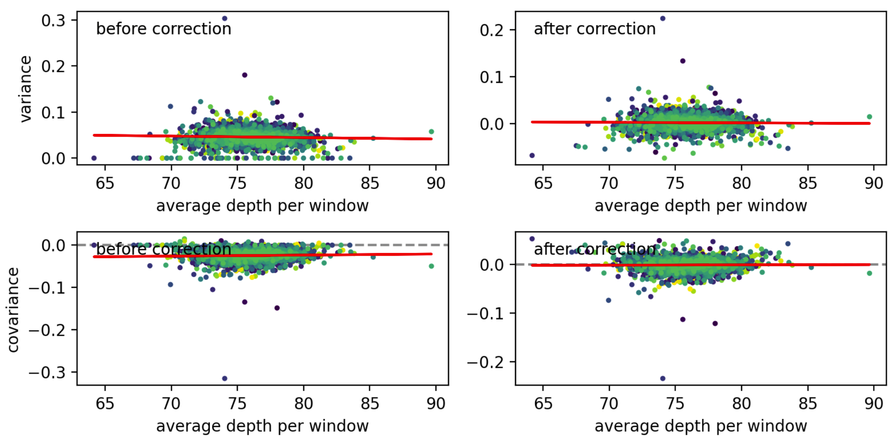

### MD3000  
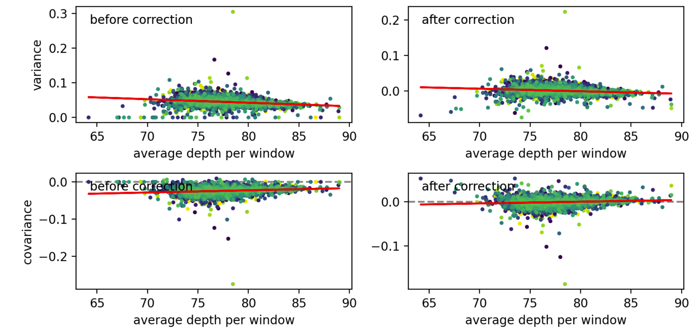

## MD4000
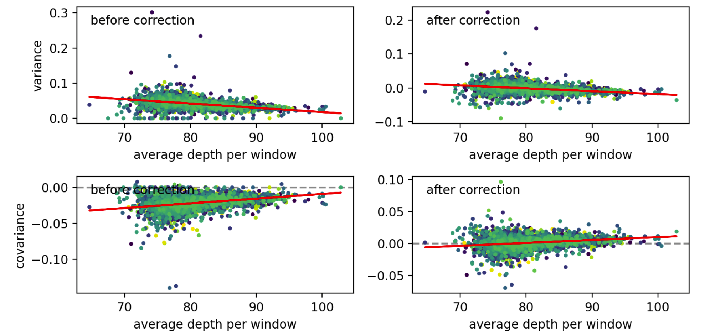  


<br>
<br>
<br>

# Create new VCF files with new filtering (MD3000 & MD2000)


## Create quality filtered snps for 3 pops at FARM, and filter to DP<2000 locally (FARM does not have the latest bcftools) 

```{r eval=FALSE, message=FALSE, warning=FALSE}
for (i in n){
    sink(paste0("../Data/Slurmscripts/0.filter_raw_",i,".sh"))
    cat("#!/bin/bash -l\n")
    cat(paste0("#SBATCH --job-name=filter",i," \n"))
    cat(paste0("#SBATCH --mem=16G \n")) 
    cat(paste0("#SBATCH --ntasks=8 \n")) 
    cat(paste0("#SBATCH -e filter",i,".err  \n"))
    cat(paste0("#SBATCH --time=144:00:00  \n"))
    cat(paste0("#SBATCH -p high  \n"))
    cat("\n\n")
    cat('module load samtools \n') 
    cat('module load bcftools \n\n') 
    
    cat(paste0("bcftools view -S /home/ktist/ph/data/new_vcf/population/timeseries.txt -m2 -M2 -v snps /home/jamcgirr/ph/data/combine_gvcfs/raw_variants_chr",i,"_1.vcf | bcftools filter -Oz -i 'MQ>30 && QUAL>20' -o /home/ktist/ph/data/new_vcf/VCF/qual_filtered_snps_chr",i,"_1.vcf.gz  \n"))
    cat(paste0("bcftools view -S /home/ktist/ph/data/new_vcf/population/timeseries.txt -m2 -M2 -v snps /home/jamcgirr/ph/data/combine_gvcfs/raw_variants_chr",i,"_2.vcf | bcftools filter -Oz -i 'MQ>30 && QUAL>20' -o /home/ktist/ph/data/new_vcf/VCF/qual_filtered_snps_chr",i,"_2.vcf.gz  \n"))
    cat(paste0("bcftools index /home/ktist/ph/data/new_vcf/VCF/qual_filtered_snps_chr",i,"_1.vcf.gz\n"))
    cat(paste0("bcftools index /home/ktist/ph/data/new_vcf/VCF/qual_filtered_snps_chr",i,"_2.vcf.gz \n\n")) 
    
    cat(paste0("bcftools view -S /home/ktist/ph/data/new_vcf/population/timeseries.txt -m2 -M2 -v snps /home/jamcgirr/ph/data/combine_gvcfs/raw_variants_chr",i+1,"_1.vcf | bcftools filter -Oz -i 'MQ>30 && QUAL>20' -o /home/ktist/ph/data/new_vcf/VCF/qual_filtered_snps_chr",i+1,"_1.vcf.gz  \n"))
    cat(paste0("bcftools view -S /home/ktist/ph/data/new_vcf/population/timeseries.txt -m2 -M2 -v snps /home/jamcgirr/ph/data/combine_gvcfs/raw_variants_chr",i+1,"_2.vcf | bcftools filter -Oz -i 'MQ>30 && QUAL>20' -o /home/ktist/ph/data/new_vcf/VCF/qual_filtered_snps_chr",i+1,"_2.vcf.gz  \n"))
    cat(paste0("bcftools index /home/ktist/ph/data/new_vcf/VCF/qual_filtered_snps_chr",i+1,"_1.vcf.gz\n"))
    cat(paste0("bcftools index /home/ktist/ph/data/new_vcf/VCF/qual_filtered_snps_chr",i+1,"_2.vcf.gz \n\n")) 
sink(NULL)
}  


# create bash scripts to run locally

sink(paste0("../Data/Slurmscripts/1.filter_byDepth.sh"))
cat("#!/bin/bash \n")
for (i in 1:26){
    cat(paste0("bcftools annotate -x INFO/DP /Users/kahotisthammer/Projects/PacHerring/Data/new_vcf/MD3000/qual_filtered_snps_chr",i,"_1.vcf.gz |bcftools +fill-tags -- -t 'INFO/DP=sum(DP)' | bcftools filter -Oz -i 'INFO/DP>471 && INFO/DP<3000' -o /Users/kahotisthammer/Projects/PacHerring/Data/new_vcf/MD3000/filtered_snps_MD3000_chr",i,"_1.vcf.gz   \n"))
     cat(paste0("bcftools annotate -x INFO/DP /Users/kahotisthammer/Projects/PacHerring/Data/new_vcf/MD3000/qual_filtered_snps_chr",i,"_2.vcf.gz | bcftools +fill-tags -- -t 'INFO/DP=sum(DP)' | bcftools filter -Oz -i 'INFO/DP>471 && INFO/DP<3000' -o /Users/kahotisthammer/Projects/PacHerring/Data/new_vcf/MD3000/filtered_snps_MD3000_chr",i,"_2.vcf.gz   \n"))
    
}
sink(NULL)


sink(paste0("../Data/Slurmscripts/1.filter_byDepth2.sh"))
cat("#!/bin/bash \n")
for (i in 1:26){
    cat(paste0("bcftools annotate -x INFO/DP /Users/kahotisthammer/Projects/PacHerring/Data/new_vcf/MD2000/qual_filtered_snps_chr",i,"_1.vcf.gz |bcftools +fill-tags -- -t 'INFO/DP=sum(DP)' | bcftools filter -Oz -i 'INFO/DP>471 && INFO/DP<2000' -o /Users/kahotisthammer/Projects/PacHerring/Data/new_vcf/MD2000/filtered_snps_MD2000_chr",i,"_1.vcf.gz   \n"))
     cat(paste0("bcftools annotate -x INFO/DP /Users/kahotisthammer/Projects/PacHerring/Data/new_vcf/MD2000/qual_filtered_snps_chr",i,"_2.vcf.gz | bcftools +fill-tags -- -t 'INFO/DP=sum(DP)' | bcftools filter -Oz -i 'INFO/DP>471 && INFO/DP<2000' -o /Users/kahotisthammer/Projects/PacHerring/Data/new_vcf/MD2000/filtered_snps_MD2000_chr",i,"_2.vcf.gz   \n"))
    
}
sink(NULL)
               
```

## Merge all vcfs
  
```{r eval=FALSE, message=FALSE, warning=FALSE}
sink(paste0("../Data/Slurmscripts/2.Merge_MD3000VCFs.sh"))
cat("#!/bin/bash -l\n")
cat(paste0("#SBATCH --job-name=mergeVCFs \n"))
cat(paste0("#SBATCH --mem=16G \n")) 
cat(paste0("#SBATCH --ntasks=8 \n")) 
cat(paste0("#SBATCH --nodes=4 \n")) 
cat(paste0("#SBATCH -e mergeVCFs.err  \n"))
cat(paste0("#SBATCH --time=72:00:00  \n"))
cat(paste0("#SBATCH -p high  \n"))
cat("\n\n")

cat('module load bcftools \n\n') 
for (i in 1:26){
    cat(paste0("bcftools index /home/ktist/ph/data/new_vcf/filtered_snps_MD3000_chr",i,"_1.vcf.gz \n"))
    cat(paste0("bcftools index /home/ktist/ph/data/new_vcf/filtered_snps_MD3000_chr",i,"_2.vcf.gz \n"))
}
cat("\n")
cat("bcftools concat -o /home/ktist/ph/data/new_vcf/MD3000/merged_filtered_snps_MD3000.bcf -O b --threads 24 ") 
for (i in 1:26){
    cat(paste0("/home/ktist/ph/data/new_vcf/MD3000/filtered_snps_MD3000_chr",i,"_1.vcf.gz /home/ktist/ph/data/new_vcf/MD3000/filtered_snps_MD3000_chr",i,"_2.vcf.gz "))
}
cat("\n")
cat("bcftools index /home/ktist/ph/data/new_vcf/MD3000/merged_filtered_snps_MD3000.bcf \n")
sink(NULL)


sink(paste0("../Data/Slurmscripts/2.Merge_MD2000VCFs.sh"))
cat("#!/bin/bash -l\n")
cat(paste0("#SBATCH --job-name=mergeVCFs \n"))
cat(paste0("#SBATCH --mem=16G \n")) 
cat(paste0("#SBATCH --ntasks=8 \n")) 
cat(paste0("#SBATCH --nodes=4 \n")) 
cat(paste0("#SBATCH -e mergeVCFs.err  \n"))
cat(paste0("#SBATCH --time=72:00:00  \n"))
cat(paste0("#SBATCH -p high  \n"))
cat("\n\n")

cat('module load bcftools \n\n') 
for (i in 1:26){
    cat(paste0("bcftools index /home/ktist/ph/data/new_vcf/filtered_snps_MD2000_chr",i,"_1.vcf.gz \n"))
    cat(paste0("bcftools index /home/ktist/ph/data/new_vcf/filtered_snps_MD2000_chr",i,"_2.vcf.gz \n"))
}
cat("\n")
cat("bcftools concat -o /home/ktist/ph/data/new_vcf/MD2000/merged_filtered_snps_MD2000.bcf -O b --threads 24 ") 
for (i in 1:26){
    cat(paste0("/home/ktist/ph/data/new_vcf/MD2000/filtered_snps_MD2000_chr",i,"_1.vcf.gz /home/ktist/ph/data/new_vcf/MD2000/filtered_snps_MD2000_chr",i,"_2.vcf.gz "))
}
cat("\n")
cat("bcftools index /home/ktist/ph/data/new_vcf/MD2000/merged_filtered_snps_MD2000.bcf \n")
sink(NULL)

```

## Subset vcf into 11 populations (grouped by unique(location:year)) and filter for 50% genotyping rate

```{r eval=FALSE, message=FALSE, warning=FALSE}
pop_info<-read.csv("../Data/Sample_metadata_892pops.csv")
pops<-unique(pop_info$Population.Year) 
pops<-pops[grep("PWS|SS|TB", pops)]
popsize<-data.frame(table(pop_info$Population.Year))

# MD3000
sink(paste0("../Data/Slurmscripts/3.SubsetVCFs_filterNS0.5_MD3000.sh"))
cat("#!/bin/bash -l\n")
cat(paste0("#SBATCH --job-name=subset \n"))
cat(paste0("#SBATCH --mem=16G \n")) 
cat(paste0("#SBATCH --ntasks=8 \n")) 
cat(paste0("#SBATCH --nodes=4 \n")) 
cat(paste0("#SBATCH -e subsetVCFs.err  \n"))
cat(paste0("#SBATCH --time=72:00:00  \n"))
cat(paste0("#SBATCH -p high  \n"))
cat("\n\n")
cat('module load bcftools \n\n') 
for (i in 1:length(pops)){
    n<-popsize$Freq[popsize$Var1==pops[i]]/2

    cat(paste0("bcftools view -S /home/ktist/ph/data/new_vcf/population/", pops[i], ".txt /home/ktist/ph/data/new_vcf/MD3000/merged_filtered_snps_MD3000.bcf | bcftools +fill-tags -- -t all,'NS' | bcftools filter -Oz -i 'NS>",n,"' >  /home/ktist/ph/data/new_vcf/MD3000/",pops[i],"_filtered_MD3000.vcf.gz \n") )
    cat(paste0("bcftools index /home/ktist/ph/data/new_vcf/MD3000/",pops[i],"_filtered_MD3000.vcf.gz \n"))
}
sink(NULL)

# MD2000
sink(paste0("../Data/Slurmscripts/3.SubsetVCFs_filterNS0.5_MD2000.sh"))
cat("#!/bin/bash -l\n")
cat(paste0("#SBATCH --job-name=subset \n"))
cat(paste0("#SBATCH --mem=16G \n")) 
cat(paste0("#SBATCH --ntasks=8 \n")) 
cat(paste0("#SBATCH --nodes=4 \n")) 
cat(paste0("#SBATCH -e subsetVCFs.err  \n"))
cat(paste0("#SBATCH --time=72:00:00  \n"))
cat(paste0("#SBATCH -p high  \n"))
cat("\n\n")
cat('module load bcftools \n\n') 
for (i in 1:length(pops)){
    n<-popsize$Freq[popsize$Var1==pops[i]]/2

    cat(paste0("bcftools view -S /home/ktist/ph/data/new_vcf/population/", pops[i], ".txt /home/ktist/ph/data/new_vcf/MD2000/merged_filtered_snps_MD2000.bcf | bcftools +fill-tags -- -t all,'NS' | bcftools filter -Oz -i 'NS>",n,"' >  /home/ktist/ph/data/new_vcf/MD2000/",pops[i],"_filtered_MD2000.vcf.gz \n") )
    cat(paste0("bcftools index /home/ktist/ph/data/new_vcf/MD2000/",pops[i],"_filtered_MD2000.vcf.gz \n"))
}
sink(NULL)
```


## Find intersecting loci 

```{r eval=FALSE, message=FALSE, warning=FALSE}
#MD3000
sink(paste0("../Data/Slurmscripts/4.Isec_MD3000_3pops.sh"))
cat("#!/bin/bash -l\n")
cat(paste0("#SBATCH --job-name=isec3pops2 \n"))
cat(paste0("#SBATCH --mem=16G \n")) 
cat(paste0("#SBATCH --ntasks=8 \n")) 
cat(paste0("#SBATCH -e isec3pops2.err  \n"))
cat(paste0("#SBATCH --time=72:00:00  \n"))
cat(paste0("#SBATCH -p high  \n"))
cat("\n\n")

cat('module load bcftools \n\n') 

cat(paste0("bcftools isec -n=11 -p isec3pops_MD3000 --threads 24  /home/ktist/ph/data/new_vcf/MD3000/PWS17_filtered_MD3000.vcf.gz /home/ktist/ph/data/new_vcf/MD3000/PWS91_filtered_MD3000.vcf.gz /home/ktist/ph/data/new_vcf/MD3000/PWS96_filtered_MD3000.vcf.gz /home/ktist/ph/data/new_vcf/MD3000/SS06_filtered_MD3000.vcf.gz /home/ktist/ph/data/new_vcf/MD3000/SS17_filtered_MD3000.vcf.gz /home/ktist/ph/data/new_vcf/MD3000/SS96_filtered_MD3000.vcf.gz /home/ktist/ph/data/new_vcf/MD3000/TB06_filtered_MD3000.vcf.gz /home/ktist/ph/data/new_vcf/MD3000/TB17_filtered_MD3000.vcf.gz /home/ktist/ph/data/new_vcf/MD3000/TB91_filtered_MD3000.vcf.gz /home/ktist/ph/data/new_vcf/MD3000/TB96_filtered_MD3000.vcf.gz  \n"))
sink(NULL)


#MD2000
sink(paste0("../Data/Slurmscripts/Isec_MD2000_3pops.sh"))
cat("#!/bin/bash -l\n")
cat(paste0("#SBATCH --job-name=isec3pops \n"))
cat(paste0("#SBATCH --mem=16G \n")) 
cat(paste0("#SBATCH --ntasks=8 \n")) 
cat(paste0("#SBATCH -e isec3pops.err  \n"))
cat(paste0("#SBATCH --time=72:00:00  \n"))
cat(paste0("#SBATCH -p high  \n"))
cat("\n\n")

cat('module load bcftools \n\n') 

cat(paste0("bcftools isec -n=11 -p isec3pops_MD2000 --threads 24 /home/ktist/ph/data/new_vcf/MD2000/PWS07_filtered_MD2000.vcf.gz /home/ktist/ph/data/new_vcf/MD2000/PWS17_filtered_MD2000.vcf.gz /home/ktist/ph/data/new_vcf/MD2000/PWS91_filtered_MD2000.vcf.gz /home/ktist/ph/data/new_vcf/MD2000/PWS96_filtered_MD2000.vcf.gz /home/ktist/ph/data/new_vcf/MD2000/SS06_filtered_MD2000.vcf.gz /home/ktist/ph/data/new_vcf/MD2000/SS17_filtered_MD2000.vcf.gz /home/ktist/ph/data/new_vcf/MD2000/SS96_filtered_MD2000.vcf.gz /home/ktist/ph/data/new_vcf/MD2000/TB06_filtered_MD2000.vcf.gz /home/ktist/ph/data/new_vcf/MD2000/TB17_filtered_MD2000.vcf.gz /home/ktist/ph/data/new_vcf/MD2000/TB91_filtered_MD2000.vcf.gz /home/ktist/ph/data/new_vcf/MD2000/TB96_filtered_MD2000.vcf.gz  \n"))
    
sink(NULL)
```

## Filter to the intersecting loci 

```{r eval=FALSE, message=FALSE, warning=FALSE}
#MD3000
sink(paste0("../Data/Slurmscripts/5.FilterMD3000_3pops.sh"))
cat("#!/bin/bash -l\n")
cat(paste0("#SBATCH --job-name=3kfil \n"))
cat(paste0("#SBATCH --mem=16G \n")) 
cat(paste0("#SBATCH --ntasks=8 \n")) 
cat(paste0("#SBATCH --nodes=4 \n"))
cat(paste0("#SBATCH -e 3kfil.err  \n"))
cat(paste0("#SBATCH --time=144:00:00  \n"))
cat(paste0("#SBATCH -p high  \n"))
cat("\n\n")

cat('module load bcftools \n\n') 
cat("bcftools view -S /home/ktist/ph/data/new_vcf/population/timeseries.txt -R /home/ktist/isec3pops_MD3000/sites.txt -Oz --threads 24  /home/ktist/ph/data/new_vcf/MD3000/merged_filtered_snps_MD3000.bcf >  /home/ktist/ph/data/new_vcf/MD3000/3pops_MD3000_NS0.5.vcf.gz \n")

cat("bcftools index /home/ktist/ph/data/new_vcf/3pops_MD3000_NS0.5.vcf.gz \n")

cat("bcftools filter -Oz --threads 24 -i 'INFO/AF>0.05' /home/ktist/ph/data/new_vcf/3pops_MD3000_NS0.5.vcf.gz -o /home/ktist/ph/data/new_vcf/MD2000/3pops_MD3000_maf05.vcf.gz \n")

cat("bcftools index /home/ktist/ph/data/new_vcf/MD3000/3pops_MD3000_maf05.vcf.gz \n")
sink(NULL)

#MD2000
sink(paste0("../Data/Slurmscripts/FilterMD2000_3pops2.sh"))
cat("#!/bin/bash -l\n")
cat(paste0("#SBATCH --job-name=2kFil \n"))
cat(paste0("#SBATCH --mem=16G \n")) 
cat(paste0("#SBATCH --ntasks=8 \n")) 
cat(paste0("#SBATCH --nodes=4 \n")) 
cat(paste0("#SBATCH -e 2kFil.err  \n"))
cat(paste0("#SBATCH --time=144:00:00  \n"))
cat(paste0("#SBATCH -p high  \n"))
cat("\n\n")

cat('module load bcftools \n\n') 
cat("bcftools view -Oz -S /home/ktist/ph/data/new_vcf/population/timeseries.txt --threads 24  -R /home/ktist/isec3pops_MD2000/sites.txt /home/ktist/ph/data/new_vcf/MD2000/merged_filtered_snps_MD2000.bcf  > /home/ktist/ph/data/new_vcf/MD2000/3pops_MD2000_NS0.5.vcf.gz \n")

cat("bcftools index /home/ktist/ph/data/new_vcf/MD2000/3pops_MD2000_NS0.5.vcf.gz  \n")

cat("bcftools filter -Oz --threads 24 -i 'INFO/AF>0.05' /home/ktist/ph/data/new_vcf/MD2000/3pops_MD2000_NS0.5.vcf.gz -o /home/ktist/ph/data/new_vcf/MD2000/3pops_MD2000_maf05.vcf.gz \n")
cat("bcftools index /home/ktist/ph/data/new_vcf/MD2000/3pops_MD2000_maf05.vcf.gz \n")

sink(NULL)
```


## RUN cvtk with the new MD2000 vcf file 
 *(351,820 loci)

```{r eval=FALSE, message=FALSE, warning=FALSE}
pops<-c("PWS","TB","SS")
covs<-data.frame()
Variance<-data.frame()
for (p in 1: length(pops)){
    cov<-read.csv(paste0("../cvtk_analysis/MD2000_3pops_maf05_temp_cov_matrix_",pops[p],"_1m.csv"))
    ci<-read.csv(paste0("../cvtk_analysis/MD2000_3pops_maf05_",pops[p],"_Cov_CIs_bootstrap5000_1mwindow.csv"))
    ci<-ci[,-1]
    mat1<-cov[1:3,]
    mat2<-cov[4:6,]
    covdf<-data.frame()
    k=1
    for (i in 1:nrow(mat1)){
        for (j in 1:ncol(mat1)){
            covdf[k,1]<-mat2[i,j]
            covdf[k,2]<-mat1[i,j]
            k=k+1
    }}
    colnames(covdf)<-c("label","value")
    covdf$value<-as.numeric(covdf$value)
    covar<-covdf[grep("cov",covdf$label),]
    vars<-covdf[grep("var",covdf$label),]
    
    #remove the redundant values
    if (pops[p]!="SS") covar<-covar[!duplicated(covar[, 2]),] 
    if (pops[p]=="SS") covar<-covar[c(1,2,4),]
        
    #assign the starting time period and covering period values
    covar$year<-c(1,2,2)
    covar$series<-c("1991","1991","1996")
        
    vars$year<-c("1991-1996","1996-2006","2006-2017")
        
    #assign population name
    covar$location<-pops[p]
    vars$location<-pops[p]
        
    #attach ci info
    covar$ci_l<-as.numeric(c(ci[1,2], ci[1,3],ci[2,3]))
    covar$ci_u<-as.numeric(c(ci[4,2], ci[4,3],ci[5,3]))
        
    #combine in to one matrix
    covs<-rbind(covs, covar)
    Variance<-rbind(Variance, vars)
}
Variance$depth<-"MD2000_new"
#VarMD2000<-Variance
xtexts<-c("\u03941991-1996\n ~ \u03941996-2006", "\n  ~ \u03942006-2017")

ggplot(data=covs, aes(x=year, y=value, color=location, shape=series, group=interaction(location, series)))+
        geom_point(size=3, position=position_dodge(width = 0.1,preserve ="total"))+
        geom_line(data=covs, aes(x=year, y=value,color=location, group=interaction(location, series)), position=position_dodge(width = 0.1,preserve ="total"))+
        ylab("Covariance")+xlab('')+theme_classic()+ggtitle("Max Depth = 2000")+
        theme(legend.title = element_blank())+
        geom_hline(yintercept = 0,color="gray70", size=0.3)+
        geom_errorbar(aes(ymin=ci_l, ymax=ci_u), width=.2, size=.2, position=position_dodge(width = 0.1,preserve ="total"))+
        scale_shape_manual(values=c(16,17),labels=c("1991-","1996-"))+
        scale_x_continuous(breaks = c(1,2), labels=xtexts)+
        scale_color_manual(values=cols[c(2,3,1)])
ggsave(paste0("../Output/COV_analysis/MD2000_newVCF_covs.png"),width = 4.7, height = 3, dpi=300)

```
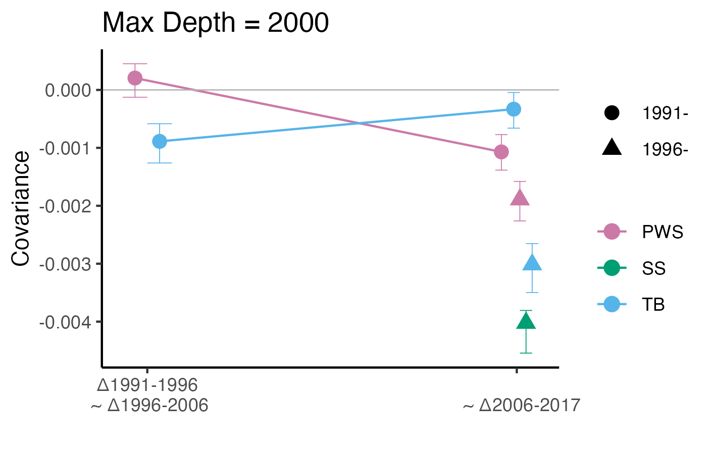  

## Plot results from MD2000 filtered down from MD70000

```{r eval=FALSE, message=FALSE, warning=FALSE}
pops<-c("PWS","TB","SS")
covs<-data.frame()
Variance<-data.frame()
for (p in 1: length(pops)){
    #covariance output file
    cov<-read.csv(paste0("../cvtk_analysis/MD2000_maf05_temp_cov_matrix_",pops[p],"_1M.csv"))
    cov<-cov[,-1]
    #CI file
    ci<-read.csv(paste0("../cvtk_analysis/MD2000_maf05_",pops[p],"_Cov_CIs_bootstrap5000_1Mwindow.csv"))
    ci<-ci[,-1]
        
    #reshape the matrix
    mat1<-cov[1:3,]
    mat2<-cov[4:6,]
        
    covdf<-data.frame()
    k=1
    for (i in 1:nrow(mat1)){
        for (j in 1:ncol(mat1)){
            covdf[k,1]<-mat2[i,j]
            covdf[k,2]<-mat1[i,j]
            k=k+1
        }
    }
    colnames(covdf)<-c("label","value")
    covdf$value<-as.numeric(covdf$value)
    covar<-covdf[grep("cov",covdf$label),]
    vars<-covdf[grep("var",covdf$label),]
        
    #remove the redundant values
    if (pops[p]!="SS") covar<-covar[!duplicated(covar[, 2]),] 
    if (pops[p]=="SS") covar<-covar[c(1,2,4),]
        
    #assign the starting time period and covering period values
    covar$year<-c(1,2,2)
    covar$series<-c("1991","1991","1996")
        
    vars$year<-c("1991-1996","1996-2006","2006-2017")
    #vars$series<-c("1991","1991","1996")
        
    #assign population name
    covar$location<-pops[p]
    vars$location<-pops[p]
        
    #attach ci info
    covar$ci_l<-as.numeric(c(ci[1,2], ci[1,3],ci[2,3]))
    covar$ci_u<-as.numeric(c(ci[4,2], ci[4,3],ci[5,3]))
        
    #combine in to one matrix
    covs<-rbind(covs, covar)
    Variance<-rbind(Variance, vars)
}
Variance$depth<-"MD2000_md7k"
VarMD2000_md7k<-Variance
xtexts<-c("\u03941991-1996\n ~ \u03941996-2006", "\n  ~ \u03942006-2017")

ggplot(data=covs, aes(x=year, y=value, color=location, shape=series, group=interaction(location, series)))+
        geom_point(size=3, position=position_dodge(width = 0.1,preserve ="total"))+
        geom_line(data=covs, aes(x=year, y=value,color=location, group=interaction(location, series)), position=position_dodge(width = 0.1,preserve ="total"))+
        ylab("Covariance")+xlab('')+theme_classic()+ggtitle("Max Depth = 2000 (filtered from 7K)")+
        theme(legend.title = element_blank())+
        geom_hline(yintercept = 0,color="gray70", size=0.3)+
        geom_errorbar(aes(ymin=ci_l, ymax=ci_u), width=.2, size=.2, position=position_dodge(width = 0.1,preserve ="total"))+
        scale_shape_manual(values=c(16,17),labels=c("1991-","1996-"))+
        scale_x_continuous(breaks = c(1,2), labels=xtexts)+
        scale_color_manual(values=cols[c(2,3,1)])
ggsave(paste0("../Output/COV_analysis/MD2000_filteredFromMD7000_VCF_covs.png"),width = 4.7, height = 3, dpi=300)

```
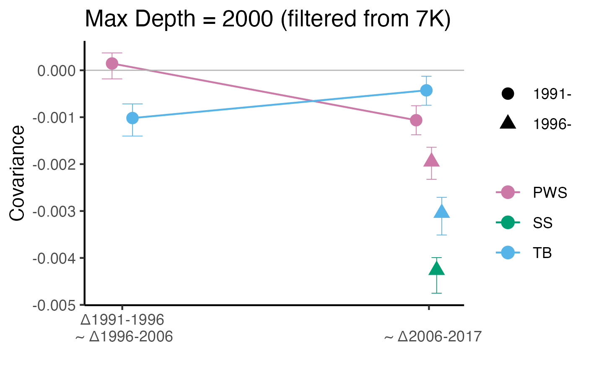

## Plot covariacne results from new MD3000 (3 pops only, 389817 loci)

```{r eval=FALSE, message=FALSE, warning=FALSE}
pops<-c("PWS","TB","SS")
covs<-data.frame()
Variance<-data.frame()
for (p in 1: length(pops)){
    cov<-read.csv(paste0("../cvtk_analysis/MD3000_3pops_maf05_temp_cov_matrix_",pops[p],"_100k.csv"))
    cov<-cov[,-1]
    ci<-read.csv(paste0("../cvtk_analysis/MD3000_3pops_maf05_",pops[p],"_Cov_CIs_bootstrap5000_100kwindow.csv"))
    ci<-ci[,-1]
    mat1<-cov[1:3,]
    mat2<-cov[4:6,]
    covdf<-data.frame()
    k=1
    for (i in 1:nrow(mat1)){
        for (j in 1:ncol(mat1)){
            covdf[k,1]<-mat2[i,j]
            covdf[k,2]<-mat1[i,j]
            k=k+1
        }
    }
    colnames(covdf)<-c("label","value")
    covdf$value<-as.numeric(covdf$value)
    covar<-covdf[grep("cov",covdf$label),]
    vars<-covdf[grep("var",covdf$label),]
        
    if (pops[p]!="SS") covar<-covar[!duplicated(covar[, 2]),] 
    if (pops[p]=="SS") covar<-covar[c(1,2,4),]
    covar$year<-c(1,2,2)
    covar$series<-c("1991","1991","1996")
    vars$year<-c("1991-1996","1996-2006","2006-2017")
    covar$location<-pops[p]
    vars$location<-pops[p]
    covar$ci_l<-as.numeric(c(ci[1,2], ci[1,3],ci[2,3]))
    covar$ci_u<-as.numeric(c(ci[4,2], ci[4,3],ci[5,3]))
    covs<-rbind(covs, covar)
    Variance<-rbind(Variance, vars)
}
Variance$depth<-"MD3000_new"
var.summary<-rbind(VarMD2000,Variance)
xtexts<-c("\u03941991-1996\n ~ \u03941996-2006", "\n  ~ \u03942006-2017")

ggplot(data=covs, aes(x=year, y=value, color=location, shape=series, group=interaction(location, series)))+
        geom_point(size=3, position=position_dodge(width = 0.1,preserve ="total"))+
        geom_line(data=covs, aes(x=year, y=value,color=location, group=interaction(location, series)), position=position_dodge(width = 0.1,preserve ="total"))+
        ylab("Covariance")+xlab('')+theme_classic()+ggtitle("Max Depth = 3000")+
        theme(legend.title = element_blank())+
        geom_hline(yintercept = 0,color="gray70", size=0.3)+
        geom_errorbar(aes(ymin=ci_l, ymax=ci_u), width=.2, size=.2, position=position_dodge(width = 0.1,preserve ="total"))+
        scale_shape_manual(values=c(16,17),labels=c("1991-","1996-"))+
        scale_x_continuous(breaks = c(1,2), labels=xtexts)+
        scale_color_manual(values=cols[c(2,3,1)])
ggsave(paste0("../Output/COV_analysis/MD3000_newVCF_covs.png"),width = 4.7, height = 3, dpi=300)
 
```

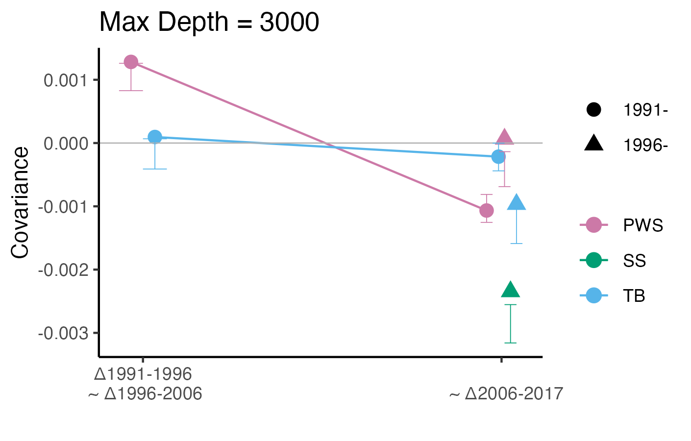

## Plot the variances of new MD2000, MD3000 & old MD2000
 
```{r eval=FALSE, message=FALSE, warning=FALSE}

var.summary<-rbind(var.summary,VarMD2000_md7k)

seqcols<-sequential_hcl(5, palette="Red-Blue")
#reverse the order
seqcols<-rev(seqcols)
ggplot(var.summary, aes(x=year, y=value, fill=depth))+
    facet_wrap(~location, ncol=1)+
    geom_bar(stat="identity", position=position_dodge(width=0.8))+
    theme_bw()+ylab("Variance")+xlab('')+
    geom_hline(yintercept = 0, color="gray30", size=0.3)+
    scale_fill_manual(values=seqcols, name="Max depth")
ggsave("../Output/COV_analysis/variances_byMaxDepthFilter.png", width = 7, height=6, dpi=300)

```


* Variances are negative at MD3000 -> Use MD2000


# Create population vcf files for manual CI calculation
## Create a script to run bcftools
```{r eval=FALSE, message=FALSE, warning=FALSE}
sink("Subset_vcf_byPop.sh")
cat("#!/bin/bash \n")
cat("bcftools view -Oz -S Data/popinfo/pws.txt --threads 24  Data/new_vcf/MD2000/3pops.MD2000_new.maf05.vcf.gz > Data/new_vcf/MD2000/3pops_MD2000_min417_PWS_maf05.vcf.gz \n")

cat("bcftools view -Oz -S Data/popinfo/ss.txt --threads 24  Data/new_vcf/MD2000/3pops.MD2000_new.maf05.vcf.gz > Data/new_vcf/MD2000/3pops_MD2000_min417_SS_maf05.vcf.gz \n")
cat("bcftools view -Oz -S Data/popinfo/tb.txt --threads 24  Data/new_vcf/MD2000/3pops.MD2000_new.maf05.vcf.gz > Data/new_vcf/MD2000/3pops_MD2000_min417_TB_maf05.vcf.gz \n")
sink(NULL)
```


## Run CVTK without Diploid or Depth bias correction 
```{r eval=FALSE, message=FALSE, warning=FALSE}
pops<-c("PWS","TB","SS")
covs1<-data.frame()
Variance1<-data.frame()
for (p in 1: length(pops)){
    cov<-read.csv(paste0("../cvtk_analysis/MD2000_min417_no_diploid_biasCorrection_temp_cov_matrix_",pops[p],".csv"))
    cov<-cov[,-1]
    mat1<-cov[1:3,]
    mat2<-cov[4:6,]
    
    covdf<-data.frame()
    k=1
    for (i in 1:nrow(mat1)){
        for (j in 1:ncol(mat1)){
            covdf[k,1]<-mat2[i,j]
            covdf[k,2]<-mat1[i,j]
            k=k+1
    }}
    colnames(covdf)<-c("label","value")
    covdf$value<-as.numeric(covdf$value)
    covar<-covdf[grep("cov",covdf$label),]
    vars<-covdf[grep("var",covdf$label),]
        
    if (pops[p]!="SS") covar<-covar[!duplicated(covar[, 2]),] 
    if (pops[p]=="SS") covar<-covar[c(1,2,4),]
        
    covar$year<-c(1,2,2)
    covar$series<-c("1991","1991","1996")
    vars$year<-c("1991-1996","1996-2006","2006-2017")
    covar$location<-pops[p]
    vars$location<-pops[p]
    covs1<-rbind(covs1, covar)
    Variance1<-rbind(Variance1, vars)
}
Variance1$method<-"no_diploid_correction"

covs2<-data.frame()
Variance2<-data.frame()
for (p in 1: length(pops)){
    #covariance output file
    cov<-read.csv(paste0("../cvtk_analysis/MD2000_min417_no_depth_biasCorrection_temp_cov_matrix_",pops[p],".csv"))
    cov<-cov[,-1]
    mat1<-cov[1:3,]
    mat2<-cov[4:6,]
    
    covdf<-data.frame()
    k=1
    for (i in 1:nrow(mat1)){
        for (j in 1:ncol(mat1)){
            covdf[k,1]<-mat2[i,j]
            covdf[k,2]<-mat1[i,j]
            k=k+1
    }}
    colnames(covdf)<-c("label","value")
    covdf$value<-as.numeric(covdf$value)
    covar<-covdf[grep("cov",covdf$label),]
    vars<-covdf[grep("var",covdf$label),]
        
    if (pops[p]!="SS") covar<-covar[!duplicated(covar[, 2]),] 
    if (pops[p]=="SS") covar<-covar[c(1,2,4),]
        
    covar$year<-c(1,2,2)
    covar$series<-c("1991","1991","1996")
    vars$year<-c("1991-1996","1996-2006","2006-2017")
    covar$location<-pops[p]
    vars$location<-pops[p]
    covs2<-rbind(covs2, covar)
    Variance2<-rbind(Variance2, vars)
}
Variance2$method<-"no_depth_correction"

covs3<-data.frame()
Variance3<-data.frame()
for (p in 1: length(pops)){
    #covariance output file
    cov<-read.csv(paste0("../cvtk_analysis/MD2000_min417_no_biasCorrections_temp_cov_matrix_",pops[p],".csv"))
    cov<-cov[,-1]
    mat1<-cov[1:3,]
    mat2<-cov[4:6,]
    
    covdf<-data.frame()
    k=1
    for (i in 1:nrow(mat1)){
        for (j in 1:ncol(mat1)){
            covdf[k,1]<-mat2[i,j]
            covdf[k,2]<-mat1[i,j]
            k=k+1
    }}
    colnames(covdf)<-c("label","value")
    covdf$value<-as.numeric(covdf$value)
    covar<-covdf[grep("cov",covdf$label),]
    vars<-covdf[grep("var",covdf$label),]
        
    if (pops[p]!="SS") covar<-covar[!duplicated(covar[, 2]),] 
    if (pops[p]=="SS") covar<-covar[c(1,2,4),]
        
    covar$year<-c(1,2,2)
    covar$series<-c("1991","1991","1996")
    vars$year<-c("1991-1996","1996-2006","2006-2017")
    covar$location<-pops[p]
    vars$location<-pops[p]
    covs3<-rbind(covs3, covar)
    Variance3<-rbind(Variance3, vars)
}
Variance3$method<-"no_corrections"
Variance_all<-rbind(Variance1, Variance2, Variance3)

covs1$method<-"no_diploid_correction"
covs2$method<-"no_depth_correction"
covs3$method<-"no_corrections"

xtexts2<-c("\u0394'91-'96\n ~ \u0394'96-'06", "\u0394'96-'06\n  ~ \u0394'06-'17", "\u0394'91-'96\n  ~ \u0394'06-'17")

covs_all<-rbind(covs1,covs2, covs3)
covs_all$time<-rep(c("cov12","cov13","cov23"), 9)

ggplot(data=covs_all, aes(x=time, y=value, color=location, shape=method))+
        geom_point(size=3, position=position_dodge(width = 0.1,preserve ="total"))+
        ylab("Covariance")+xlab('')+theme_classic()+
        theme(legend.title = element_blank(), axis.text.x = element_text(size=9))+
        geom_hline(yintercept = 0,color="gray70", size=0.3)+
        scale_x_discrete(labels=xtexts2)+
    scale_color_manual(values=cols[c(2,3,1)])+
    geom_vline(xintercept = c(1.5,2.5), color="gray", size=0.2)
ggsave("../Output/COV/sensitivity_analysis_covs_no_bias_corrections.png", width = 7, height=6, dpi=300)

#with all corrections
covs<-data.frame()
Variance<-data.frame()
for (p in 1: length(pops)){
    #covariance output file
    cov<-read.csv(paste0("../cvtk_analysis/MD2000_3pops_maf05_temp_cov_matrix_",pops[p],"_100k.csv"))
    cov<-cov[,-1]
    #CI file
    ci<-read.csv(paste0("../cvtk_analysis/MD2000_3pops_maf05_",pops[p],"_Cov_CIs_bootstrap5000_100kwindow.csv"))
    ci<-ci[,-1]
        
    #reshape the matrix
    mat1<-cov[1:3,]
    mat2<-cov[4:6,]
        
    covdf<-data.frame()
    k=1
    for (i in 1:nrow(mat1)){
        for (j in 1:ncol(mat1)){
            covdf[k,1]<-mat2[i,j]
            covdf[k,2]<-mat1[i,j]
            k=k+1
        }
    }
    colnames(covdf)<-c("label","value")
    covdf$value<-as.numeric(covdf$value)
    covar<-covdf[grep("cov",covdf$label),]
    vars<-covdf[grep("var",covdf$label),]
        
    #remove the redundant values
    if (pops[p]!="SS") covar<-covar[!duplicated(covar[, 2]),] 
    if (pops[p]=="SS") covar<-covar[c(1,2,4),]
        
    #assign the starting time period and covering period values
    covar$year<-c(1,2,2)
    covar$series<-c("1991","1991","1996")
        
    vars$year<-c("1991-1996","1996-2006","2006-2017")
    #vars$series<-c("1991","1991","1996")
        
    #assign population name
    covar$location<-pops[p]
    vars$location<-pops[p]
        
    #attach ci info
    covar$ci_l<-as.numeric(c(ci[1,2], ci[1,3],ci[2,3]))
    covar$ci_u<-as.numeric(c(ci[4,2], ci[4,3],ci[5,3]))
        
    #combine in to one matrix
    covs<-rbind(covs, covar)
    Variance<-rbind(Variance, vars)
}

Variance$method<-"both correction"
Variance_all<-rbind(Variance_all, Variance)

ggplot(Variance_all, aes(x=year, y=value, fill=method))+
    facet_wrap(~location, ncol=1)+
    geom_bar(stat="identity", position=position_dodge(width=0.8))+
    theme_bw()+ylab('Variance')+xlab('')+
    geom_hline(yintercept = 0, color="gray30", size=0.3)+
    scale_fill_manual(values=seqcols, name="Bias correction applied")
ggsave("../Output/COV_analysis/sensitivity_analysis_vars_no_bias_corrections.png", width = 7, height=6, dpi=300)

```

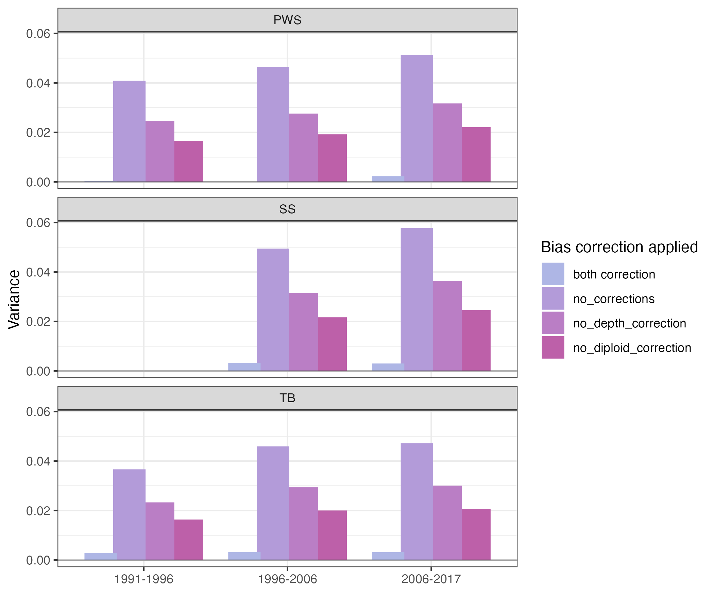

* Calculate CIs using the 'standard' bootstrap method in cvtk to avoid being off center

## Plots COVs and CIs from the 'standard' bootstrap method

```{r eval=FALSE, message=FALSE, warning=FALSE}
pops<-c("PWS","TB","SS")
covs<-data.frame()
for (p in 1: length(pops)){
    #covariance output file
    cov<-read.csv(paste0("../cvtk_analysis/MD2000_3pops_maf05_temp_cov_matrix_",pops[p],"_100k.csv"))
    cov<-cov[,-1]
        
    #reshape the matrix
    mat1<-cov[1:3,]
    mat2<-cov[4:6,]
        
    covdf<-data.frame()
    k=1
    for (i in 1:nrow(mat1)){
        for (j in 1:ncol(mat1)){
            covdf[k,1]<-mat2[i,j]
            covdf[k,2]<-mat1[i,j]
            k=k+1
        }
    }
    colnames(covdf)<-c("label","value")
    covdf$value<-as.numeric(covdf$value)
    covar<-covdf[grep("cov",covdf$label),]
        
    #remove the redundant values
    if (pops[p]!="SS") covar<-covar[!duplicated(covar[, 2]),] 
    if (pops[p]=="SS") covar<-covar[c(1,2,4),]
        
    #assign the starting time period and covering period values
    covar$year<-c(1,2,2)
    covar$series<-c("1991","1991","1996")
        
    #assign population name
    covar$location<-pops[p]
    
    #combine in to one matrix
    covs<-rbind(covs, covar)
}

covs$time<-rep(c("cov12","cov13","cov23"), 3)
colnames(covs)[2]<-"cov"

# 95% confidence intervals (calculated from the 'straps' returned from bootstrap_cov2() ci=1.96*sd(straps))
time<-c("cov12","cov13","cov23")

covs$ci<-NA
for (i in 1:length(pops)){  
     if (i!=3){
        df<-read.csv(paste0("../cvtk_analysis/MD2000_",pops[i],"_CIs_100kwindow.csv"), header=F)
        covs$ci[covs$location==pops[i]&time=='cov12']<-df[1,2]
        covs$ci[covs$location==pops[i]&time=='cov13']<-df[1,3]
        covs$ci[covs$location==pops[i]&time=='cov23']<-df[2,3]
    }
    if (p==3) {
        df<-read.csv(paste0("../cvtk_analysis/MD2000_",pops[i],"_CIs_100kwindow.csv"), header=F)
        covs$ci[covs$location==pops[i]&time=='cov23']<-df[1,2] 
    }
}

xtexts<-c("\u03941991-1996\n ~ \u03941996-2006", "\n  ~ \u03942006-2017")

ggplot(data=covs, aes(x=year, y=cov, color=location, shape=series, group=interaction(location, series)))+
        geom_point(size=3, position=position_dodge(width = 0.1,preserve ="total"))+
        geom_line(data=covs, aes(x=year, y=cov,color=location, group=interaction(location, series)), position=position_dodge(width = 0.1,preserve ="total"))+
        ylab("Covariance")+xlab('')+theme_classic()+
        theme(legend.title = element_blank())+
        geom_hline(yintercept = 0,color="gray70", size=0.3)+
        geom_errorbar(aes(ymin=cov-ci, ymax=cov+ci), width=.2, size=.2, position=position_dodge(width = 0.1,preserve ="total"))+
        scale_shape_manual(values=c(16,17),labels=c("\u0394'91-'96~","\u0394'96-'06~"))+
        scale_x_continuous(breaks = c(1,2), labels=xtexts)+
        scale_color_manual(values=cols[c(2,3,1)])+ylim(-0.0037,0.0013)
ggsave(paste0("../Output/COV_analysis/3Pops_plot1.png"),width = 4.7, height = 3, dpi=300)
    
covs$time<-factor(covs$time, levels=c("cov12","cov23","cov13"))
#xtexts<-c("\u03941991-1996\n ~ \u03941996-2006", "\u03941996-2006\n  ~ \u03942006-2017", "\u03941991-1996\n  ~ \u03942006-2017")
xtexts<-c("\u0394'91-'96\n ~ \u0394'96-'06", "\u0394'96-'06\n  ~ \u0394'06-'17", "\u0394'91-'96\n  ~ \u0394'06-'17")

ggplot(data=covs, aes(x=time, y=cov, color=location))+
        geom_point(size=3, position=position_dodge(width = 0.1,preserve ="total"))+
        #geom_line(data=covs, aes(x=year, y=cov,color=location, group=interaction(location, series)), position=position_dodge(width = 0.1,preserve ="total"))+
        ylab("Covariance")+xlab('')+theme_classic()+
        theme(legend.title = element_blank(), axis.text.x = element_text(size=9))+
        geom_hline(yintercept = 0,color="gray70", size=0.3)+
        geom_errorbar(aes(ymin=cov-ci, ymax=cov+ci), width=.2, size=.2, position=position_dodge(width = 0.1,preserve ="total"))+
        scale_x_discrete(labels=xtexts)+
    scale_color_manual(values=cols[c(2,3,1)])+
    geom_vline(xintercept = c(1.5,2.5), color="gray", size=0.2)+ylim(-0.0038,0.0014)
ggsave(paste0("../Output/COV_analysis/3Pops_plot2.png"),width = 4.57, height = 3, dpi=300)

```

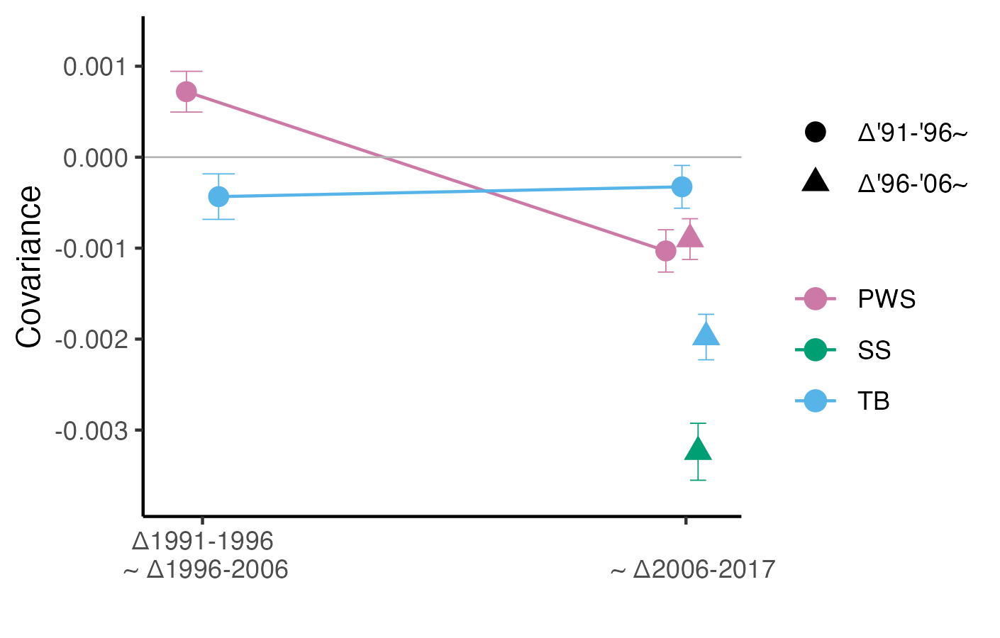

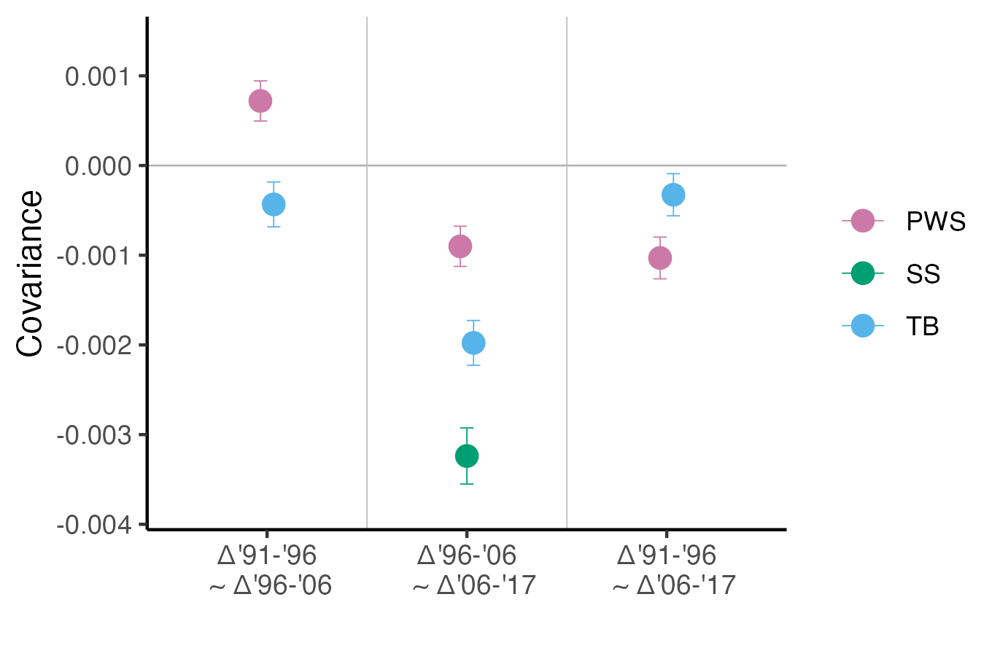
* Continue to COV_Analysis1 & COV_Analysis2.Rmd