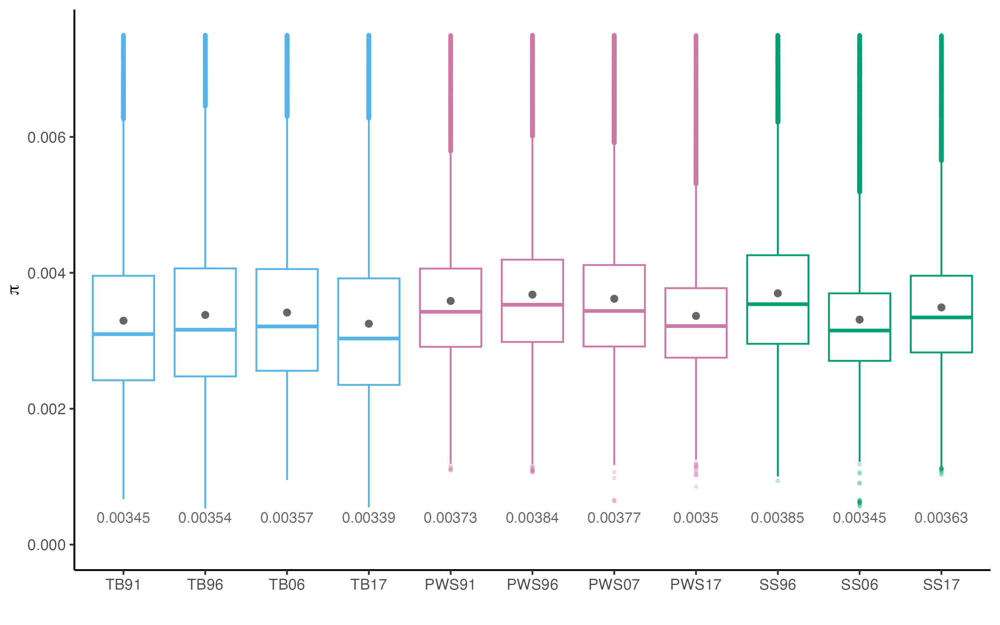
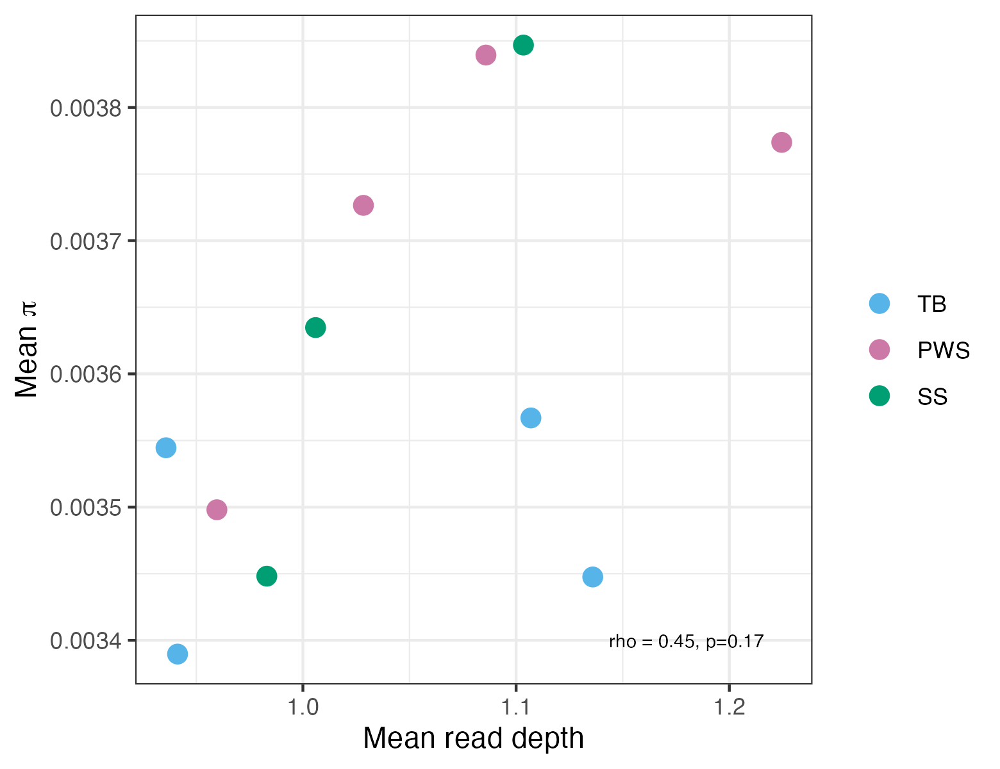
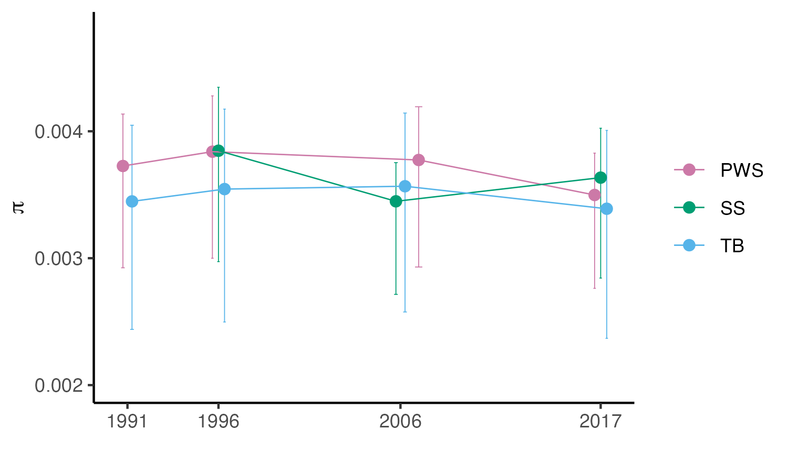
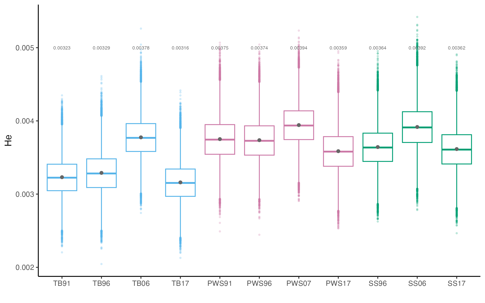
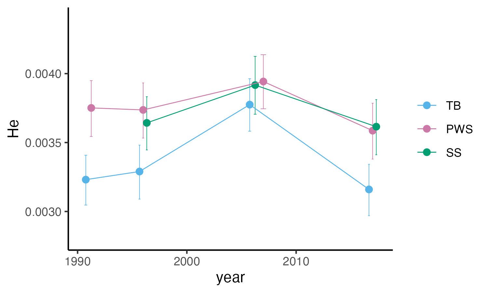
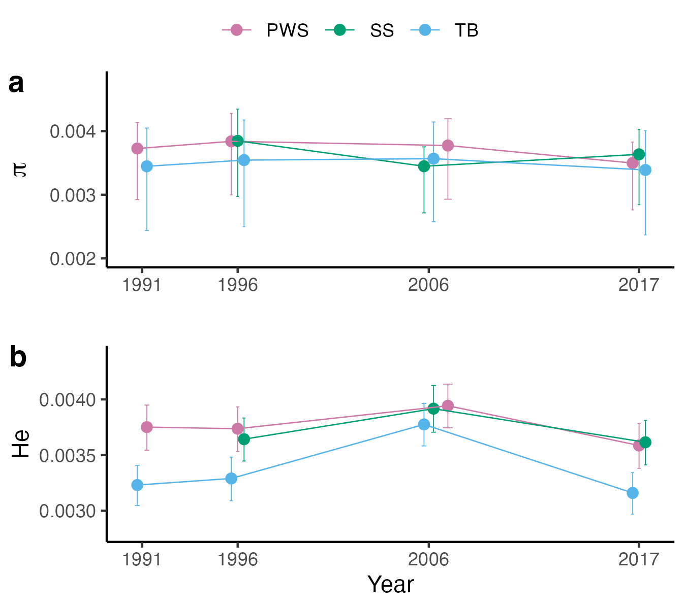
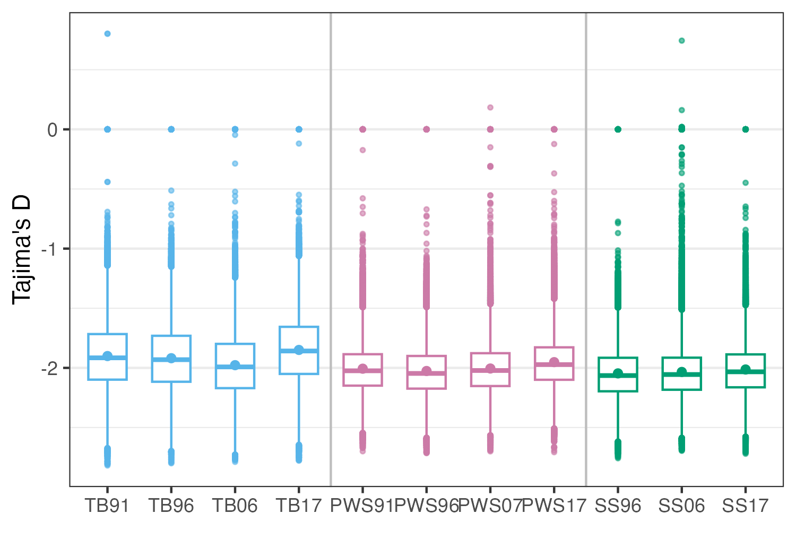
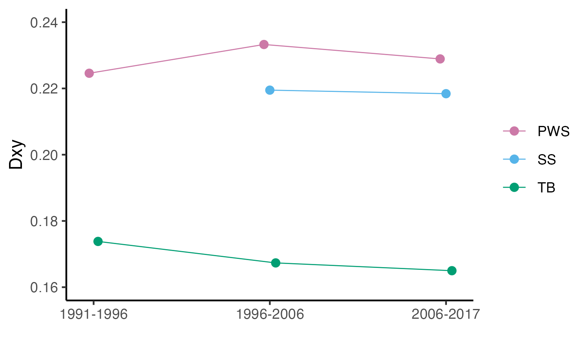
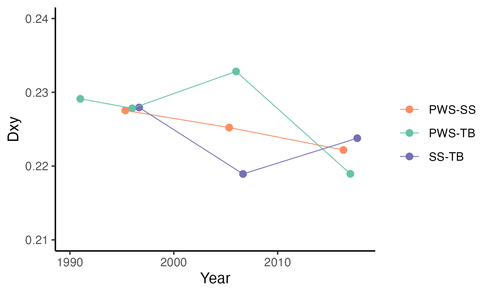

```{r eval=FALSE, message=FALSE, warning=FALSE}
source("BaseScripts.R")
require(data.table)
require(plyr)
require(RColorBrewer)
```
 

# Pi from Single Read Sampling in ANGSD 

```{r eval=FALSE, message=FALSE, warning=FALSE}
pops<-c("TB91","TB96","TB06","TB17","PWS91","PWS96","PWS07","PWS17","SS96","SS06","SS17")


## Outputs generated from ANGSD are available at OSF Storage: https://osf.io/wrca4 in Data/IBS

full<-data.frame()
for (i in 1:length(pops)){
    theta<-read.delim(paste0('../Data/IBS/',pops[i],'_theta_ibs_50kwin_10kstep.pestPG'))
    theta$pi<-theta$tP/theta$nSites
    theta<-theta[,c("Chr","WinCenter","pi","Tajima" )]
    theta$pop.yr<-pops[i]
    theta$pop<-gsub("([0-9])",'', pops[i])
    full<-rbind(full, theta)
}

full$pop.yr<-factor(full$pop.yr, levels=pops)
full$pop<-factor(full$pop, levels=c("TB","PWS","SS"))
meansPi <- aggregate(pi ~ pop.yr,full, mean)
#write.csv(meansPi, "../Output/Pi/Pi_fromANGSD_singleReadSampling.csv")

ggplot(full, aes(x=pop.yr, y=pi, color=pop))+
        geom_boxplot(aes(color=pop), outlier.alpha = 0.2, outlier.size = 0.6)+
        theme_classic()+ 
        geom_point(stat = "summary", fun = "mean", color="gray40")+
         xlab("")+ylab(expression(pi))+
        geom_text(data = meansPi, aes(label = round(pi, digits=5), y = pi + 0.015),size=3, color="gray40")+
    scale_color_manual(values=cols, guide='none')
ggsave(paste0("../Output/Pi/Pi_fromANGSD_singleRead_allpops.png"), width = 8, height = 5, dpi=300)

#zoom in 
ggplot(full, aes(x=pop.yr, y=pi, color=pop))+
        geom_boxplot(aes(color=pop), outlier.alpha = 0.2, outlier.size = 0.6)+
        theme_classic()+ylim(0, 0.0075)+
        geom_point(stat = "summary", fun = "mean", color="gray40")+
         xlab("")+ylab(expression(pi))+
        geom_text(data = meansPi, aes(label = round(pi, digits=5), y = 0.0004),size=3, color="gray40")+
    scale_color_manual(values=cols,guide='none')
ggsave(paste0("../Output/Pi/Pi_fromANGSD_singleRead_allpops_zoomed.png"), width = 8, height = 5, dpi=300)


```
* Zoomed in plot


* Compare to read coverage
  

<br>

## Correlation analysis of read depth & Pi

```{r eval=FALSE, message=FALSE, warning=FALSE}
year<-c(1991,1996,2006,2017,1991,1996,2007,2017,1996,2006,2017,2017,2017,2017)

#coverage info 
byPopYr<-read.csv("../Output/QC/Bam_metrics_average_depths.csv")
colnames(byPopYr)<-c("pop.yr","depth")
# Pi from ANGSD (single-read sampling)
meanPi<-read.csv("../Output/Pi/Pi_fromANGSD_singleReadSampling.csv")
data<-merge(byPopYr, meansPi, by="pop.yr")


cor.test(data$depth, data$pi, method = "spearman")
#S = 122, p-value = 0.1728
#alternative hypothesis: true rho is not equal to 0
#sample estimates:
#      rho 
#0.4454545 

data$pop<-gsub("[0-9]",'',data$pop.yr)
data$pop<-factor(data$pop, levels=c("TB","PWS","SS"))
ggplot(data, aes(x=depth, y=pi, color=pop))+
    geom_point(size=3)+
    xlab("Mean read depth")+
    ylab(expression(paste("Mean ", pi)))+
    theme_bw()+
    annotate('text', x=1.18, y=0.0034, label="rho = 0.45, p=0.17", size=2.5)+
    scale_color_manual(values=cols)+ theme(legend.title = element_blank())
ggsave("../Output/Pi/Correlation_depth.vs.Pi.png", width = 5.2, height = 4, dpi=300)
# No more correlation

```




## Plot pi over time for time-series data  

```{r eval=FALSE, message=FALSE, warning=FALSE}
pops2<-c("TB91","TB96","TB06","TB17","PWS91","PWS96","PWS07","PWS17","SS96","SS06","SS17")

times<-full[full$pop.yr %in% pops2,]
times$pop<-droplevels(times$pop)
times$pop.yr<-droplevels(times$pop.yr)

sum<-aggregate( . ~ pop.yr, FUN=function(x) c(mn=mean(x), sd=sd(x),se=std.error(x)), data=times[,c("pop.yr","pi")])
pi_sum<-as.data.frame(sum$pi)
pi_sum$pop.yr<-sum$pop.yr

pi_sum$year<-gsub('[A-Z]', '', pi_sum$pop.yr)
years = c('91'='1991', '96'='1996','06'='2006','07'='2007','17'='2017')
pi_sum$year<-str_replace_all(pi_sum$year, years)
pi_sum$year<-as.integer(pi_sum$year)
pi_sum$pop<-gsub('[0-9]', '', pi_sum$pop.yr)

times$year<-gsub('[A-Z]', '', times$pop.yr)
times$year<-str_replace_all(times$year, years)
times$year<-as.integer(times$year)

#boxplot
times$pop<-factor(times$pop, levels=c("TB","PWS","SS"))

ggplot(times, aes(x=pop.yr, y=pi, color=pop))+
        geom_boxplot(aes(color=pop), outlier.alpha = 0.2, outlier.size = 0.6)+
        theme_classic()+ 
        geom_point(stat = "summary", fun = "mean", color="gray40")+
         xlab("")+ylab(expression(pi))+
        geom_text(data = pi_sum, aes(label = round(mn, digits=5), y = mn + 0.015),size=3, color="gray40")+
    scale_color_manual(values=cols, guide='none')
#ggsave(paste0("../Output/Pi/Pi_singleRead_shifts_overtime_3pops_boxplot.png"), width = 8, height = 5, dpi=300)

# Add quantile to the point plot
qs<-aggregate(times$pi, by=list(times$pop.yr), quantile, na.rm=T )[2]              
qs<-data.frame(qs$x)
qs$pop.yr<-pi_sum$pop.yr
pi_sum$q_low<-qs$X25.
pi_sum$q_up<-qs$X75.

#with 25% -75% qunatile
ggplot(pi_sum, aes(x=year, y=mn, color=pop))+
    geom_errorbar(aes(ymin=q_low, ymax=q_up),position=position_dodge(width=1),  width=.4, size=.2)+
    geom_point(position=position_dodge(width=1), size=2)+
    geom_path(aes(group=pop),position=position_dodge(width=1), size=0.3)+
    ylim(0.002, 0.0048)+xlab("Year")+
    theme_classic()+ylab(expression(pi))+xlab('')+
    scale_color_manual(values=cols[c(2,3,1)])+theme(legend.title=element_blank(), axis.title.y = element_text(size=11))+
    scale_x_continuous(breaks=c(1991, 1996,2006,2017))
ggsave("../Output/Pi/Pi_singleRead_shifts_overtime_3pops_quantiles.png", width=5, height=3, dpi=300)


```

  


## Run T-test on Pi

```{r eval=FALSE, message=FALSE, warning=FALSE}

#shapiro.test(times$pi) 
qqnorm(times$pi)
bartlett.test(pi ~ pop.yr, times)
#Bartlett's K-squared = 5961.4, df = 10, p-value < 2.2e-16


#t-test
library(BSDA) #t-test based on summary data
size<-read.csv("../Data/Samplesize.per.pop.csv")
size<-size[size$Pop %in% c("PWS","SS","TB"),]

names<-as.character(size$pop.yr)
Ncomb<-t(combn(names,2))
ttestres<-data.frame(matrix(ncol=3,nrow=nrow(Ncomb)))
colnames(ttestres)<-c("pop.yr1","pop.yr2","rawP")

for (i in 1:nrow(Ncomb)) {
    re1<-tsum.test(mean.x = pi_sum$mn[pi_sum$pop.yr==Ncomb[i,1]] , s.x =  pi_sum$sd[pi_sum$pop.yr==Ncomb[i,1]] , n.x = size$Freq[size$pop.yr==Ncomb[i,1]], 
          mean.y = pi_sum$mn[pi_sum$pop.yr==Ncomb[i,2]], s.y = pi_sum$sd[pi_sum$pop.yr==Ncomb[i,2]],n.y = size$Freq[size$pop.yr==Ncomb[i,2]])
        
    
    ttestres$pop.yr1[i]<-Ncomb[i,1]
    ttestres$pop.yr2[i]<-Ncomb[i,2]
    ttestres$rawP[i]<-re1[[3]]
}   

source("Pcorrection.R")
res.t<-Pcorrection(ttestres)

# None are significant


```
* None of them are significant


# Calculate expected heterozygosity    
* Heterozygosity estimates using 2p(1-p) (He)


## Expected heterozygostiy (He) 

```{r eval=FALSE, message=FALSE, warning=FALSE}

# ibs files obtained from ANGSD single read sampling approach (-doIBS) are available at: OSF Storage: https://osf.io/wrca4 Data/IBS/

pops.info<-read.csv("../Data/Sample_metadata_3pops.csv")
sampleN<-data.frame(table(pops.info$Population.Year))

#### Calculate SFS from IBS data
mfiles<-list.files('../Data/IBS/SAF/', pattern='.mafs.gz') # estimated freq

summaryHe<-data.frame(V=1:length(mfiles))
for (f in 1: length(mfiles)){
    mf<-fread(paste0('../Data/IBS/SAF/', mfiles[f])) 
    samplename<-gsub("_ibs.mafs.gz", '', mfiles[f])
    
    #number of sample
    n<-sampleN$Freq[sampleN$Var1==samplename]
    
    #remove the sites with less than n/2 samples 
    mf<-mf[mf$nInd>=n/2,]
    mf<-mf[,c("chromo","position","knownEM")]

    #calculate He
    mf$het<-mf$knownEM*2*(1-mf$knownEM)
    
    summaryHe$pop[f]<-samplename
    summaryHe$He_knownEM[f]<-mean(mf$het)
    #summaryHe$He_maf[f]<-mean(freq$het2, na.rm=T)
    
    # calculate every 50,000th row average
    w=50000
    df<-mf[, mean(het), by= (seq(nrow(mf)) - 1) %% w]
    
    write.csv(df, file=gzfile(paste0("../Output/SingleRead/He_50kwin_from.fullSaf.", samplename,".csv.gz")))
    print(f)
    gc()
}
summaryHe[,1]<-gsub("([0-9])",'', summaryHe$pop)
colnames(summaryHe)<-c("pop","pop.yr", "meanHe")
write.csv(summaryHe, "../Output/SingleRead/Het_mean.csv", row.names = F)

```


## Plot the results 
``` {r eval=FALSE, message=FALSE, warning=FALSE}
# Read the summary He files and create a figure

hfiles<-list.files("../Output/Pi/SingleRead/", pattern="He_50kwin_from.fullSaf.")
Het<-data.frame()
for (i in 1: length(hfiles)){
    df<-fread(paste0("../Output/Pi/SingleRead/", hfiles[i]))
    df<-df[,2:3]
    samplename<-gsub("He_50kwin_from.fullSaf.", '', hfiles[i])
    samplename<-gsub(".csv.gz", '', samplename)
    df$pop.yr<-samplename
    df$pop<-gsub("([0-9])",'', samplename)
    Het<-rbind(Het, df)
}
colnames(Het)[2]<-"he"
Het$pop.yr<-factor(Het$pop.yr, levels=pops)
Het$pop<-factor(Het$pop, levels=c("TB","PWS","SS"))

meanHe<-read.csv("../Output/Pi/SingleRead/Het_mean.csv")
colnames(meanHe)[3]<-"he"
meanHe$pop.yr<-factor(meanHe$pop.yr, levels=pops)


ggplot(Het, aes(x=pop.yr, y=he, color=pop))+
    geom_boxplot(outlier.alpha = 0.2, outlier.size = 0.6)+
    theme_classic()+
    geom_point(stat = "summary", fun = "mean", color="gray40")+
    xlab("")+ylab("He")+
    geom_text(data = meanHe, aes(label = round(he, digits=5), y = 0.005), color="gray40", size=2)+
    scale_color_manual(values=cols, guid="none")
ggsave(paste0("../Output/Pi/SingleRead/ExpectedHet_fromANGSD_EM.png"), width = 8, height = 5, dpi=300)

```




* Compare to read coverage


## Plot He over time  
``` {r eval=FALSE, message=FALSE, warning=FALSE}
hfiles<-list.files("../Output/Pi/SingleRead/", pattern="He_50kwin_from.fullSaf.")
Het<-data.frame()
for (i in 1: length(hfiles)){
    df<-fread(paste0("../Output/Pi/SingleRead/", hfiles[i]))
    df<-df[,2:3]
    samplename<-gsub("He_50kwin_from.fullSaf.", '', hfiles[i])
    samplename<-gsub(".csv.gz", '', samplename)
    df$pop.yr<-samplename
    df$pop<-gsub("([0-9])",'', samplename)
    Het<-rbind(Het, df)
}
colnames(Het)[2]<-"he"

years = c('91'='1991', '96'='1996','06'='2006','07'='2007','17'='2017')
Het$year<-gsub('[A-Z]', '', Het$pop.yr)
Het$year<-str_replace_all(Het$year, years)
Het$year<-as.integer(Het$year)
Het$pop.yr<-factor(Het$pop.yr, levels=pops[1:11])
Het$pop<-factor(Het$pop, levels=c("TB","PWS","SS"))

sum<-aggregate( . ~ pop.yr, FUN=function(x) c(mn=mean(x), sd=sd(x),se=std.error(x)), data=Het[,c("pop.yr","he")])
het_sum<-as.data.frame(sum$he)
het_sum$pop.yr<-sum$pop.yr
colnames(het_sum)[1]<-"he"

qss<-aggregate(Het$he, by=list(Het$pop.yr), quantile, na.rm=T )            
qs<-data.frame(qss$x)
qs$pop.yr<-qss$Group.1


meanHe<-merge(het_sum, qs[,c("pop.yr", "X25.","X75.")], by="pop.yr")
meanHe$pop<-gsub('[0-9]', '', meanHe$pop.yr)
meanHe$pop<-factor(meanHe$pop, levels=c("TB","PWS","SS"))
meanHe$year<-gsub('[A-Z]', '', meanHe$pop.yr)
meanHe$year<-str_replace_all(meanHe$year, years)
meanHe$year<-as.integer(meanHe$year)
meanHe$pop.yr<-factor(meanHe$pop.yr, levels=pops[1:11])
meanHe<-meanHe[order(meanHe$year),]


ggplot(meanHe, aes(x=year, y=he, color=pop))+
    geom_errorbar(aes(ymin=X25., ymax=X75.),position=position_dodge(width=1),  width=.5, size=.2)+
    geom_point(position=position_dodge(width=1), size=2)+
    geom_path(aes(group=pop),position=position_dodge(width=1), size=0.3)+
    ylim(0.0028, 0.0044)+
    theme_classic()+ylab("He")+
    scale_color_manual(values=cols[c(1,2,3)])+theme(legend.title=element_blank())
ggsave("../Output/Pi/He_singleRead_shifts_overtime_3pops_quantiles.png", width=5, height=3, dpi=300)

```




## Run stats
```{r eval=FALSE, message=FALSE, warning=FALSE}
size<-read.csv("../Data/Samplesize.per.pop.csv")

#shapiro.test(Het$he) 
qqnorm(Het$he)
bartlett.test(he ~ pop.yr, Het)
#Bartlett's K-squared = 1587.2, df = 10, p-value < 2.2e-16

# run Welch Modified Two-Sample t-Test
ttestresults<-data.frame(matrix(ncol=3,nrow=nrow(Ncomb)))
colnames(ttestresults)<-c("pop.yr1","pop.yr2","rawP")
for (i in 1:nrow(Ncomb)) {
    re1<-tsum.test(mean.x = meanHe$he[meanHe$pop.yr==Ncomb[i,1]] , s.x =  meanHe$sd[meanHe$pop.yr==Ncomb[i,1]] , n.x = size$Freq[size$pop.yr==Ncomb[i,1]], 
          mean.y = meanHe$he[meanHe$pop.yr==Ncomb[i,2]], s.y = meanHe$sd[meanHe$pop.yr==Ncomb[i,2]],n.y = size$Freq[size$pop.yr==Ncomb[i,2]], alternative = "two.sided", mu = 0, var.equal = FALSE,
          conf.level = 0.95)
    ttestresults$pop.yr1[i]<-Ncomb[i,1]
    ttestresults$pop.yr2[i]<-Ncomb[i,2]
    ttestresults$rawP[i]<-re1[[3]]
}   

source("Pcorrection.R")
rest<-Pcorrection(ttestresults)

options(scipen=999)
rest[,3:9]<- signif(rest[,3:9], digits=3)

rest$pop1<-gsub('[0-9]', '', rest$pop.yr1)
rest$pop2<-gsub('[0-9]', '', rest$pop.yr2)
rest$year1<-gsub('[A-Z]', '', rest$pop.yr1)
rest$year2<-gsub('[A-Z]', '', rest$pop.yr2)
years = c('91'='1991', '96'='1996','06'='2006','07'='2006','17'='2017')
rest$year1<-str_replace_all(rest$year1, years)
rest$year2<-str_replace_all(rest$year2, years)
rest$year1<-as.integer(rest$year1)
rest$year2<-as.integer(rest$year2)

#create intra pop comparison
#rest2<-rest
intrapop<-rest[rest$pop1==rest$pop2,]

#compare between pop in the same year
interpop<-rest[rest$pop1!=rest$pop2 & rest$year1==rest$year2,]
Heresults<-rbind(intrapop, interpop)

write.csv(Heresults,"../Output/Pi/He.stats.select.results.csv",row.names = F)
```


## Plot the results together
```{r eval=FALSE, message=FALSE, warning=FALSE}

# Stack pi and He together

p1<-ggplot(pi_sum, aes(x=year, y=mn, color=pop))+
    geom_errorbar(aes(ymin=q_low, ymax=q_up),position=position_dodge(width=1),  width=.4, size=.2)+
    geom_point(position=position_dodge(width=1), size=2)+
    geom_path(aes(group=pop),position=position_dodge(width=1), size=0.3)+
    ylim(0.002, 0.0048)+
    theme_classic()+ylab(expression(pi))+xlab('')+
    scale_color_manual(values=cols[c(2,3,1)])+theme(legend.title=element_blank(), axis.title.y = element_text(size=13))+
    scale_x_continuous(breaks=c(1991, 1996,2006,2017), name="")

p2<-ggplot(meanHe, aes(x=year, y=he, color=pop))+
    geom_errorbar(aes(ymin=X25., ymax=X75.),position=position_dodge(width=1),  width=.5, size=.2)+
    geom_point(position=position_dodge(width=1), size=2)+
    geom_path(aes(group=pop),position=position_dodge(width=1), size=0.3)+
    ylim(0.0028, 0.0044)+
    theme_classic()+ylab("He")+
    scale_color_manual(values=cols[c(1,2,3)])+theme(legend.title=element_blank())+
     scale_x_continuous(breaks=c(1991, 1996,2006,2017), name="Year")


ggpubr::ggarrange(p1, p2, # list of plots
                  labels = "auto", # labels
                  common.legend = T, # COMMON LEGEND
                  legend = "top", # legend position
                  align = "hv", # Align them both, horizontal and vertical
                  nrow = 2)  # number of rows
ggsave("../Output/Pi/single_read_diversity_plots.png", height = 4, width = 4.5, dpi=300, units = "in")

```



## Tajima's D. 
```{r eval=FALSE, message=FALSE, warning=FALSE}
#Tajima's D (folded SFS)
theta<-data.frame()
for (i in 1:length(pops2)){
    theta2<-read.delim(paste0('../Data/IBS/',pops2[i],'_folded_theta_ibs_50kwin_10kstep.pestPG'))
    df<-theta2[,c("Chr","WinCenter","Tajima" )]
    df$pop<-pops2[i]    
    theta<-rbind(theta, df)
}

colnames(theta)[4]<-"pop.yr"
theta$pop<-gsub('[0-9]', '', theta$pop.yr)
theta$pop.yr<-factor(theta$pop.yr, levels=pops)

ggplot(theta, aes(x=pop.yr, y=Tajima, color=pop, fills=pop))+
    geom_boxplot(aes(color=pop), outlier.alpha = 0.6,outlier.size = 0.7,width=0.6)+
    geom_point(stat = "summary", fun = "mean",)+
    ylab("Tajima's D")+xlab("")+
    theme_bw()+
    scale_color_manual(values=cols, guid="none")+
    theme(panel.grid.major.x = element_blank())+
    geom_vline(xintercept = c(4.5,8.5), color="gray", size=0.5)
ggsave("../Output/Pi/TajimaD.png", width = 5, height = 3.5)

```




# Calculate Dxy
* ngsTools website (https://github.com/mfumagalli/ngsTools/blob/master/TUTORIAL.md)
*"dxy been shown to be over-estimated and should be used only for inspecting the distribution and not to make inferences based on its absolute values"

* Use calcDxy.R (https://github.com/mfumagalli/ngsPopGen/blob/master/scripts/calcDxy.R) using mafs from angsd


##create a script to run calcDxy.R for population pairs 

```{r eval=FALSE, message=FALSE, warning=FALSE, include=FALSE}

pwss<-c("PWS91","PWS96","PWS07","PWS17")
tbs<-c("TB91","TB96","TB06","TB17")
sss<-c("SS96","SS06","SS17")
comb1<-combn(pwss, 2)
comb1<-t(comb1)
comb2<-combn(tbs, 2)
comb2<-t(comb2)
comb3<-combn(sss, 2)
comb3<-t(comb3)
comb<-data.frame(rbind(comb1, comb2, comb3))

# between pop comparison
comb4<-combn(c("PWS17","SS17","TB17"), 2)
comb4<-t(comb4)
comb5<-combn(c("PWS07","SS06","TB06"),2)
comb5<-t(comb5)
comb6<-combn(c("PWS96","SS96","TB96"),2)
comb6<-t(comb6)
comb7<-combn(c("PWS91","TB91"),2)
comb7<-t(comb7)
combT<-data.frame(rbind(comb4, comb5, comb6,comb7))


# first unzip the Maf files and move to /Scripts/calcDxy/
# for f in *.mafs.gz; do
# filename=$(basename $f)
# bgzip -d $f 
# done


#Create the scripts to run calcDxy from Terminal
sink("../Scripts/calculateDxy/run_calcDxy_3pops.sh")
cat("#!/bin/bash \n\n")
for (i in 1: nrow(comb)){
    cat(paste0("Rscript calcDxy.R  -p ",comb[i,1]," --popA='AF3pops_",comb[i,1],"_maf05.mafs' -q ",comb[i,2], " --popB='AF3pops_",comb[i,2],"_maf05.mafs'\n"))
    cat(paste0("mv Dxy_persite.txt Dxy_persite_",comb[i,1],"_",comb[i,2],".txt \n"))
}
sink(NULL)

sink("../Scripts/calculateDxy/run_calcDxy_betw3pops.sh")
cat("#!/bin/bash \n\n")
for (i in 1: nrow(combT)){
    cat(paste0("Rscript calcDxy.R  -p ",combT[i,1]," --popA='AF3pops_",combT[i,1],"_maf05.mafs' -q ",combT[i,2], " --popB='AF3pops_",combT[i,2],"_maf05.mafs'\n"))
    cat(paste0("mv Dxy_persite.txt Dxy_persite_",combT[i,1],"_",combT[i,2],".txt \n"))
}
sink(NULL)

# Run the above script in terminal 
 cd Scripts/calculateDxy/
 bash run_calcDxy_3pops.sh
#

```

## Plot mean Dxy
```{r eval=FALSE, message=FALSE, warning=FALSE, include=FALSE}
dxy<-comb

for (i in 1:nrow(comb)){
    df<-read.table(paste0("../Scripts/calculateDxy/Dxy_persite_",comb[i,1],"_",comb[i,2],".txt"), header = T) 
    dxy$mean[i]<-mean(df$dxy)
    dxy$globalDxy[i]<-sum(df$dxy)
    qss<-quantile(df$dxy)
    dxy$X25[i]<-qss[2]
    dxy$X75[i]<-qss[4]
}


dxy_pop<-dxy
dxy$pop<-c(rep("PWS",times=6), rep("TB", times=6), rep("SS", times=3))
#time period 1,4,6 are the succeeding years
dxy$time<-c(rep(1:6, times=2), 4:6)

dxy2<-dxy[dxy$time%in% c(1,4,6),]
dxy2$period<-c(rep(1:3, times=2), 2,3)

# Dxy over time
ggplot(dxy2, aes(x=period, y=mean, color=pop))+
    #geom_errorbar(aes(ymin=X25, ymax=X75),position=position_dodge(width=1),  width=.5, size=.2)+
    geom_point(position=position_dodge(width=.1), size=2)+
    geom_path(aes(group=pop),position=position_dodge(width=.1), size=0.3)+
    theme_classic()+ylab("Dxy")+ylim(0.16,0.24)+
    scale_color_manual(values=cols[c(2,1,3)])+theme(legend.title=element_blank())+
      scale_x_continuous(breaks=c(1,2,3), labels=c("1991-1996", "1996-2006","2006-2017"))+xlab('')
ggsave("../Output/Pi/Dxy_over_time.png", width=5, height=3, dpi=300)

```

## Between population Dxy
```{r eval=FALSE, message=FALSE, warning=FALSE, include=FALSE}
dxyT<-combT

for (i in 1:nrow(combT)){
    df<-read.table(paste0("../Scripts/calculateDxy/Dxy_persite_",combT[i,1],"_",combT[i,2],".txt"), header = T) 
    dxyT$mean[i]<-mean(df$dxy)
    dxyT$globalDxy[i]<-sum(df$dxy)
    qss<-quantile(df$dxy)
    dxyT$X25[i]<-qss[2]
    dxyT$X75[i]<-qss[4]
}


dxyT$Year<-c(rep(2017,times=3), rep(2006, times=3), rep(1996, times=3), 1991)
dxyT$pops<-c(rep(c("PWS-SS","PWS-TB","SS-TB"), times=3), "PWS-TB")

# Dxy between pop over time
ggplot(dxyT, aes(x=Year, y=mean, color=pops))+
    geom_point(position=position_dodge(width=2), size=2)+
    geom_path(aes(group=pops),position=position_dodge(width=2), size=0.3)+
    theme_classic()+ylab("Dxy")+ylim(0.21,0.24)+
    scale_color_manual(values=colors3[c(2,1,3)])+theme(legend.title=element_blank())
ggsave("../Output/Pi/Dxy_betwPop_over_time.png", width=5, height=3, dpi=300)


```





