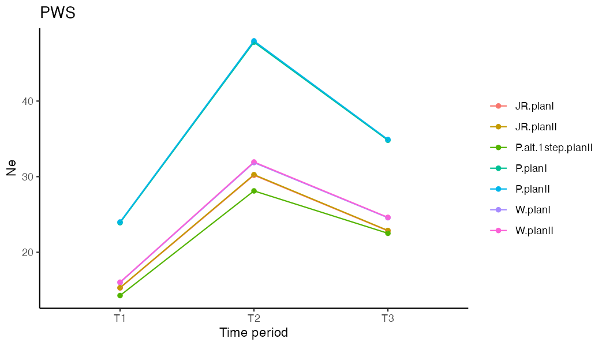
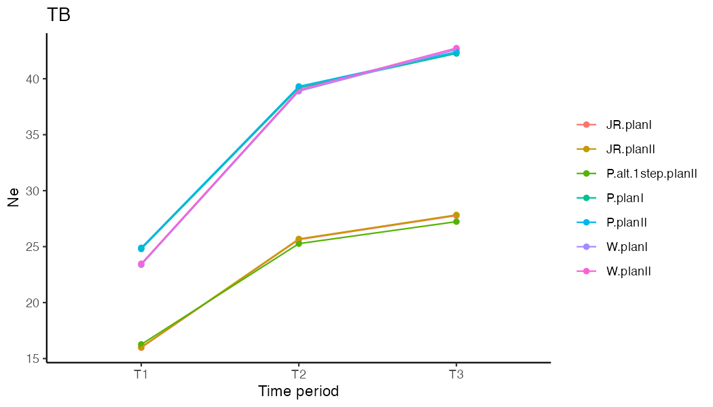
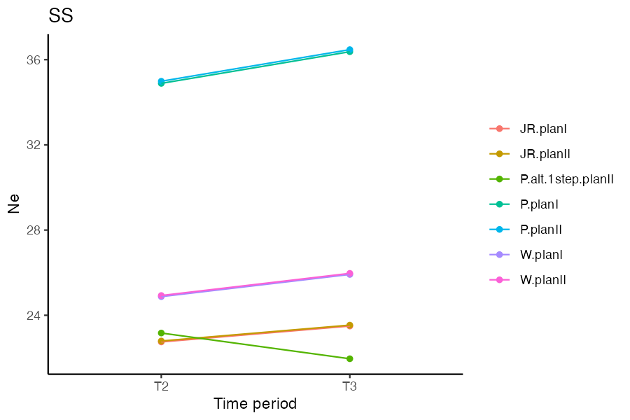
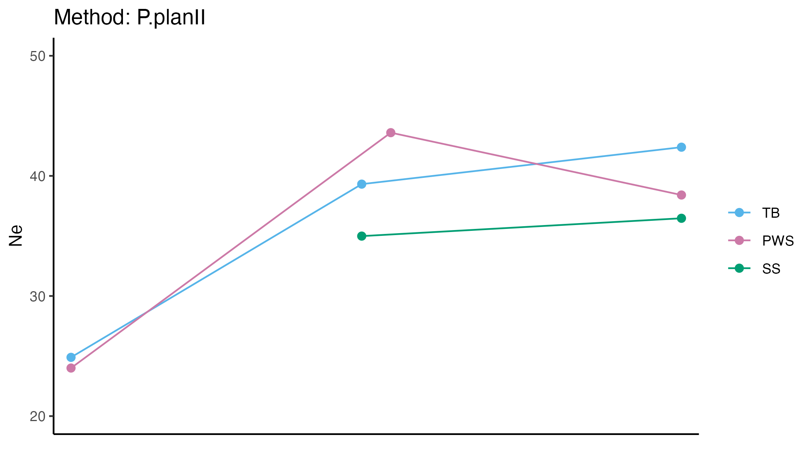
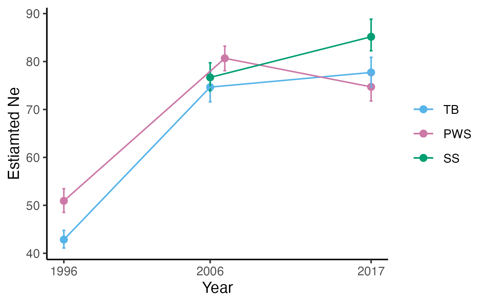
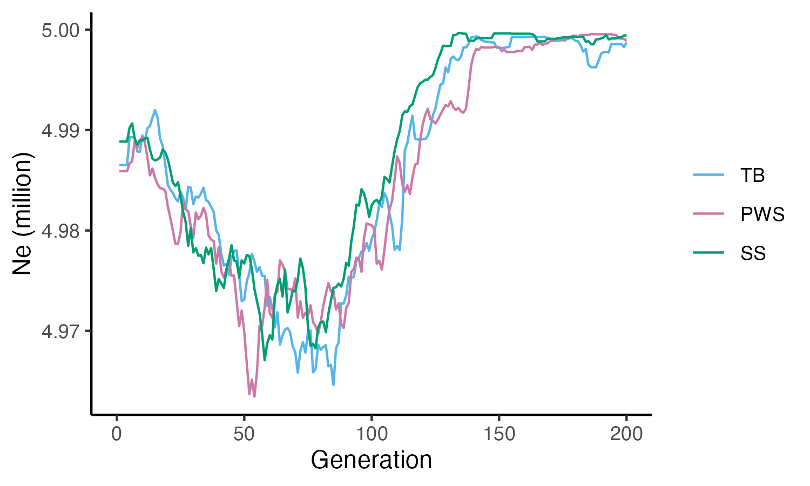

# Estimate effective population size (Ne) from allele frequncy chagnes 

```{r eval=FALSE, message=FALSE, warning=FALSE}
source("BaseScripts.R")
require(data.table)
require(plyr)
require(RColorBrewer)
library(poolSeq)
library(data.table)
library(kableExtra)
```
* Use Nest/PoolSeq package  
Ref: doi: 10.1534/genetics.116.191197

## • Prepare freq files
 1. Subset VCF files by population  
```{bash eval=FALSE, message=FALSE, warning=FALSE}
#subset a VCF file by population (subset_vcf_3pops.sh)

#Example: 
bcftools view -Oz -S /home/ktist/ph/data/new_vcf/population/PWS07.txt --threads 16 /home/ktist/ph/data/new_vcf/MD2000/3pops.MD2000_new.maf05.vcf.gz > /home/ktist/ph/data/new_vcf/MD2000/MD2000_PWS07_maf05.vcf.gz

```

 2. Calculate allele frequency using ANGSD  
```{bash eval=FALSE, message=FALSE, warning=FALSE}
#Calculate allele frequency using VCFtools (calculateAF_3pops.sh)

#!/bin/bash -l
#SBATCH --job-name=calcAF
#SBATCH --mem=16G
#SBATCH --nodes=4 
#SBATCH --ntasks=8 
#SBATCH --error calcAF.err
#SBATCH --time=48:00:00
#SBATCH --mail-user=ktist@ucdavis.edu ##email you when job starts,ends,etc
#SBATCH --mail-type=ALL
#SBATCH -p high 

module load angsd

angsd -out /home/ktist/ph/data/angsd/AF/PWS91_MD2000_maf05 -fai /home/jamcgirr/ph/data/c_harengus/c.harengus.fa.fai -doGlf 2 -doMaf 3 -doMajorMinor 4 -doPost 1 -doGeno 2 -vcf-pl /home/ktist/ph/data/new_vcf/MD2000/MD2000_PWS91_maf05.vcf.gz -ref /home/jamcgirr/ph/data/c_harengus/c.harengus.fa 


```

 3. Obtain read depths from VCF files  
```{r eval=FALSE, message=FALSE, warning=FALSE}

pop_info<-read.csv("../Data/Sample_metadata_892pops.csv")
pops<-unique(pop_info$Population.Year[grep("PWS|SS|TB",pop_info$Population.Year)])

#Obtain depth information from VCF files (extract_coveragePWS.sh)
sink("../Data/Slurmscripts/extract_depth.sh")

cat("#!/bin/bash -l \n")
cat("#SBATCH --job-name=extract_coverage  \n")
cat("#SBATCH --mem=16G  \n")
cat("#SBATCH --ntasks=1  \n")
cat("#SBATCH -e extract_coverage.err   \n")
cat("#SBATCH --time=48:00:00   \n")
cat("#SBATCH -p high   \n")

cat("module load bcftools  \n\n")
for (i in 1:length(pops)){
    cat(paste0("bcftools query -f '%CHROM  %POS  %INFO/DP\\n' /home/ktist/ph/data/new_vcf/MD2000/MD2000_",pops[i],"_maf05.vcf.gz >  /home/ktist/ph/data/new_vcf/MD2000/DP/MD2000_",pops[i],"_maf05.depth.info \n"))
} 

sink(NULL)

```


## • Read AF (maf.gz) files and filter out extreme values and uninformative loci 

### - Run plink to prune vcf files  
```{r eval=FALSE, message=FALSE, warning=FALSE}
# run plink to prune linked sites
sink("../prune_vcf.sh")
cat("#!/bin/bash \n")
#add variant id & createped/bed files
cat("plink --vcf Data/new_vcf/MD2000/3pops.MD2000_new.maf05.vcf.gz --set-missing-var-ids @:#[ph]\\$r,\\$a --make-bed --out Data/new_vcf/MD2000/3pops_newMD2000_maf05 \n")
cat("plink --bfile Data/new_vcf/MD2000/3pops_newMD2000_maf05 --recode --tab --out Data/new_vcf/MD2000/3pops_newMD2000_maf05 \n")
cat("plink --file Data/new_vcf/MD2000/3pops_newMD2000_maf05 --indep-pairwise 75'kb' 5 0.5 --out Data/new_vcf/MD2000/3pops_newMD2000_maf05_75_5_0.5_pruned \n")
sink(NULL)

### Manually add extra'\' to make it like " @:#[ph]\\$r,\\$a "

#bash prune_vcf.sh
```


### - Preapre frequency and depth files
```{r eval=FALSE, message=FALSE, warning=FALSE}
# Depth files available at: OSF Storage: https://osf.io/wrca4 Data/vcf/DP/

pops<-c("PWS91","PWS96","PWS07","PWS17")
yr<-c(91,96,"07",17)

#Read the allele freq data for PWS and trim for unlinked loci
unlnk<-read.table('../Data/vcf/3pops_newMD2000_maf05_75_5_0.5_pruned.prune.in', sep=":")
names(unlnk)= c("chromo","position")
for (i in 1:length(pops)){
    df<-fread(paste0("../Data/vcf/AF/",pops[i],"_MD2000_maf05.mafs.gz"))
    df<-df[,c(1,2,6)]
    #setkey(df, chromo, position)
    df<-merge(df, unlnk)
    assign(paste0("pws",i),df)
}

#combine AF for all years
pws<-cbind(pws1, pws2[,3],pws3[,3],pws4[,3])
colnames(pws)<-c("chr","pos","F0","F1","F2","F3")

#Read depth information
for (i in 1:length(pops)){
    df<-fread(paste0("../Data/vcf/DP/MD2000_",pops[i],"_maf05.depth.info"))
    setnames(df, c("chromo","position","depth"))
    setkey(df,chromo,position)
    df<-merge(df, unlnk)
    assign(paste0("D",i),df)
}

#combine Depth for all years
DP<-cbind(D1, D2[,3],D3[,3],D4[,3])
colnames(DP)<-c("chr","pos","F0","F1","F2","F3")

#Find SNPs with extreme values and uninformative loci and remove them
retain<-checkSNP(pws[,"F0"],pws[,"F3"],DP[,"F0"], DP[,"F3"])
length(retain[retain==F]) #929 will be removed

#filtered the snp dataset
pws_filtered<-pws[as.vector(retain),]
DP_filtered<-DP[as.vector(retain),]

#Look at F0 and F1
retain1<-checkSNP(pws_filtered[,"F0"],pws_filtered[,"F1"],DP_filtered[,"F0"], DP_filtered[,"F1"])
length(retain1[retain1==F]) #0

retain2<-checkSNP(pws_filtered[,"F0"],pws_filtered[,"F2"],DP_filtered[,"F0"], DP_filtered[,"F2"])
length(retain2[retain2==F]) #0

retain3<-checkSNP(pws_filtered[,"F1"],pws_filtered[,"F2"],DP_filtered[,"F1"], DP_filtered[,"F2"])
length(retain3[retain3==F]) #860

retain4<-checkSNP(pws_filtered[,"F2"],pws_filtered[,"F3"],DP_filtered[,"F2"], DP_filtered[,"F3"])
length(retain4[retain4==F]) #813

```


## • Run poolSeq to obtain short-term Ne values 
### 1. PWS between 1991 and 2017  
```{r eval=FALSE, message=FALSE, warning=FALSE}
methods<-c("W.planI","W.planII","JR.planI","JR.planII","P.planI","P.planII","P.alt.1step.planII")

#calculate Ne for 1991-2017 period 
pws_filtered<-data.frame(pws_filtered)
DP_filtered<-data.frame(DP_filtered)

#Generation time is calculated based on 4 yrs (age to maturity)

pws_Ne<-data.frame(methods=methods)
for (i in 1: length(methods)){
    pws_Ne$Ne[i]<-estimateNe(p0=pws_filtered[,"F0"], pt=pws_filtered[,"F3"], cov0=DP_filtered[,"F0"], covt=DP_filtered[,"F3"], t=6.5,
                  method=methods[i], Ncensus=1000,poolSize=c(58,56))
    pws_Ne$Ne_10000[i]<-estimateNe(p0=pws_filtered[,"F0"], pt=pws_filtered[,"F3"], cov0=DP_filtered[,"F0"], covt=DP_filtered[,"F3"], t=6.5, method=methods[i], Ncensus=10000,poolSize=c(58,56))
      pws_Ne$Ne_100000[i]<-estimateNe(p0=pws_filtered[,"F0"], pt=pws_filtered[,"F3"], cov0=DP_filtered[,"F0"], covt=DP_filtered[,"F3"], t=6.5, method=methods[i], Ncensus=100000,poolSize=c(58,56))
}

write.csv(pws_Ne,"../Output/Ne/MD2000_Ne_estimation_PWS91-17_angsdAF_genage4.csv")
#PlanI requires Ncensus, PlanII does not require Ncensus

```


* Generation = 4 years
```{r}
library(knitr)
pws_Ne1<-read.csv("../Output/Ne/MD2000_Ne_estimation_PWS91-17_angsdAF_genage4.csv", row.names = 1)
kable(pws_Ne1, caption = "PWS Estiamted Ne (1991-2017)", "html") %>%
  kable_styling(full_width = F)
```

PlanI requires 'Ncensus',and PlanII does not require Ncensus. Ncensus =1000 [Ne] and 10000 Ne_10000.
Does not make much difference after 10000


### 2. Estimate Ne for each time point  
```{r}
#further filtered the snp dataset
pws_filtered<-pws_filtered[as.vector(retain3),]
DP_filtered<-DP_filtered[as.vector(retain3),]
retain4<-checkSNP(pws_filtered[,"F2"],pws_filtered[,"F3"],DP_filtered[,"F2"], DP_filtered[,"F3"])
pws_filtered<-pws_filtered[as.vector(retain4),]
DP_filtered<-DP_filtered[as.vector(retain4),]

Ne<-data.frame(methods=methods)
for (i in 1: length(methods)){
    Ne$Ne01_t1[i]<-estimateNe(p0=pws_filtered[,"F0"], pt=pws_filtered[,"F1"], cov0=DP_filtered[,"F0"], covt=DP_filtered[,"F1"], t=5/4, method=methods[i], Ncensus=10000,poolSize=c(58,72))
    Ne$Ne12_t2[i]<-estimateNe(p0=pws_filtered[,"F1"], pt=pws_filtered[,"F2"], cov0=DP_filtered[,"F1"], covt=DP_filtered[,"F2"], t=11/4, method=methods[i], Ncensus=10000,poolSize=c(72,46))
    Ne$Ne23_t2[i]<-estimateNe(p0=pws_filtered[,"F2"], pt=pws_filtered[,"F3"], cov0=DP_filtered[,"F2"], covt=DP_filtered[,"F3"], t=10/4, method=methods[i], Ncensus=10000,poolSize=c(46,56))
}

write.csv(Ne, "../Output/Ne/MD2000_Ne_estimation_PWS_eachTimePeriod_angsdAF_genage4.csv")

```

```{r}
pws_Ne2<-read.csv("../Output/Ne/MD2000_Ne_estimation_PWS_eachTimePeriod_angsdAF_genage4.csv", row.names = 1)
colnames(pws_Ne2)[2:4]<- c("1991-1996","1996-2007","2007-2017")
kable(pws_Ne2, caption = "PWS Estiamted Ne", "html") %>%
  kable_styling(full_width = F)

```

### 3. Plot the results
```{r eval=FALSE, message=FALSE, warning=FALSE}
colnames(Ne)[2:4]<-c("T1","T2","T3")
nem<-reshape2::melt(Ne, id.vars="methods",value.name ="Ne")

ggplot(nem, aes(x=variable, y=Ne, color=methods))+
    geom_point()+
    theme_classic()+ylab("Ne")+xlab("Time period")+
    geom_path(aes(x=variable, y=Ne, group=methods,color=methods))+
    theme(legend.title=element_blank())+ggtitle("PWS")
ggsave("../Output/Ne/MD2000_Ne_estimates_overtime_PWS.png", width = 7, height = 4, dpi=150)
```



## • Calculate Ne for TB and SS  

## 1. TB
```{r eval=FALSE, message=FALSE, warning=FALSE}
size<-read.csv("../Data/popsize.csv")
colnames(size)[1]<-"pop"
pops<-c("TB91","TB96","TB06","TB17")

for (i in 1:length(pops)){
    df<-fread(paste0("../Data/vcf/AF/",pops[i],"_MD2000_maf05.mafs.gz"))
    df<-df[,c(1,2,6)]
    setkey(df, chromo, position)
    df<-merge(df, unlnk)
    assign(paste0("AF",i),df)
}
#combine AF for all years
AF<-cbind(AF1, AF2[,3],AF3[,3],AF4[,3])
colnames(AF)<-c("chr","pos","F0","F1","F2","F3")

#Read depth information
for (i in 1:length(pops)){
    df<-read.table(paste0("../Data/vcf/DP/MD2000_",pops[i],"_maf05.depth.info"))
    names(df)= c("chromo","position","depth")
    df<-merge(df, unlnk)
    assign(paste0("D",i),df)
}
#combine Depth for all years
DP<-cbind(D1, D2[,3],D3[,3],D4[,3])
colnames(DP)<-c("chr","pos","F0","F1","F2","F3")

#Find SNPs with extreme values and uninformative loci and remove them
retain2<-checkSNP(AF[,"F0"],AF[,"F3"],DP[,"F0"], DP[,"F3"])
length(retain2[retain2==F]) #1714
AF_filtered<-AF[as.vector(retain2),]
DP_filtered<-DP[as.vector(retain2),]

#Look at F0 and F1
retain1<-checkSNP(AF_filtered[,"F0"],AF_filtered[,"F1"],DP_filtered[,"F0"], DP_filtered[,"F1"])
length(retain1[retain1==F]) #0

retain2<-checkSNP(AF_filtered[,"F0"],AF_filtered[,"F2"],DP_filtered[,"F0"], DP_filtered[,"F2"])
length(retain2[retain2==F]) #0

retain3<-checkSNP(AF_filtered[,"F1"],AF_filtered[,"F2"],DP_filtered[,"F1"], DP_filtered[,"F2"])
length(retain3[retain3==F]) #500

methods<-c("W.planI","W.planII","JR.planI","JR.planII","P.planI","P.planII","P.alt.1step.planII")

#calcualte Ne for 1991-2017 period 
AF_filtered<-data.frame(AF_filtered)
AF_Ne<-data.frame(methods=methods)
for (i in 1:length(methods)){
    AF_Ne$Ne[i]<-estimateNe(p0=AF_filtered[,"F0"], pt=AF_filtered[,"F3"], cov0=DP_filtered[,"F0"], covt=DP_filtered[,"F3"], t=6.5, 
                  method=methods[i], Ncensus=1000, poolSize=c(size$Freq[size$pop==pops[1]],size$Freq[size$pop==pops[4]]))
    AF_Ne$Ne_100000[i]<-estimateNe(p0=AF_filtered[,"F0"], pt=AF_filtered[,"F3"], cov0=DP_filtered[,"F0"], covt=DP_filtered[,"F3"], t=6.5, 
                                   method=methods[i], Ncensus=100000,poolSize= c(size$Freq[size$pop==pops[1]], size$Freq[size$pop==pops[4]]))
}
write.csv(AF_Ne,"../Output/Ne/MD2000_Ne_estimation_TB91-17_angsdAF_genage4.csv")
```


```{r}
Ne1<-read.csv("../Output/Ne/MD2000_Ne_estimation_TB91-17_angsdAF_genage4.csv", row.names = 1)
kable(Ne1, caption = "TB Estiamted Ne (1991-2017)", "html") %>%
  kable_styling(full_width = F)
```

### TB each time period  
```{r eval=FALSE, message=FALSE, warning=FALSE}
# Estimate Ne for each time point  
AF_filtered<-AF_filtered[as.vector(retain3),]
DP_filtered<-DP_filtered[as.vector(retain3),]

retain4<-checkSNP(AF_filtered[,"F2"],AF_filtered[,"F3"],DP_filtered[,"F2"], DP_filtered[,"F3"])
length(retain4[retain4==F]) #389
AF_filtered<-AF_filtered[as.vector(retain4),]
DP_filtered<-DP_filtered[as.vector(retain4),]

Ne<-data.frame(methods=methods)
for (i in 1: length(methods)){
    Ne$Ne01_t1[i]<-estimateNe(p0=AF_filtered[,"F0"], pt=AF_filtered[,"F1"], cov0=DP_filtered[,"F0"], covt=DP_filtered[,"F1"], t=5/4, 
                         method=methods[i], Ncensus=10000, poolSize=c(size$Freq[size$pop==pops[1]],size$Freq[size$pop==pops[2]]))
    Ne$Ne12_t2[i]<-estimateNe(p0=AF_filtered[,"F1"], pt=AF_filtered[,"F2"], cov0=DP_filtered[,"F1"], covt=DP_filtered[,"F2"], t=10/4, 
                              method=methods[i], Ncensus=10000,poolSize=c(size$Freq[size$pop==pops[2]],size$Freq[size$pop==pops[3]]))
    Ne$Ne23_t2[i]<-estimateNe(p0=AF_filtered[,"F2"], pt=AF_filtered[,"F3"], cov0=DP_filtered[,"F2"], covt=DP_filtered[,"F3"], t=11/4, 
                              method=methods[i], Ncensus=10000,poolSize=c(size$Freq[size$pop==pops[3]],size$Freq[size$pop==pops[4]]))
}
write.csv(Ne, "../Output/Ne/MD2000_Ne_estimation_TB_eachTimePeriod_angsdAF_genage4.csv")

colnames(Ne)[2:4]<-c("T1","T2","T3")
nem<-reshape2::melt(Ne, id.vars="methods",value.name ="Ne")

ggplot(nem, aes(x=variable, y=Ne, color=methods))+
    geom_point()+
    theme_classic()+ylab("Ne")+xlab("Time period")+
    geom_path(aes(x=variable, y=Ne, group=methods,color=methods))+
    theme(legend.title=element_blank())+ggtitle("TB")
ggsave("../Output/Ne/MD2000_Ne_estimates_overtime_TB.png", width = 7, height = 4, dpi=150)
```


## 2. SS  

```{r eval=FALSE, message=FALSE, warning=FALSE}
pops<-c("SS96","SS06","SS17")
for (i in 1:length(pops)){
    df<-fread(paste0("../Data/vcf/AF/",pops[i],"_MD2000_maf05.mafs.gz"))
    df<-df[,c(1,2,6)]
    setkey(df, chromo, position)
    df<-merge(df, unlnk)
    assign(paste0("AF",i),df)
}
AF<-cbind(AF1, AF2[,3],AF3[,3],AF4[,3])
colnames(AF)<-c("chr","pos","F0","F1","F2","F3")

#Read depth information
for (i in 1:length(pops)){
    df<-read.table(paste0("../Data/vcf/DP/MD2000_",pops[i],"_maf05.depth.info"))
    names(df)= c("chromo","position","depth")
    df<-merge(df, unlnk)
    assign(paste0("D",i),df)
}
#combine Depth for all years
DP<-cbind(D1, D2[,3],D3[,3],D4[,3])
colnames(DP)<-c("chr","pos","F0","F1","F2","F3")

#Find SNPs with extreme values and uninformative loci and remove them
retain<-checkSNP(AF[,"F0"],AF[,"F2"],DP[,"F0"], DP[,"F2"])
length(retain[retain==F]) #1164
AF_filtered<-AF[as.vector(retain),]
DP_filtered<-DP[as.vector(retain),]

AF_filtered<-data.frame(AF_filtered)

#Look at F0 and F1
retain1<-checkSNP(AF_filtered[,"F0"],AF_filtered[,"F1"],DP_filtered[,"F0"], DP_filtered[,"F1"])
length(retain1[retain1==F]) #0

retain2<-checkSNP(AF_filtered[,"F0"],AF_filtered[,"F2"],DP_filtered[,"F0"], DP_filtered[,"F2"])
length(retain2[retain2==F]) #0

retain3<-checkSNP(AF_filtered[,"F1"],AF_filtered[,"F2"],DP_filtered[,"F1"], DP_filtered[,"F2"])
length(retain3[retain3==F]) #477

methods<-c("W.planI","W.planII","JR.planI","JR.planII","P.planI","P.planII","P.alt.1step.planII")
#calcualte Ne for 1991-2017 period 
AF_Ne<-data.frame(methods=methods)
for (i in 1: length(methods)){
    AF_Ne$Ne[i]<-estimateNe(p0=AF_filtered[,"F0"], pt=AF_filtered[,"F2"], cov0=DP_filtered[,"F0"], covt=DP_filtered[,"F2"], t=6.5, 
                  method=methods[i], Ncensus=1000,poolSize=c(size$Freq[size$pop==pops[1]],size$Freq[size$pop==pops[3]]))
    AF_Ne$Ne_10000[i]<-estimateNe(p0=AF_filtered[,"F0"], pt=AF_filtered[,"F2"], cov0=DP_filtered[,"F0"], covt=DP_filtered[,"F2"], t=6.5, 
                                   method=methods[i], Ncensus=100000,poolSize= c(size$Freq[size$pop==pops[1]],size$Freq[size$pop==pops[3]]))
    
}
write.csv(AF_Ne,"../Output/Ne/MD2000_Ne_estimation_SS96-17_angsdAF_genage4.csv")

```

```{r}
Ne2<-read.csv("../Output/Ne/MD2000_Ne_estimation_SS96-17_angsdAF_genage4.csv", row.names = 1)
kable(Ne2, caption = "SS Estiamted Ne (1996-2017)", "html") %>%
  kable_styling(full_width = F)
```
### SS each time period
```{r eval=FALSE, message=FALSE, warning=FALSE}
# Estimate Ne for each time point  
AF_filtered<-AF_filtered[as.vector(retain3),]
DP_filtered<-DP_filtered[as.vector(retain3),]

AF_filtered<-data.frame(AF_filtered)
Ne<-data.frame(methods=methods)
for (i in 1: length(methods)){
    Ne$Ne01_t1[i]<-estimateNe(p0=AF_filtered[,"F0"], pt=AF_filtered[,"F1"], cov0=DP_filtered[,"F0"], covt=DP_filtered[,"F1"], t=10/4, 
                         method=methods[i], Ncensus=10000,poolSize=c(size$Freq[size$pop==pops[1]],size$Freq[size$pop==pops[2]]))
    Ne$Ne12_t2[i]<-estimateNe(p0=AF_filtered[,"F1"], pt=AF_filtered[,"F2"], cov0=DP_filtered[,"F1"], covt=DP_filtered[,"F2"], t=11/4, 
                              method=methods[i], Ncensus=10000,poolSize=c(size$Freq[size$pop==pops[2]],size$Freq[size$pop==pops[3]]))
}

write.csv(Ne, "../Output/Ne/MD2000_Ne_estimation_SS_eachTimePeriod_angsdAF_genage4.csv")

colnames(Ne)[2:3]<-c("T2","T3")
nem<-reshape2::melt(Ne, id.vars="methods",value.name ="Ne")

ggplot(nem, aes(x=variable, y=Ne, color=methods))+
    geom_point()+
    theme_classic()+ylab("Ne")+xlab("Time period")+
    geom_path(aes(x=variable, y=Ne, group=methods,color=methods))+
    theme(legend.title=element_blank())+ggtitle("SS")
ggsave("../Output/Ne/MD2000_Ne_estimates_overtime_SS.png", width = 6, height = 4, dpi=150)
```



# • Plot all populations together   
* Plot P.Plan II results as an example
```{r eval=FALSE, message=FALSE, warning=FALSE}
library(tibble)
pops<-c("PWS","TB","SS")
Ne<-data.frame()
for (i in 1: length(pops)){
    df<-read.csv(paste0("../Output/Ne/MD2000_Ne_estimation_",pops[i],"_eachTimePeriod_angsdAF_genage4.csv"), row.names = 1)
    df$pop<-pops[i]  
    if (i==3) {
        colnames(df)[2:3]<-c("T2","T3")
        df<-add_column(df, T1=NA, .after=1)
    }
    if (i!=3) colnames(df)[2:4]<-c("T1","T2","T3")
    Ne<-rbind(Ne, df[df$methods=="P.planII",])
}

colnames(Ne)[2:4]<-c(1996,2006,2017)
Nem<-reshape2::melt(Ne[,2:5], id.vars="pop")
Nem$variable=as.integer(as.character(Nem$variable))
Nem$variable[Nem$variable==2006&Nem$pop=="PWS"]<-2007

Nem$pop<-factor(Nem$pop, levels=c("TB","PWS","SS"))
ggplot(Nem, aes(x=variable, y=value, color=pop))+
    geom_point(size=2)+
    theme_classic()+ylab("Ne")+xlab("")+
    geom_path(aes(x=variable, y=value, group=pop,color=pop))+
    theme(legend.title=element_blank())+
    scale_color_manual(values=cols)+ylim(20,40)+
    scale_x_discrete(labels=c("1996", "2006/2007","2017"))+ggtitle("Method: P.planII")
ggsave("../Output/Ne/Ne_estimates_overtime_3pops_P.planII.png", width = 7, height = 4, dpi=300)

```



<br>
<br>

# Use the Jorde-Ryman temporal method from NeEstimator 2.1.

From https://github.com/pinskylab/codEvol calcNe_ANGSD.r 

```{r eval=FALSE, message=FALSE, warning=FALSE}
require(data.table)
require(boot)
source("calcNe.R")
```

### Starting with PWS 
### STEP 1. Read the mafs data from ANGSD & trim positions to unlinked loci
 
```{r eval=FALSE}
#MAF data
dat91<-fread("../Data/vcf/AF/PWS91_MD2000_maf05.mafs.gz")
dat96<-fread("../Data/vcf/AF/PWS96_MD2000_maf05.mafs.gz")
dat07<-fread("../Data/vcf/AF/PWS07_MD2000_maf05.mafs.gz")
dat17<-fread("../Data/vcf/AF/PWS17_MD2000_maf05.mafs.gz")
setkey(dat91, chromo, position)
setkey(dat96, chromo, position)
setkey(dat07, chromo, position)
setkey(dat17, chromo, position)

# unlinked loci from plink
unlnk<-read.table('../Data/vcf/3pops_newMD2000_maf05_75_5_0.5_pruned.prune.in', sep=":")
names(unlnk)=c("chromo","position")

dat91<-merge(dat91, unlnk)
dat96<-merge(dat96, unlnk)
dat07<-merge(dat07, unlnk)
dat17<-merge(dat17, unlnk)

```

### STEP 2. Combine time points and trim loci with freq > 0.1  

```{r eval=FALSE, message=FALSE, warning=FALSE}
years<-c("91","96","07","17")
comb<-t(combn(years, 2))

estNe<-data.frame(pop1=comb[,1], pop2=comb[,2])
gens<-c(5/4, 16/4, 26/4, 9/4, 21/4,10/4)

for (i in 2: nrow(comb)){
    df1<-get(paste0("dat",comb[i,1]))
    df2<-get(paste0("dat",comb[i,2]))
    
    setnames(df1, c("knownEM", 'nInd'), c("freq1", 'nInd1'))
    setnames(df2, c("knownEM", 'nInd'), c("freq2", 'nInd2'))
    
    df <- df1[df2, .(chromo, position, freq1, freq2, nInd1, nInd2)][!is.na(freq1) & !is.na(freq2) & freq1 > 0.1 & freq2 > 0.1, ]
    g=gens[i]
    
    estNe$Ne[i]<-df[, jrNe2(freq1, freq2, nInd1, nInd2, g)] 

    # block bootstrapping across LGs
    uq.ch <- df[, sort(unique(chromo))]

    boot.re <- boot(uq.ch, jrNe2block, 1000, gen = g, alldata = df)
    estNe$median[i]<-median(boot.re$t[is.finite(boot.re$t)]) # median bootstrap
    estNe$mean[i]<-mean(boot.re$t[is.finite(boot.re$t)])
    ci<-boot.ci(boot.re, type = c('perc'))
    #95% C.I.
    estNe$CI.low[i]<-ci$percent[4]
    estNe$CI.up[i]<-ci$percent[5]
    
    #reset the attibutes
    setnames(df1, c("freq1", 'nInd1'),c("knownEM", 'nInd'))
    setnames(df2, c("freq2", 'nInd2'),c("knownEM", 'nInd'))
}

write.csv(estNe,"../Output/Ne/MD2000_Jorde-Ryman_Ne.estimates_PWS.csv")

#estNe<-read.csv("../Output/Ne/MD2000_Jorde-Ryman_Ne.estimates_PWS.csv", row.names = 1, colClasses=c("pop1"="character", "pop2"="character"))
estNe$year<-apply(estNe["pop2"],1, function(x) {if (x=="96") x=1996
                   else if (x=="07") x=2007
                   else if (x=="17") x=2017})
```

```{r}
estNe<-read.csv("../Output/Ne/MD2000_Jorde-Ryman_Ne.estimates_PWS.csv", row.names = 1)
kable(estNe, caption = "PWS Estiamted Ne (1991-2017) by NeEstimator", "html") %>%
  kable_styling(full_width = F)
```


### * TB population  

```{r eval=FALSE}
#MAF data
dat91<-fread("../Data/vcf/AF/TB91_MD2000_maf05.mafs.gz")
dat96<-fread("../Data/vcf/AF/TB96_MD2000_maf05.mafs.gz")
dat06<-fread("../Data/vcf/AF/TB06_MD2000_maf05.mafs.gz")
dat17<-fread("../Data/vcf/AF/TB17_MD2000_maf05.mafs.gz")
setkey(dat91, chromo, position)
setkey(dat96, chromo, position)
setkey(dat06, chromo, position)
setkey(dat17, chromo, position)

# unlinked loci from plink
unlnk<-read.table('../Data/new_vcf/MD3000/3pops_newMD2000_maf05_75_5_0.5_pruned.prune.in', sep=":")
names(unlnk)=c("chromo","position")

dat91<-merge(dat91, unlnk)
dat96<-merge(dat96, unlnk)
dat06<-merge(dat06, unlnk)
dat17<-merge(dat17, unlnk)

years<-c("91","96","06","17")
comb<-t(combn(years, 2))

estNe<-data.frame(pop1=comb[,1], pop2=comb[,2])
gens<-c(5/4, 15/4, 26/4, 10/4, 21/4,11/4)

for (i in 1: nrow(comb)){
    df1<-get(paste0("dat",comb[i,1]))
    df2<-get(paste0("dat",comb[i,2]))
    
    setnames(df1, c("knownEM", 'nInd'), c("freq1", 'nInd1'))
    setnames(df2, c("knownEM", 'nInd'), c("freq2", 'nInd2'))
    
    df <- df1[df2, .(chromo, position, freq1, freq2, nInd1, nInd2)][!is.na(freq1) & !is.na(freq2) & freq1 > 0.1 & freq2 > 0.1, ]
    g=gens[i]
    
    estNe$Ne[i]<-df[, jrNe2(freq1, freq2, nInd1, nInd2, g)] 

    # block bootstrapping across LGs
    uq.ch <- df[, sort(unique(chromo))]

    boot.re <- boot(uq.ch, jrNe2block, 1000, gen = g, alldata = df)
    estNe$median[i]<-median(boot.re$t[is.finite(boot.re$t)]) # median bootstrap
    estNe$mean[i]<-mean(boot.re$t[is.finite(boot.re$t)])
    ci<-boot.ci(boot.re, type = c('perc'))
    #95% C.I.
    estNe$CI.low[i]<-ci$percent[4]
    estNe$CI.up[i]<-ci$percent[5]
    
    #reset the attibutes
    setnames(df1, c("freq1", 'nInd1'),c("knownEM", 'nInd'))
    setnames(df2, c("freq2", 'nInd2'),c("knownEM", 'nInd'))
}

write.csv(estNe,"../Output/Ne/MD2000_Jorde-Ryman_Ne.estimates_TB.csv")

#estNe<-read.csv("../Output/Ne/Jorde-Ryman_Ne.estimates_TB.csv", row.names = 1, colClasses=c("pop1"="character", "pop2"="character"))
estNe$year<-apply(estNe["pop2"],1, function(x) {if (x=="96") x=1996
                   else if (x=="06") x=2006
                   else if (x=="17") x=2017})


```

```{r}
estNe<-read.csv("../Output/Ne/MD2000_Jorde-Ryman_Ne.estimates_TB.csv", row.names = 1)
kable(estNe, caption = "TB Estiamted Ne (1991-2017) by NeEstimator", "html") %>%
  kable_styling(full_width = F)
```


### * SS population
```{r eval=FALSE}
#MAF data
dat96<-fread("../Data/new_vcf/MD3000/AF/SS96_MD2000_maf05.mafs.gz")
dat06<-fread("../Data/new_vcf/MD3000/AF/SS06_MD2000_maf05.mafs.gz")
dat17<-fread("../Data/new_vcf/MD3000/AF/SS17_MD2000_maf05.mafs.gz")
setkey(dat96, chromo, position)
setkey(dat06, chromo, position)
setkey(dat17, chromo, position)

# unlinked loci from plink
unlnk<-read.table('../Data/new_vcf/MD3000/3pops_newMD2000_maf05_75_5_0.5_pruned.prune.in', sep=":")
names(unlnk)=c("chromo","position")

dat96<-merge(dat96, unlnk)
dat06<-merge(dat06, unlnk)
dat17<-merge(dat17, unlnk)

years<-c("96","06","17")
comb<-t(combn(years, 2))

estNe<-data.frame(pop1=comb[,1], pop2=comb[,2])
gens<-c(10/4,21/4, 11/4)

for (i in 1: nrow(comb)){
    df1<-get(paste0("dat",comb[i,1]))
    df2<-get(paste0("dat",comb[i,2]))
    
    setnames(df1, c("knownEM", 'nInd'), c("freq1", 'nInd1'))
    setnames(df2, c("knownEM", 'nInd'), c("freq2", 'nInd2'))
    
    df <- df1[df2, .(chromo, position, freq1, freq2, nInd1, nInd2)][!is.na(freq1) & !is.na(freq2) & freq1 > 0.1 & freq2 > 0.1, ]
    g=gens[i]
    
    estNe$Ne[i]<-df[, jrNe2(freq1, freq2, nInd1, nInd2, g)] 

    # block bootstrapping across LGs
    uq.ch <- df[, sort(unique(chromo))]

    boot.re <- boot(uq.ch, jrNe2block, 1000, gen = g, alldata = df)
    estNe$median[i]<-median(boot.re$t[is.finite(boot.re$t)]) # median bootstrap
    estNe$mean[i]<-mean(boot.re$t[is.finite(boot.re$t)])
    ci<-boot.ci(boot.re, type = c('perc'))
    #95% C.I.
    estNe$CI.low[i]<-ci$percent[4]
    estNe$CI.up[i]<-ci$percent[5]
    
    #reset the attibutes
    setnames(df1, c("freq1", 'nInd1'),c("knownEM", 'nInd'))
    setnames(df2, c("freq2", 'nInd2'),c("knownEM", 'nInd'))
}

write.csv(estNe,"../Output/Ne/MD2000_Jorde-Ryman_Ne.estimates_SS.csv")

```

```{r}
estNe<-read.csv("../Output/Ne/MD2000_Jorde-Ryman_Ne.estimates_SS.csv", row.names = 1)
kable(estNe, caption = "SS Estiamted Ne (1996-2017) by NeEstimator", "html") %>%
  kable_styling(full_width = F)
```


### Plot 3 populations together
```{r}

ne<-data.frame()
pops<-c("PWS","TB","SS")
for (i in 1:3){
    df<-read.csv(paste0("../Output/Ne/MD2000_Jorde-Ryman_Ne.estimates_", pops[i],".csv"), row.names = 1)
    df$pop<-pops[i]
    ne<-rbind(ne, df)
}

ne$year<-apply(ne["pop2"],1, function(x) {if (x=="96") x=1996
                   else if (x==6) x=2006
                   else if (x==7) x=2007
                   else if (x=="17") x=2017})
ne2<-ne[c(1,4,6,7,10,12,13,15),]
ne2$pop<-factor(ne2$pop, levels=c("TB","PWS","SS"))

ggplot(ne2, aes(x=year, y=Ne, color=pop))+
    geom_point(size=2)+
    geom_errorbar(aes(ymin = CI.low, ymax = CI.up), width = 0.2)+
    geom_path()+ylab("Estiamted Ne")+xlab("Year")+
    theme_classic()+
    scale_color_manual(values=cols)+
    theme(legend.title = element_blank())+
      scale_x_continuous(breaks=c(1991, 1996,2006,2017), name="Year")
ggsave("../Output/Ne/MD2000_Jorde-Ryman_Ne.estimates_3Populations.png", width = 4.8, height = 3, dpi=300)

```




# Run the demography program GONE 
*  GONE by Santiago et al. 2020 [link to the paper](https://doi.org/10.1093/molbev/msaa169)

## 1. Prepare files to be run with GONE 

```{bash eval=FALSE, message=FALSE, warning=FALSE}
# Subset maf00 (no maf filtering) to individual populations
# (Subset.vcf.sh) Using 2017 population
bcftools view -Oz -S /home/ktist/ph/data/new_vcf/MD7000/population/PWS17.txt --threads 16 /home/ktist/ph/data/new_vcf/MD7000/PH_DP600_7000_minQ20_minMQ30_NS0.5.vcf.gz > /home/ktist/ph/data/new_vcf/MD7000/PWS17_MD7000_maf00.vcf.gz


# Run plink to create .map and .bed files from vcf files (no maf filtering)
(makePlinkFiles2.sh)
plink --vcf /home/ktist/ph/data/new_vcf/MD7000/PWS17_MD7000_maf00.vcf.gz --make-bed --out /home/ktist/ph/data/new_vcf/MD7000/plinkfiles/PWS17_maf00

plink --bfile  /home/ktist/ph/data/new_vcf/MD7000/plinkfiles/PWS17_maf00 --recode --tab --out /home/ktist/ph/data/new_vcf/MD7000/plinkfiles/PWS17_maf00

```


```{r eval=FALSE, message=FALSE, warning=FALSE}
# Add SNP names to each map file (the current vcf files do not have snp ID)
df<-read.table("../Data/plink/PWS17_maf00.map")
df$V2<-paste0("snp",1:nrow(df))
write.table(df, "../Data/plink/PWS17_maf00.map", quote=F, sep="\t", col.names=F, row.names=F)
```

```{bash eval=FALSE, message=FALSE, warning=FALSE}
#Copy and rename as PWS17_maf00.map, SS17_maf00.map,TB17_maf00.map (.map file is the same for all)
cp ~/Projects/PacHerring/Data/plink/PWS17_maf00.map ~/Projects/PacHerring/Data/plink/SS17_maf00.map
cp ~/Projects/PacHerring/Data/plink/PWS17_maf00.map ~/Projects/PacHerring/Data/plink/TB17_maf00.map

# Modify the INPUT_PARAMETERS_FILE as needed
#Run with default (may need to modify hc=0.05 to hc=0.01 for populations with recent migrants)

#FID and SID are swapped for herring vcf data. Swap the first 2 columns (this will create a space-delimited file but the example file is also space-delimited. It may work)
awk ' { t = $1; $1 = $2; $2 = t; print; } ' PWS17_maf00.ped >  PWS17_maf00_new.ped
awk ' { t = $1; $1 = $2; $2 = t; print; } ' SS17_maf00.ped >  SS17_maf00_new.ped
awk ' { t = $1; $1 = $2; $2 = t; print; } ' TB17_maf00.ped >  TB17_maf00_new.ped

```

## 2. Run GONE
```{bash eval=FALSE, message=FALSE, warning=FALSE}
# Run in the GONE/MacOSX/ directory (changed script_GONE.sh line 63 and 67: grep -w "" wasn't working)
bash script_GONE.sh PWS17_maf00

```


## 3. Plot the results
```{r eval=FALSE, message=FALSE, warning=FALSE}
#import the GONE output files

## PWS 
neP<-read.table("/Users/kahotisthammer/programs/GONE/MacOSX/PWS17_hc0.05/Output_Ne_PWS17_maf00", skip=1, header=T)

ggplot(neP, aes(x=Generation, y=Geometric_mean))+
    geom_line()+ylab("Ne")+theme_bw()+ggtitle("PWS MAF00")

#zoom in to more recent
ggplot(neP[neP$Generation<200,], aes(x=Generation, y=Geometric_mean))+
    geom_line()+ylab("Ne")+theme_bw()+ggtitle("PWS MAF00")

# From tutorial: "unbiased estimates require that the population is a closed one without recent admixture from other populations. If this is not the case, some artefacts may arise."
# "the reliable estimates to be considered should be for a maximum of 100 or 200 generations"

## SS
neS<-read.table("/Users/kahotisthammer/programs/GONE/MacOSX/Output_Ne_SS17_maf00", skip=1, header=T)

## TB
neT<-read.table("/Users/kahotisthammer/programs/GONE/MacOSX/Output_Ne_TB17_maf00", skip=1, header=T)


neP$pop<-"PWS"
neS$pop<-"SS"
neT$pop<-"TB"
neG<-rbind(neP, neS,neT)

neG$pop<-factor(neG$pop, levels=c("TB","PWS","SS"))

ggplot(neG, aes(x=Generation, y=Geometric_mean/1000000, color=pop))+
    geom_line()+ylab("Ne")+theme_bw()+xlim(0,200)+
    theme_classic()+ylab('Ne (million)')+
    theme(legend.title = element_blank())+
    scale_color_manual(values=cols)
ggsave("../Output/Ne/3pop2017_recent_ne.by.Gone_formatted.png", width = 5, height = 3, dpi=300)
```

