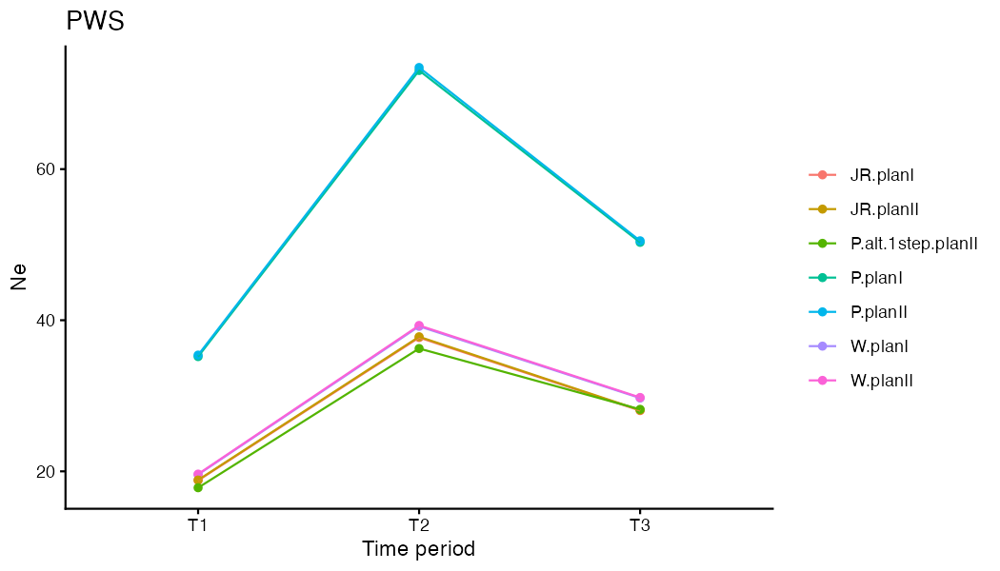
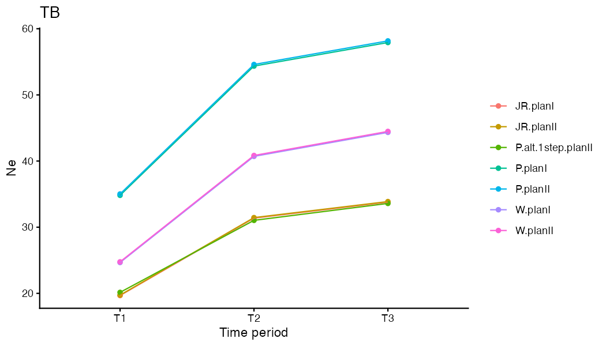
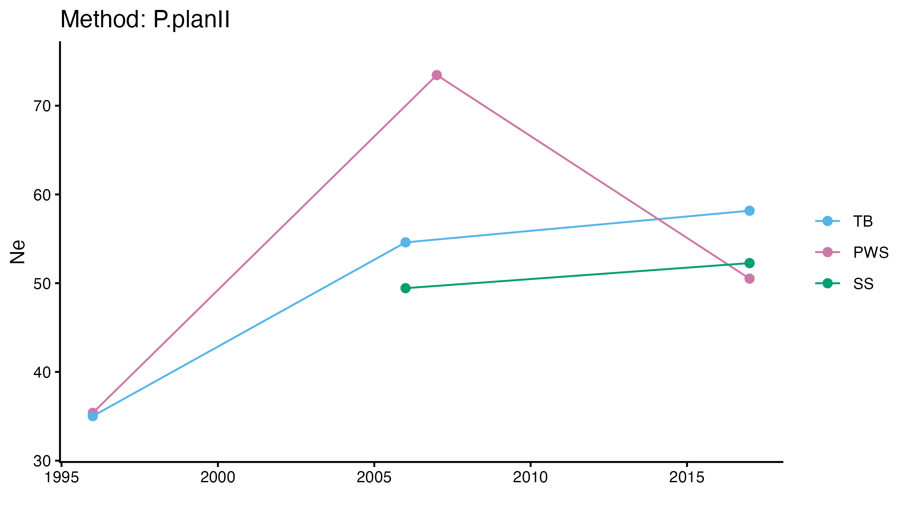
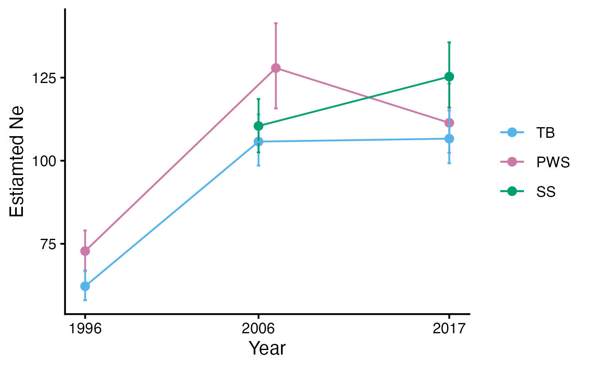
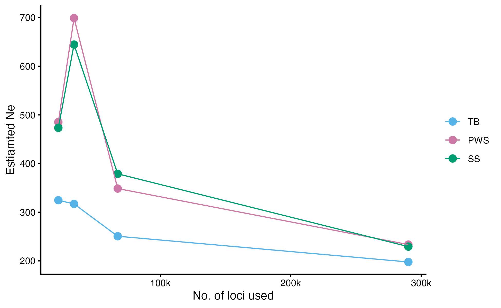

# Estimate effective population size (Ne) from allele frequncy chagnes - Applying depth filter (less loci) 

```{r eval=FALSE, message=FALSE, warning=FALSE}
#source("BaseScripts.R")
#require(plyr)
require(RColorBrewer)
library(poolSeq)
library(data.table)
library(kableExtra)
```
* Use Nest/PoolSeq package  
Ref: doi: 10.1534/genetics.116.191197

## • Prepare freq files
 1. Subset VCF files by population  
 
```{r eval=FALSE, message=FALSE, warning=FALSE}
#subset a VCF file by population.time
pop_info<-read.csv("../Data/Sample_metadata_892pops.csv")
pop_info<-pop_info[,c("Sample","Population.Year","pop","Year.Collected")]
colnames(pop_info)[4]<-"year"
pops<-unique(pop_info$Population.Year[grep("PWS|SS|TB",pop_info$Population.Year)])

sink("../Data/Slurmscripts/subset_vcf.sh")

cat("#!/bin/bash -l \n")

for (i in 1:length(pops)){
    cat(paste0("bcftools view -Oz -S /Users/kahotisthammer/Projects/PacHerring/Data/popinfo/",pops[i],".txt  --threads 4 /Users/kahotisthammer/Projects/PacHerring/plink/final_filtered.recode.vcf.gz > /Users/kahotisthammer/Projects/PacHerring/plink/filtered_", pops[i],".vcf.gz \n"))
} 
sink(NULL)
```

 2. Calculate allele frequency using ANGSD  
```{r eval=FALSE, message=FALSE, warning=FALSE}

sink("../Data/Slurmscripts/calc_af_angsd.sh")

cat("#!/bin/bash -l \n")
cat("module load angsd \n")
for (i in 1:length(pops)){
    cat(paste0("angsd -out /home/ktist/ph/filtered_AF_", pops[i]," -fai /home/jamcgirr/ph/data/c_harengus/c.harengus.fa.fai -doGlf 2 -doMaf 3 -doMajorMinor 4 -doPost 1 -doGeno 2 -vcf-pl /home/ktist/ph/filtered_",pops[i],".vcf.gz -ref /home/jamcgirr/ph/data/c_harengus/c.harengus.fa  \n"))
} 

sink(NULL)

```

 3. Obtain read depths from VCF files  
```{r eval=FALSE, message=FALSE, warning=FALSE}

pop_info<-read.csv("../Data/Sample_metadata_892pops.csv")
pops<-unique(pop_info$Population.Year[grep("PWS|SS|TB",pop_info$Population.Year)])

#Obtain depth information from VCF files 
sink("../Data/Slurmscripts/extract_depth.sh")

cat("#!/bin/bash -l \n")
cat(paste0("#SBATCH --job-name=depth \n"))
cat(paste0("#SBATCH --mem=24G \n")) 
cat(paste0("#SBATCH --time=24:00:00  \n"))
cat(paste0("#SBATCH -p low  \n"))
cat("\n\n")
cat("module load bcftools  \n\n")
for (i in 1:length(pops)){
    cat(paste0("bcftools query -f '%CHROM  %POS  %INFO/DP\\n' /home/ktist/ph/filtered_",pops[i],".vcf.gz >  /home/ktist/ph/filtered_",pops[i],".depth.info \n"))
} 

sink(NULL)

```


## • Read AF (maf.gz) files and filter out extreme values and uninformative loci 

### - Run plink to prune vcf files  
```{r eval=FALSE, message=FALSE, warning=FALSE}
# run plink to prune linked sites

#plink --vcf final_filtered.recode.vcf.gz --set-missing-var-ids @:#[ph]\\$r,\\$a --make-bed --out final_filtered 
#plink --bfile final_filtered --recode --tab --out final_filtered 
#plink --file final_filtered --indep-pairwise 75'kb' 5 0.5 --out final_filtered_prune_75_5_0.5
## #15987 of 83266 variants removed
```


### - Preapre frequency and depth files
```{r eval=FALSE, message=FALSE, warning=FALSE}
# Depth files available at: OSF Storage: https://osf.io/wrca4 Data/vcf/DP/

pops<-c("PWS91","PWS96","PWS07","PWS17")
yr<-c(91,96,"07",17)

#Read the allele freq data for PWS and trim for unlinked loci
unlnk<-read.table('/Users/kahotisthammer/Projects/PacHerring/plink/final_filtered_prune_75_5_0.5.prune.in', sep=":")
names(unlnk)= c("chromo","position")
unlnk$position<-gsub("([0-9]+).*", "\\1", unlnk$position)
unlnk$position<-as.integer(unlnk$position)

for (i in 1:length(pops)){
    df<-fread(paste0("../Data/vcf/AF/filtered_AF_",pops[i],".mafs.gz"))
    df<-df[,c(1,2,6)]
    #setkey(df, chromo, position)
    df<-merge(df, unlnk)
    assign(paste0("pws",i),df)
}

#combine AF for all years
pws<-cbind(pws1, pws2[,3],pws3[,3],pws4[,3])
colnames(pws)<-c("chr","pos","F0","F1","F2","F3")

#Read depth information
for (i in 1:length(pops)){
    df<-fread(paste0("../Data/vcf/AF/filtered_",pops[i],".depth.info"))
    setnames(df, c("chromo","position","depth"))
    setkey(df,chromo,position)
    df<-merge(df, unlnk)
    assign(paste0("D",i),df)
}

#combine Depth for all years
DP<-cbind(D1, D2[,3],D3[,3],D4[,3])
colnames(DP)<-c("chr","pos","F0","F1","F2","F3")

#Find SNPs with extreme values and uninformative loci and remove them
retain<-checkSNP(pws[,"F0"],pws[,"F3"],DP[,"F0"], DP[,"F3"])
length(retain[retain==F]) #41 will be removed

#filtered the snp dataset
pws_filtered<-pws[as.vector(retain),]
DP_filtered<-DP[as.vector(retain),]

#Look at F0 and F1
retain1<-checkSNP(pws_filtered[,"F0"],pws_filtered[,"F1"],DP_filtered[,"F0"], DP_filtered[,"F1"])
length(retain1[retain1==F]) #0

retain2<-checkSNP(pws_filtered[,"F0"],pws_filtered[,"F2"],DP_filtered[,"F0"], DP_filtered[,"F2"])
length(retain2[retain2==F]) #0

retain3<-checkSNP(pws_filtered[,"F1"],pws_filtered[,"F2"],DP_filtered[,"F1"], DP_filtered[,"F2"])
length(retain3[retain3==F]) #43

retain4<-checkSNP(pws_filtered[,"F2"],pws_filtered[,"F3"],DP_filtered[,"F2"], DP_filtered[,"F3"])
length(retain4[retain4==F]) #58

```


## • Run poolSeq to obtain short-term Ne values 
### 1. PWS between 1991 and 2017  
```{r eval=FALSE, message=FALSE, warning=FALSE}
methods<-c("W.planI","W.planII","JR.planI","JR.planII","P.planI","P.planII","P.alt.1step.planII")

#calculate Ne for 1991-2017 period 
pws_filtered<-data.frame(pws_filtered)
DP_filtered<-data.frame(DP_filtered)

#Generation time is calculated based on 4 yrs (age to maturity)

pws_Ne<-data.frame(methods=methods)
for (i in 1: length(methods)){
    pws_Ne$Ne[i]<-estimateNe(p0=pws_filtered[,"F0"], pt=pws_filtered[,"F3"], cov0=DP_filtered[,"F0"], covt=DP_filtered[,"F3"], t=6.5,
                  method=methods[i], Ncensus=1000,poolSize=c(58,56))
    pws_Ne$Ne_10000[i]<-estimateNe(p0=pws_filtered[,"F0"], pt=pws_filtered[,"F3"], cov0=DP_filtered[,"F0"], covt=DP_filtered[,"F3"], t=6.5, method=methods[i], Ncensus=10000,poolSize=c(58,56))
      pws_Ne$Ne_100000[i]<-estimateNe(p0=pws_filtered[,"F0"], pt=pws_filtered[,"F3"], cov0=DP_filtered[,"F0"], covt=DP_filtered[,"F3"], t=6.5, method=methods[i], Ncensus=100000,poolSize=c(58,56))
}

write.csv(pws_Ne,"../Output/Ne/Filtered_Ne_PWS91-17_angsdAF_genage4.csv")
#PlanI requires Ncensus, PlanII does not require Ncensus

# Generation = 4 years

```

```{r}
library(knitr)
pws_Ne1<-read.csv("../Output/Ne/Filtered_Ne_estimation_PWS91-17_angsdAF_genage4.csv", row.names = 1)
kable(pws_Ne1, caption = "PWS Estiamted Ne (1991-2017)", "html") %>%
  kable_styling(full_width = F)
```

PlanI requires 'Ncensus',and PlanII does not require Ncensus. Ncensus =1000 [Ne] and 10000 Ne_10000.
Does not make much difference after 10000


### 2. Estimate Ne for each time point  
```{r}
#further filtered the snp dataset
pws_filtered<-pws_filtered[as.vector(retain3),]
DP_filtered<-DP_filtered[as.vector(retain3),]
retain4<-checkSNP(pws_filtered[,"F2"],pws_filtered[,"F3"],DP_filtered[,"F2"], DP_filtered[,"F3"])
pws_filtered<-pws_filtered[as.vector(retain4),]
DP_filtered<-DP_filtered[as.vector(retain4),]

Ne<-data.frame(methods=methods)
for (i in 1: length(methods)){
    Ne$Ne01_t1[i]<-estimateNe(p0=pws_filtered[,"F0"], pt=pws_filtered[,"F1"], cov0=DP_filtered[,"F0"], covt=DP_filtered[,"F1"], t=5/4, method=methods[i], Ncensus=10000,poolSize=c(58,72))
    Ne$Ne12_t2[i]<-estimateNe(p0=pws_filtered[,"F1"], pt=pws_filtered[,"F2"], cov0=DP_filtered[,"F1"], covt=DP_filtered[,"F2"], t=11/4, method=methods[i], Ncensus=10000,poolSize=c(72,46))
    Ne$Ne23_t2[i]<-estimateNe(p0=pws_filtered[,"F2"], pt=pws_filtered[,"F3"], cov0=DP_filtered[,"F2"], covt=DP_filtered[,"F3"], t=10/4, method=methods[i], Ncensus=10000,poolSize=c(46,56))
}

write.csv(Ne, "../Output/Ne/Filtered_Ne_PWS_eachTimePeriod_angsdAF_genage4.csv")

```

```{r}
pws_Ne2<-read.csv("../Output/Ne/Filtered_Ne_PWS_eachTimePeriod_angsdAF_genage4.csv", row.names = 1)
colnames(pws_Ne2)[2:4]<- c("1991-1996","1996-2007","2007-2017")
kable(pws_Ne2, caption = "PWS Estiamted Ne", "html") %>%
  kable_styling(full_width = F)

```

### 3. Plot the results
```{r eval=FALSE, message=FALSE, warning=FALSE}
library(ggplot2)
colnames(Ne)[2:4]<-c("T1","T2","T3")
nem<-reshape2::melt(Ne, id.vars="methods",value.name ="Ne")

ggplot(nem, aes(x=variable, y=Ne, color=methods))+
    geom_point()+
    theme_classic()+ylab("Ne")+xlab("Time period")+
    geom_path(aes(x=variable, y=Ne, group=methods,color=methods))+
    theme(legend.title=element_blank())+ggtitle("PWS")
ggsave("../Output/Ne/Filtered_Ne_estimates_PWS.png", width = 7, height = 4, dpi=150)
```



## • Calculate Ne for TB and SS  

## 1. TB
```{r eval=FALSE, message=FALSE, warning=FALSE}
size<-read.csv("../Data/popsize.csv")
colnames(size)[1]<-"pop"
pops<-c("TB91","TB96","TB06","TB17")

for (i in 1:length(pops)){
    df<-fread(paste0("../Data/vcf/AF/filtered_AF_",pops[i],".mafs.gz"))
    df<-df[,c(1,2,6)]
    setkey(df, chromo, position)
    df<-merge(df, unlnk)
    assign(paste0("AF",i),df)
}
#combine AF for all years
AF<-cbind(AF1, AF2[,3],AF3[,3],AF4[,3])
colnames(AF)<-c("chr","pos","F0","F1","F2","F3")

#Read depth information
for (i in 1:length(pops)){
    df<-read.table(paste0("../Data/vcf/AF/filtered_",pops[i],".depth.info"))
    names(df)= c("chromo","position","depth")
    df<-merge(df, unlnk)
    assign(paste0("D",i),df)
}
#combine Depth for all years
DP<-cbind(D1, D2[,3],D3[,3],D4[,3])
colnames(DP)<-c("chr","pos","F0","F1","F2","F3")

#Find SNPs with extreme values and uninformative loci and remove them
retain2<-checkSNP(AF[,"F0"],AF[,"F3"],DP[,"F0"], DP[,"F3"])
length(retain2[retain2==F]) #1714
AF_filtered<-AF[as.vector(retain2),]
DP_filtered<-DP[as.vector(retain2),]

#Look at F0 and F1
retain1<-checkSNP(AF_filtered[,"F0"],AF_filtered[,"F1"],DP_filtered[,"F0"], DP_filtered[,"F1"])
length(retain1[retain1==F]) #0

retain2<-checkSNP(AF_filtered[,"F0"],AF_filtered[,"F2"],DP_filtered[,"F0"], DP_filtered[,"F2"])
length(retain2[retain2==F]) #0

retain3<-checkSNP(AF_filtered[,"F1"],AF_filtered[,"F2"],DP_filtered[,"F1"], DP_filtered[,"F2"])
length(retain3[retain3==F]) #49

methods<-c("W.planI","W.planII","JR.planI","JR.planII","P.planI","P.planII","P.alt.1step.planII")

#calcualte Ne for 1991-2017 period 
AF_filtered<-data.frame(AF_filtered)
AF_Ne<-data.frame(methods=methods)
for (i in 1:length(methods)){
    AF_Ne$Ne[i]<-estimateNe(p0=AF_filtered[,"F0"], pt=AF_filtered[,"F3"], cov0=DP_filtered[,"F0"], covt=DP_filtered[,"F3"], t=6.5, 
                  method=methods[i], Ncensus=1000, poolSize=c(size$Freq[size$pop==pops[1]],size$Freq[size$pop==pops[4]]))
    AF_Ne$Ne_100000[i]<-estimateNe(p0=AF_filtered[,"F0"], pt=AF_filtered[,"F3"], cov0=DP_filtered[,"F0"], covt=DP_filtered[,"F3"], t=6.5, 
                                   method=methods[i], Ncensus=100000,poolSize= c(size$Freq[size$pop==pops[1]], size$Freq[size$pop==pops[4]]))
}
write.csv(AF_Ne,"../Output/Ne/Filtered_Ne_TB91-17_angsdAF_genage4.csv")
```


```{r}
Ne1<-read.csv("../Output/Ne/Filtered_Ne_TB91-17_angsdAF_genage4.csv", row.names = 1)
kable(Ne1, caption = "TB Estiamted Ne (1991-2017)", "html") %>%
  kable_styling(full_width = F)
```

### TB each time period  
```{r eval=FALSE, message=FALSE, warning=FALSE}
# Estimate Ne for each time point  
AF_filtered<-AF_filtered[as.vector(retain3),]
DP_filtered<-DP_filtered[as.vector(retain3),]

retain4<-checkSNP(AF_filtered[,"F2"],AF_filtered[,"F3"],DP_filtered[,"F2"], DP_filtered[,"F3"])
length(retain4[retain4==F]) #389
AF_filtered<-AF_filtered[as.vector(retain4),]
DP_filtered<-DP_filtered[as.vector(retain4),]

Ne<-data.frame(methods=methods)
for (i in 1: length(methods)){
    Ne$Ne01_t1[i]<-estimateNe(p0=AF_filtered[,"F0"], pt=AF_filtered[,"F1"], cov0=DP_filtered[,"F0"], covt=DP_filtered[,"F1"], t=5/4, 
                         method=methods[i], Ncensus=10000, poolSize=c(size$Freq[size$pop==pops[1]],size$Freq[size$pop==pops[2]]))
    Ne$Ne12_t2[i]<-estimateNe(p0=AF_filtered[,"F1"], pt=AF_filtered[,"F2"], cov0=DP_filtered[,"F1"], covt=DP_filtered[,"F2"], t=10/4, 
                              method=methods[i], Ncensus=10000,poolSize=c(size$Freq[size$pop==pops[2]],size$Freq[size$pop==pops[3]]))
    Ne$Ne23_t2[i]<-estimateNe(p0=AF_filtered[,"F2"], pt=AF_filtered[,"F3"], cov0=DP_filtered[,"F2"], covt=DP_filtered[,"F3"], t=11/4, 
                              method=methods[i], Ncensus=10000,poolSize=c(size$Freq[size$pop==pops[3]],size$Freq[size$pop==pops[4]]))
}
write.csv(Ne, "../Output/Ne/Filtered_Ne_TB_eachTimePeriod_angsdAF_genage4.csv")

colnames(Ne)[2:4]<-c("T1","T2","T3")
nem<-reshape2::melt(Ne, id.vars="methods",value.name ="Ne")

ggplot(nem, aes(x=variable, y=Ne, color=methods))+
    geom_point()+
    theme_classic()+ylab("Ne")+xlab("Time period")+
    geom_path(aes(x=variable, y=Ne, group=methods,color=methods))+
    theme(legend.title=element_blank())+ggtitle("TB")
ggsave("../Output/Ne/Filtered_Ne_estimates_TB.png", width = 7, height = 4, dpi=150)
```


## 2. SS  

```{r eval=FALSE, message=FALSE, warning=FALSE}
pops<-c("SS96","SS06","SS17")
for (i in 1:length(pops)){
    df<-fread(paste0("../Data/vcf/AF/filtered_AF_",pops[i],".mafs.gz"))
    df<-df[,c(1,2,6)]
    setkey(df, chromo, position)
    df<-merge(df, unlnk)
    assign(paste0("AF",i),df)
}
AF<-cbind(AF1, AF2[,3],AF3[,3],AF4[,3])
colnames(AF)<-c("chr","pos","F0","F1","F2","F3")

#Read depth information
for (i in 1:length(pops)){
    df<-read.table(paste0("../Data/vcf/AF/filtered_",pops[i],".depth.info"))
    names(df)= c("chromo","position","depth")
    df<-merge(df, unlnk)
    assign(paste0("D",i),df)
}
#combine Depth for all years
DP<-cbind(D1, D2[,3],D3[,3],D4[,3])
colnames(DP)<-c("chr","pos","F0","F1","F2","F3")

#Find SNPs with extreme values and uninformative loci and remove them
retain<-checkSNP(AF[,"F0"],AF[,"F2"],DP[,"F0"], DP[,"F2"])
length(retain[retain==F]) #1164
AF_filtered<-AF[as.vector(retain),]
DP_filtered<-DP[as.vector(retain),]

AF_filtered<-data.frame(AF_filtered)

#Look at F0 and F1
retain1<-checkSNP(AF_filtered[,"F0"],AF_filtered[,"F1"],DP_filtered[,"F0"], DP_filtered[,"F1"])
length(retain1[retain1==F]) #0

retain2<-checkSNP(AF_filtered[,"F0"],AF_filtered[,"F2"],DP_filtered[,"F0"], DP_filtered[,"F2"])
length(retain2[retain2==F]) #0

retain3<-checkSNP(AF_filtered[,"F1"],AF_filtered[,"F2"],DP_filtered[,"F1"], DP_filtered[,"F2"])
length(retain3[retain3==F]) #22

methods<-c("W.planI","W.planII","JR.planI","JR.planII","P.planI","P.planII","P.alt.1step.planII")
#calcualte Ne for 1991-2017 period 
AF_Ne<-data.frame(methods=methods)
for (i in 1: length(methods)){
    AF_Ne$Ne[i]<-estimateNe(p0=AF_filtered[,"F0"], pt=AF_filtered[,"F2"], cov0=DP_filtered[,"F0"], covt=DP_filtered[,"F2"], t=6.5, 
                  method=methods[i], Ncensus=1000,poolSize=c(size$Freq[size$pop==pops[1]],size$Freq[size$pop==pops[3]]))
    AF_Ne$Ne_10000[i]<-estimateNe(p0=AF_filtered[,"F0"], pt=AF_filtered[,"F2"], cov0=DP_filtered[,"F0"], covt=DP_filtered[,"F2"], t=6.5, 
                                   method=methods[i], Ncensus=100000,poolSize= c(size$Freq[size$pop==pops[1]],size$Freq[size$pop==pops[3]]))
    
}
write.csv(AF_Ne,"../Output/Ne/Filtered_Ne_SS96-17_angsdAF_genage4.csv")

```

```{r}
Ne2<-read.csv("../Output/Ne/Filtered_Ne_SS96-17_angsdAF_genage4.csv", row.names = 1)
kable(Ne2, caption = "SS Estiamted Ne (1996-2017)", "html") %>%
  kable_styling(full_width = F)
```
### SS each time period
```{r eval=FALSE, message=FALSE, warning=FALSE}
# Estimate Ne for each time point  
AF_filtered<-AF_filtered[as.vector(retain3),]
DP_filtered<-DP_filtered[as.vector(retain3),]

AF_filtered<-data.frame(AF_filtered)
Ne<-data.frame(methods=methods)
for (i in 1: length(methods)){
    Ne$Ne01_t1[i]<-estimateNe(p0=AF_filtered[,"F0"], pt=AF_filtered[,"F1"], cov0=DP_filtered[,"F0"], covt=DP_filtered[,"F1"], t=10/4, 
                         method=methods[i], Ncensus=10000,poolSize=c(size$Freq[size$pop==pops[1]],size$Freq[size$pop==pops[2]]))
    Ne$Ne12_t2[i]<-estimateNe(p0=AF_filtered[,"F1"], pt=AF_filtered[,"F2"], cov0=DP_filtered[,"F1"], covt=DP_filtered[,"F2"], t=11/4, 
                              method=methods[i], Ncensus=10000,poolSize=c(size$Freq[size$pop==pops[2]],size$Freq[size$pop==pops[3]]))
}

write.csv(Ne, "../Output/Ne/Filtered_Ne_SS_eachTimePeriod_angsdAF_genage4.csv")

colnames(Ne)[2:3]<-c("T2","T3")
nem<-reshape2::melt(Ne, id.vars="methods",value.name ="Ne")

ggplot(nem, aes(x=variable, y=Ne, color=methods))+
    geom_point()+
    theme_classic()+ylab("Ne")+xlab("Time period")+
    geom_path(aes(x=variable, y=Ne, group=methods,color=methods))+
    theme(legend.title=element_blank())+ggtitle("SS")
ggsave("../Output/Ne/Filtered_Ne_estimates_SS.png", width = 6, height = 4, dpi=150)
```


# • Plot all populations together   
* Plot P.Plan II results as an example
```{r eval=FALSE, message=FALSE, warning=FALSE}
library(tibble)
pops<-c("PWS","TB","SS")
Ne<-data.frame()
for (i in 1: length(pops)){
    df<-read.csv(paste0("../Output/Ne/Filtered_Ne_",pops[i],"_eachTimePeriod_angsdAF_genage4.csv"), row.names = 1)
    df$pop<-pops[i]  
    if (i==3) {
        colnames(df)[2:3]<-c("T2","T3")
        df<-add_column(df, T1=NA, .after=1)
    }
    if (i!=3) colnames(df)[2:4]<-c("T1","T2","T3")
    Ne<-rbind(Ne, df[df$methods=="P.planII",])
}

colnames(Ne)[2:4]<-c(1996,2006,2017)
Nem<-reshape2::melt(Ne[,2:5], id.vars="pop")
Nem$variable=as.integer(as.character(Nem$variable))
Nem$variable[Nem$variable==2006&Nem$pop=="PWS"]<-2007

Nem$pop<-factor(Nem$pop, levels=c("TB","PWS","SS"))
ggplot(Nem, aes(x=variable, y=value, color=pop))+
    geom_point(size=2)+
    theme_classic()+ylab("Ne")+xlab("")+
    geom_path(aes(x=variable, y=value, group=pop,color=pop))+
    theme(legend.title=element_blank())+
    scale_color_manual(values=cols)+ggtitle("Method: P.planII")+
    ylim(32,75)
ggsave("../Output/Ne/Filtered_Ne_3pops_P.planII.png", width = 7, height = 4, dpi=300)

```



<br>
<br>

# Use the Jorde-Ryman temporal method from NeEstimator 2.1.

From https://github.com/pinskylab/codEvol calcNe_ANGSD.r 

```{r eval=FALSE, message=FALSE, warning=FALSE}
require(data.table)
require(boot)
source("calcNe.R")
```

### Starting with PWS 
### STEP 1. Read the mafs data from ANGSD & trim positions to unlinked loci
 
```{r eval=FALSE}
#MAF data
dat91<-fread("../Data/vcf/AF/filtered_AF_PWS91.mafs.gz")
dat96<-fread("../Data/vcf/AF/filtered_AF_PWS96.mafs.gz")
dat07<-fread("../Data/vcf/AF/filtered_AF_PWS07.mafs.gz")
dat17<-fread("../Data/vcf/AF/filtered_AF_PWS17.mafs.gz")
setkey(dat91, chromo, position)
setkey(dat96, chromo, position)
setkey(dat07, chromo, position)
setkey(dat17, chromo, position)

# unlinked loci from plink
unlnk<-read.table('/Users/kahotisthammer/Projects/PacHerring/plink/final_filtered_prune_75_5_0.5.prune.in', sep=":")
names(unlnk)= c("chromo","position")
unlnk$position<-gsub("([0-9]+).*", "\\1", unlnk$position)
unlnk$position<-as.integer(unlnk$position)

dat91<-merge(dat91, unlnk)
dat96<-merge(dat96, unlnk)
dat07<-merge(dat07, unlnk)
dat17<-merge(dat17, unlnk)
```

### STEP 2. Combine time points and trim loci with freq > 0.1  

```{r eval=FALSE, message=FALSE, warning=FALSE}
years<-c("91","96","07","17")
comb<-t(combn(years, 2))

estNe<-data.frame(pop1=comb[,1], pop2=comb[,2])
gens<-c(5/4, 16/4, 26/4, 9/4, 21/4,10/4)

for (i in 1: nrow(comb)){
    df1<-get(paste0("dat",comb[i,1]))
    df2<-get(paste0("dat",comb[i,2]))
    
    setnames(df1, c("knownEM", 'nInd'), c("freq1", 'nInd1'))
    setnames(df2, c("knownEM", 'nInd'), c("freq2", 'nInd2'))
    
    df <- df1[df2, .(chromo, position, freq1, freq2, nInd1, nInd2)][!is.na(freq1) & !is.na(freq2) & freq1 > 0.1 & freq2 > 0.1, ]
    g=gens[i]
    
    estNe$Ne[i]<-df[, jrNe2(freq1, freq2, nInd1, nInd2, g)] 

    # block bootstrapping across LGs
    uq.ch <- df[, sort(unique(chromo))]

    boot.re <- boot(uq.ch, jrNe2block, 1000, gen = g, alldata = df)
    estNe$median[i]<-median(boot.re$t[is.finite(boot.re$t)]) # median bootstrap
    estNe$mean[i]<-mean(boot.re$t[is.finite(boot.re$t)])
    ci<-boot.ci(boot.re, type = c('perc'))
    #95% C.I.
    estNe$CI.low[i]<-ci$percent[4]
    estNe$CI.up[i]<-ci$percent[5]
    
    #reset the attibutes
    setnames(df1, c("freq1", 'nInd1'),c("knownEM", 'nInd'))
    setnames(df2, c("freq2", 'nInd2'),c("knownEM", 'nInd'))
}

write.csv(estNe,"../Output/Ne/Jorde-Ryman_Ne.filtered_PWS.csv")

estNe$year<-apply(estNe["pop2"],1, function(x) {if (x=="96") x=1996
                   else if (x=="07") x=2007
                   else if (x=="17") x=2017})
```

```{r}
estNe<-read.csv("../Output/Ne/Jorde-Ryman_Ne.filtered_PWS.csv", row.names = 1)
kable(estNe, caption = "PWS Estiamted Ne (1991-2017) by NeEstimator", "html") %>%
  kable_styling(full_width = F)
```


### * TB population  

```{r eval=FALSE}
#MAF data
dat91<-fread("../Data/vcf/AF/TB91_MD2000_maf05.mafs.gz")
dat96<-fread("../Data/vcf/AF/TB96_MD2000_maf05.mafs.gz")
dat06<-fread("../Data/vcf/AF/TB06_MD2000_maf05.mafs.gz")
dat17<-fread("../Data/vcf/AF/TB17_MD2000_maf05.mafs.gz")
setkey(dat91, chromo, position)
setkey(dat96, chromo, position)
setkey(dat06, chromo, position)
setkey(dat17, chromo, position)

dat91<-merge(dat91, unlnk)
dat96<-merge(dat96, unlnk)
dat06<-merge(dat06, unlnk)
dat17<-merge(dat17, unlnk)

years<-c("91","96","06","17")
comb<-t(combn(years, 2))

estNe<-data.frame(pop1=comb[,1], pop2=comb[,2])
gens<-c(5/4, 15/4, 26/4, 10/4, 21/4,11/4)

for (i in 1: nrow(comb)){
    df1<-get(paste0("dat",comb[i,1]))
    df2<-get(paste0("dat",comb[i,2]))
    
    setnames(df1, c("knownEM", 'nInd'), c("freq1", 'nInd1'))
    setnames(df2, c("knownEM", 'nInd'), c("freq2", 'nInd2'))
    
    df <- df1[df2, .(chromo, position, freq1, freq2, nInd1, nInd2)][!is.na(freq1) & !is.na(freq2) & freq1 > 0.1 & freq2 > 0.1, ]
    g=gens[i]
    
    estNe$Ne[i]<-df[, jrNe2(freq1, freq2, nInd1, nInd2, g)] 

    # block bootstrapping across LGs
    uq.ch <- df[, sort(unique(chromo))]

    boot.re <- boot(uq.ch, jrNe2block, 1000, gen = g, alldata = df)
    estNe$median[i]<-median(boot.re$t[is.finite(boot.re$t)]) # median bootstrap
    estNe$mean[i]<-mean(boot.re$t[is.finite(boot.re$t)])
    ci<-boot.ci(boot.re, type = c('perc'))
    #95% C.I.
    estNe$CI.low[i]<-ci$percent[4]
    estNe$CI.up[i]<-ci$percent[5]
    
    #reset the attibutes
    setnames(df1, c("freq1", 'nInd1'),c("knownEM", 'nInd'))
    setnames(df2, c("freq2", 'nInd2'),c("knownEM", 'nInd'))
}

write.csv(estNe,"../Output/Ne/Jorde-Ryman_Ne.filtered_TB.csv")

```

```{r}
estNe<-read.csv("../Output/Ne/Jorde-Ryman_Ne.filtered_TB.csv", row.names = 1)
kable(estNe, caption = "TB Estiamted Ne (1991-2017) by NeEstimator", "html") %>%
  kable_styling(full_width = F)
```


### * SS population
```{r eval=FALSE}
#MAF data
dat96<-fread("../Data/vcf/AF/filtered_AF_SS96.mafs.gz")
dat06<-fread("../Data/vcf/AF/filtered_AF_SS06.mafs.gz")
dat17<-fread("../Data/vcf/AF/filtered_AF_SS17.mafs.gz")
setkey(dat96, chromo, position)
setkey(dat06, chromo, position)
setkey(dat17, chromo, position)

dat96<-merge(dat96, unlnk)
dat06<-merge(dat06, unlnk)
dat17<-merge(dat17, unlnk)

years<-c("96","06","17")
comb<-t(combn(years, 2))

estNe<-data.frame(pop1=comb[,1], pop2=comb[,2])
gens<-c(10/4,21/4, 11/4)

for (i in 1: nrow(comb)){
    df1<-get(paste0("dat",comb[i,1]))
    df2<-get(paste0("dat",comb[i,2]))
    
    setnames(df1, c("knownEM", 'nInd'), c("freq1", 'nInd1'))
    setnames(df2, c("knownEM", 'nInd'), c("freq2", 'nInd2'))
    
    df <- df1[df2, .(chromo, position, freq1, freq2, nInd1, nInd2)][!is.na(freq1) & !is.na(freq2) & freq1 > 0.1 & freq2 > 0.1, ]
    g=gens[i]
    
    estNe$Ne[i]<-df[, jrNe2(freq1, freq2, nInd1, nInd2, g)] 

    # block bootstrapping across LGs
    uq.ch <- df[, sort(unique(chromo))]

    boot.re <- boot(uq.ch, jrNe2block, 1000, gen = g, alldata = df)
    estNe$median[i]<-median(boot.re$t[is.finite(boot.re$t)]) # median bootstrap
    estNe$mean[i]<-mean(boot.re$t[is.finite(boot.re$t)])
    ci<-boot.ci(boot.re, type = c('perc'))
    #95% C.I.
    estNe$CI.low[i]<-ci$percent[4]
    estNe$CI.up[i]<-ci$percent[5]
    
    #reset the attibutes
    setnames(df1, c("freq1", 'nInd1'),c("knownEM", 'nInd'))
    setnames(df2, c("freq2", 'nInd2'),c("knownEM", 'nInd'))
}

write.csv(estNe,"../Output/Ne/Jorde-Ryman_Ne.filtered_SS.csv")

```

```{r}
estNe<-read.csv("../Output/Ne/Jorde-Ryman_Ne.filtered_SS.csv", row.names = 1)
kable(estNe, caption = "SS Estiamted Ne (1996-2017) by NeEstimator", "html") %>%
  kable_styling(full_width = F)
```


### Plot 3 populations together
```{r eval=FALSE, message=FALSE, warning=FALSE}

ne<-data.frame()
pops<-c("PWS","TB","SS")
for (i in 1:3){
    df<-read.csv(paste0("../Output/Ne/Jorde-Ryman_Ne.filtered_", pops[i],".csv"), row.names = 1)
    df$pop<-pops[i]
    ne<-rbind(ne, df)
}

ne$year<-apply(ne["pop2"],1, function(x) {if (x=="96") x=1996
                   else if (x==6) x=2006
                   else if (x==7) x=2007
                   else if (x=="17") x=2017})
ne2<-ne[c(1,4,6,7,10,12,13,15),]
ne2$pop<-factor(ne2$pop, levels=c("TB","PWS","SS"))

source("BaseScripts.R")
ggplot(ne2, aes(x=year, y=Ne, color=pop))+
    geom_point(size=2)+
    geom_errorbar(aes(ymin = CI.low, ymax = CI.up), width = 0.2)+
    geom_path()+ylab("Estiamted Ne")+xlab("Year")+
    theme_classic()+
    scale_color_manual(values=cols)+
    theme(legend.title = element_blank())+
      scale_x_continuous(breaks=c(1991, 1996,2006,2017), name="Year")
ggsave("../Output/Ne/Jorde-Ryman_Ne.filtered.png", width = 4.8, height = 3, dpi=300)

```



# Ne estimates comparison with different filtering parameters

```{r eval=FALSE, message=FALSE, warning=FALSE}

#1. 
sink("../Data/Slurmscripts/subset_vcf1.sh")
cat("#!/bin/bash -l \n")
for (j in 2:3){
for (i in 1:length(pops)){
    cat(paste0("bcftools view -Oz -S /Users/kahotisthammer/Projects/PacHerring/Data/popinfo/",pops[i],".txt  --threads 4 /Users/kahotisthammer/Projects/PacHerring/plink/final_filtered",j,".recode.vcf.gz > /Users/kahotisthammer/Projects/PacHerring/plink/filtered",j,"_", pops[i],".vcf.gz \n"))
} }
sink(NULL)


sink("../Data/Slurmscripts/calc_af_angsd2.sh")
cat("#!/bin/bash -l\n")
cat(paste0("#SBATCH --job-name=af \n"))
cat(paste0("#SBATCH --mem=24G \n")) 
cat(paste0("#SBATCH --time=24:00:00  \n"))
cat(paste0("#SBATCH -p low  \n"))
cat("\n\n")
cat("module load angsd \n")
cat("\n\n")
for (j in 2:3){ 
for (i in 1:length(pops)){
    cat(paste0("angsd -out /home/ktist/ph/filtered",j,"_AF_", pops[i]," -fai /home/jamcgirr/ph/data/c_harengus/c.harengus.fa.fai -doGlf 2 -doMaf 3 -doMajorMinor 4 -doPost 1 -doGeno 2 -vcf-pl /home/ktist/ph/filtered",j,"_",pops[i],".vcf.gz -ref /home/jamcgirr/ph/data/c_harengus/c.harengus.fa  \n"))
}}
sink(NULL)

sink("../Data/Slurmscripts/extract_depth2.sh")
cat("#!/bin/bash -l \n")
cat(paste0("#SBATCH --job-name=depth \n"))
cat(paste0("#SBATCH --mem=24G \n")) 
cat(paste0("#SBATCH --time=24:00:00  \n"))
cat(paste0("#SBATCH -p low  \n"))
cat("\n\n")
cat("module load bcftools  \n\n")
for (j in 2:3){
for (i in 1:length(pops)){
    cat(paste0("bcftools query -f '%CHROM  %POS  %INFO/DP\\n' /home/ktist/ph/filtered",j,"_",pops[i],".vcf.gz >  /home/ktist/ph/filtered",j,"_",pops[i],".depth.info \n"))
} }
sink(NULL)


#plink --vcf final_filtered2.recode.vcf.gz --set-missing-var-ids @:#[ph]\\$r,\\$a --make-bed --out final_filtered2 
#plink --bfile final_filtered2 --recode --tab --out final_filtered2 
#plink --file final_filtered2 --indep-pairwise 75'kb' 5 0.5 --out final_filtered2_prune_75_5_0.5


#plink --vcf final_filtered3.recode.vcf.gz --set-missing-var-ids @:#[ph]\\$r,\\$a --make-bed --out final_filtered3 
#plink --bfile final_filtered3 --recode --tab --out final_filtered2 
#plink --file final_filtered3 --indep-pairwise 75'kb' 5 0.5 --out final_filtered3_prune_75_5_0.5

```


1. PWS pop 
```{r eval=FALSE, message=FALSE, warning=FALSE}
years<-c("91","96","07","17")
comb<-t(combn(years, 2))

estNe<-data.frame(pop1=comb[,1], pop2=comb[,2])
gens<-c(5/4, 16/4, 26/4, 9/4, 21/4,10/4)

for (j in 2:3){
    #MAF data
    dat91<-fread(paste0("../Data/vcf/AF/filtered",j,"_AF_PWS91.mafs.gz"))
    dat96<-fread(paste0("../Data/vcf/AF/filtered",j,"_AF_PWS96.mafs.gz"))
    dat07<-fread(paste0("../Data/vcf/AF/filtered",j,"_AF_PWS07.mafs.gz"))
    dat17<-fread(paste0("../Data/vcf/AF/filtered",j,"_AF_PWS17.mafs.gz"))
    setkey(dat91, chromo, position)
    setkey(dat96, chromo, position)
    setkey(dat07, chromo, position)
    setkey(dat17, chromo, position)
    
    unlnk<-read.table(paste0("/Users/kahotisthammer/Projects/PacHerring/plink/final_filtered",j,"_prune_75_5_0.5.prune.in"), sep=":")
    names(unlnk)= c("chromo","position")
    unlnk$position<-gsub("([0-9]+).*", "\\1", unlnk$position)
    unlnk$position<-as.integer(unlnk$position)

    dat91<-merge(dat91, unlnk)
    dat96<-merge(dat96, unlnk)
    dat07<-merge(dat07, unlnk)
    dat17<-merge(dat17, unlnk)
    
    for (i in 1: nrow(comb)){
        df1<-get(paste0("dat",comb[i,1]))
        df2<-get(paste0("dat",comb[i,2]))
    
        setnames(df1, c("knownEM", 'nInd'), c("freq1", 'nInd1'))
        setnames(df2, c("knownEM", 'nInd'), c("freq2", 'nInd2'))
    
        df <- df1[df2, .(chromo, position, freq1, freq2, nInd1, nInd2)][!is.na(freq1) & !is.na(freq2) & freq1 > 0.1 & freq2 > 0.1, ]
        g=gens[i]
    
        estNe$Ne[i]<-df[, jrNe2(freq1, freq2, nInd1, nInd2, g)] 

        # block bootstrapping across LGs
        uq.ch <- df[, sort(unique(chromo))]

        boot.re <- boot(uq.ch, jrNe2block, 1000, gen = g, alldata = df)
        estNe$median[i]<-median(boot.re$t[is.finite(boot.re$t)]) # median bootstrap
        estNe$mean[i]<-mean(boot.re$t[is.finite(boot.re$t)])
        ci<-boot.ci(boot.re, type = c('perc'))
        #95% C.I.
        estNe$CI.low[i]<-ci$percent[4]
        estNe$CI.up[i]<-ci$percent[5]
    
        #reset the attibutes
        setnames(df1, c("freq1", 'nInd1'),c("knownEM", 'nInd'))
        setnames(df2, c("freq2", 'nInd2'),c("knownEM", 'nInd'))
    }

    write.csv(estNe,paste0("../Output/Ne/Jorde-Ryman_Ne.filtered",j,"_PWS.csv"))
}


```


2. TB
```{r eval=FALSE, message=FALSE, warning=FALSE}
years<-c("91","96","06","17")
comb<-t(combn(years, 2))

estNe<-data.frame(pop1=comb[,1], pop2=comb[,2])
gens<-c(5/4, 15/4, 26/4, 10/4, 21/4,11/4)

for (j in 2:3){
    #MAF data
    dat91<-fread(paste0("../Data/vcf/AF/filtered",j,"_AF_TB91.mafs.gz"))
    dat96<-fread(paste0("../Data/vcf/AF/filtered",j,"_AF_TB96.mafs.gz"))
    dat06<-fread(paste0("../Data/vcf/AF/filtered",j,"_AF_TB06.mafs.gz"))
    dat17<-fread(paste0("../Data/vcf/AF/filtered",j,"_AF_TB17.mafs.gz"))
    setkey(dat91, chromo, position)
    setkey(dat96, chromo, position)
    setkey(dat06, chromo, position)
    setkey(dat17, chromo, position)
    
    unlnk<-read.table(paste0("/Users/kahotisthammer/Projects/PacHerring/plink/final_filtered",j,"_prune_75_5_0.5.prune.in"), sep=":")
    names(unlnk)= c("chromo","position")
    unlnk$position<-gsub("([0-9]+).*", "\\1", unlnk$position)
    unlnk$position<-as.integer(unlnk$position)

    dat91<-merge(dat91, unlnk)
    dat96<-merge(dat96, unlnk)
    dat06<-merge(dat06, unlnk)
    dat17<-merge(dat17, unlnk)
    
    for (i in 1: nrow(comb)){
        df1<-get(paste0("dat",comb[i,1]))
        df2<-get(paste0("dat",comb[i,2]))
        setnames(df1, c("knownEM", 'nInd'), c("freq1", 'nInd1'))
        setnames(df2, c("knownEM", 'nInd'), c("freq2", 'nInd2'))
    
        df <- df1[df2, .(chromo, position, freq1, freq2, nInd1, nInd2)][!is.na(freq1) & !is.na(freq2) & freq1 > 0.1 & freq2 > 0.1, ]
        g=gens[i]
        estNe$Ne[i]<-df[, jrNe2(freq1, freq2, nInd1, nInd2, g)] 

        # block bootstrapping across LGs
        uq.ch <- df[, sort(unique(chromo))]
        boot.re <- boot(uq.ch, jrNe2block, 1000, gen = g, alldata = df)
        estNe$median[i]<-median(boot.re$t[is.finite(boot.re$t)]) # median bootstrap
        estNe$mean[i]<-mean(boot.re$t[is.finite(boot.re$t)])
        ci<-boot.ci(boot.re, type = c('perc'))
        #95% C.I.
        estNe$CI.low[i]<-ci$percent[4]
        estNe$CI.up[i]<-ci$percent[5]
        #reset the attibutes
        setnames(df1, c("freq1", 'nInd1'),c("knownEM", 'nInd'))
        setnames(df2, c("freq2", 'nInd2'),c("knownEM", 'nInd'))
    }

    write.csv(estNe,paste0("../Output/Ne/Jorde-Ryman_Ne.filtered",j,"_TB.csv"))
}
```

3. SS
```{r eval=FALSE, message=FALSE, warning=FALSE}
years<-c("96","06","17")
comb<-t(combn(years, 2))

estNe<-data.frame(pop1=comb[,1], pop2=comb[,2])
gens<-c(10/4,21/4, 11/4)

for (j in 2:3){
    #MAF data
    dat96<-fread(paste0("../Data/vcf/AF/filtered",j,"_AF_SS96.mafs.gz"))
    dat06<-fread(paste0("../Data/vcf/AF/filtered",j,"_AF_SS06.mafs.gz"))
    dat17<-fread(paste0("../Data/vcf/AF/filtered",j,"_AF_SS17.mafs.gz"))
    setkey(dat96, chromo, position)
    setkey(dat06, chromo, position)
    setkey(dat17, chromo, position)
    
    unlnk<-read.table(paste0("/Users/kahotisthammer/Projects/PacHerring/plink/final_filtered",j,"_prune_75_5_0.5.prune.in"), sep=":")
    names(unlnk)= c("chromo","position")
    unlnk$position<-gsub("([0-9]+).*", "\\1", unlnk$position)
    unlnk$position<-as.integer(unlnk$position)
    dat96<-merge(dat96, unlnk)
    dat06<-merge(dat06, unlnk)
    dat17<-merge(dat17, unlnk)
    
    for (i in 1: nrow(comb)){
        df1<-get(paste0("dat",comb[i,1]))
        df2<-get(paste0("dat",comb[i,2]))
        setnames(df1, c("knownEM", 'nInd'), c("freq1", 'nInd1'))
        setnames(df2, c("knownEM", 'nInd'), c("freq2", 'nInd2'))
    
        df <- df1[df2, .(chromo, position, freq1, freq2, nInd1, nInd2)][!is.na(freq1) & !is.na(freq2) & freq1 > 0.1 & freq2 > 0.1, ]
        g=gens[i]
        estNe$Ne[i]<-df[, jrNe2(freq1, freq2, nInd1, nInd2, g)] 

        # block bootstrapping across LGs
        uq.ch <- df[, sort(unique(chromo))]
        boot.re <- boot(uq.ch, jrNe2block, 1000, gen = g, alldata = df)
        estNe$median[i]<-median(boot.re$t[is.finite(boot.re$t)]) # median bootstrap
        estNe$mean[i]<-mean(boot.re$t[is.finite(boot.re$t)])
        ci<-boot.ci(boot.re, type = c('perc'))
        #95% C.I.
        estNe$CI.low[i]<-ci$percent[4]
        estNe$CI.up[i]<-ci$percent[5]
        #reset the attibutes
        setnames(df1, c("freq1", 'nInd1'),c("knownEM", 'nInd'))
        setnames(df2, c("freq2", 'nInd2'),c("knownEM", 'nInd'))
    }

    write.csv(estNe,paste0("../Output/Ne/Jorde-Ryman_Ne.filtered",j,"_SS.csv"))
}
```

## Summary Table
```{r eval=FALSE, message=FALSE, warning=FALSE}
summary<- data.frame(matrix(ncol = 3, nrow = 3))
colnames(summary) <- c("PWS", "SS", "TB")

for (j in 1:3){
    if (j == 1){
        pws<-read.csv(paste0("../Output/Ne/Jorde-Ryman_Ne.filtered_PWS.csv"))
        ss<-read.csv(paste0("../Output/Ne/Jorde-Ryman_Ne.filtered_SS.csv"))
        tb<-read.csv(paste0("../Output/Ne/Jorde-Ryman_Ne.filtered_TB.csv"))
    }
    if (j != 1) {
        pws<-read.csv(paste0("../Output/Ne/Jorde-Ryman_Ne.filtered",j,"_PWS.csv"))
        ss<-read.csv(paste0("../Output/Ne/Jorde-Ryman_Ne.filtered",j,"_SS.csv"))
        tb<-read.csv(paste0("../Output/Ne/Jorde-Ryman_Ne.filtered",j,"_TB.csv"))
    }
    
    summary$PWS[j]<-pws$Ne[pws$pop1==91&pws$pop2==17]
    summary$SS[j]<-ss$Ne[ss$pop1==96&ss$pop2==17]
    summary$TB[j]<-tb$Ne[tb$pop1==91&tb$pop2==17]
    
}
summary$No.loci[1]<-67292 
summary$No.loci[2]<-(40283-6473) 
summary$No.loci[3]<-(26705-4914)

estimates<-c(233.5058594,229.3025863, 197.7439716,290134)
summary<-rbind(estimates, summary)

sum2<-melt(summary, id.vars = 'No.loci')
names(sum2)[2:3]<- c("Pop","Ne")
cols<-c("#56b4e9", "#cc79a7","#009e73")
sum2$Pop<-factor(sum2$Pop, levels=c("TB","PWS","SS"))

ggplot(sum2, aes(x=No.loci, y=Ne, color=Pop))+
    geom_point(size=3)+
    geom_line()+
    theme_classic()+
    scale_color_manual(values=cols)+
    theme(legend.title = element_blank())+
    xlab("No. of loci used")+ylab("Estiamted Ne")+
    scale_x_continuous(breaks=c(100000,200000,300000), labels=c("100k","200k","300k"))
 ggsave("../Output/Ne/Ne.estiamtes.comparison.png", width = 6.5, height = 4, dpi=300) 
```
