# 
```{r eval=FALSE, message=FALSE, warning=FALSE, include=FALSE}
source("BaseScripts.R")
library(dplyr)
library(cowplot)
library(knitr)
library(kableExtra)
library(data.table)
library(ggpubr)
gcols<-c('#ffffb3','#8dd3c7','#bebada')
```


# Calculate Fst with maf05 vcf files
* Use unfolded 2D SFS  
* Obtain Weighted Fst (The ratio of averages) 
* see Bhatia et al. 2013 for Fst methods

```{r eval=FALSE, message=FALSE, warning=FALSE}
#vcf files not in the repository are available at: OSF Storage: https://osf.io/wrca4 Data/vcf/
files<-list.files("../Data/vcf/maf05/")

pop_info<-read.csv("../Data/Sample_metadata_3pops.csv")
pops<-unique(pop_info$Population.Year)

combs<-combn(pops, 2)
Fst<-data.frame(t(combs))
Fst$pair=paste0(Fst$X1,"_",Fst$X2)
colnames(Fst)[1:2]<-c("pop1","pop2")

# calc persite Fst using ANGSD
comb<-read.csv("../Data/timeserires_combs.csv")

## Create a script to run ANGSD at Farm
sink(paste0("../Data/Slurmscripts/perSite_Fst.sh"))
cat("#!/bin/bash -l\n")
cat(paste0("#SBATCH --job-name=siteFst \n"))
cat(paste0("#SBATCH --mem=24G \n")) 
cat(paste0("#SBATCH --ntasks=8 \n")) 
cat(paste0("#SBATCH --nodes=4 \n")) 
cat(paste0("#SBATCH -e siteFst.err  \n"))
cat(paste0("#SBATCH --time=24:00:00  \n"))
cat(paste0("#SBATCH -p high  \n"))
cat("\n\n")
cat('module load angsd \n\n') 
for (i in 1:nrow(comb)){
    p1<-comb[i,1]
    p2<-comb[i,2]
    cat(paste0("realSFS fst print /home/ktist/ph/data/angsd/SFS/fromVCF/MD2000_fst_",p1,"_",p2,"_persite_maf05.fst.idx > /home/ktist/ph/data/angsd/SFS/fromVCF/MD2000_fst_",p1,"_",p2,"_persite_maf05.fst.txt \n"))
    cat(paste0("bgzip /home/ktist/ph/data/angsd/SFS/fromVCF/MD2000_fst_",p1,"_",p2,"_persite_maf05.fst.txt \n\n" ))
}
sink(NULL)


# Read the persite Fst files
files<-list.files("../Data/vcf/maf05/", pattern="_persite_maf05.fst.txt.gz")

#pairwise combination info
Fst<-read.csv("../Data/timeserires_combs.csv")
Fst$pair=paste0(Fst$V1,"_",Fst$V2)
colnames(Fst)[1:2]<-c("pop1","pop2")

# calculate genome-wise weighted Fst 
for (i in 1: length(files)){
    df<-read.delim(paste0("../Data/vcf/maf05/",files[i]), header = F)
    colnames(df)<-c("chr","pos","A","B")
    pair<-gsub("MD2000_fst_",'', files[i])
    pair<-gsub("_persite_maf05.fst.txt.gz",'',pair)
    
    Fst$fst[Fst$pair==pair]<-sum(df$A)/sum(df$B)
}

write.csv(Fst,"../Output/Fst/newMD2000_weightedFst_3pops.csv", row.names = F)
```


# Pairwise Fst over time (Weighted)

```{r eval=FALSE, message=FALSE, warning=FALSE}
Fst<-read.csv("../Output/Fst/newMD2000_weightedFst_3pops.csv")

popnames<-c("PWS","TB","SS")
subpops1<-c("PWS91","PWS96","PWS07","PWS17")
subpops2<-c("TB91","TB96","TB06","TB17")
subpops3<-c("SS96","SS06","SS17")
# Reorder for a matrix plot
fst_long<-list()
for(p in 1:length(popnames)){
    if(p==1) subpops=subpops1
    if(p==2) subpops=subpops2
    if(p==3) subpops=subpops3
    
    comb<-t(combn(subpops, 2))
    if (p!=3) pairfst<-data.frame(matrix(ncol=4, nrow=4), row.names=subpops)
    if (p==3) pairfst<-data.frame(matrix(ncol=3, nrow=3), row.names=subpops)
    colnames(pairfst)<-subpops
    
    for (i in 1:nrow(comb)){
        pop1<-comb[i,1]
        pop2<-comb[i,2]
        df<-Fst[Fst$pop1==pop1&Fst$pop2==pop2,]
        if (nrow(df)==0) {
        #reverse the order
            df<-Fst[Fst$pop2==pop1&Fst$pop1==pop2,]
            if (nrow(df)==0) pairfst[pop1,pop2]<-0
            else pairfst[pop1,pop2]<-df$fst
        }
        else pairfst[pop1,pop2]<-df$fst
    }
    write.csv(pairfst, paste0("../Output/Fst/MD2000_",popnames[p],"_pairwiseFst_matrix.csv"))
    
    # melt the data frame for plotting
    pairfst$pop1<-rownames(pairfst)
    fstm<-melt(pairfst, id.vars="pop1")
    colnames(fstm)[2:3]<-c("pop2","fst")
    fstm$pop1<-factor(fstm$pop1, levels=subpops)
    fstm$pop2<-factor(fstm$pop2, levels=subpops)
    fstm$fst<-round(fstm$fst, 4)
    fst_long[[p]]<-fstm
    #letter color
    fstm$color<-"a"
    fstm$color[fstm$fst>max(fstm$fst,na.rm=T)*0.9]<-"b"
    #letter size
     if(p==3) l=4
     if(p!=3) l=5
    ggplot(data = fstm, aes(pop1, pop2, fill = fst))+
        geom_tile(color = "white")+
        scale_fill_gradientn(colors=c("white","#073466"),limits=c(0,(max(fstm$fst,na.rm=T)+0.006)),na.value="gray90",name="Fst")+
        theme_minimal()+ xlab("")+ylab("")+
        theme(axis.text.x = element_text(angle = 0, vjust = 0, size = 12, hjust = 0.5))+
        theme(axis.text.y = element_text(size = 12))+
        coord_fixed()+
        geom_text(aes(label = fst,  color=color), size = l)+
        scale_color_manual(values=c("black", "white"), guide='none')
    ggsave(paste0("../Output/Fst/pairwiseFst_",popnames[p],".png"), width = length(subpops)*1.25, height = length(subpops)*1.25, dpi=300)
}


```
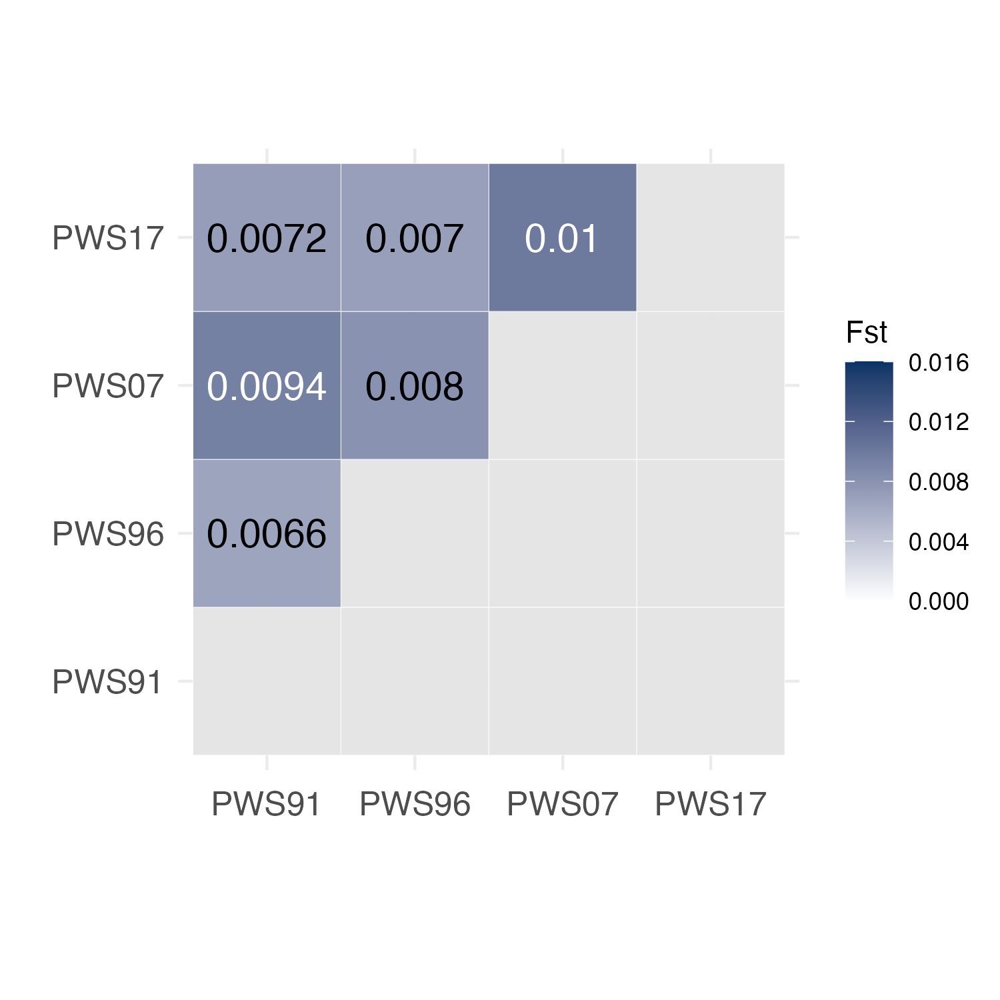

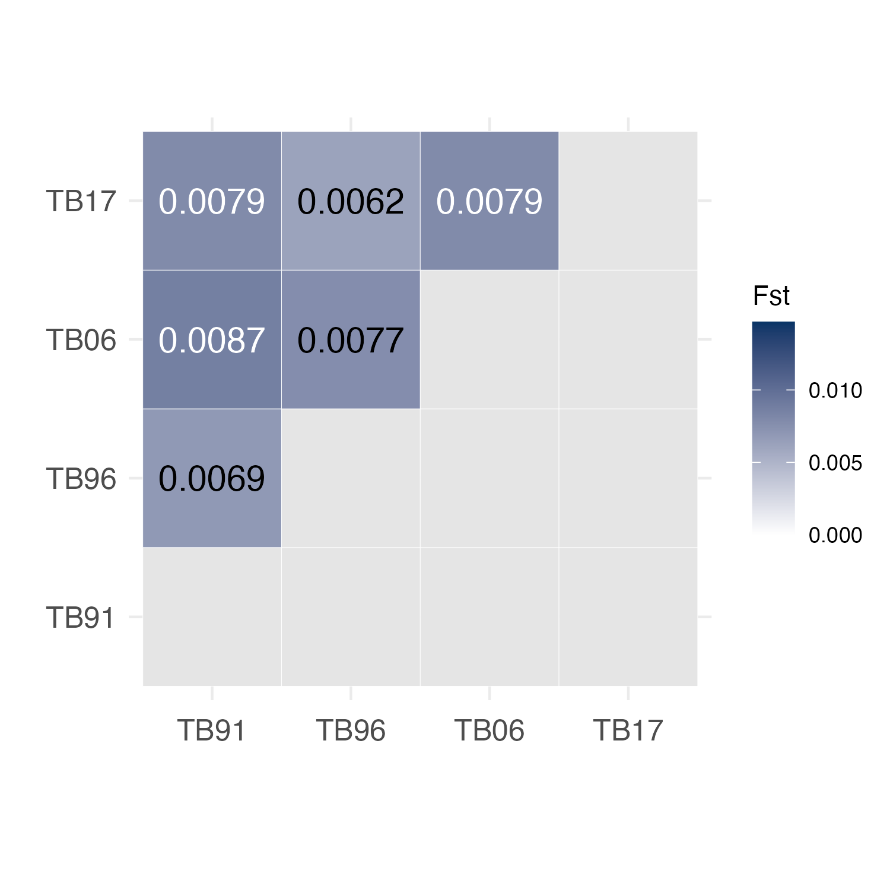

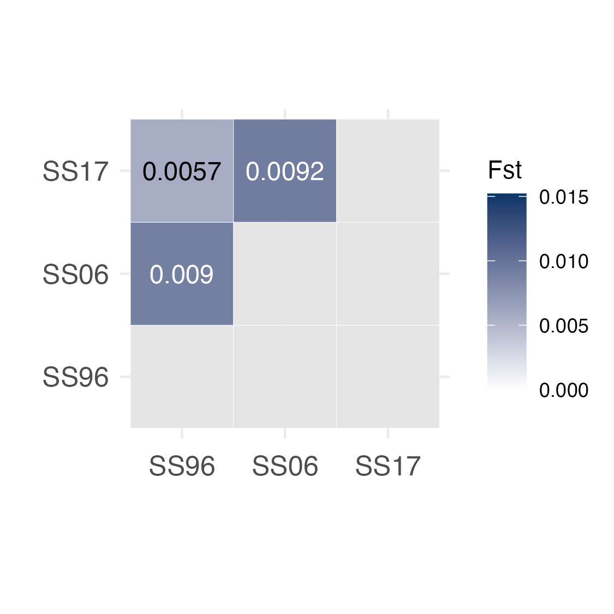


# Fst change over time  

```{r eval=FALSE, message=FALSE, warning=FALSE}
years = c('91'='1991', '96'='1996','06'='2006','07'='2007','17'='2017')
fst_time<-data.frame()
for (p in 1:3){
    df<-fst_long[[p]]
    df<-df[!is.na(df$fst),]
    df<-df[c(1,3,6),]
    df$yr<-gsub(popnames[p],'',df$pop2)
    df$yr<-str_replace_all(df$yr, years)
    df$yr<-as.integer(df$yr)
    df$pop<-popnames[p]
    fst_time<-rbind(fst_time, df)
}
fst_time<-fst_time[!is.na(fst_time$fst),]

ggplot(fst_time, aes(x=yr, y=fst, color=pop))+
    geom_point(size=3)+
    geom_path()+
    scale_color_manual(values=cols[c(2,3,1)])+
    theme_classic()+ylab("Fst")+xlab("")+
    ylim(0.006,0.011)+
    scale_x_continuous(breaks=c(1996,2006,2017), labels=c("1991-1996", "1996-2006/7","2006/7\n-2017"))+
    theme(legend.title = element_blank(), legend.position = c(0.15,.85))

ggsave("../Output/Fst/Fst_overTime_3pops.png", width = 4, height = 4, dpi=300 )

```
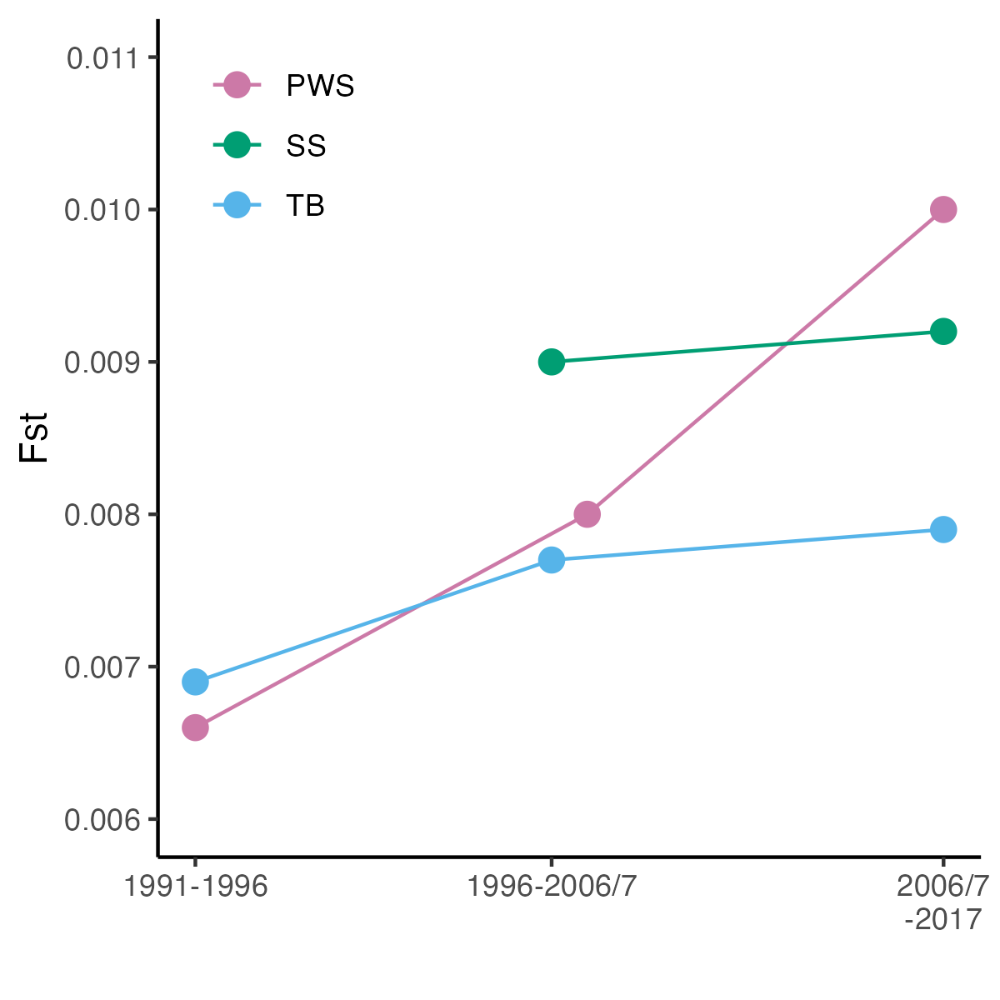


## Fst change over time between PWS/SS/TB

```{r message=FALSE, warning=FALSE, eval=FALSE}

comb<-data.frame(a=c("PWS91","PWS96","PWS07","PWS17","PWS96","PWS07","PWS17","SS96","SS06","SS17"),b=c("TB91","TB96","TB06","TB17","SS96","SS06","SS17","TB96","TB06","TB17")) 

fsts<-data.frame()
for (i in 1: nrow(comb)){
    pop1<-comb[i,1]
    pop2<-comb[i,2]
    df<-Fst[Fst$pop1==pop1 & Fst$pop2==pop2,]
    fsts<-rbind(fsts, df)
}

fsts$group<-c(rep("PWS vs. TB", times=4),rep("PWS vs. SS", times=3), rep("SS vs. TB", times=3))
fsts$year<-c(1991, rep(c(1996,2006,2017), times=3))

write.csv(fsts,"../Output/Fst/MD2000_Fst_betweenPop.csv")


library(RColorBrewer)
colors2<-brewer.pal(n=8, "Set3")
colors3<-c('#66c2a5','#fc8d62','#7570b3','#e78ac3','#a6d854')

ggplot(fsts, aes(x=year, y=fst, color=group, group=group))+
    geom_point(position=position_dodge(width = 1), size=3)+
    geom_line(position=position_dodge(width = 1))+
    ylab("Fst")+xlab("Year")+
    theme_classic()+theme(legend.title = element_blank())+
    scale_color_manual(values=colors3[c(2,1,3)])
ggsave("../Output/Fst/Fst_between_3pops.png", width = 5, height = 3, dpi=300)


# PWS and SS only
library(cowplot)
p1<-ggplot(fsts[5:7,], aes(x=year, y=fst, color=group, group=group))+
        geom_point(position=position_dodge(width = 1), size=3)+
        geom_line(position=position_dodge(width = 1))+
        ylab("Fst")+xlab("")+
        theme_classic()+
        scale_color_manual(values=colors3[c(2)])+
        scale_x_continuous(breaks=c(1996,2006,2017))+
        theme(legend.title = element_blank(), legend.position = c(0.87,.9))

p2<-ggplot(fsts[c(1:4,8:10),], aes(x=year, y=fst, color=group, group=group))+
        geom_point(position=position_dodge(width = 1), size=3)+
        geom_line(position=position_dodge(width = 1))+
        ylab("Fst")+xlab("Year")+
        theme_classic()+
        scale_color_manual(values=colors3[c(1,3)])+
        scale_x_continuous(breaks=c(1996,2006,2017))+
        theme(legend.title = element_blank(), legend.position = c(0.87,.95))

ggdraw()+
        draw_plot(p1,x=0,y=0.5,width=1, height=0.5)+
        draw_plot(p2,x=0,y=0,width=1, height=0.5)
ggsave("../Output/Fst/Fst_betweenPops.png",width=4.5, height=5, units="in",dpi=300)


# Fst Matrix plot between pops for each year 
yrs<-c("1996","2006","2017")
mat<-data.frame(pop1=c("PWS","SS","TB"),pop2=c("PWS","SS","TB"),fst=c(NA,NA,NA))
for (i in 1:length(yrs)){
    df<-fsts[fsts$year==yrs[i],]
    df<-df[,c("pop1","pop2","fst")]
    df$pop1<-gsub('[0-9]','',df$pop1)
    df$pop2<-gsub('[0-9]','',df$pop2)
    df<-rbind(df,mat)
    
    df$pop1<-factor(df$pop1, levels=c("TB","PWS","SS"))
    df$pop2<-factor(df$pop2, levels=c("TB","PWS","SS"))
    which(df$pop2=="SS")
    df$pop2[2]<-"PWS"
    df$pop1[2]<-"SS"
    
    
    #letter color
    df$color<-"a"
    df$color[df$fst>max(df$fst,na.rm=T)*0.9]<-"b"
    
    ggplot(df, aes(pop2, pop1, fill = fst))+
        geom_tile(color = "white")+
        scale_fill_gradientn(colors=c("white","#073466"),limits=c(0,(max(df$fst,na.rm=T)+0.006)),na.value="gray90",name="Fst")+
        theme_minimal()+ xlab("")+ylab("")+
        theme(axis.text.x = element_text(angle = 0, vjust = 0, size = 12, hjust = 0.5))+
        theme(axis.text.y = element_text(size = 12))+
        coord_fixed()+
        geom_text(aes(pop2, pop1, label = round(fst, 3), color=color),size = 3)+
        scale_color_manual(values=c("black", "white"), guide='none')+ggtitle(yrs[i])
    ggsave(paste0("../Output/Fst/Fst_yr",yrs[i],"_3pops.png"), width=4, height=4, dpi=300)
}

```

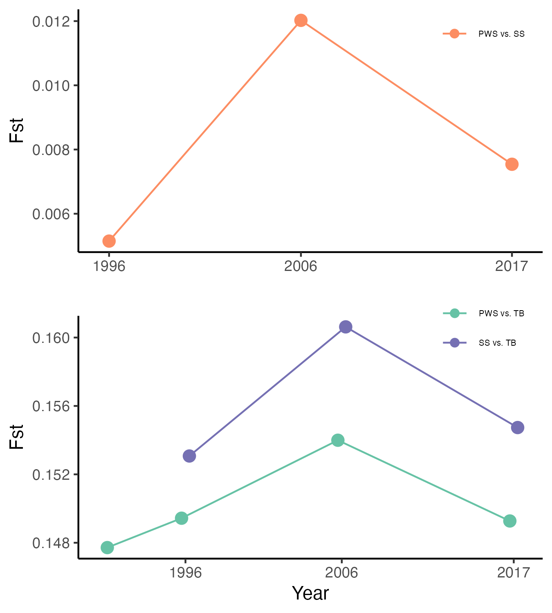{width=65%}

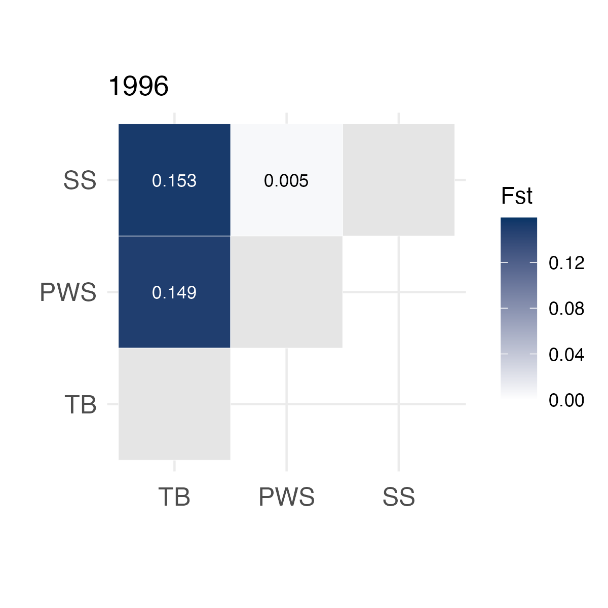


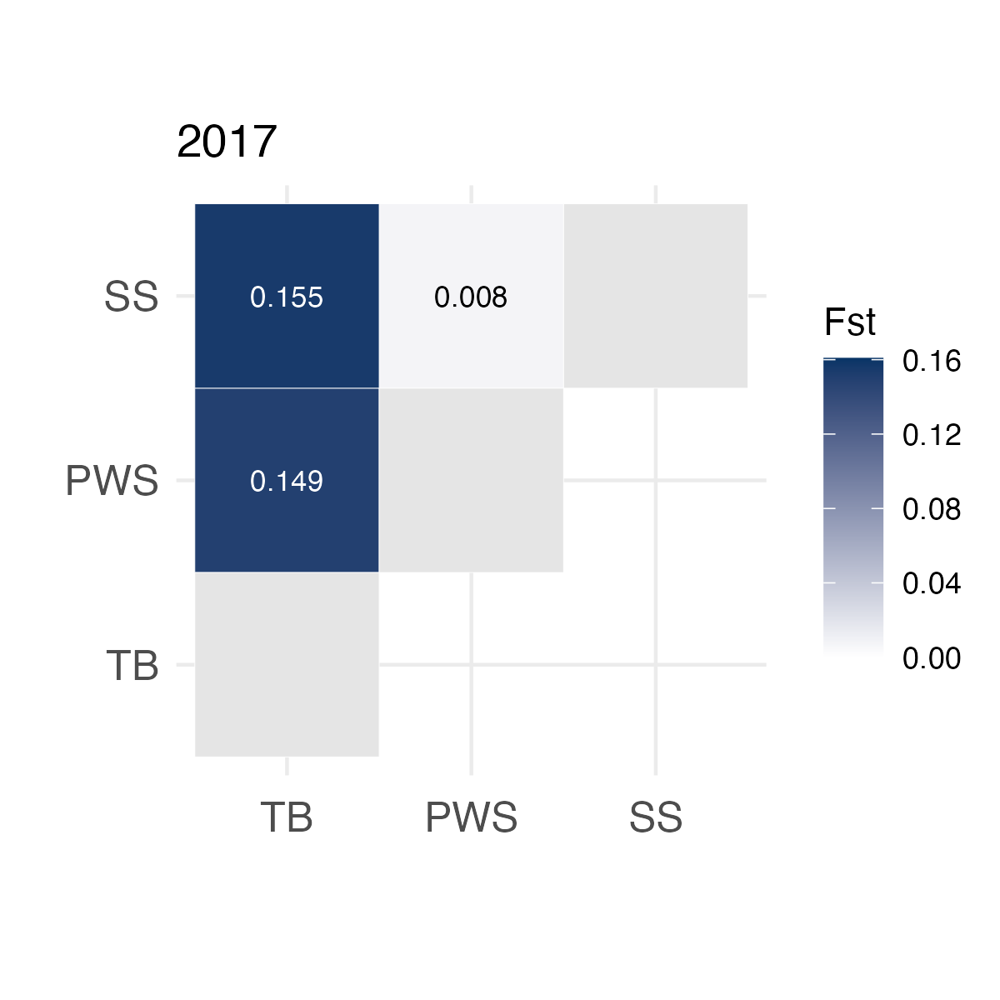


# Fst between populations & over time barplot 

```{r eval=FALSE, message=FALSE, warning=FALSE}

fst_all<-fsts
fst_all$class<-"interpop"
colnames(fst_all)[5]<-"pop"
fst_all$pair<-paste0(fst_all$pop1,"-",fst_all$pop2)
fst_time2<-fst_time
colnames(fst_time2)[4]<-"year"
fst_time2$pair<-paste0(fst_time2$pop1,"-",fst_time2$pop2)
fst_time2$class<-"intrapop"
fst_time2<-fst_time2[, c("pop1","pop2","pair","fst","pop","year","class")]

fst_all<-rbind(fst_all, fst_time2)

fst_all$class<-factor(fst_all$class, levels=c("interpop", "intrapop"))
fst_all$pair<-factor(fst_all$pair, levels=c("PWS91-TB91","PWS96-TB96", "PWS07-TB06","PWS17-TB17","SS96-TB96" , "SS06-TB06","SS17-TB17","PWS96-SS96","PWS07-SS06","PWS17-SS17", "TB91-TB96","TB96-TB06","TB06-TB17","PWS91-PWS96", "PWS96-PWS07", "PWS07-PWS17","SS96-SS06","SS06-SS17"))
ggplot(fst_all, aes(x=pair, y=fst, fill=class))+
    geom_bar(stat="identity")+
    theme_classic()+
    theme(axis.text.x=element_text(angle=45, hjust=1))+
    scale_fill_manual(values=c("#3182bd","#9ecae1"), labels=c("Between population","Within population"))+xlab('')+ylab("Fst")+
    theme(legend.title=element_blank(),legend.position = c(0.85,.9),legend.text = element_text(size=10))
ggsave("../Output/Fst/Fst_all_barplot.png", width=7, height=4.5, dpi=300)

```

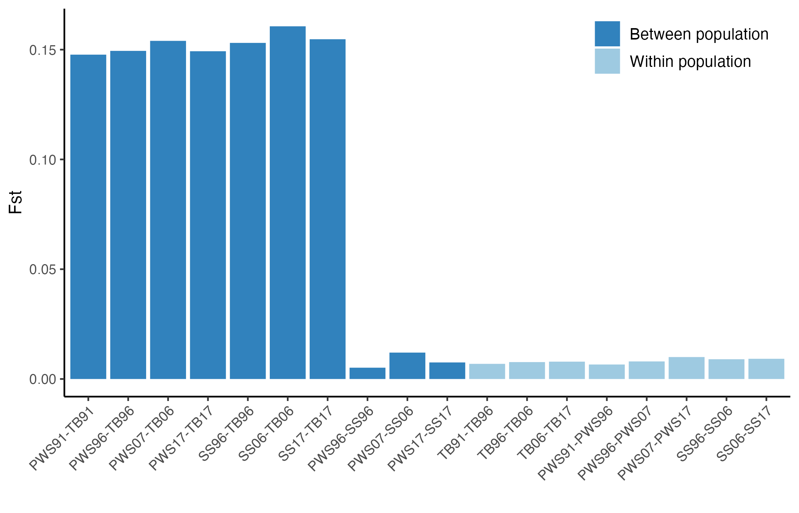


# Sampling random individuals and calculate Fst between PWS and SS populations  

## Random sample the PWS and SS individuals into 2 groups and calculate Fst in ANGSD  

```{r eval=FALSE, message=FALSE, warning=FALSE}

#Random sampling of PWS and SS individuals within the same time period
pop_info<-read.csv("../Data/Sample_metadata_892pops.csv")
pop_info<-pop_info[,c("Sample","Population.Year","pop","Year.Collected")]
colnames(pop_info)[4]<-"Year"
pops2<-pop_info[grep("PWS|SS",pop_info$Population.Year),]
# change PWS year to 2006
pops2$Year[pops2$Year==2007]<-2006


# create a file with lists of 2 random groups 
library(randomizr)
years<-c(1996,2006,2017)
for (i in 1:10){
    for (j in 1:length(years)){
        df1<-pops2[pops2$Year==years[j],]
        df1$group<-complete_ra(N = nrow(df1), num_arms = 2)
        pop1<-df1$Sample[df1$group=="T1"]
        pop2<-df1$Sample[df1$group=="T2"]
        write.table(pop1, paste0('../Output/Fst/random/pop1_',years[j],"_rep",i,".txt"), row.names = F, col.names = F, quote = F)
        write.table(pop2, paste0('../Output/Fst/random/pop2_',years[j],"_rep",i,".txt"), row.names = F, col.names = F, quote = F)
    }
}

#Create slurm scripts to calculate Fst for randomized 2 groups 
for (r in 1:10){
    sink(paste0("../Data/Slurmscripts/calc_Fst_rep",r,".sh"))
    #sink(paste0("../Data/Slurmscripts/calc_Fst_",years[i],"_",r,".sh"))
    cat("#!/bin/bash -l\n")
    cat(paste0("#SBATCH --job-name=calcFst",r," \n"))
    cat(paste0("#SBATCH --mem=16G \n")) 
    cat(paste0("#SBATCH --ntasks=8 \n"))
    #cat(paste0("#SBATCH --nodes=4 \n"))
    cat(paste0("#SBATCH -e calcFst",r,".err  \n"))
    cat(paste0("#SBATCH --time=120:00:00  \n"))
    cat(paste0("#SBATCH -p high  \n"))
    cat("\n\n")
    cat("module load bcftools\n")  
    for (i in 1:length(years)){
        #create vcf files
        cat(paste0("bcftools view -Oz -S /home/ktist/ph/data/new_vcf/random/pop1_",years[i],"_rep",r,".txt --threads 24 /home/ktist/ph/data/new_vcf/MD3000/3pops.MD2000_new.maf05.vcf.gz > /home/ktist/ph/data/new_vcf/random/pop1_rep",r,"_",years[i],".vcf.gz \n"))
        cat(paste0("bcftools index /home/ktist/ph/data/new_vcf/random/pop1_rep",r,"_",years[i],".vcf.gz \n"))
        cat(paste0("bcftools view -Oz -S /home/ktist/ph/data/new_vcf/random/pop2_",years[i],"_rep",r,".txt --threads 24 /home/ktist/ph/data/new_vcf/MD3000/3pops.MD2000_new.maf05.vcf.gz > /home/ktist/ph/data/new_vcf/random/pop2_rep",r,"_",years[i],".vcf.gz \n"))
        cat(paste0("bcftools index /home/ktist/ph/data/new_vcf/random/pop2_rep",r,"_",years[i],".vcf.gz \n\n"))
    }
    
    cat("module unload htslib \n")
    cat("module load angsd \n\n")  
    for (i in 1:length(years)){
    #create saf
        cat(paste0("angsd -doSaf 1 -vcf-pl /home/ktist/ph/data/new_vcf/random/pop1_rep",r,"_",years[i],".vcf.gz -out /home/ktist/ph/data/new_vcf/random/angsd/pop1_rep",r,"_",years[i]," -anc /home/jamcgirr/ph/data/c_harengus/c.harengus.fa \n"))
        cat(paste0("angsd -doSaf 1 -vcf-pl /home/ktist/ph/data/new_vcf/random/pop2_rep",r,"_",years[i],".vcf.gz -out /home/ktist/ph/data/new_vcf/random/angsd/pop2_rep",r,"_",years[i]," -anc /home/jamcgirr/ph/data/c_harengus/c.harengus.fa \n\n"))

    #create SFS
    #cat(paste0("realSFS /home/ktist/ph/data/new_vcf/random/angsd/pop1_rep",r,"_",years[i],".saf.idx -P 16 > /home/ktist/ph/data/new_vcf/random/angsd/pop1_rep",r,"_",years[i],".unfolded.sfs \n"))
    #cat(paste0("realSFS /home/ktist/ph/data/new_vcf/random/angsd/pop2_rep",r,"_",years[i],".saf.idx -P 16 > /home/ktist/ph/data/new_vcf/random/angsd/pop2_rep",r,"_",years[i],".unfolded.sfs \n"))
    
    #create 2D SFS
        cat(paste0("realSFS /home/ktist/ph/data/new_vcf/random/angsd/pop1_rep",r,"_",years[i],".saf.idx /home/ktist/ph/data/new_vcf/random/angsd/pop2_rep",r,"_",years[i],".saf.idx -P 24 > /home/ktist/ph/data/new_vcf/random/angsd/rep",r,"_",years[i],".sfs \n\n"))
    
    # calculate Fst
        cat(paste0("realSFS fst index /home/ktist/ph/data/new_vcf/random/angsd/pop1_rep",r,"_",years[i],".saf.idx /home/ktist/ph/data/new_vcf/random/angsd/pop2_rep",r,"_",years[i],".saf.idx -sfs /home/ktist/ph/data/new_vcf/random/angsd/rep",r,"_",years[i],".sfs -fstout /home/ktist/ph/data/new_vcf/random/angsd/rep",r,"_persite_",years[i],"\n"))
        cat(paste0("realSFS fst stats2 /home/ktist/ph/data/new_vcf/random/angsd/rep",r,"_persite_",years[i],".fst.idx -win 50000 -step 10000 > /home/ktist/ph/data/new_vcf/random/angsd/rep",r,"_persite_",years[i],"_50kWindow \n\n"))
    }
    sink(NULL)
}


years<-c(1996,2006,2017)
sink(paste0("../Data/Slurmscripts/perSite_Fst_random.sh"))
cat("#!/bin/bash -l\n")
cat(paste0("#SBATCH --job-name=siteFst \n"))
cat(paste0("#SBATCH --mem=16G \n")) 
cat(paste0("#SBATCH --ntasks=8 \n")) 
cat(paste0("#SBATCH -e siteFst.err  \n"))
cat(paste0("#SBATCH --time=24:00:00  \n"))
cat(paste0("#SBATCH -p high  \n"))
cat("\n\n")
cat('module load angsd \n\n') 

comb<-data.frame(pop1=c("PWS96","PWS07","PWS17"),pop2=c("SS96","SS06","SS17")) 

for (y in 1:3){
    yr=years[y]
    for (i in 1:10){
        p1<-comb[i,1]
        p2<-comb[i,2]
        cat(paste0("realSFS fst print /home/ktist/ph/data/new_vcf/random/angsd/rep", i, "_persite_", yr,".fst.idx > /home/ktist/ph/data/new_vcf/random/angsd/rep", i, "_persite_", yr,".fst.txt \n"))
        cat(paste0("bgzip //home/ktist/ph/data/new_vcf/random/angsd/rep", i, "_persite_", yr,".fst.txt \n\n" ))
}}
sink(NULL)


```


## Summarize the results
```{r message=FALSE, warning=FALSE, eval=FALSE}

# calculate genome-wide wieghted Fst (the ratio of averages)
comb<-data.frame(pop1=c("PWS96","PWS07","PWS17"),pop2=c("SS96","SS06","SS17")) 
Fst.random<-data.frame(comb)
Fst.random$Year<-c("1996","2006","2017")

for (j in 1:length(years)){
    yr<-years[j]
    for (i in 1:10){
        df<-read.delim(paste0("../Output/Fst/random/rep",i,"_persite_",yr,".fst.txt.gz"))
        colnames(df)<-c("chr","pos","A","B")
        Fst.random[j,paste0("rep",i)]<-sum(df$A)/sum(df$B)
    }    
 }

# means for 10 replicates
Fst.random$meanFst<-rowMeans(Fst.random[,4:13])
Fst.random$sd<-apply(Fst.random[,4:13], 1, sd)
write.csv(Fst.random,"../Output/Fst/random/Fst_MD2000_random_betweenPWS.SS.csv" )


# Estimated Fst values based on the data
fsts<-read.csv("../Output/Fst/newMD2000_weightedFst_3pops.csv")
Fst.random$realFst<-fsts$fst[c(22,20,21)]

fstm<-melt(Fst.random[,c("Year","meanFst","realFst","sd")], id.vars=c("Year","sd"))
fstm$sd[fstm$variable=="realFst"]<-NA
fstm$Year<-factor(fstm$Year, levels=c("1996","2006","2017"))

# Plot the results 
ggplot(fstm, aes(x=Year, y=value, fill=variable))+
    geom_bar(stat="identity", position=position_dodge(width=1))+
    geom_errorbar(aes(ymin=value-sd,ymax=value+sd), position=position_dodge(width=1), width=.2, size=.2)+
    scale_fill_manual(values=gcols[2:3], labels=c("Randomsized", "Estimated Fst"))+
    theme_bw()+theme(legend.title = element_blank())+ggtitle("PWS vs. SS Fst")
ggsave("../Output/Fst/PWS_SS_randomsized.vs.realFst.png", width = 4.4, height = 3, dpi=300)
```

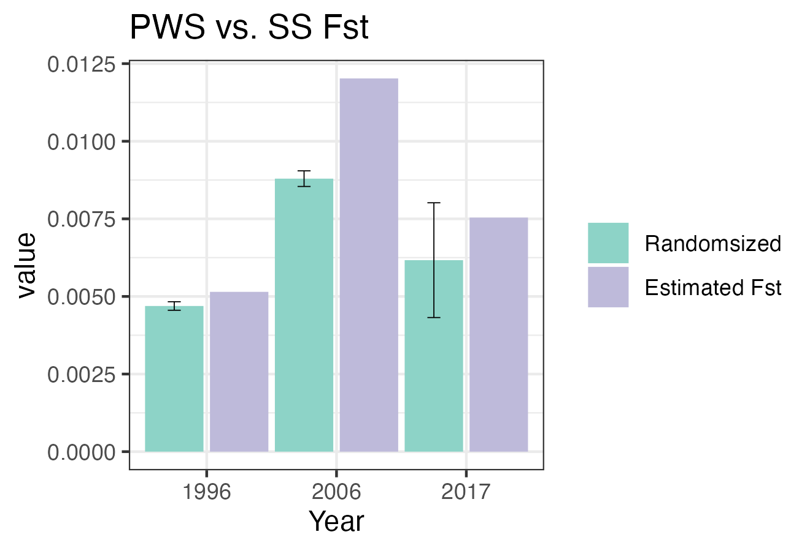


# Bootstrap to take randomized samples from [PWS+SS] and calculate Fst to obtain null distribution & P-value

## Create scripts to run at Farm  
* https://www.researchgate.net/post/What-is-the-most-appropriate-way-to-assess-the-significance-of-pairwise-Fst-values
* pop1 = PWS pop size, pop2= SS pop size (randomization without replacement)

```{r eval=FALSE, message=FALSE, warning=FALSE}
# Some bootstrapping results are upload at OSF Storage: https://osf.io/wrca4 (Output/Fst/bootstrap/)
# All bootstrap output data are available upon request

#Sample each pop.yr PWS and SS individuals within the same time period
pop_info<-read.csv("../Data/Sample_metadata_892pops.csv")
pop_info<-pop_info[,c("Sample","Population.Year","pop","Year.Collected")]
colnames(pop_info)[4]<-"Year"
pops2<-pop_info[grep("PWS|SS",pop_info$Population.Year),]
# change PWS year to 2006
pops2$Year[pops2$Year==2007]<-2006

# create a list of sampled individuals for each pair (1996, 2006, 2017) 
library(randomizr)
library(boot)
years<-c(1996,2006,2017)

for (i in 1:100){
    for (j in 1:length(years)){
        df<-pops2[pops2$Year==years[j],]
        df1<-df[df$pop=="PWS",]
        df2<-df[df$pop=="SS",]
        pop1<-sample(df$Sample, nrow(df1), replace=FALSE)
        pop2<-df$Sample[!(df$Sample %in% pop1)]
        write.table(pop1, paste0('../Output/Fst/bootstrap/pop1_',years[j],"_rep",i,".txt"), row.names = F, col.names = F, quote = F)
        write.table(pop2, paste0('../Output/Fst/bootstrap/pop2_',years[j],"_rep",i,".txt"), row.names = F, col.names = F, quote = F)

    }
}

#Create slurm scripts to calculate Fst for randomized 2 groups 
for (r in 1:100){
    sink(paste0("../Data/Slurmscripts/boot_Fst_rep",r,".sh"))
    cat("#!/bin/bash -l\n")
    cat(paste0("#SBATCH --job-name=boot",r," \n"))
    cat(paste0("#SBATCH --mem=16G \n")) 
    cat(paste0("#SBATCH --ntasks=8 \n"))
    cat(paste0("#SBATCH -e bootFst",r,".err  \n"))
    cat(paste0("#SBATCH --time=120:00:00  \n"))
    cat(paste0("#SBATCH -p high  \n"))
    cat("\n\n")
    cat("module load bcftools\n\n")  
    
    for (i in 1:length(years)){
        #create vcf files
        cat(paste0("bcftools view -Oz -S /home/ktist/ph/data/new_vcf/bootstrap/pop1_",years[i],"_rep",r,".txt --threads 24 /home/ktist/ph/data/new_vcf/MD3000/3pops.MD2000_new.maf05.vcf.gz > /home/ktist/ph/data/new_vcf/bootstrap/vcf/pop1_rep",r,"_",years[i],".vcf.gz \n"))
        #cat(paste0("bcftools index /home/ktist/ph/data/new_vcf/bootstrap/PWS_rep",r,"_",years[i],"_",k,".vcf.gz \n"))
         cat(paste0("bcftools view -Oz -S /home/ktist/ph/data/new_vcf/bootstrap/pop2_",years[i],"_rep",r,".txt --threads 24 /home/ktist/ph/data/new_vcf/MD3000/3pops.MD2000_new.maf05.vcf.gz > /home/ktist/ph/data/new_vcf/bootstrap/vcf/pop2_rep",r,"_",years[i],".vcf.gz \n\n"))
    }  
    cat("module unload htslib \n")
    cat("module load angsd \n\n")  
    for (i in 1:length(years)){
    #create saf
        cat(paste0("angsd -doSaf 1 -vcf-pl /home/ktist/ph/data/new_vcf/bootstrap/vcf/pop1_rep",r,"_",years[i],".vcf.gz -out /home/ktist/ph/data/new_vcf/bootstrap/angsd/pop1_rep",r,"_",years[i]," -anc /home/jamcgirr/ph/data/c_harengus/c.harengus.fa \n"))
        cat(paste0("angsd -doSaf 1 -vcf-pl /home/ktist/ph/data/new_vcf/bootstrap/vcf/pop2_rep",r,"_",years[i],".vcf.gz -out /home/ktist/ph/data/new_vcf/bootstrap/angsd/pop2_rep",r,"_",years[i]," -anc /home/jamcgirr/ph/data/c_harengus/c.harengus.fa \n\n"))

    #create 2D SFS
        cat(paste0("realSFS /home/ktist/ph/data/new_vcf/bootstrap/angsd/pop1_rep",r,"_",years[i],".saf.idx /home/ktist/ph/data/new_vcf/bootstrap/angsd/pop2_rep",r,"_",years[i],".saf.idx -P 24 > /home/ktist/ph/data/new_vcf/bootstrap/angsd/rep",r,"_",years[i],".2D.sfs \n\n"))
    
    # calculate Fst
        cat(paste0("realSFS fst index /home/ktist/ph/data/new_vcf/bootstrap/angsd/pop1_rep",r,"_",years[i],".saf.idx /home/ktist/ph/data/new_vcf/bootstrap/angsd/pop2_rep",r,"_",years[i],".saf.idx -sfs /home/ktist/ph/data/new_vcf/bootstrap/angsd/rep",r,"_",years[i],".2D.sfs -fstout /home/ktist/ph/data/new_vcf/bootstrap/angsd/rep",r,"_persite_",years[i],"\n"))
        cat(paste0("realSFS fst print /home/ktist/ph/data/new_vcf/bootstrap/angsd/rep", r, "_persite_", years[i],".fst.idx > /home/ktist/ph/data/new_vcf/bootstrap/angsd/fst/rep", r, "_persite_", years[i],".fst.txt \n"))
        cat(paste0("bgzip /home/ktist/ph/data/new_vcf/bootstrap/angsd/fst/rep", r, "_persite_", years[i],".fst.txt \n\n"))
    }
    sink(NULL)
}


```


## Plot the results for Interpop comparison
### Read the results and create the average files
```{r message=FALSE, warning=FALSE, eval=FALSE}
years<-c(1996,2006,2017)

# calculate genome-wide wieghted Fst (the ratio of averages)
comb<-data.frame(pop1=c("PWS96","PWS07","PWS17"),pop2=c("SS96","SS06","SS17")) 

Fst.random<-data.frame(comb)
Fst.random$Year<-c("1996","2006","2017")

for(i in 1:100){
    for(j in 1:length(years)){
        df<-read.delim(paste0("../Output/Fst/bootstrap/fst/rep",i,"_persite_",years[j],".fst.txt.gz"))
        colnames(df)<-c("chr","pos","A","B")
        Fst.random[j,paste0("rep",i)]<-sum(df$A)/sum(df$B)
    }
}

# means for all replicates
n<-ncol(Fst.random)
Fst.boot<-Fst.random[,1:3]
Fst.boot$meanFst<-rowMeans(Fst.random[,4:n])
Fst.boot$sd<-apply(Fst.random[,4:n], 1, sd)
write.csv(Fst.random,"../Output/Fst/bootstrap/fst/Fst_MD2000_boot100_betweenPWS.SS.csv" )
write.csv(Fst.boot,"../Output/Fst/bootstrap/fst/Fst_MD2000_means_betweenPWS.SS.csv" )
```


### Summary of Results between PWS vs. SS
``` {r message=FALSE, warning=FALSE, eval=FALSE}
#Randomoized results
Fst.random<-read.csv("../Output/Fst/bootstrap/fst/Fst_MD2000_boot100_betweenPWS.SS.csv", row.names = 1)
Fst.boot<-read.csv("../Output/Fst/bootstrap/fst/Fst_MD2000_means_betweenPWS.SS.csv", row.names=1)

# Estimated Fst values
fsts<-read.csv("../Output/Fst/newMD2000_weightedFst_3pops.csv")
Fst.boot$realFst<-fsts$fst[c(22,20,21)]

fstm<-melt(Fst.boot[,c("Year","meanFst","realFst","sd")], id.vars=c("Year","sd"))
fstm$sd[fstm$variable=="realFst"]<-NA
#fstm$Year<-factor(fstm$Year, levels=c("1996","2006","2017"))

# Plot the results 

fs<-t(Fst.random)
colnames(fs)<-fs[3,]
fs<-fs[-c(1:3),]
fsm<-melt(fs)
colnames(fsm)[1:2]<-c("variable","Year")
fsm$Fst<-"meanFst"
fsm<-fsm[,-1]
fsm<-rbind(fsm,data.frame(Year=c("1996","2006","2017"), value=rep(NA, times=3),Fst=rep("realFst", times=3)))
fsm$value<-as.numeric(fsm$value)
fsm$Year<-as.integer(fsm$Year)
tcols<-c("#984ea3","#4daf4a")

colnames(fstm)[3]<-"Fst"

p2<-ggplot()+
    geom_point(data=fsm, aes(x=Year, y=value,fill=Fst), position=position_jitterdodge(dodge.width=1, jitter.width=0.1), size=0.3, color=gcols[3],show.legend = F)+
    geom_point(data=fstm, aes(x=Year, y=value, fill=Fst,color=Fst), position=position_dodge(width=1),size=2)+
    scale_color_manual(values=tcols, labels=c("Randomsized", "Estimated Fst"))+
    theme_bw()+theme(legend.title = element_blank())+
     guides(fill="none")+scale_x_continuous(breaks=c(1996, 2006,2017))+
    ylab(expression("F"[ST]))


#95% CIs
fs<-data.frame(fs)
fs$X1996<-as.numeric(fs$X1996)
fs$X2006<-as.numeric(fs$X2006)
fs$X2017<-as.numeric(fs$X2017)

Fst.boot$ci_low[1]<-quantile(fs$X1996, probs=c(0.025,0.975))[1]
Fst.boot$ci_high[1]<-quantile(fs$X1996, probs=c(0.025,0.975))[2]
Fst.boot$ci_low[2]<- quantile(fs$X2006, probs=c(0.025,0.975))[1]
Fst.boot$ci_high[2]<-quantile(fs$X2006, probs=c(0.025,0.975))[2]
Fst.boot$ci_low[3]<- quantile(fs$X2017, probs=c(0.025,0.975))[1]
Fst.boot$ci_high[3]<-quantile(fs$X2017, probs=c(0.025,0.975))[2]


fstm<-melt(Fst.boot[,c("Year","meanFst","realFst","ci_low","ci_high")], id.vars=c("Year","ci_low","ci_high"))
fstm$ci_low[fstm$variable=="realFst"]<-NA
fstm$ci_high[fstm$variable=="realFst"]<-NA

# Calculate p-values
# ((# of bootstraps >= actual Fst) + 1) / (# of replicates +1).
#Number of bootstraps
n=103
for (i in 1:3){
    fstboot<-t(Fst.random[i, 4:n])
    range(fstboot)
    Fst.boot$P.val[i]<-(length(fstboot[fstboot >=Fst.boot$realFst[i]])+1)/(n+1)
}

#pvalues
# 0.019230769 0.009615385 0.009615385

ann <- fstm[fstm$variable=="realFst",]
ann$value<-0.0125
ann$P.val<-round(Fst.boot$P.val, digit=4)
ann$p.symble<-c("*","**","**")

#Plot both in 1 plot for figures
p1<-ggplot(fstm, aes(x=factor(Year), y=value, fill=variable))+
    geom_bar(stat="identity", position=position_dodge(width=0.8), width=0.8)+
    geom_errorbar(aes(ymin=ci_low,ymax=ci_high), position=position_dodge(width=0.8), width=.2, size=.2)+
    scale_fill_manual(values=gcols[c(3,2)], labels=c("Randomsized", "Estimated Fst"))+ylab(expression("F"[ST] ~" ± 95% CI"))+xlab('')+
    theme_bw()+theme(legend.title = element_blank())+
    geom_text(data=ann, mapping = aes(label = p.symble), size=3, color="gray25")+
    theme(panel.grid.major.x = element_blank(), panel.grid.minor.x = element_blank())

ggarrange(p1,p2, labels=c("a","b"),ncol=1)
ggsave("../Output/Fst/PWS_SS_Fst_randomized_2plots.png",width = 4.5, height = 5.5, dpi=300)

```
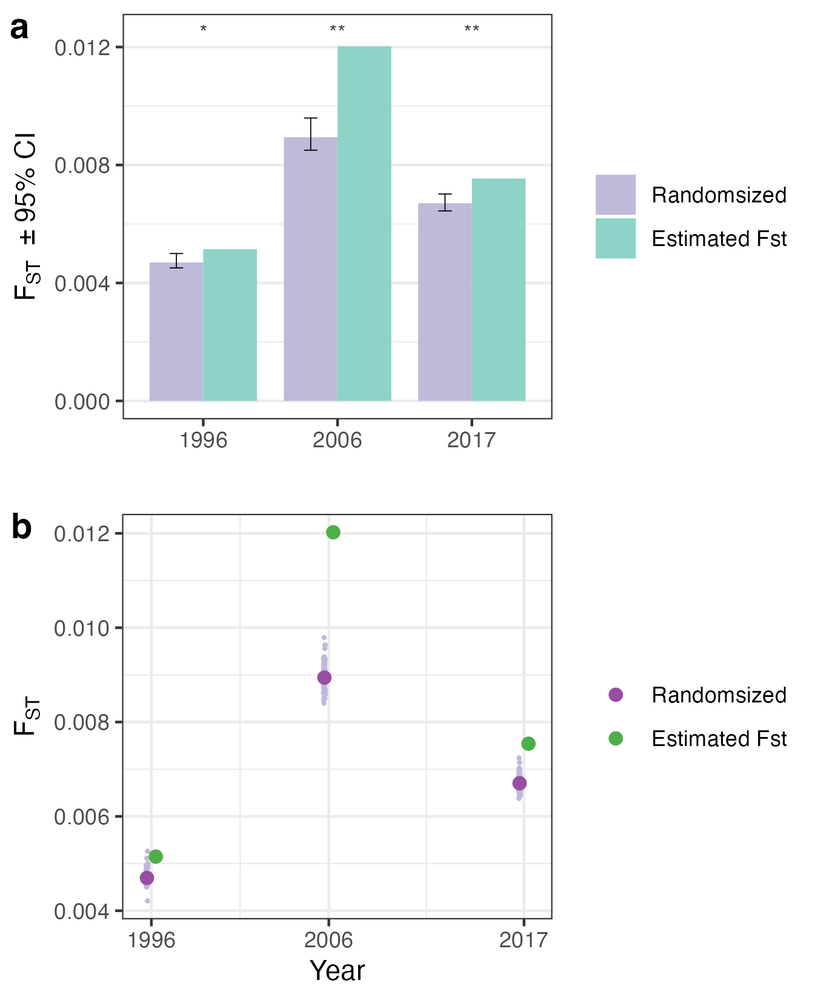


# Bootstrapping to assgin confidence intervals for intrapop Fst values 

## Create slumr scripts to randomize individuals from 2 time points to 2 pops & calcualte Fst with ANGSD

```{r eval=FALSE, message=FALSE, warning=FALSE}

#Sample each pop.yr PWS and SS individuals within the same time period
pop_info<-read.csv("../Data/Sample_metadata_892pops.csv")
pop_info<-pop_info[,c("Sample","Population.Year","pop","Year.Collected")]
colnames(pop_info)[4]<-"Year"

pops3<-pop_info[grep("PWS|SS|TB",pop_info$Population.Year),]

# change PWS year to 2006
pops3$Year[pops3$Year==2007]<-2006

# create a list of sampled individuals for each pair of PWS 
library(randomizr)
years<-c(1991,1996,2006,2017)
for(p in c("PWS","TB","SS")){
    pps<-pops3[pops3$pop==p,]
    start=ifelse (p=="SS", 2, 1)
    for (j in start:(length(years)-1)){
        for (i in 1:100){
            df<-pps[pps$Year==years[j]|pps$Year==years[j+1],]
            df1<-df[df$Year==years[j],]
            df2<-df[df$Year==years[j+1],]
            pop1<-sample(df$Sample, nrow(df1), replace=FALSE)
            pop2<-df$Sample[!(df$Sample %in% pop1)]
            write.table(pop1, paste0('../Output/Fst/bootstrap/',p,"/pop1_", years[j],"-",years[j+1],"_rep",i,".txt"), row.names = F, col.names = F, quote = F)
            write.table(pop2, paste0('../Output/Fst/bootstrap/',p,"/pop2_", years[j],"-",years[j+1],"_rep",i,".txt"), row.names = F, col.names = F, quote = F)
        }
    }
}

#Create slurm scripts to calculate Fst for randomized 2 groups 

for(p in c("PWS","TB","SS")){
    pps<-pops3[pops3$pop==p,]
    start=ifelse (p=="SS", 2, 1)
    for (j in start:(length(years)-1)){
        sink(paste0("../Data/Slurmscripts/boot_Fst_",p,"_",years[j],".sh"))
        cat("#!/bin/bash -l\n")
        cat(paste0("#SBATCH --job-name=",p,"_", years[j]," \n"))
        cat(paste0("#SBATCH --mem=16G \n")) 
        cat(paste0("#SBATCH --ntasks=8 \n"))
        cat(paste0("#SBATCH --nodes=4 \n"))
        cat(paste0("#SBATCH -e bootFst_",p,"_", years[j],".err  \n"))
        cat(paste0("#SBATCH --time=200:00:00  \n"))
        cat(paste0("#SBATCH -p high  \n"))
        cat("\n\n")
        cat("module load bcftools\n\n")  
      
        for (r in 1:100){
            #create vcf files
            cat(paste0("bcftools view -Oz -S /home/ktist/ph/data/new_vcf/bootstrap/",p,"/pop1_", years[j],"-",years[j+1],"_rep",r,".txt --threads 24 /home/ktist/ph/data/new_vcf/MD2000/3pops.MD2000_new.maf05.vcf.gz > /home/ktist/ph/data/new_vcf/bootstrap/",p,"/pop1_rep",r,"_", years[j],"-",years[j+1],".vcf.gz \n"))
            cat(paste0("bcftools view -Oz -S /home/ktist/ph/data/new_vcf/bootstrap/", p, "/pop2_", years[j],"-",years[j+1],"_rep",r,".txt --threads 24 /home/ktist/ph/data/new_vcf/MD2000/3pops.MD2000_new.maf05.vcf.gz > /home/ktist/ph/data/new_vcf/bootstrap/",p,"/pop2_rep",r,"_",years[j],"-",years[j+1],".vcf.gz \n\n"))
        }
      
        cat("module unload htslib \n")
        cat("module load angsd \n\n")  
        for (r in 1:100){
            #create saf
            cat(paste0("angsd -doSaf 1 -vcf-pl /home/ktist/ph/data/new_vcf/bootstrap/",p,"/pop1_rep",r,"_",     years[j],"-",years[j+1],".vcf.gz -out /home/ktist/ph/data/new_vcf/bootstrap/",p,"/pop1_rep",r,"_",     years[j],"-",years[j+1]," -anc /home/jamcgirr/ph/data/c_harengus/c.harengus.fa \n"))
            cat(paste0("angsd -doSaf 1 -vcf-pl /home/ktist/ph/data/new_vcf/bootstrap/",p,"/pop2_rep",r,"_",     years[j],"-",years[j+1],".vcf.gz -out /home/ktist/ph/data/new_vcf/bootstrap/",p,"/pop2_rep",r,"_",     years[j],"-",years[j+1]," -anc /home/jamcgirr/ph/data/c_harengus/c.harengus.fa \n\n"))
    
        #create 2D SFS
            cat(paste0("realSFS /home/ktist/ph/data/new_vcf/bootstrap/",p,"/pop1_rep",r,"_",     years[j],"-",years[j+1],".saf.idx /home/ktist/ph/data/new_vcf/bootstrap/",p,"/pop2_rep",r,"_",     years[j],"-",years[j+1],".saf.idx -P 24 > /home/ktist/ph/data/new_vcf/bootstrap/",p,"/Fst",j,"/rep",r,"_",     years[j],"-",years[j+1],".2D.sfs \n\n"))
        
        # calculate Fst
            cat(paste0("realSFS fst index /home/ktist/ph/data/new_vcf/bootstrap/",p,"/pop1_rep",r,"_",     years[j],"-",years[j+1],".saf.idx /home/ktist/ph/data/new_vcf/bootstrap/",p,"/pop2_rep",r,"_",     years[j],"-",years[j+1],".saf.idx -sfs /home/ktist/ph/data/new_vcf/bootstrap/",p,"/Fst",j,"/rep",r,"_",     years[j],"-",years[j+1],".2D.sfs -fstout /home/ktist/ph/data/new_vcf/bootstrap/",p,"/rep",r,"_persite_",years[j],"-",years[j+1],"\n"))
            cat(paste0("realSFS fst print /home/ktist/ph/data/new_vcf/bootstrap/",p,"/rep",r,"_persite_",years[j],"-",years[j+1],".fst.idx > /home/ktist/ph/data/new_vcf/bootstrap/",p,"/Fst",j,"/rep",r,"_persite_",years[j],"-",years[j+1],".fst.txt \n"))
            cat(paste0("bgzip /home/ktist/ph/data/new_vcf/bootstrap/",p,"/Fst",j,"/rep",r,"_persite_",years[j],"-",years[j+1]    ,".fst.txt \n\n"))
            
            cat(paste0("rm /home/ktist/ph/data/new_vcf/bootstrap/",p,"/pop1_rep",r,"_", years[j],"-",years[j+1],".vcf.gz     \n"))
            cat(paste0("rm /home/ktist/ph/data/new_vcf/bootstrap/",p,"/pop2_rep",r,"_", years[j],"-",years[j+1],".vcf.gz     \n"))
            cat(paste0("rm /home/ktist/ph/data/new_vcf/bootstrap/",p,"/rep",r,"_persite_", years[j],"-",years[j+1],".fst.* \n"))
            cat(paste0("rm /home/ktist/ph/data/new_vcf/bootstrap/",p,"/pop1_rep",r,"_",years[j],"* \n"))    
            cat(paste0("rm /home/ktist/ph/data/new_vcf/bootstrap/",p,"/pop2_rep",r,"_",years[j],"* \n\n"))    
        
        }
    sink(NULL)
    }
}   
    
```


## Plot the results: 2. Intrapop comparison (over times)

```{r message=FALSE, warning=FALSE, eval=FALSE}
years<-c(1991,1996,2006, 2017)
# actual Fst values
fsts<-read.csv("../Output/Fst/newMD2000_weightedFst_3pops.csv")

# calculate genome-wide wieghted Fst (the ratio of averages)
#comb<- "Data/popinfo/timeserires_combs.csv", row.names = F)
k=1
Fst<-list()
boot<-data.frame()
for(p in c("PWS","TB","SS")){
    start=ifelse (p=="SS", 2, 1)
    Frandom<-data.frame(Year=c("1991-1996","1996-2006","2006-2017"))
    for(j in start:(length(years)-1)){
        for(i in 1:100){
            df<-read.delim(paste0("../Output/Fst/bootstrap/",p,"/Fst",j,"/rep",i,"_persite_",years[j],"-",years[j+1],".fst.txt.gz"), header = F)
            colnames(df)<-c("chr","pos","A","B")
            Frandom[j,paste0("rep",i)]<-sum(df$A)/sum(df$B)
        }
    }
    
    # means for all replicates
    n<-101
    F.boot<-data.frame(Year=c("1991-1996","1996-2006","2006-2017"))
    F.boot$meanFst<-rowMeans(Frandom[,2:n])
    #F.boot$sd<-apply(Frandom[,2:n], 1, sd)
    cis<-apply(Frandom[, 2:n], 1, function(x) quantile(x, probs=c(0.025,0.975),na.rm=T))
    F.boot$ci_low<-cis[1,]
    F.boot$ci_high<-cis[2,]
    if (p=="PWS") rows<-c(6,3,1)
    if (p=="TB") rows<-c(12,9,7)
    if (p=="SS") rows<-c(NA, 14,13)
    F.boot$realFst<-fsts$fst[rows]
    
    F.boot$pop<-p
    #p-values
    F.boot$P.val<-NA
    for (j in start:3){
        fstboot<-t(Frandom[j, 2:n])
        F.boot$P.val[j]<-(length(fstboot[fstboot >=F.boot$realFst[j]])+1)/(n+1)
    }
        
    write.csv(Frandom,paste0("../Output/Fst/bootstrap/",p,"/Fst_",p,"_boot100.csv" ))
    write.csv(F.boot, paste0("../Output/Fst/bootstrap/",p,"/Fst_",p,"_summary.csv" ))
    
    Fst[[k]]<-Frandom
    Pval[[k]]<-F.boot[[]]
    names(Fst)[k]<-p
    boot<-rbind(boot, F.boot)
    k=k+1
}
write.csv(boot, "../Output/Fst/bootstrap/Fst_bootstrap_mean.csv", row.names = F)


# Read in the saved results for creating figures
boot<-read.csv("../Output/Fst/bootstrap/Fst_bootstrap_mean.csv")
Fst<-list()
locs<-c("PWS","TB","SS")
for (i in 1:3){
    p<-locs[i]
    df<-read.csv(paste0("../Output/Fst/bootstrap/",p,"/Fst_",p,"_boot100.csv" ), row.names = 1)
    Fst[[i]]<-df
    names(Fst)[i]<-p
}

# CIs
bootm<-melt(boot, id.vars=c("pop","Year","ci_low","ci_high","P.val") )
bootm$ci_low[bootm$variable=="realFst"]<-NA
bootm$ci_high[bootm$variable=="realFst"]<-NA
colnames(bootm)[which(colnames(bootm)=="variable")]<-"Fst"

# Plot all data points
fsm<-data.frame()
for (i in 1:3){
    df<-Fst[[i]]
    fs<-t(df)
    colnames(fs)<-fs[1,]
    fs<-fs[-1,]
    fs2<-melt(fs)
    colnames(fs2)[1:2]<-c("variable","Year")
    fs2$Fst<-"meanFst"
    fs2<-fs2[,-1]
    fs2<-rbind(fs2,data.frame(Year=c("1991-1996","1996-2006","2006-2017"), value=rep(NA, times=3),Fst=rep("realFst", times=3)))
    fs2$pop<-names(Fst)[i]
    fsm<-rbind(fsm, fs2)
} 

fsm$value<-as.numeric(fsm$value)
tcols<-c("#984ea3","#4daf4a")

p4<-ggplot()+
    facet_wrap(~pop)+
    geom_point(data=fsm, aes(x=Year, y=value,fill=Fst), position=position_jitterdodge(dodge.width=0.7, jitter.width=0.1), size=0.3, color=gcols[3],show.legend = F)+
    geom_point(data=bootm, aes(x=Year, y=value, fill=Fst,color=Fst), position=position_dodge(width=0.7),size=2)+
    scale_color_manual(values=tcols, labels=c("Randomsized", expression("Estimated"~ "F"[ST])))+
    theme_bw()+theme(legend.title = element_blank())+
    guides(fill="none")+ylab("Fst")+xlab('')+
    theme(panel.grid.major = element_blank(), panel.grid.minor = element_blank())+
    geom_vline(xintercept=c(1.5,2.5), color="gray70",size=0.3)+
    ylab(expression("F"[ST]))

write.csv(boot, "../Output/Fst/bootstrap/Intrapop_Fst_summary_table.csv")


# Plot with P-values
fstm<-melt(boot[,c("Year","meanFst","realFst","ci_low","ci_high")], id.vars=c("Year","ci_low","ci_high"))
fstm$ci_low[fstm$variable=="realFst"]<-NA
fstm$ci_high[fstm$variable=="realFst"]<-NA

ann_text <- bootm[bootm$Fst=="realFst",]
ann_text$value<-0.011
ann_text$P.val<-round(boot$P.val, digit=3)
ann_text$p.symble<-ifelse(is.na(ann_text$P.val), NA, "**")

p3<-ggplot(bootm, aes(x=Year, y=value,fill=Fst ))+
    facet_wrap(~pop)+
    geom_bar(stat="identity", position=position_dodge(width=0.8), width=0.8)+
    geom_errorbar(aes(ymin=ci_low,ymax=ci_high), position=position_dodge(width=0.8), width=.2, size=.2)+
    scale_fill_manual(values=gcols[c(3,2)], labels=c("Randomsized", expression("Estimated"~ "F"[ST])))+xlab('')+
    theme_bw()+theme(legend.title = element_blank())+theme(panel.grid.major.x = element_blank(),panel.grid.minor.x = element_blank())+
    geom_text(data=ann_text, mapping = aes(label = p.symble), size=3, color="gray25")+
    ylab(expression("F"[ST] ~" ± 95% CI"))


ggarrange(p3,p4, labels=c("c","d"),ncol=1)
ggsave("../Output/Fst/3pop_Fst_randomized_plots_stacked.png",width = 8.5, height = 5.5, dpi=300)

```

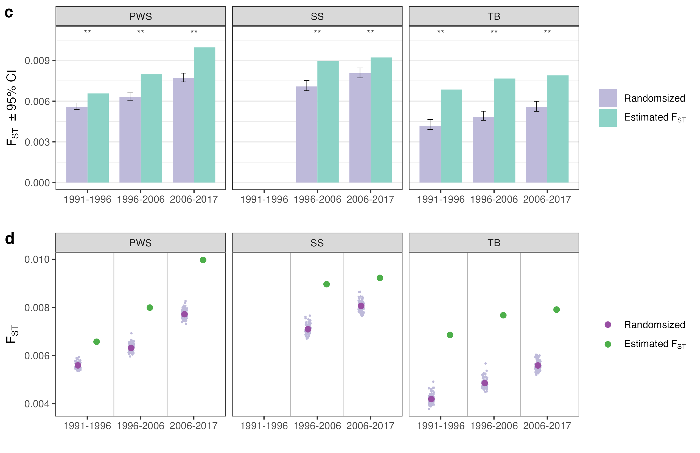

