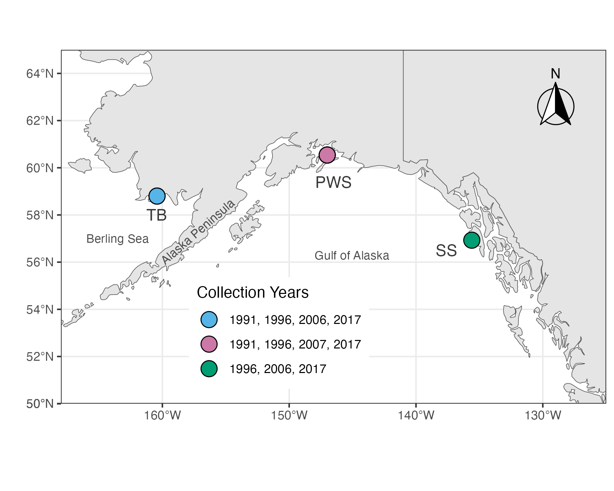

# Load R libraries
```{r eval=FALSE, message=FALSE, warning=FALSE, include=FALSE}
source("BaseScripts.R")
library(ggplot2)
library(tidyverse)
library(reticulate)
library(ggpubr)
library(sf)
library(rnaturalearth)
library(rnaturalearthdata)
library(ggspatial)
library(rgeos)
#library(data.table)
```


# Plot population locations
```{r, message=FALSE, warning=FALSE, fig.width= 10, fig.height= 7,class.source = 'fold-show'}
theme_set(theme_bw())

world <- ne_countries(scale = "medium", returnclass = "sf")
sites<-read.csv("../Data/Sampling_sites_coordinates.csv", row.names = 1)

# Select time-series data only (PWS, SS, and TB populations)

sites2<-sites[sites$population %in% c("PWS","Togiak", "Sitka"),]

sites2$population<-factor(sites2$population, levels=c("Togiak","PWS","Sitka"))
ggplot(data = world) +
  geom_sf() +
  geom_point(data = sites2, aes(x = pop_longitude, y = pop_latitude, fill = population), size = 5, 
             shape = 21) +
  scale_fill_manual(name = "Collection Years",values=cols, labels=c("1991, 1996, 2006, 2017","1991, 1996, 2007, 2017","1996, 2006, 2017"))+
  coord_sf(xlim = c(-168, -125), ylim = c(50, 65), expand = FALSE)+
  xlab("") + ylab("")+
  theme(legend.position = c(0.4, 0.2))+
  annotate(geom = "text", x = -160.45, y = 58, label = "TB", 
           color = "grey22", size = 4)+
  annotate(geom = "text", x = -146.5, y = 59.4, label = "PWS", 
           color = "grey22", size = 4)+
  annotate(geom = "text", x = -137.6, y = 56.5, label = "SS", 
           color = "grey22", size = 4)+
     annotation_north_arrow(location = "tr", which_north = "true", 
        pad_x = unit(0.2, "in"), pad_y = unit(0.2, "in"),
        style = north_arrow_fancy_orienteering)+
   annotate(geom = "text", x = -160, y = 56, label = "Alaska Peninsula", 
           color = "grey30", size = 3, angle=41, hjust=0)+
     annotate(geom = "text", x = -148, y = 56.3, label = "Gulf of Alaska", 
           color = "grey30", size = 3, hjust=0)+
     annotate(geom = "text", x = -166, y = 57, label = "Berling Sea", 
           color = "grey30", size = 3, hjust=0)
ggsave("../Output/Map/PH_timeSeries_map.png", height = 4.8, width = 6,dpi = 300)

```


