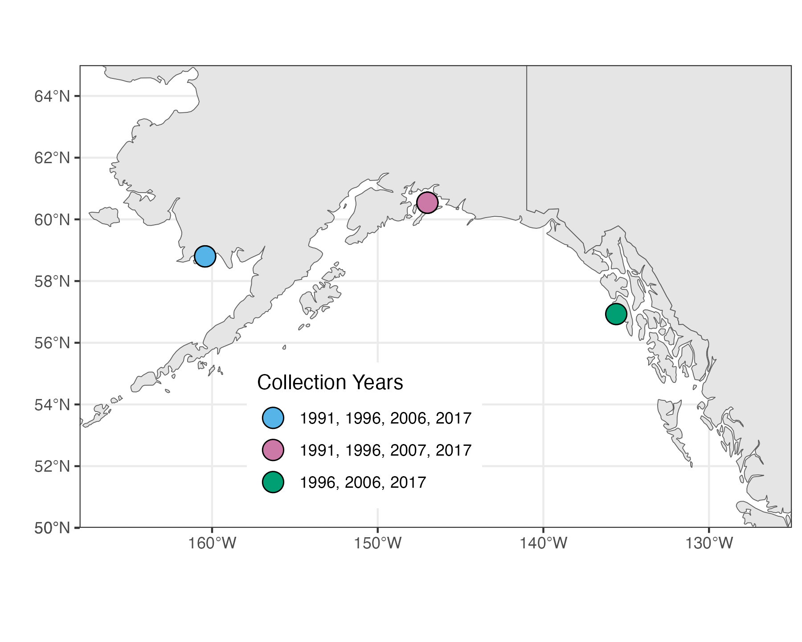
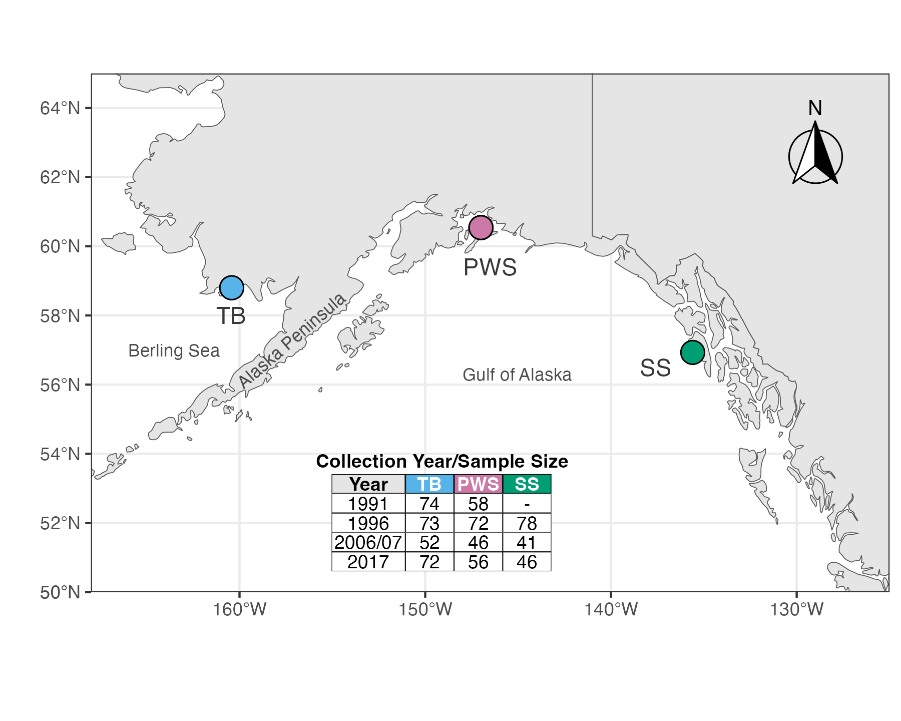

# Load R libraries
```{r eval=FALSE, message=FALSE, warning=FALSE, include=FALSE}
source("BaseScripts.R")
library(ggplot2)
library(tidyverse)
library(reticulate)
library(ggpubr)
library(sf)
library(rnaturalearth)
library(rnaturalearthdata)
library(ggspatial)
#library(rgeos)

#library(data.table)
```


# Plot population locations
```{r, message=FALSE, warning=FALSE, fig.width= 10, fig.height= 7,class.source = 'fold-show'}
theme_set(theme_bw())

world <- ne_countries(scale = "medium", returnclass = "sf")
sites<-read.csv("../Data/Sampling_sites_coordinates.csv", row.names = 1)

# Select time-series data only (PWS, SS, and TB populations)

sites2<-sites[sites$population %in% c("PWS","Togiak", "Sitka"),]

sites2$population<-factor(sites2$population, levels=c("Togiak","PWS","Sitka"))
ggplot(data = world) +
  geom_sf() +
  geom_point(data = sites2, aes(x = pop_longitude, y = pop_latitude, fill = population), size = 5, 
             shape = 21) +
  scale_fill_manual(name = "Collection Years",values=cols, labels=c("1991, 1996, 2006, 2017","1991, 1996, 2007, 2017","1996, 2006, 2017"))+
  coord_sf(xlim = c(-168, -125), ylim = c(50, 65), expand = FALSE)+
  xlab("") + ylab("")+
  theme(legend.position = c(0.4, 0.2))+
  annotate(geom = "text", x = -160.45, y = 58, label = "TB", 
           color = "grey22", size = 4)+
  annotate(geom = "text", x = -146.5, y = 59.4, label = "PWS", 
           color = "grey22", size = 4)+
  annotate(geom = "text", x = -137.6, y = 56.5, label = "SS", 
           color = "grey22", size = 4)+
     annotation_north_arrow(location = "tr", which_north = "true", 
        pad_x = unit(0.2, "in"), pad_y = unit(0.2, "in"),
        style = north_arrow_fancy_orienteering)+
   annotate(geom = "text", x = -160, y = 56, label = "Alaska Peninsula", 
           color = "grey30", size = 3, angle=41, hjust=0)+
     annotate(geom = "text", x = -148, y = 56.3, label = "Gulf of Alaska", 
           color = "grey30", size = 3, hjust=0)+
     annotate(geom = "text", x = -166, y = 57, label = "Berling Sea", 
           color = "grey30", size = 3, hjust=0)
ggsave("../Output/Map/PH_timeSeries_map.png", height = 4.8, width = 6,dpi = 300)

```


```{r, message=FALSE, warning=FALSE,eval=FALSE}
library(gridExtra)  
library(grid)  
library(cowplot) 

p<-ggplot(data = world) +
  geom_sf() +
  geom_point(data = sites2, aes(x = pop_longitude, y = pop_latitude, fill = population), size = 5, 
             shape = 21) +
  coord_sf(xlim = c(-168, -125), ylim = c(50, 65), expand = FALSE)+
  xlab("") + ylab("")+
  scale_fill_manual(name = "Collection Years/Sample Size",values=cols)+
  theme(legend.position = c(0.4, 0.2))+
  annotate(geom = "text", x = -160.45, y = 58, label = "TB", 
           color = "grey22", size = 4)+
  annotate(geom = "text", x = -146.5, y = 59.4, label = "PWS", 
           color = "grey22", size = 4)+
  annotate(geom = "text", x = -137.6, y = 56.5, label = "SS", 
           color = "grey22", size = 4)+
     annotation_north_arrow(location = "tr", which_north = "true", 
        pad_x = unit(0.2, "in"), pad_y = unit(0.2, "in"),
        style = north_arrow_fancy_orienteering)+
   annotate(geom = "text", x = -160, y = 56, label = "Alaska Peninsula", 
           color = "grey30", size = 3, angle=41, hjust=0)+
     annotate(geom = "text", x = -148, y = 56.3, label = "Gulf of Alaska", 
           color = "grey30", size = 3, hjust=0)+
     annotate(geom = "text", x = -166, y = 57, label = "Berling Sea", 
           color = "grey30", size = 3, hjust=0)+
    annotate(geom = "text", x = -155.9, y = 53.8, label = "Collection Year/Sample Size", 
           color = "black", size = 3.2, hjust=0, fontface = "bold")+
    theme(legend.position = "none") 


tab_df <- data.frame(
  Year = c("1991","1996","2006/07","2017"),
  TB = c(74,73,52,72),
  PWS   = c(58,72,46,56),
  SS    = c("-", 78,41,46))

# Header colors per column (Year, TB, PWS, SS)
head_fills <- c("grey90", "#56b4e9", "#cc79a7", "#009e73")
head_text  <- c("black",  "white",   "white",   "white")

tg <- tableGrob(
  tab_df,
  rows = NULL,
  theme = ttheme_default(
    base_size = 9,
    padding = unit(c(1, 1), "mm"),
    core = list(
      fg_params = list(col = "black"),
      # grid lines for ALL data cells; keep them white (no color fill)
      bg_params = list(fill = "white", col = "black", lwd = 0.7)
    ),
    colhead = list(
      fg_params = list(fontface = "bold", col = head_text),
      # ✅ colors ONLY in the header row
      bg_params = list(fill = head_fills, col = "black", lwd = 0.9)
    )
  )
)
maxw <- grid::unit.pmax(tg$widths[2], tg$widths[3], tg$widths[4])
tg$widths[2] <- maxw
tg$widths[3] <- maxw
tg$widths[4] <- maxw
tg$widths[2:4] <- maxw


# ---- Inset into ggplot ----
ggdraw(p) +
  draw_grob(tg, x = 0.3, y = 0.11, width = 0.38, height = 0.33)

ggsave("../Output/Map/PH_timeSeries_map2.png", height = 4.8, width = 6,dpi = 300)

```

