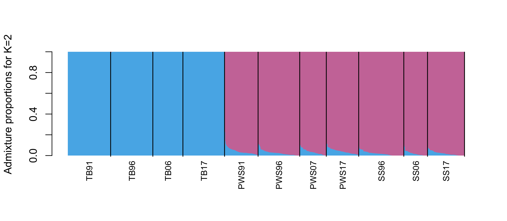

# Run PCAnsgd for PWS populations 
Using the 'PWSonly' sites (~770k snps) 
Running PCAngsd requires several steps
```{r eval=FALSE, message=FALSE, warning=FALSE, include=FALSE}
source("BaseScripts.R")
library(dplyr)
library(cowplot)
library(knitr)
library(kableExtra)
library(data.table)
library(ggpubr)
gcols<-c('#ffffb3','#8dd3c7','#bebada')
```

## Analysis Steps
### Prune SNPs: Using Plink to prune highly linked snps  
* Need to reformat the output (xxx.prune.in) file to subset a vcf file (rather than using it for  pruing a ped/bed file) 
```{bash eval=FALSE, echo=TRUE}
# vcf files not in the repository are available at: OSF Storage: https://osf.io/wrca4 Data/vcf/


#first create ped/bed files with adding variant id
#add variant id & create ped/bed files
plink --vcf Data/vcf/3pops.MD2000_new.maf05.vcf.gz --set-missing-var-ids @:#[ph]\\$r,\\$a --make-bed --out Data/new_vcf/MD3000/3pops_newMD2000_maf05

plink --bfile Data/vcf/3pops_newMD2000_maf05 --recode --tab --out Data/vcf/3pops_newMD2000_maf05

#find highly correlated sites for pruning
plink --file Data/vcf/3pops_newMD2000_maf05 --indep-pairwise 75'kb' 5 0.5 --out Data/new_vcf/MD3000/3pops_newMD2000_maf05_75_5_0.5_pruned

```


* Reformat the prune.in file
```{r eval=FALSE, message=FALSE, warning=FALSE}
#Reformat prun.in file with running the reformat_prunin.R
source("reformat_prunin.R")
reformat_prunin("../Data/vcf/3pops_newMD2000_maf05_75_5_0.5_pruned.prune.in")

#Output in ../Data/vcf/3pops_newMD2000_maf05_75_5_0.5_pruned.prune.in.sites.txt
```

### Using bcftools to subset the VCF file using prune.in file

### Convert VCF to the beagle format and run PCAnsgd

```{bash eval=FALSE, echo=TRUE}
#create vcf files with only prune.in sites

bcftools view -R Data/vcf/3pops_newMD2000_maf05_75_5_0.5_pruned.prune.in.sites.txt Data/vcf/3pops.MD2000_new.maf05.vcf.gz > Data/vcf/3pops_MD2000_maf05_pruned.vcf

bgzip /Data/vcf/3pops_MD2000_maf05_pruned.vcf

#Create beagle files (at farm: create_beagle.sh) - same scripts to obtain allele frequency can output beagle files as well (calulateAF_xx.sh)
#  angsd -GL -doGlf 2

angsd -out /home/ktist/ph/data/new_vcf/MD3000/3pops_MD2000_maf05 -fai /home/jamcgirr/ph/data/c_harengus/c.harengus.fa.fai -doGlf 2 -doMaf 3 -doMajorMinor 4 -doPost 1 -doGeno 2 -vcf-pl /home/ktist/ph/data/new_vcf/MD7000/3pops/3pops_PWS91_maf05.vcf.gz -ref /home/jamcgirr/ph/data/c_harengus/c.harengus.fa 

# Reformat the prune.in file
```

### Craete a slurm script file to create beagle files  
```{r eval=FALSE, message=FALSE, warning=FALSE}

sink(paste0("../Data/Slurmscripts/create_beagle.sh"))
cat("#!/bin/bash -l\n")
cat(paste0("#SBATCH --job-name=beagle \n"))
cat(paste0("#SBATCH --mem=16G \n")) 
cat(paste0("#SBATCH --ntasks=8 \n"))
cat(paste0("#SBATCH --nodes=4 \n"))
cat(paste0("#SBATCH -e =beagle.err  \n"))
cat(paste0("#SBATCH --time=72:00:00  \n"))
cat(paste0("#SBATCH -p high  \n"))
cat("\n\n")
cat("module load vcftools")     
cat("\n\n")
    
for (i in 1:26){
    cat(paste0("vcftools --gzvcf /home/ktist/ph/data/new_vcf/MD3000/3pops_MD2000_maf05_pruned.vcf.gz  --chr chr",i))
    cat(paste0(" --out /home/ktist/ph/data/new_vcf/MD3000/beagle/3pops_MD2000_pruned_c",i," --BEAGLE-PL \n"))
}

cat("\n")

#remove the head line and cat beagle files
for (i in 2:26){
    cat(paste0("sed -e '1, 1d' < /home/ktist/ph/data/new_vcf/MD3000/beagle/3pops_MD2000_pruned_c",i,".BEAGLE.PL > /home/ktist/ph/data/new_vcf/MD3000/beagle/3pops_MD2000_pruned_c",i,".2.BEAGLE.PL \n"))
}
cat("\n")

cat("cat /home/ktist/ph/data/new_vcf/MD3000/beagle/3pops_MD2000_pruned_c1.BEAGLE.PL ") 
for (i in 2:26){
    cat(paste0("/home/ktist/ph/data/new_vcf/MD3000/beagle/3pops_MD2000_pruned_c",i,".2.BEAGLE.PL "))
}
cat(paste0(" > /home/ktist/ph/data/new_vcf/MD3000/beagle/3pops_MD2000_pruned_BEAGLE.PL \n"))
cat("gzip /home/ktist/ph/data/new_vcf/MD3000/beagle/3pops_MD2000_pruned_BEAGLE.PL \n\n")

sink(NULL)
```

### Craete a slurm script file to run pcansgd  
```{r eval=FALSE, message=FALSE, warning=FALSE}

# Run PCAangsd for the entire chromosomes and each chromosome
sink(paste0("../Data/Slurmscripts/runPCAnsgd.sh"))
cat("#!/bin/bash -l\n")
cat(paste0("#SBATCH --job-name=PCAnsgd \n"))
cat(paste0("#SBATCH --mem=16G \n")) 
cat(paste0("#SBATCH --ntasks=8 \n"))
cat(paste0("#SBATCH --nodes=4 \n"))
cat(paste0("#SBATCH -e PCAnsgd.err  \n"))
cat(paste0("#SBATCH --time=72:00:00  \n"))
cat(paste0("#SBATCH -p high  \n"))
cat("\n\n")
cat("module load angsd \n")     
cat("module load deprecated/python \n")     
cat("module load deprecated/pcangsd")     
cat("\n\n")
    
cat("python /home/jamcgirr/apps/pcangsd/pcangsd.py -b /home/ktist/ph/data/new_vcf/MD3000/beagle/3pops_MD2000_pruned_BEAGLE.PL.gz -o /home/ktist/ph/data/angsd/PCAngsd/3pops_MD2000 -threads 16 \n")
sink(NULL)


# run each chromosome separately 
sink(paste0("../Data/Slurmscripts/runPCAnsgd_byChromosome.sh"))
cat("#!/bin/bash -l\n")
cat(paste0("#SBATCH --job-name=PCAnsgdC \n"))
cat(paste0("#SBATCH --mem=16G \n")) 
cat(paste0("#SBATCH --ntasks=8 \n"))
cat(paste0("#SBATCH --nodes=4 \n"))
cat(paste0("#SBATCH -e PCAnsgdbyChrom.err  \n"))
cat(paste0("#SBATCH --time=72:00:00  \n"))
cat(paste0("#SBATCH -p high  \n"))
cat("\n\n")
cat("module load angsd \n")     
cat("module load deprecated/python \n")     
cat("module load deprecated/pcangsd")     
cat("\n\n")

for(i in 1:26){
    cat(paste0("python /home/jamcgirr/apps/pcangsd/pcangsd.py -beagle /home/ktist/ph/data/new_vcf/MD3000/beagle/3pops_MD2000_pruned_c",i,".BEAGLE.PL.gz -o /home/ktist/ph/data/angsd/PCAngsd/3pops_MD2000_c",i," -threads 24 \n"))
}

sink(NULL)

```


# Results of PCAngsd 
## All chromosomes  
```{r eval=FALSE, message=FALSE, warning=FALSE}
pop_info<-read.csv("../Data/Sample_metadata_892pops.csv")
pop_info<-pop_info[,c("Sample","Population.Year","pop","Year.Collected")]
colnames(pop_info)[4]<-"year"
pops<-unique(pop_info$Population.Year[grep("PWS|SS|TB",pop_info$Population.Year)])
pop3<-pop_info[pop_info$Population.Year %in% pops,]

pop3$year[pop3$year==2007|pop3$year==2006]<-"2006/2007"
pop3$year<-factor(pop3$year, levels=c(1991, 1996, "2006/2007", 2017))

C <- as.matrix(read.table(paste0("../Data/PCAangsd/3pops_MD2000.cov")))
e <- eigen(C)
pca <-data.frame(Sample=pop3$Sample, 
                 pop= pop3$pop,
                 year=pop3$year,
                 PC1=e$vectors[,1],PC2=e$vectors[,2],
                 PC3=e$vectors[,3],PC4=e$vectors[,4],
                 PC5=e$vectors[,5],PC6=e$vectors[,6],
                 PC7=e$vectors[,7],PC8=e$vectors[,8],
                 stringsAsFactors=FALSE)

prop_explained <- c()
for (s in e$values[1:10]) {
    #print(s / sum(e$values))
    prop_explained <- c(prop_explained,round(((s / sum(e$values))*100),2))
}
pca$pop<-factor(pca$pop, levels=c("PWS","SS","TB"))

ggplot()+
    geom_point(data = pca, aes(x = PC1, y = PC2, fill = pop, color = pop, shape=year), size = 1.8)+
    scale_fill_manual(values=paste0(cols[c(2,3,1)],"4D"), guide="none")+
    scale_color_manual(values=cols[c(2,3,1)], name="Population")+
    xlab(paste("PC 1: ", prop_explained[1],"%\n",sep = ""))+
    ylab(paste("PC 2: ", prop_explained[2],"%\n",sep = ""))+
    theme_bw()+
    scale_shape_manual(values=c(23,25,3,21), name="Year")
ggsave("../Output/PCA/3pop_allChromosomes.png", height = 3.8, width = 5.2, dpi=300)

```


## Each chromosome separately  
```{r eval=FALSE, message=FALSE, warning=FALSE}

Plots<-list()
chr<-paste0("c", c(1:26))
for (i in 1:length(chr)){
    C <- as.matrix(read.table(paste0("../Data/PCAangsd/3pops_MD2000_",chr[i],".cov")))
    e <- eigen(C)
    pca <-data.frame(Sample=pop3$Sample, 
                     pop=pop3$pop,
                     year=pop3$year,
                     PC1=e$vectors[,1],PC2=e$vectors[,2],
                     PC3=e$vectors[,3],PC4=e$vectors[,4],
                     PC5=e$vectors[,5],PC6=e$vectors[,6],
                     PC7=e$vectors[,7],PC8=e$vectors[,8],
                     stringsAsFactors=FALSE)
    
    prop_explained <- c()
    for (s in e$values[1:10]) {
        prop_explained <- c(prop_explained,round(((s / sum(e$values))*100),2))
    }
    Plots[[i]]<-ggplot()+
                    geom_point(data = pca, aes(x = PC1, y = PC2, fill = pop, color = pop, shape=year), size = 2.5)+
                    scale_fill_manual(values=paste0(cols[c(2,3,1)],"4D"), guide="none")+
                    scale_color_manual(values=cols[c(2,3,1)], name="Population")+
                    xlab(paste("PC 1: ", prop_explained[1],"%\n",sep = ""))+
                    ylab(paste("PC 2: ", prop_explained[2],"%\n",sep = ""))+
                    theme_bw()+
                    scale_shape_manual(values=c(23,25,3,21), name="Year")+
                    ggtitle(paste0("Chr",i))+theme(legend.position = "none")
}
g <- arrangeGrob(do.call(grid.arrange, c(Plots, ncol=5)))
ggsave(g, file="../Output/PCA/3pops_MD2000_PCA_byChromosome.png",width = 35, height = 30)

{pdf("../Output/PCA/3pops_MD2000_PCA_byChromosome.pdf",width = 30, height = 30)
do.call(grid.arrange, c(Plots, ncol=5))
dev.off()
}

# Plot legends
   p<-ggplot()+
        geom_point(data = pca, aes(x = PC1, y = PC2, fill = pop, color = pop, shape=year), size = 2.5)+
        scale_fill_manual(values=paste0(cols[c(2,3,1)],"4D"), guide="none")+
        scale_color_manual(values=cols[c(2,3,1)], name="Population")+
        xlab(paste("PC 1: ", prop_explained[1],"%\n",sep = ""))+
        ylab(paste("PC 2: ", prop_explained[2],"%\n",sep = ""))+
        theme_bw()+
        scale_shape_manual(values=c(23,25,3,21), name="Year")+
        ggtitle(paste0("Chr",i))

as_ggplot(get_legend(p))
ggsave("../Output/PCA/3pops_MD2000_PCA_byChromosome_legend.png",width = 1.5, height = 5)

```


## Color by Year  
```{r eval=FALSE, message=FALSE, warning=FALSE}

ycols<-c("#f2f0f7","#cbc9e2","#9e9ac8","#6a51a3")

Plots<-list()
chr<-paste0("c", c(1:26))
for (i in 1:length(chr)){
    C <- as.matrix(read.table(paste0("../Data/PCAangsd/3pops_MD2000_",chr[i],".cov")))
    e <- eigen(C)
    pca <-data.frame(Sample=pop3$Sample, 
                     pop=pop3$pop,
                     year=pop3$year,
                     PC1=e$vectors[,1],PC2=e$vectors[,2],
                     PC3=e$vectors[,3],PC4=e$vectors[,4],
                     PC5=e$vectors[,5],PC6=e$vectors[,6],
                     PC7=e$vectors[,7],PC8=e$vectors[,8],
                     stringsAsFactors=FALSE)
    
    prop_explained <- c()
    for (s in e$values[1:10]) {
        prop_explained <- c(prop_explained,round(((s / sum(e$values))*100),2))
    }
    
    Plots[[i]]<-ggplot()+
                    geom_point(data = pca, aes(x = PC1, y = PC2, fill = year, color = year, shape=pop), size = 2.5)+
                    scale_fill_manual(values=paste0(ycols,"4D"), guide="none")+
                    scale_color_manual(values=ycols, name="Year")+
                    xlab(paste("PC 1: ", prop_explained[1],"%\n",sep = ""))+
                    ylab(paste("PC 2: ", prop_explained[2],"%\n",sep = ""))+
                    theme_bw()+
                    scale_shape_manual(values=c(16,17,15), name="Population")+
                    ggtitle(paste0("Chr",i))+theme(legend.position = "none")
}

{pdf("../Output/PCA/3pops_MD2000_PCA_byChromosome_byYear_nolegends.pdf",width = 30, height = 30)
do.call(grid.arrange, c(Plots, ncol=5))
dev.off()
}

g <- arrangeGrob(do.call(grid.arrange, c(Plots, ncol=4)))
ggsave(g, file="../Output/PCA/3pops_MD2000_PCA_byChromosome_byYear.png",width = 35, height = 40)


# Save the legend
    p<-ggplot()+
            geom_point(data = pca, aes(x = PC1, y = PC2, fill = year, color = year, shape=pop), size = 2.5)+
            scale_fill_manual(values=paste0(ycols,"4D"), guide="none")+
            scale_color_manual(values=ycols, name="Year")+
            xlab(paste("PC 1: ", prop_explained[1],"%\n",sep = ""))+
            ylab(paste("PC 2: ", prop_explained[2],"%\n",sep = ""))+
            theme_bw()+
            scale_shape_manual(values=c(16,17,15), name="Population")+
            ggtitle(paste0("Chr",i))
as_ggplot(get_legend(p))
ggsave("../Output/PCA/3pops_MD2000_PCA_byChromosome_byYear_legend.png",width = 1.5, height = 5)


```


<br>
<br>
<br>

# PCAnsgd Selection scan
## File preps and running PCAngsd  
```{r eval=FALSE, message=FALSE, warning=FALSE}
#Divide the BEAGLE.PL file into each population

# BEAGLE.PL.gz files available upon request
bea<-fread("../Data/vcf/MD2000/3pops_MD2000_pruned_BEAGLE.PL.gz") 
pop_info<-read.csv("../Data/Sample_metadata_892pops.csv")
pop_info<-pop_info[,c("Sample","Population.Year","pop","Year.Collected")]
colnames(pop_info)[4]<-"year"
pops<-unique(pop_info$Population.Year[grep("PWS|SS|TB",pop_info$Population.Year)])


# for each populations
pops3<-c("PWS","TB","SS")
for (i in 1:length(pops3)){
    colums<-grep(pops3[i], colnames(bea))
    vec<-c(1:3, colums)
    df<-bea[,..vec]
    write.table(df, file=gzfile(paste0("../Data/vcf/MD2000/", pops3[i],"_MD2000_pruned.BEAGLE.PL.gz")), sep="\t", quote = F, row.names = FALSE )
}


y1<-c("PWS07","PWS17","PWS91","PWS96")
comb1<-t(combn(y1, 2))
y2<-c("TB06","TB17","TB91","TB96")
comb2<-t(combn(y2, 2))
y3<-c("SS06","SS17","SS96")
comb3<-t(combn(y3, 2))
comb4<-data.frame(V1=c("PWS07","PWS17","PWS91","PWS96","PWS07","PWS17","PWS96","SS06","SS17","SS96"), V2=c("TB06","TB17","TB91","TB96","SS06","SS17","SS96","TB06","TB17","TB96"))
comb<-rbind(comb1,comb2,comb3, comb4)

for (i in 3:nrow(comb)){
    pop1<-comb[i,1]
    pop2<-comb[i,2]
    col1<-grep(pop1, colnames(bea))
    col2<-grep(pop2, colnames(bea))
    vec<-c(1:3, col1, col2)
    df<-bea[,..vec]
    write.table(df, file=gzfile(paste0("../Data/vcf/MD2000/", pop1,"_",pop2,"_MD2000_pruned.BEAGLE.PL.gz")), sep="\t", quote = F, row.names = FALSE )
}


# Create slurm scripts
bfiles<-list.files("../Data/new_vcf/MD2000/", pattern="BEAGLE.PL.gz")

sink("../Data/Slurmscripts/pcansgd_selection_md2000.sh")
cat("#!/bin/bash -l")
cat("\n")
cat(paste0("#SBATCH --job-name=selection \n"))
cat(paste0("#SBATCH --mem=24G \n")) 
cat(paste0("#SBATCH --ntasks=8 \n")) 
cat(paste0("#SBATCH --nodes=4  \n")) 
cat(paste0("#SBATCH -e selection.err  \n"))
cat(paste0("#SBATCH --time=144:00:00  \n"))
#cat(paste0("#SBATCH --mail-user=ktist@ucdavis.edu ##email you when job starts,ends,etc \n"))
#cat(paste0("#SBATCH --mail-type=ALL \n"))
cat(paste0("#SBATCH -p high  \n"))
cat("\n")
cat("module load angsd
module load deprecated/python
module load deprecated/pcangsd")
cat("\n\n")

for (i in 1:length(bfiles)){
  fname<-gsub("_MD2000_pruned.BEAGLE.PL.gz",'', bfiles[i])
  cat(paste0("python /home/jamcgirr/apps/pcangsd/pcangsd.py -beagle /home/ktist/ph/data/new_vcf/MD3000/beagle/",bfiles[i]," -o /home/ktist/ph/data/angsd/selection/",fname,"_selection -selection -sites_save \n"))
}

sink(NULL)

#(ran pcansgd_selection_md2000.sh, pcansgd_selection_md2000_1.sh, pcansgd_selection_md2000_2.sh at Farm on 6/28/23)
```


## Plot the results of each population 
```{r eval=FALSE, message=FALSE, warning=FALSE}
# Selection scan results are available at: OSF Storage: https://osf.io/wrca4 Data/PCAngsd/selection/

pop_info<-read.csv("../Data/Sample_metadata_892pops.csv")
pop_info<-pop_info[,c("Sample","pop","Year.Collected")]
colnames(pop_info)[3]<-"year"


#######
### Selection ###
library(RcppCNPy) # Numpy library for R

## function for QQplot
qqchi<-function(x,...){
    lambda<-round(median(x)/qchisq(0.5,1),2)
    qqplot(qchisq((1:length(x)-0.5)/(length(x)),1),x,ylab="Observed",xlab="Expected",...);abline(0,1,col=2,lwd=2)
    legend("topleft",paste("lambda=",lambda))
}

### read in seleciton statistics (chi2 distributed)
# Each column reflect the selection statistics along a tested PC (they are χ²-distributed with 1 degree of freedom.)
s<-npyLoad("../Data/PCAangsd/selection/PWS_selection.selection.npy")

## make QQ plot to QC the test statistics
qqchi(s)
ncol(s)

## read positions 
p<-read.table("../Data/PCAangsd/selection/PWS_selection.sites",colC=c("factor","integer"),sep=":")
names(p)<-c("chr","pos")


# 1. 1 axis:
#convert test statistic to p-value
p$pval<-1-pchisq(s,1)
p$loc<-1:nrow(p)
p$pval.log<--log10(p$pval)

## make manhatten plot
plot(-log10(p$pval),col=p$chr,xlab="Chromosomes",main="Manhattan plot", pch=".")

# 2. if more than 1 axis (ncol(s)>1)
# p$pval1<-pval[,1]
# p$pval2<-pval[,2]
# p$loc<-1:nrow(p)
# p$pval1.log<--log10(p$pval1)
# p$pval2.log<--log10(p$pval2)

## make Manhattan plots
pops1<-c("PWS","SS","TB")
evens<-paste0("chr",seq(2,26, by=2))

for (i in 1:length(pops1)){
    s<-npyLoad(paste0("../Data/PCAangsd/selection/",pops1[i],"_selection.selection.npy"))
    p<-read.table(paste0("../Data/PCAangsd/selection/",pops1[i],"_selection.sites"),colC=c("factor","integer"),sep=":")
    names(p)<-c("chr","pos")

    n<-ncol(s)
    if (n==1){
        p$pval<-1-pchisq(s,1)
        p$loc<-1:nrow(p)
        p$pval.log<--log10(p$pval)
    }
    #count the number of sites per chromosomes
    poss<-data.frame(chr=paste0("chr",1:26))
    k=1
    for (j in 1:26){
        df<-p[p$chr==paste0("chr",j),]
        poss$start[j]<-k
        poss$end[j]<-k+nrow(df)-1
        k=k+nrow(df)
    }
    poss$x<-poss$start+(poss$end-poss$start)/2

    p$color<-"steelblue"
    p$color[p$chr %in% evens]<-"lightblue"
    ggplot(data=p, aes(x=loc, y=pval.log, color=color))+
        geom_point(size=0.1)+
        scale_color_manual(values=c("lightblue","steelblue"), guide='none')+
        scale_x_continuous(name="Chromosome position", breaks=poss$x, labels=1:26)+
        theme_classic()+ylab("-log10(p-value)")+
        ggtitle(pops1[i])
    ggsave(paste0("../Output/PCA/selection_MD2000/",pops1[i],"_selection_scan.png"), width=8, height=4,dpi=300)
           
}

# -log10(0.05) = 1.30103
# -log10(0.05/232644) #6.667722
###  Significant p-value for 232,644 loci is 6.67  ###


```


* NO sites above 6.7

## Plot results of pariwise comparison
```{r eval=FALSE, message=FALSE, warning=FALSE}
y1<-c("PWS07","PWS17","PWS91","PWS96")
comb1<-t(combn(y1, 2))
y2<-c("TB06","TB17","TB91","TB96")
comb2<-t(combn(y2, 2))
y3<-c("SS06","SS17","SS96")
comb3<-t(combn(y3, 2))
comb<-rbind(comb1, comb2, comb3)

evens<-paste0("chr",seq(2,26, by=2))

for (i in 1:nrow(comb)){
    pop1<-comb[i,1]
    pop2<-comb[i,2]
    s<-npyLoad(paste0("../Data/PCAangsd/selection/",pop1, "_",pop2,"_selection.selection.npy"))
    p<-read.table(paste0("../Data/PCAangsd/selection/",pop1, "_",pop2,"_selection.sites"),colC=c("factor","integer"),sep=":")
    names(p)<-c("chr","pos")

    n<-ncol(s)
    if (n==1){
        p$pval<-1-pchisq(s,1)
        p$loc<-1:nrow(p)
        p$pval.log<--log10(p$pval)
    }
    if (n>1){
        p$pval<-pval[,1]
        p$loc<-1:nrow(p)
        p$pval.log<--log10(p$pval)
    }
    #count the number of sites per chromosomes
    poss<-data.frame(chr=paste0("chr",1:26))
    k=1
    for (j in 1:26){
        df<-p[p$chr==paste0("chr",j),]
        poss$start[j]<-k
        poss$end[j]<-k+nrow(df)-1
        k=k+nrow(df)
    }
    poss$x<-poss$start+(poss$end-poss$start)/2

    p$color<-"steelblue"
    p$color[p$chr %in% evens]<-"lightblue"
    ggplot(data=p, aes(x=loc, y=pval.log, color=color))+
        geom_point(size=0.1)+
        scale_color_manual(values=c("lightblue","steelblue"), guide='none')+
        scale_x_continuous(name="Chromosome position", breaks=poss$x, labels=1:26)+
        theme_classic()+ylab("-log10(p-value)")+
        ggtitle(paste0(pop1, " - ", pop2))
    ggsave(paste0("../Output/PCA/selection_MD2000/",pop1, "_",pop2,"_selection_scan.png"), width=8, height=4,dpi=300)
}
```


<br>
<br>
<br>

# NGSadmix

## Run NGSadmix (at Farm or locally)
* NGSadmix_md2000_1.sh,NGSadmix_md2000_2.sh,NGSadmix_md2000_3.sh


## Run CLUMPAL to find best K
* (The best K =3)

### Compile all likelihood numbers from log files into 1 (logfile)

```{bash eval=FALSE}
#linux code (won't work with unix)
(for log in `ls *.log`; do grep -oP '3pops_pruned_maf05_\K[^ ]+|like=\K[^ ]+' $log; done) > 3pops_logfile_k3
(for log in `ls *.log`; do grep -oP '3pps_pruned_maf05_\K[^ ]+|like=\K[^ ]+' $log; done) > 3pops_logfile_k2
(for log in `ls *.log`; do grep -oP '3pops_pruned_maf05_\K[^ ]+|like=\K[^ ]+' $log; done) > 3pops_logfile_k4
```

## Read 'logfile' & create an input file for Clumpak
* http://clumpak.tau.ac.il/bestK.html  
* Upload the log probability table file to the website and submit the form

```{r eval=FALSE, message=FALSE, warning=FALSE}
log2<-read.table("../Data/ngsadmix/3pops_logfile_k2", sep="\t", header =FALSE)
log3<-read.table("../Data/ngsadmix/3pops_logfile_k3", sep="\t", header =FALSE)
log4<-read.table("../Data/ngsadmix/3pops_logfile_k4", sep="\t", header =FALSE)
log4<-data.frame(log4[c(FALSE,TRUE),])

logs<-data.frame(K=c(rep(2, times=10),rep(3, times=10),rep(4, times=10)), Liklihood=c(log2$V1,log3$V1, log4))
write.table(logs, "../Output/ngsadmix/3popslogs.txt", sep="\t", row.names = F, col.names = F, quote=F)
# DO NOT use special character in the file name
# Must have at least three K values

# upload the logs.txt to Clumpak website
# http://clumpak.tau.ac.il

#'Estimating the Best K (from Clumpak)'
#Wed Jul  5 20:15:52 2023: Ln'(3) = 277336.622395895
#Wed Jul  5 20:15:52 2023: Ln'(4) = 264322.030625194
#Wed Jul  5 20:15:52 2023: |Ln''(K=3)| = 13014.5917707011
#Wed Jul  5 20:15:52 2023: Delta(K=3) = 130.085671688741
#Wed Jul  5 20:15:52 2023: Max Delta K: 130.085671688741
#Wed Jul  5 20:15:52 2023: Optimal K by Evanno is: 3
#Wed Jul  5 20:15:56 2023: Using median values of Ln Prob of Data to calculate Prob(K=k):
#Wed Jul  5 20:15:56 2023: Prob(K=2) = 0
#Wed Jul  5 20:15:56 2023: Prob(K=3) = 0
#Wed Jul  5 20:15:56 2023: Prob(K=4) = 1
#Wed Jul  5 20:15:56 2023: Max Probability: 1
#Wed Jul  5 20:15:56 2023: The k for which Prob(K=k) obtains the highest value is: 4
#
#
#
```


* 2 makes more sense than 3 but the reuslts chose "K=3" as the best


## Run evalAdmix
```{r eval=FALSE, message=FALSE, warning=FALSE}

#Create bash scripts to run locally
sink("../Data/Slurmscripts/evalAdmix_runlocal.sh")
cat("#!/bin/bash\n\n")

for (i in 2:3){
    cat("evalAdmix -beagle Data/new_vcf/MD2000/beagle/3pops_MD2000_pruned_BEAGLE.PL.gz ")
    cat(paste0("-fname Data/ngsadmix/3pops_pruned_maf05_k",i,"_run1.fopt.gz "))
    cat(paste0("-qname Data/ngsadmix/3pops_pruned_maf05_k",i,"_run1.qopt "))
    cat("-P 10 ")
    cat(paste0("-o Data/ngsadmix/evaladmix/output.corres.k",i,".txt\n"))
}
sink(NULL)

```


# Plot results

```{r eval=FALSE, message=FALSE, warning=FALSE}
source("visFuns.R")

#Output files
qfiles<-list.files("../Data/ngsadmix/",pattern="_run1.qopt")
ofiles<-list.files("../Data/ngsadmix/evaladmix/",pattern="output.corres")

#population info
pop<-read.csv("../Data/Sample_metadata_892pops.csv")
pop<-pop[grep("PWS|SS|TB", pop$pop),]
pop$Population.Year<-factor(pop$Population.Year, levels=c("TB91","TB96","TB06","TB17","PWS91","PWS96","PWS07","PWS17","SS96","SS06","SS17"))
poporder<-paste(pop$Population.Year[order(pop$Population.Year)])
pop_order<-c("TB91","TB96","TB06","TB17","PWS91","PWS96","PWS07","PWS17","SS96","SS06","SS17")

for (i in 1:length(qfiles)){
    # extract K from the file name
    if (i!=3) {
        oname<-ofiles[i]
        k<-gsub("[^0-9.]", "", ofiles[i])
        k<-as.integer(gsub("\\.",'',k))
    }
    if (i==3) k=3
    
    #read the qopt file for k=k
    q<-read.table(paste0("../Data/ngsadmix/", qfiles[i]))
    
    #order according to population and plot the NGSadmix results
    q$id<-pop$Population.Year
    q<-q[order(q$id),]
    
    ord<-orderInds(pop = as.vector(poporder), q = q[,1:(i+1)])
    
    xlabels<-data.frame(x=tapply(1:length(poporder),list(poporder), mean))
    xlabels$pop<-factor(rownames(xlabels), levels=pop_order)
    xlabels<-xlabels[order(xlabels$pop),]
    
    #color assignment
    if (i==1) colors=cols[c(1,2)]
    if (i==2) colors=cols[c(1,6,2) ]
    if (i==3) colors=cols[c(1,6,2,3) ]

    {png(paste0("../Output/ngsadmix/3pops_Admix_plot_k",k,".png"), height = 3.5, width=8, unit="in", res=300)
    barplot(t(q[,1:(i+2)])[,ord],col=colors,space=0,border=NA,xaxt="n",xlab="",ylab=paste0("Admixture proportions for K=",k))
    text(xlabels$x,-0.05,xlabels$pop,xpd=T, srt=90, adj=1,cex=0.8)
    abline(v=cumsum(sapply(unique(poporder[ord]),function(x){sum(pop[ord,"Population.Year"]==x)})),col=1,lwd=1.2)
    dev.off()}
    
    #Plot the correlation matrix from evalAdmix
    if (i!=3) {
        r<-read.table(paste0("../Data/ngsadmix/evaladmix/",ofiles[i]))
    
    # Plot correlation of residuals
    {pdf(paste0("../Output/ngsadmix/3pops_evalAdmix_corplot_k",k,".pdf"), height = 8, width=10)
    plotCorRes(cor_mat = r, pop = as.vector(pop[,"Population.Year"]), ord = ord, title=paste0("Evaluation of admixture proportions with K=",k), max_z=0.1, min_z=-0.1)
    dev.off()}
    }
}
```



```{r eval=FALSE, message=FALSE, warning=FALSE}
# plot all 10 replicates for k=3
qfiles<-list.files("../Data/ngsadmix/",pattern="^3pops_pruned_maf05_k3+.*.qopt")
for (i in 2:10){
    q<-read.table(paste0("../Data/ngsadmix/", qfiles[i]))
    
    #order according to population and plot the NGSadmix results
    q$id<-pop$Population.Year
    q<-q[order(q$id),]
    
    ord<-orderInds(pop = as.vector(poporder), q = q[,1:3])
    
    xlabels<-data.frame(x=tapply(1:length(poporder),list(poporder), mean))
    xlabels$pop<-factor(rownames(xlabels), levels=pop_order)
    xlabels<-xlabels[order(xlabels$pop),]
    
    #color assignment
    colors=cols[c(1,6,2)]
    
    {png(paste0("../Output/ngsadmix/3pops_Admix_k3_rep",i,".png"), height = 3.5, width=8, unit="in", res=300)
    barplot(t(q[,1:3])[,ord],col=colors,space=0,border=NA,xaxt="n",xlab="",ylab=paste0("Admixture proportions for K=",k), main=paste0("rep",i))
    text(xlabels$x,-0.05,xlabels$pop,xpd=T, srt=90, adj=1,cex=0.8)
    abline(v=cumsum(sapply(unique(poporder[ord]),function(x){sum(pop[ord,"Population.Year"]==x)})),col=1,lwd=1.2)
    dev.off()}
}

```

