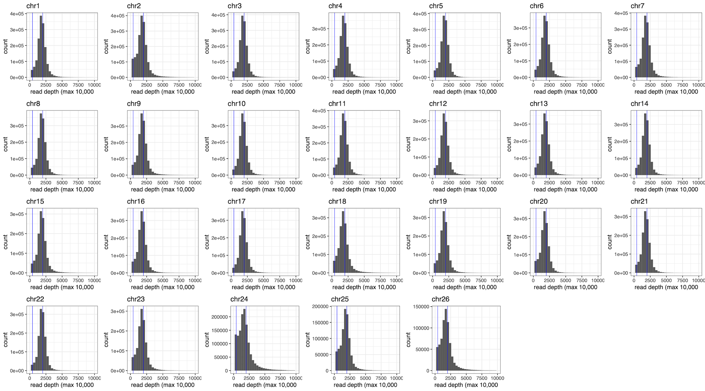

```{r eval=FALSE, message=FALSE, warning=FALSE, include=FALSE}
source("BaseScripts.R")
library(windowscanr)
library(gridExtra)
```


# Check the mean coverage (depth) of the dataset

* Create depth summary files from picard metrics & calculate the average depth
```{r eval=FALSE, message=FALSE, warning=FALSE}
# Read the metadata file
pops<-read.csv("../Data/Sample_metadata_3pops.csv")

## Read picard metrics output files 
# The files are available at https://osf.io/3cmkr/files/osfstorage/ph/familiarize/multiqc_data/wgsMetrics

## How "BamMetrics_summay.csv was created ##
wgs<-data.frame()
for (i in 1: nrow(pops)){
    id<-pops$Sample[i]
    df<-read.table(paste0("/Volumes/Kaho_Data/PacHerring/Data/QC/wgsMetrics/",id,".collect_wgs_metrics.txt"),header = TRUE, stringsAsFactors = FALSE, nrow= 1)
    df$Sample<-id
    wgs<-rbind(wgs, df)
}

popinfo<-pops[,c("Sample","Population.Year","pop","Year.Collected")]

bam_summary<-merge(popinfo, wgs, by="Sample")

byPopYr<-aggregate(bam_summary$MEAN_COVERAGE, by=list(bam_summary$Population.Year), mean)
write.csv(byPopYr, "../Output/QC/Bam_metrics_average_depths.csv",, row.names = F)

bam_summary$Population.Year<-factor(bam_summary$Population.Year, levels=c("TB91","TB96","TB06","TB17","PWS91","PWS96","PWS07","PWS17","SS96","SS06","SS17", "BC17","WA17","CA17"))
write.csv(bam_summary, "../Output/QC/BamMetrics_summay.csv", row.names = F)
####

# Read the files created from the above process #
bam_summary<-read.csv("../Output/QC/BamMetrics_summay.csv")
byPopYr<-read.csv("../Output/QC/Bam_metrics_average_depths.csv")

bam_summary$pop<-factor(bam_summary$pop, levels=c("TB","PWS","SS"))
byPopYr$Group.1<-factor(byPopYr$Group.1,  levels=c("TB91","TB96","TB06","TB17","PWS91","PWS96","PWS07","PWS17","SS96","SS06","SS17"))

bam_summary$Population.Year<-factor(bam_summary$Population.Year, levels=c("TB91","TB96","TB06","TB17","PWS91","PWS96","PWS07","PWS17","SS96","SS06","SS17"))

m<-mean(bam_summary$MEAN_COVERAGE)
#1.044247

ggplot()+
    geom_boxplot(data=bam_summary, aes(x=Population.Year, y=MEAN_COVERAGE, color=pop))+
    theme_classic()+ylab("Read coverage")+xlab('')+
    theme(axis.text.x = element_text(angle=45, hjust=1))+
    geom_point(data=byPopYr, aes(x=Group.1, y=x))+
    scale_color_manual(values=cols, guide="none")+
    annotate(geom="text", x = 10, y=2.55,label=paste0("Mean coverage = ",round(m, digits=3)))
ggsave("../Output/QC/Mean_coverage_plot_perPop.png", width = 6, height = 4, dpi=300)

```


# Total reads of all samples (the entire dataset for 3 populations)
```{r eval=FALSE, message=FALSE, warning=FALSE}

# Total reads of all samples
# use samtools to extract bam statistics (NoReads.sh)

files<-list.files("../Data/QC/", pattern=".stats.txt")
reads<-data.frame(file=gsub(".stats.txt",'',files))
for (i in 1: length(files)){
    df<-read.table(paste0("../Data/QC/", files[i]), fill = T)
    reads$Total[i]<-df[1,1]
    reads$Mapped[i]<-df[7,1]
}
reads$Total<-as.integer(reads$Total)
reads$Mapped<-as.integer(reads$Mapped)


reads$Total<-as.integer(reads$Total)
sum(reads$Total)
#6,843,679,501
sum(reads$Mapped)
#6,663,624,351

# Create a sample size csv file

size<-table(pops$Population.Year)
size<-data.frame(t(size))
size<-size[,-1]
colnames(size)[1]<-"pop.yr"
write.csv(size, "../Data/popsize.csv", row.names = F)
```
* 6,663,624,351 mapped reads 


# Calculate the combined depth of the detaset 

```{r eval=FALSE, message=FALSE, warning=FALSE}

# "quality_filtered_vcf" files available upon request

# 1. create a script to extract depth info using bcftools:
vfiles<-list.files("/Volumes/Kaho_Data/PacHerring/Data/new_vcf/quality_filtered_vcf_MD2000/", pattern = ".vcf.gz$")
sink("../extract_depthinfo.sh")
cat("#!bin/bash \n")
for(i in 1: length(vfiles)){
    # extract the read depth information from raw vcf file
    fname<-gsub(".vcf.gz",'',vfiles[i])
    cat(paste0("bcftools query -f '%CHROM  %POS  %INFO/DP\\n' /Volumes/Kaho_Data/PacHerring/Data/new_vcf/quality_filtered_vcf_MD2000/",vfiles[i], " > /Volumes/Kaho_Data/PacHerring/Data/new_vcf/quality_filtered_vcf/",fname,".info \n"))
}
sink(NULL)

# 2. Run bcftools


# 3. Read the out put files
library(tidyr)
C<-crossing(paste0("chr",1:26), c(".1",".2"))

#library(data.table)
#CJ(paste0("chr",1:26), c(".1",".2"), unique = TRUE)

DP.summary<-data.frame(chr=paste0(C$`paste0("chr", 1:26)`,C$`c(".1", ".2")`))

Depth<-list()
for (i in 1: 26){
    df1<-read.table(paste0("/Volumes/Kaho_Data/PacHerring/Data/new_vcf/quality_filtered_vcf/qual_filtered_snps_chr",i,"_1.info"), header = FALSE, stringsAsFactors = FALSE)
    DP.summary$mean[DP.summary$chr==paste0("chr",i,".1")]<-mean(df1$V3,na.rm=T )    
    DP.summary$median[DP.summary$chr==paste0("chr",i,".1")]<-median(df1$V3,na.rm=T ) 
    DP.summary$sd[DP.summary$chr==paste0("chr",i,".1")]<-sd(df1$V3,na.rm=T) 
    
    df2<-read.table(paste0("/Volumes/Kaho_Data/PacHerring//Data/new_vcf/quality_filtered_vcf/qual_filtered_snps_chr",i,"_2.info"), header = FALSE, stringsAsFactors = FALSE)
    DP.summary$mean[DP.summary$chr==paste0("chr",i,".2")]<-mean(df2$V3,na.rm=T )    
    DP.summary$median[DP.summary$chr==paste0("chr",i,".2")]<-median(df2$V3,na.rm=T ) 
    DP.summary$sd[DP.summary$chr==paste0("chr",i,".2")]<-sd(df2$V3,na.rm=T ) 

    print(i)
    df<-rbind(df1, df2)
    df$log<-log10(df$V3)
    Depth[[i]]<-df
}
DP.summary$max_cutoff<-DP.summary$median+2*DP.summary$sd
write.csv(DP.summary,"/Volumes/Kaho_Data/PacHerring//Output/Depth/Read_depth_summary_3Pops_qula_filtered.csv")

dp.all<-do.call(rbind, Depth)

mean(dp.all$V3, na.rm=T)
#1898.419

median(dp.all$V3, na.rm=T)
#1805

#cutoff
median(dp.all$V3, na.rm=T)+2*sd(dp.all$V3, na.rm=T)
#10821


hist_log<-list()
hist<-list()
for (i in 1:26){
    df<-Depth[[i]]
    hist[[i]]<-ggplot(df, aes(x=V3))+
        geom_histogram()+xlab("read depth (max 10,000")+
        theme_bw()+ggtitle(paste0("chr",i))+xlim(0,10000)+
        geom_vline(xintercept=c(417, 2000), color="blue",size=.3 )
    hist_log[[i]]<-ggplot(df, aes(x=log))+
        geom_histogram()+xlab("log10(read depth)")+
        theme_bw()+ggtitle(paste0("chr",i))+
         geom_vline(xintercept=c(log10(417), log10(2000)), color="blue",size=.3 )
}

{pdf("../Output/QC/3pops_Read_depth_hist_perChrom_log.pdf", height = 10, width = 18)
do.call(grid.arrange, c(hist_log, ncol=7))
dev.off()}

{pdf("../Output/QC/3popsRead_depth_hist_perChrom.pdf", height = 10, width = 18)
do.call(grid.arrange, c(hist, ncol=7))
dev.off()}

```

# Check the mapping rate


```{r eval=FALSE, message=FALSE, warning=FALSE}
pops<-read.csv("../Data/Sample_metadata_3pops.csv")

table(pops$Year.Collected)
#1991 1996 2006 2007 2017  
# 132  223   93   46  192

table(pops$Location, pops$Year.Collected)
#              1991 1996 2006 2007 2017
#Cordova, PWS     0    0    0    0   56
#Gravina Point    0    0    0   46    0
#Green Island    58    0    0    0    0
#Nunavachak       0    0   52    0    0
#Rocky Bay        0   72    0    0    0
#Sitka Sound      0   78   41    0   64
#Togiak Bay      74   73    0    0   72


# Calculate the mapping rate for the samples used in the study

## Read picard metrics output files from Joe
maps<-pops[,c("Sample","Population.Year","Year.Collected","pop")]
for (i in 1: nrow(pops)){
    id<-pops$Sample[i]
    f <- readLines(paste0("../Data/QC/",id,".stats.txt"))
    value <- grep("primary mapped",f,
                  value=TRUE)
    maprate<-str_extract(value, '(?<=mapped\\s\\().*(?=% : N/A)')
    maprate <- as.numeric(maprate)
    maps$maprate[i]<-maprate
}

mean(maps$maprate)
# 97.2892 %

```

* 97.29%


# 

```{r eval=FALSE, message=FALSE, warning=FALSE}


```

