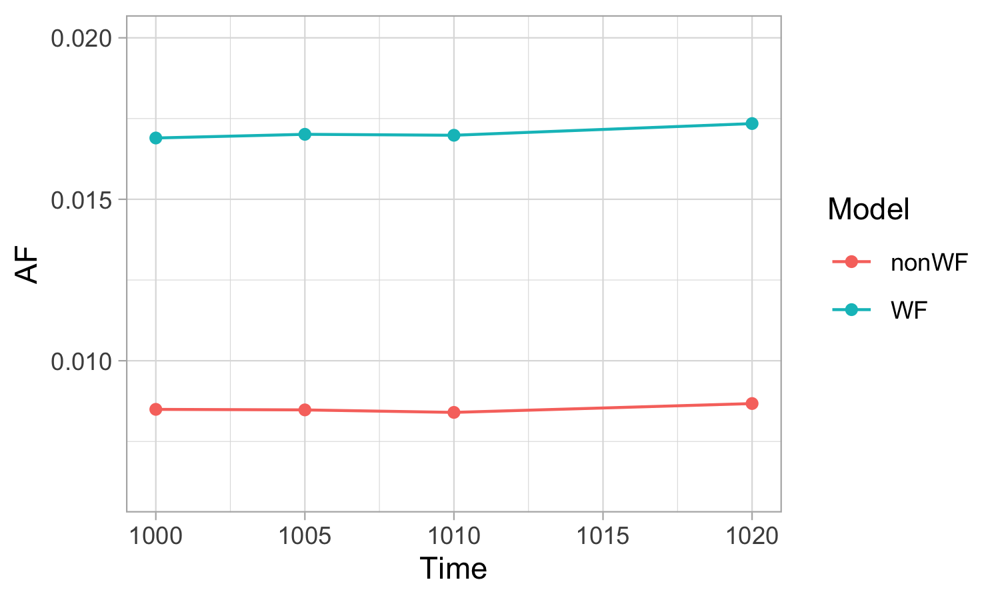
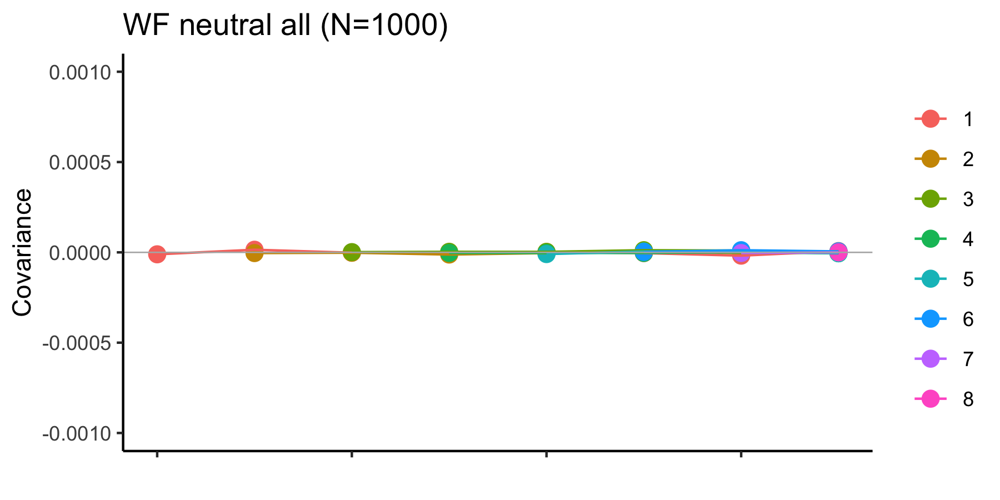
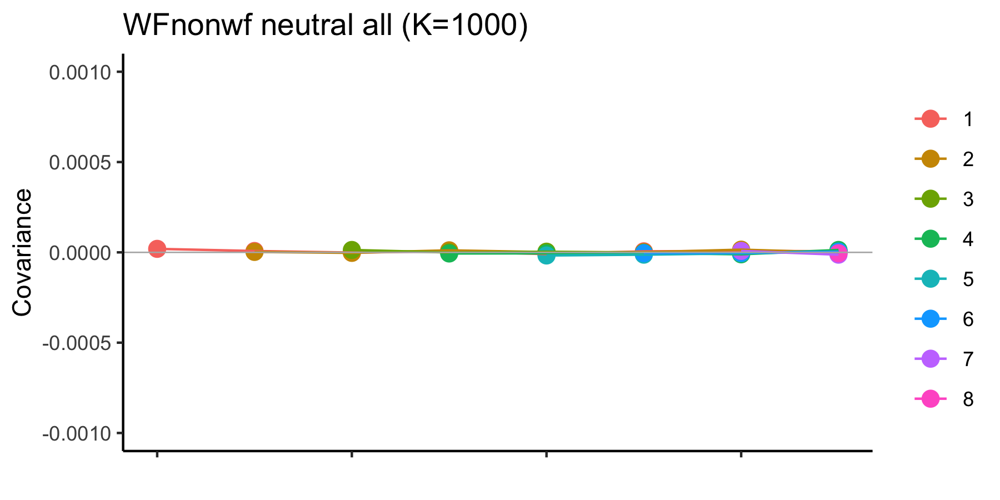
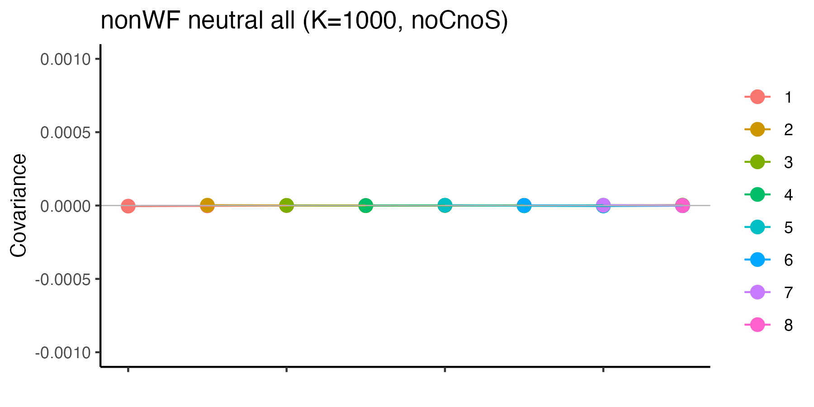
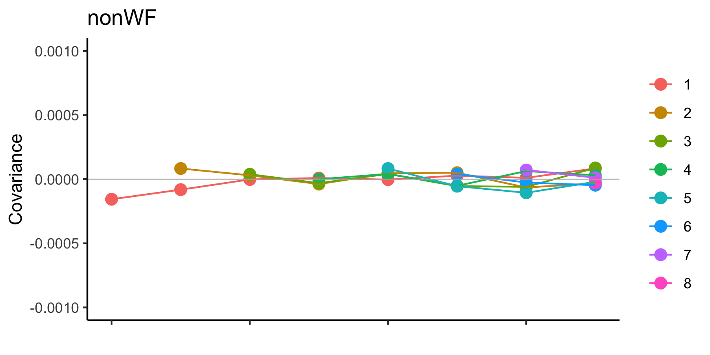
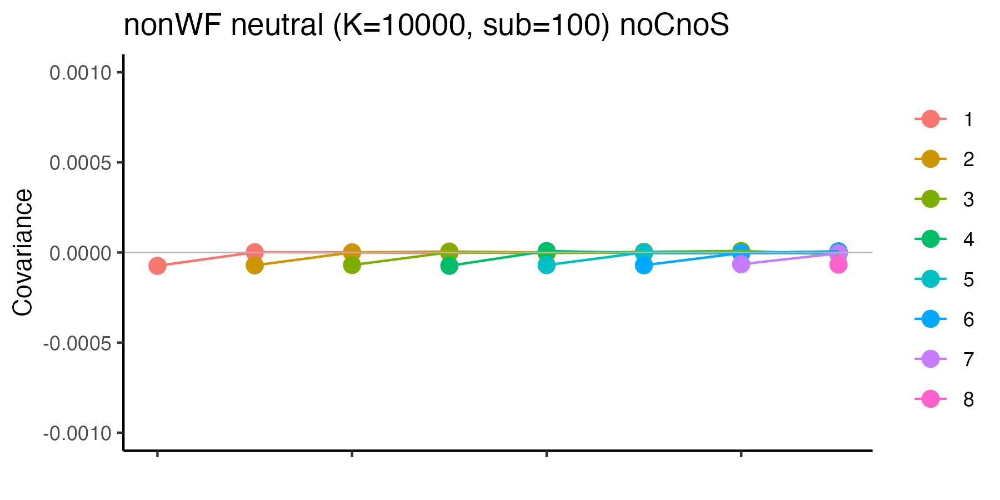

```{r eval=FALSE, message=FALSE, warning=FALSE, include=FALSE}
source("BaseScripts.R")
library(gridExtra)
library(tidyverse)
library(cowplot)
```


# SLiM simulations to assess the effects of overlapping populations on temporal covariacne (cvtk) analysis  
```{R eval=FALSE, message=FALSE, warning=FALSE}

# Create a bash script to extract mutation information from Slim output files using perl

# Ex)
sink(paste0("~/Projects/SLiM/extractMutaions.sh"))
gentime<-c(1000,1005,1010,1020)
filename<-"nonWF_neutral1.txt"
modelname<-c("nonWF")
for (i in 1: length(gentime)){
    cat(paste0("perl -lne 'if(/OUT: ",gentime[i]," SS p1 200/../Genome/){s/.*?(OUT: ",gentime[i]," SS p1 200)/$1/ if!$i++;s/Genome\K.*//&&print&&exit;print}' ", filename, "  > mut",i,"\n"))
    cat(paste0("sed '$d' mut",i," > ",modelname,i,".txt\n"))
}
sink(NULL)
```


# Allele frequency changes over time (neutral simulations) 

```{R eval=FALSE, echo=FALSE, message=FALSE, warning=FALSE}
#200 genomes (100 individuals) at generation 1000,1005,1010,1020 

# WF: the Wright–Fisher Model (non-overlapping generations)
# non-WF (overlapping generation models)

time<-c(1000,1005,1010,1020)
results<-data.frame()
for (i in 1:4){
    df<-read.table(paste0("../SLiM/PacHerring/nonWF_mutation",i,".txt"), skip=2)
        df$AF<-df$V9/200
        df$time<-time[i]
        results<-rbind(results,df)
}
results2<-data.frame()
for (i in 1:4){
    df<-read.table(paste0("~/Projects/SLiM/PacHerring/WF_mutation",i,".txt"), skip=2)
        df$AF<-df$V9/200
        df$time<-time[i]
        results2<-rbind(results2,df)
}

mean<-data.frame(aggregate(results$AF, by=list(results$time), FUN=mean))
mean2<-data.frame(aggregate(results2$AF, by=list(results2$time), FUN=mean))
colnames(mean)<-c("Time","AF")
colnames(mean2)<-c("Time","AF")
mean$Model<-"nonWF"
mean2$Model<-"WF"
Re<-rbind(mean, mean2)

ggplot(Re, aes(x=Time, y=AF, color=Model))+
    geom_point()+theme_light()+ylim(0.006,0.02)+
    geom_line(aes(x=Time, y=AF, group=Model))
ggsave("../Output/COV_analysis/Slim/meanAF.WF.vs.nonWF.png", width = 5, height = 3, dpi=300)  
```    
   
* SLiM scripts are available at the osf repository

# Temporal Covariance Analysis with nonWF models

## Data processing: Subsampled individuals
1. Create sample names files for the generated VCF files  

``` {r eval=FALSE, message=FALSE, warning=FALSE}   
#1. Fixed number of individuals

#Select the number of time points and number of samples (individuals)
t=10
n=100

#Create a name file to rename the samples in vcf
for (i in 1:t){
    df<-data.frame(sample=paste0("time",i-1,".",1:n))
    write.table(df, paste0("~/Projects/SLiM/PacHerring/newsampleids.",i-1,".txt"), row.names = F, col.names = F, quote = F)
}


#2. the Entire population
#number of time period
t=10
log<-read.csv("~/Projects/SLiM/PacHerring/nonWF_neutral_log2.txt")
times<-seq(1000, 1000+10*(t-1), 10) 
#Create a name file to rename the samples in vcf
for (i in 1:t){
    n<-log$num_individuals[log$generation==times[i]]
    df<-data.frame(sample=paste0("time",i-1,".",1:n))
    write.table(df, paste0("~/Projects/SLiM/PacHerring/newsampleids.",i-1,".txt"), row.names = F, col.names = F, quote = F)
}


```


2. Create a bash script to process Slim VCF files 

``` {r eval=FALSE, message=FALSE, warning=FALSE}    
#Create the bash script to reformat the output of slim
#select the appropriate name
run<-"nonWF.K10000.sub100"  #select a name
model<-"nonWF"
run<-"WF.N10000.sub100"  #select a name
model<-"WF"
run<-"WF.N1000.sub100.Pos0.2.g5000" 

t<-10
all<-'' # ('all' or '' none)

# 1. Create a bash script
sink(paste0("~/Projects/SLiM/PacHerring/slim_",run,".sh"))
cat("#!/bin/bash \n\n")
cat(paste0("mkdir ", run, " \n"))
#rename the samples
for (i in 1:t){
    cat(paste0("bcftools reheader ",model,all,"_time",i-1,".vcf -s newsampleids.",i-1,".txt -o ",run,"/",model,"_time",i-1,".vcf \n"))
}

cat(paste0("cd ",run," \n"))
cat("for f in *.vcf; do filename=$(basename $f); bgzip $f ; done \n")
cat("for f in *.vcf.gz; do filename=$(basename $f); bcftools index $f ; done \n")
#find intersecting loci
cat(paste0("bcftools isec -n=",t," -p isec --threads 10 *vcf.gz \n"))
cat(paste0("bcftools merge *vcf.gz -o ",model,"_combined.vcf.gz \n"))
cat(paste0("bcftools index ",model,"_combined.vcf.gz \n"))
# extract intersec loci from the combined 
cat(paste0("bcftools view -R isec/sites.txt ",model,"_combined.vcf.gz -Oz > ",model,"_isec.vcf.gz \n"))
cat(paste0("rm isec/*.vcf"))
sink(NULL)

## Run  bash slim_xxxx.sh
```

# Results from temporal covariance analysis
* Need to randomly permute the tracked allele (draw a Bernoulli random variable and if it's 1 you randomly flip the frequency) to avoid bias 

Functions to create covariance summary plots  
```{r eval=FALSE, message=FALSE, warning=FALSE} 
# function to read the covariance output file form cvtkpy with 4 time points, simulation pws pops
# fname=file name, model= "WF" or "nonWF", t=# of time points)
require("stringr")
covResults<-function(fname, model, t){
    cov<-read.csv(paste0("../cvtk_analysis/SLiM/",fname))
    cov<-cov[,-1]
    #reshape the matrix
    mat1<-cov[1:(t-1),]
    mat2<-cov[t:(2*t-2),]
    
    covdf<-data.frame()
    k=1
    for (i in 1:nrow(mat1)){
        for (j in 1:ncol(mat1)){
         covdf[k,1]<-mat2[i,j]
         covdf[k,2]<-mat1[i,j]
         k=k+1
        }
    }
    colnames(covdf)<-c("label","value")
    covdf$value<-as.numeric(covdf$value)
    covar<-covdf[grep("cov",covdf$label),]
            
    #remove the redundant values
    ids<-str_match(covar$label, "sim:\\s(.*?)\\,\\ssim:\\s(.*?)\\)")
    ids<-ids[,2:3]
    remove<-duplicated(lapply(1:nrow(ids), function(x) {
        A<-ids[x,]
        A[order(A)]
    }  ))
    covar<-covar[!remove,] 
    
    #assign the starting time period and covering period values
    vecn<-1:(t-2)
    syr<-c()
    for (i in 1:length(vecn)){
        syr<-c(syr, rep(i, times=(t-i-1)))
    }
    covar$start_year<-syr
    
    eyr<-c()
    for (i in 1:(t-2)){
        v<-(i+1):(t-1)
        eyr<-c(eyr,v)
    }
    covar$end_year<-eyr

    newfile<-gsub(".csv","", fname)
    newfile<-gsub("_temp_cov_matrix","", newfile)
    ggplot(data=covar, aes(x=end_year, y=value,group=start_year, color=factor(start_year)))+
        geom_point(size=3)+
        geom_line()+
        ylab("Covariance")+xlab('')+theme_classic()+
        theme(axis.text.x = element_blank(),legend.title = element_blank())+
        geom_hline(yintercept = 0,color="gray70", size=0.3)+ggtitle(paste0(model))+
        scale_y_continuous(labels = scales::comma, limits = c(-0.001,0.001))
    ggsave(paste0("../Output/COV/Sim/", newfile, "_neutral.png"),width = 6, height = 3, dpi=300)
    print(paste0("../Output/COV/Sim/", newfile, "_neutral.png"))
}

#No ylim
covResults2<-function(fname, model, t){
    cov<-read.csv(paste0("../cvtk_analysis/SLiM/",fname))
    cov<-cov[,-1]
    #reshape the matrix
    mat1<-cov[1:(t-1),]
    mat2<-cov[t:(2*t-2),]
    
    covdf<-data.frame()
    k=1
    for (i in 1:nrow(mat1)){
        for (j in 1:ncol(mat1)){
         covdf[k,1]<-mat2[i,j]
         covdf[k,2]<-mat1[i,j]
         k=k+1
        }
    }
    colnames(covdf)<-c("label","value")
    covdf$value<-as.numeric(covdf$value)
    covar<-covdf[grep("cov",covdf$label),]
            
    #remove the redundant values
    ids<-str_match(covar$label, "sim:\\s(.*?)\\,\\ssim:\\s(.*?)\\)")
    ids<-ids[,2:3]
    remove<-duplicated(lapply(1:nrow(ids), function(x) {
        A<-ids[x,]
        A[order(A)]
    }  ))
    covar<-covar[!remove,] 
    
    #assign the starting time period and covering period values
    vecn<-1:(t-2)
    syr<-c()
    for (i in 1:length(vecn)){
        syr<-c(syr, rep(i, times=(t-i-1)))
    }
    covar$start_year<-syr
    
    eyr<-c()
    for (i in 1:(t-2)){
        v<-(i+1):(t-1)
        eyr<-c(eyr,v)
    }
    covar$end_year<-eyr

    newfile<-gsub(".csv","", fname)
    newfile<-gsub("_temp_cov_matrix","", newfile)
    ggplot(data=covar, aes(x=end_year, y=value,group=start_year, color=factor(start_year)))+
        geom_point(size=3)+
        geom_line()+
        ylab("Covariance")+xlab('')+theme_classic()+
        theme(axis.text.x = element_blank(),legend.title = element_blank())+
        geom_hline(yintercept = 0,color="gray70", size=0.3)+ggtitle(paste0(model))+
        scale_y_continuous(labels = scales::comma)
    ggsave(paste0("../Output/COV_analysis/Slim/", newfile, "_neutral_noylim.png"),width = 6, height = 3, dpi=300)
}
```

## Use the entire population to calculate COV and AF (no subsampling of individuals)

### WF neutral (all individuals, 10  timepoints)

```{r eval=FALSE, message=FALSE, warning=FALSE} 
covResults("Slim_WF_N1000_noCnoS_temp_cov_matrix_250kwin.csv", "WF neutral all (N=1000)", 10)
```
{width=70%}

### WF with nonWF model, neutral (all individuals, 10  timepoints)

```{r eval=FALSE, message=FALSE, warning=FALSE} 
covResults("Slim_WFnonwf_K1000_noCnoS_temp_cov_matrix_250kwin.csv", "WFnonwf neutral all (K=1000)", 10)

```
{width=70%}

### nonWF neutral (K=1000, all individuals, 10  timepoints)

```{r eval=FALSE, message=FALSE, warning=FALSE} 
#covResults("Slim_nonWF_all_K1000_t10_temp_cov_matrix_250kwin.csv", "nonWF neutral all (K=1000)", 10)
covResults("Slim_nonWF_K1000_noCnoS_temp_cov_matrix_250kwin.csv", "nonWF neutral all (K=1000, noCnoS)", 10)

```
{width=70%}
```{r}
covResults("Slim_nonWF_K1000_wCwS_temp_cov_matrix_250kwin.csv", "nonWF neutral all (K=1000)", 10)

```


{width=70%}


## Sample 100 individuals from N=10000 population  


```{r}
covResults("Slim_nonWF_K10000_s100_noCnoS_temp_cov_matrix_250kwin.csv", "nonWF neutral (K=10000, sub=100) noCnoS", 10)

```



