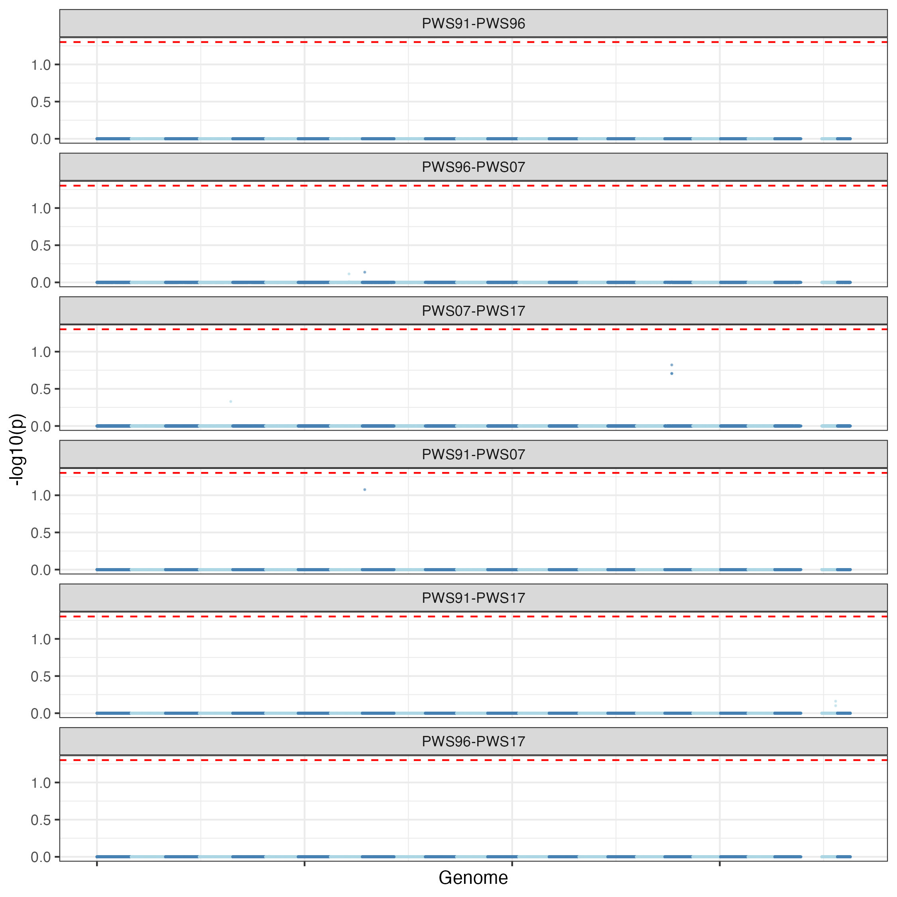
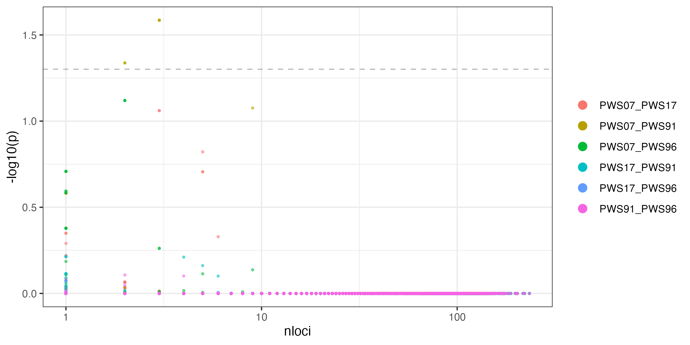
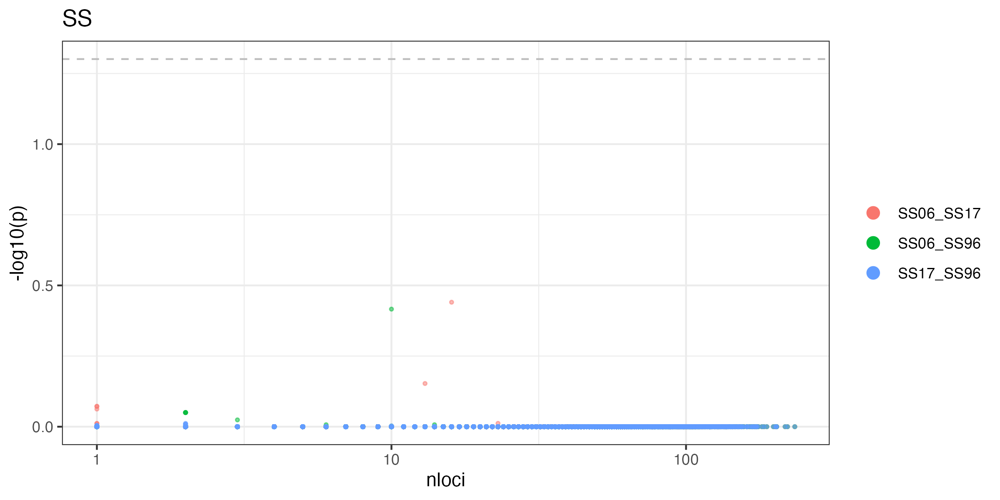
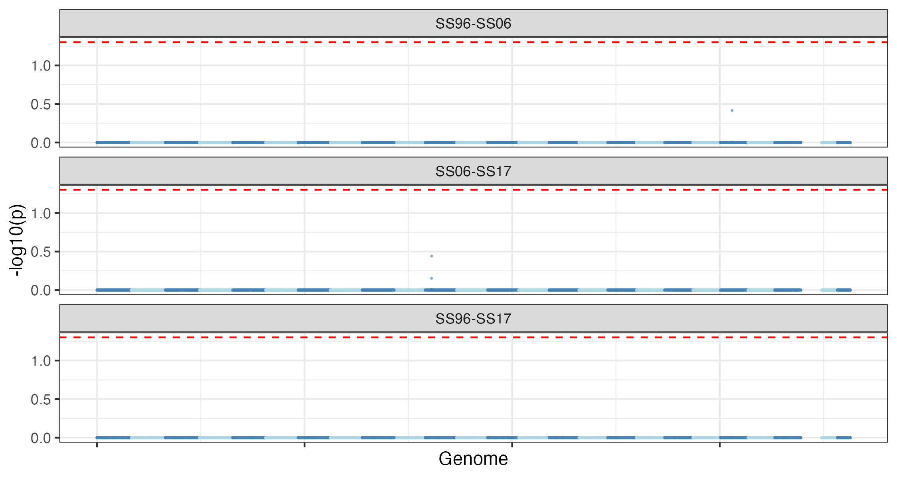
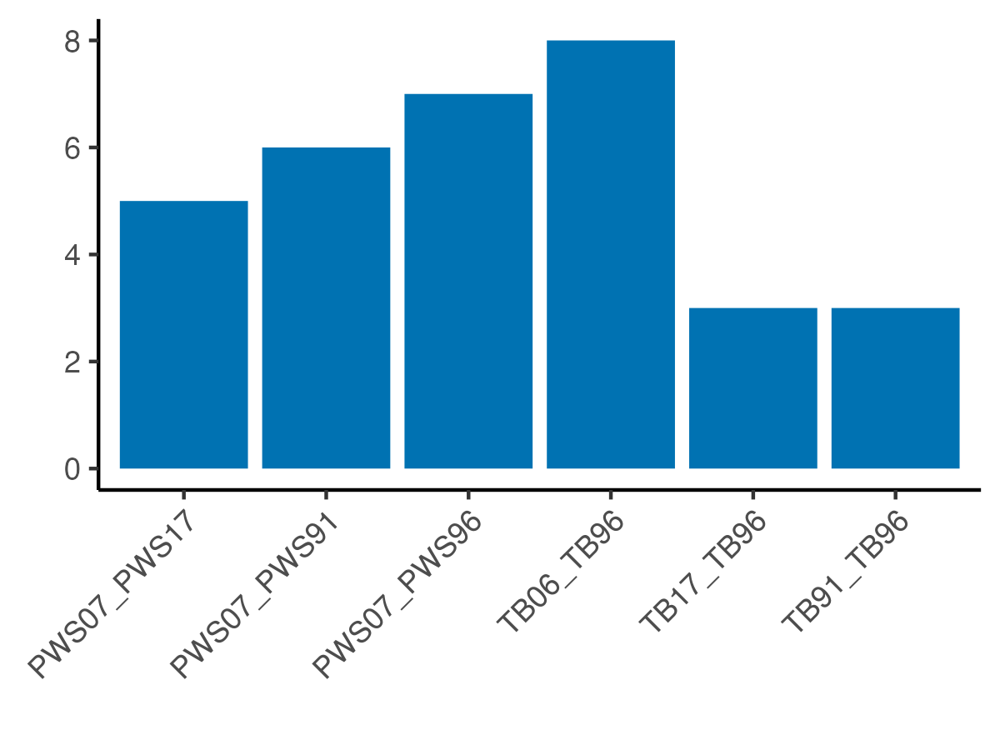

# Find significantly different loci/regions between years using shuffling to create null distributions{.unnumbered}  
* ## COULD NOT RUN -out of memory at farm
 
```{r eval=FALSE, message=FALSE, warning=FALSE}
source("BaseScripts.R")
require(data.table)
require(plyr)
require(RColorBrewer)
```


# Theta null distribution


## Create a maf00 newMD2000 3 pops VCF file, pruned to unliked loci
 
```{r eval=FALSE, message=FALSE, warning=FALSE}
sink(paste0("../Scripts/3pops_md2000.sh"))
cat("#!/bin/bash \n")
cat(paste0("bcftools filter Data/new_vcf/MD2000/3pops_MD3000_NS0.5.vcf.gz -Oz -i 'INFO/DP>471 && INFO/DP<2000' -o Data/new_vcf/MD2000/3pops_MD2000_NS0.5.vcf.gz   \n"))
cat(paste0("bcftools index Data/new_vcf/MD2000/3pops_MD2000_NS0.5.vcf.gz   \n"))
sink(NULL)

# Transfer pops_MD2000_NS0.5.vcf.gz to Farm
# In /home/ktist/ph/data/new_vcf/MD2000


#Run plink to find linked loci 
sink(paste0("../Data/Slurmscripts/Plink_linkedLoci.sh"))
cat("#!/bin/bash -l\n")
cat(paste0("#SBATCH --job-name=prune \n"))
cat(paste0("#SBATCH --mem=24G \n")) 
cat(paste0("#SBATCH --ntasks=8 \n")) 
cat(paste0("#SBATCH --nodes=4 \n")) 
cat(paste0("#SBATCH -e prune.err  \n"))
cat(paste0("#SBATCH --time=24:00:00  \n"))
cat(paste0("#SBATCH -p high  \n"))
cat("\n\n")
cat('module load plink \n\n') 

cat("plink  --vcf /home/ktist/ph/data/new_vcf/MD2000/3pops_MD2000_NS0.5.vcf.gz  --set-missing-var-ids @:#[ph]\\$r,\\$a --make-bed --out /home/ktist/ph/data/new_vcf/MD2000/MD2000_maf00 \n")

cat("plink --vcf /home/ktist/ph/data/MD2000/3pops_MD2000_NS0.5.vcf.gz --make-bed --out /home/ktist/ph/data/new_vcf/MD2000/MD2000_maf00 \n")
cat("plink --bfile /home/ktist/ph/data/new_vcf/MD2000/MD2000_maf00 --recode --tab --out /home/ktist/ph/data/new_vcf/MD2000/MD2000_maf00 \n")
cat("plink --file /home/ktist/ph/data/new_vcf/MD2000/MD2000_maf00 --indep-pairwise 75'kb' 5 0.5 --out /home/ktist/ph/data/new_vcf/MD2000/MD2000_maf00_75_5_0.5 \n")

sink(NULL)

# Does not work at farm due to the plink version
# Run locally (Plink_prune_local.sh)

source("reformat_prunin.R")
reformat_prunin("../Data/vcf/MD2000_maf00_75_5_0.5.prune.in")


# prune maf00 files
# 1. Reformat in file
#Reformat prun.in file with running the reformat_prunin.R
#R
#source("reformat_prunin.R")
#reformat_prunin("ph/data/new_vcf/MD2000/MD2000_maf00_75_5_0.5")
#quit()

# 2. remove linked loci


sink(NULL)

# ** Add '\' to make it double back slash (#[ph]\\$r,\\$a)


# Subset to each pop.yr 
pop_info<-read.csv("../Data/Sample_metadata_892pops.csv")
pops<-unique(pop_info$Population.Year[grep("PWS|SS|TB",pop_info$Population.Year)])


for (i in 1:length(pops)){
    cat(paste0("thetaStat  print /home/ktist/ph/data/angsd/SFS/ffromBam/folded/",pops[i],"_folded_ibs.thetas.idx | gzip > /home/ktist/ph/data/angsd/theta/",pops[i],"_ibs_thetas.pestPG.gz \n"))
}
sink(NULL)
# Run Theta2.sh at farm
```
** Can't run at farm due to memory constraints. No pi change detection can be done as pi was based on IBS.


<br>
<br>

# Fst genome-scan using a null model
* from Pinsky et al. 2021  https://github.com/pinskylab/codEvol
* Create a null distribution of expected maximum Fst
* Define a genome-wide p-value for each region as (r+1)/(n+1), where r was the number of null simulations with maximum change greater than or equal to the empirical value and n was the number of shuffles

## Shuffle Fst and create a null model of max Fst
* Based on angsd persite Fst output

1. After running angsd (realSFS), print a persite Fst file 
* Create slurm script  
```{r eval=FALSE, message=FALSE, warning=FALSE}

y1<-c("PWS07","PWS17","PWS91","PWS96")
comb1<-t(combn(y1, 2))
y2<-c("TB06","TB17","TB91","TB96")
comb2<-t(combn(y2, 2))
y3<-c("SS06","SS17","SS96")
comb3<-t(combn(y3, 2))
comb<-rbind(comb1, comb2, comb3)

sink(paste0("../Data/Slurmscripts/perSite_Fst.sh"))
cat("#!/bin/bash -l\n")
cat(paste0("#SBATCH --job-name=siteFst \n"))
cat(paste0("#SBATCH --mem=24G \n")) 
cat(paste0("#SBATCH --ntasks=8 \n")) 
cat(paste0("#SBATCH --nodes=4 \n")) 
cat(paste0("#SBATCH -e siteFst.err  \n"))
cat(paste0("#SBATCH --time=24:00:00  \n"))
cat(paste0("#SBATCH -p high  \n"))
cat("\n\n")
cat('module load angsd \n\n') 
for (i in 1:nrow(comb)){
    p1<-comb[i,1]
    p2<-comb[i,2]
    cat(paste0("realSFS fst print /home/ktist/ph/data/angsd/SFS/fromVCF/MD2000_fst_",p1,"_",p2,"_persite_maf05.fst.idx > /home/ktist/ph/data/angsd/SFS/fromVCF/MD2000_fst_",p1,"_",p2,"_persite_maf05.fst.txt \n"))
    cat(paste0("bgzip /home/ktist/ph/data/angsd/SFS/fromVCF/MD2000_fst_",p1,"_",p2,"_persite_maf05.fst.txt \n\n" ))
}
sink(NULL)
```


2. Run Fst_shuffle_pws_md2000.R at Farm (slurm script: angsd_fst_siteshuffle_null_pws.sh)  
Run Fst_shuffle_tb_md2000.R at Farm (slurm script: angsd_fst_siteshuffle_null_tb.sh)  
Run Fst_shuffle_ss_md2000.R at Farm (slurm script: angsd_fst_siteshuffle_null_ss.sh)  

* This is the code for Fst_shuffle
```{r eval=FALSE, message=FALSE, warning=FALSE}
# From https://github.com/pinskylab/codEvol angsd_fst_siteshuffle_null.r

# shuffle ANGSD persite FST A and B values across sites and calculate windowed FST to get a null distribution of max genome-wide FST
# need fst persite output from angsd

# to run on farm 


##### R code  ####### 

# parameters
winsz <- 50000 # window size
winstp <- 10000 # window step
nrep <- 1000 # number of reshuffles
minloci <- 10 # minimum number of loci per window to consider


# load functions
require(data.table)


#############
# Prep data
#############
# load fst A/B data
#can <- fread('analysis/Can_40.Can_14.fst.AB.gz')
#setnames(can, c('CHROM', 'POS', 'A', 'B'))

pws9196 <- fread('/home/ktist/ph/data/angsd/analysis/fst_PWS91_PWS96_persite_maf00.txt.gz')
setnames(pws9196, c('CHROM', 'POS', 'A', 'B'))
pws9107 <- fread('/home/ktist/ph/data/angsd/analysis/fst_PWS91_PWS07_persite_maf00.txt.gz')
setnames(pws9107, c('CHROM', 'POS', 'A', 'B'))
pws9117 <- fread('/home/ktist/ph/data/angsd/analysis/fst_PWS91_PWS17_persite_maf00.txt.gz')
setnames(pws9117, c('CHROM', 'POS', 'A', 'B'))
pws9607 <- fread('/home/ktist/ph/data/angsd/analysis/fst_PWS96_PWS07_persite_maf00.txt.gz')
setnames(pws9607, c('CHROM', 'POS', 'A', 'B'))
pws9617 <- fread('/home/ktist/ph/data/angsd/analysis/fst_PWS96_PWS17_persite_maf00.txt.gz')
setnames(pws9617, c('CHROM', 'POS', 'A', 'B'))
pws0717 <- fread('/home/ktist/ph/data/angsd/analysis/fst_PWS07_PWS17_persite_maf00.txt.gz')
setnames(pws0717, c('CHROM', 'POS', 'A', 'B'))

PWS<-list()
PWS[[1]]<-pws9196
PWS[[2]]<-pws9107
PWS[[3]]<-pws9117
PWS[[4]]<-pws9607
PWS[[5]]<-pws9617 
PWS[[6]]<-pws0717 
    
 
# create new columns as indices for windows

for (i in 1: length(PWS)){
    df<-PWS[[i]]
    for(j in 1:(winsz/winstp)){
        df[, (paste0('win', j)) := floor((POS - (j-1)*winstp)/winsz)*winsz + winsz/2 + (j-1)*winstp]
    }
    PWS[[i]]<-df
}

# mark windows with < minloci for removal
rem <- rep(0, 6) # number of windows removed for each of the 6 comparisons

for(i in 1: length(PWS)){
    pw<-PWS[[i]]
    for(j in 1:(winsz/winstp)){
        pwwin <- pw[, .(nsnps = length(POS)), by = .(win = get(paste0('win', j)))] # calc num snps per window
        rem[1] <- rem[1] + pwwin[, sum(nsnps < minloci)] # record number to be removed
        pwwin[, (paste0('win', j, 'keep')) := 1] # create col to mark which windows to keep
        pwwin[nsnps < minloci, (paste0('win', j, 'keep')) := 0] # mark windows to remove
        pwwin[, nsnps := NULL] # drop column
        setnames(pwwin, "win", paste0('win', j)) # change col name
        pw <- merge(pw, pwwin, by = paste0('win', j), all.x = TRUE) # merge keeper col back to full dataset
    }
    PWS[[i]]<-pw
}

rem # number of windows removed for each comparison


####################################
# shuffle and recalc windowed FST
####################################
colnms <- c('CHROM', 'POS', paste0('win', 1:(winsz/winstp)), paste0('win', 1:(winsz/winstp), 'keep')) # list of column names we want out of the base data.table

# PWS07-17
pops<-c("PWS91.96","PWS91.07","PWS91.17","PWS96.07","PWS96.17","PWS07.17")


for(p in 1:length(PWS)){
    print(paste0('Starting ', pops[p]))

    pw<-PWS[[p]]
    for(i in 1:nrep){
        cat(i); cat(' ')
        # create new dataset
        inds <- sample(1:nrow(pw), nrow(pw), replace = FALSE)
        temp <- cbind(pw[, ..colnms], pw[inds, .(A, B)]) # shuffle FSTs across positions
        
        # calc fst for each window to keep
        for(j in 1:(winsz/winstp)){
            temp2 <- temp[get(paste0('win', j, 'keep')) == 1, ] # trim to windows to keep. can't combine with next line for some reason.
            if(j ==1) tempfsts <- temp2[, .(fst = sum(A)/sum(B)), by = .(CHROM, POS = get(paste0('win', j)))]
            if(j > 1) tempfsts <- rbind(tempfsts, temp2[, .(fst = sum(A)/sum(B)), by = .(CHROM, POS = get(paste0('win', j)))])
        }
        
        # save the max windowed fst
        # exclude windows with negative midpoints
        if(i == 1) maxfst <- tempfsts[POS > 0, max(fst, na.rm = TRUE)]	
        if(i > 1) maxfst <- c(maxfst, tempfsts[POS > 0, max(fst, na.rm = TRUE)])
    }

    print(paste('Max:', max(maxfst, na.rm = TRUE), '; 95th:', quantile(maxfst, prob = 0.95, na.rm = TRUE)))
    
    write.csv(maxfst, gzfile(paste0('/home/ktist/ph/data/angsd/analysis/',pops[p], '_siteshuuffle.csv.gz')), row.names = FALSE)
    rm(maxfst)
}

```


## Assess the results from site reshuffled Fst 
Need 
- sitehuffle results *fst_siteshuuffle.csv.gz
- window-based Fst results from angsd *_50kWindow_maf00
- persite Fst files after LD pruning (with AB info) *_pruned_persite_maf05.fst.txt.gz 


### Slurm Scripts for calculating pruned Fst values  

```{r eval=FALSE, message=FALSE, warning=FALSE}
y1<-c("PWS07","PWS17","PWS91","PWS96")
comb1<-t(combn(y1, 2))
y2<-c("TB06","TB17","TB91","TB96")
comb2<-t(combn(y2, 2))
y3<-c("SS06","SS17","SS96")
comb3<-t(combn(y3, 2))
for (i in 1:3){
    sink(paste0("../Data/Slurmscripts/2DSFS_pruned_",i,".sh"))
    cat("#!/bin/bash -l")
    cat("\n")
    cat(paste0("#SBATCH --job-name=2DSFS_",i," \n"))
    cat(paste0("#SBATCH --mem=16G \n")) 
    cat(paste0("#SBATCH --nodes=4 \n"))
    cat(paste0("#SBATCH --ntasks=8 \n")) 
    cat(paste0("#SBATCH -e 2DSFS_",i,".err  \n"))
    cat(paste0("#SBATCH --time=144:00:00  \n"))
    cat(paste0("#SBATCH -p high  \n"))
    cat("\n\n")
    cat("module load angsd \n\n") 
    
    comb<-get(paste0("comb",i))
    for (i in 1:nrow(comb)){
        pop1<-comb[i,1]
        pop2<-comb[i,2]
        
        cat(paste0("realSFS /home/ktist/ph/data/angsd/SFS/fromVCF/pruned/", pop1, "_pruned_maf05.saf.idx /home/ktist/ph/data/angsd/SFS/fromVCF/pruned/", pop2, "_pruned_maf05.saf.idx -P 24 > /home/ktist/ph/data/angsd/SFS/fromVCF/pruned/", pop1,"_",pop2,"_pruned_maf05.sfs \n")) 
        cat(paste0("realSFS fst index /home/ktist/ph/data/angsd/SFS/fromVCF/pruned/", pop1, "_pruned_maf05.saf.idx /home/ktist/ph/data/angsd/SFS/fromVCF/pruned/", pop2,"_pruned_maf05.saf.idx "))
        cat(paste0("-sfs /home/ktist/ph/data/angsd/SFS/fromVCF/pruned/", pop1,"_",pop2,"_pruned_maf05.sfs -fstout /home/ktist/ph/data/angsd/SFS/fromVCF/pruned/fst_",pop1, "_",pop2,"_pruned_persite_maf05 \n"))
        cat(paste0("realSFS fst print /home/ktist/ph/data/angsd/SFS/fromVCF/pruned/fst_",pop1, "_",pop2,"_pruned_persite_maf05.fst.idx > /home/ktist/ph/data/angsd/SFS/fromVCF/pruned/fst_",pop1, "_",pop2,"_pruned_persite_maf05.fst.txt  \n"))
        cat(paste0("bgzip /home/ktist/ph/data/angsd/SFS/fromVCF/pruned/fst_",pop1, "_",pop2,"_pruned_persite_maf05.fst.txt  \n"))
    } 
    sink(NULL)
}

```


## read the output  

```{r eval=FALSE, message=FALSE, warning=FALSE}
#from https://github.com/pinskylab/codEvol

# parameters
# remove windows with less than 5 snps (this can be changed)
minloci <- 5
winsz <- 50000 # window size
winstp <- 10000 # window step


calcp <- function(fst, null) return((sum(null > fst)+1)/(length(null)+1)) # equation from North et al. 2002 Am J Hum Gen

# read in and prep data
y1<-c("PWS07","PWS17","PWS91","PWS96")
comb1<-t(combn(y1, 2))
y2<-c("TB06","TB17","TB91","TB96")
comb2<-t(combn(y2, 2))
y3<-c("SS06","SS17","SS96")
comb3<-t(combn(y3, 2))
comb<-data.frame(rbind(comb1, comb2, comb3))

# continuous nucleotide position for the whole genome
chrmax <- fread('../Data/vcf/chr_sizes.bed')
chrmax<-chrmax[,-2]
colnames(chrmax)<-c("chr", "len")
chrmax$start<-c(0,cumsum(chrmax$len)[1:(nrow(chrmax)-1)])
setkey(chrmax, chr)

prunedFst_gw<-data.frame(pop1=comb[,1],pop2=comb[,2])
for (p in 1: nrow(comb)){
    #genome-wide max Fst from reshuffling (all sites)
    null<-fread(paste0('../Data/Fst_shuffle/',comb[p,1],'.', comb[p,2], '_siteshuuffle.csv.gz'))
    
    #persite fst (AB) -pruned sites
    AB <- fread(paste0('../Data/Fst_shuffle/fst_',comb[p,1],"_",comb[p,2],'_pruned_persite_maf05.fst.txt.gz'))
    names(AB)<-c("CHROM","POS","A","B")
    # merge nucleotide position into the frequency files
    setkey(AB, CHROM)
    AB <- AB[chrmax[, .(CHROM = chr, start)], ]
    AB[, posgen := POS + start]
    AB[,start := NULL]
    
    # Calc genome-wide FST
    prunedFst_gw$gwFst[p]<-AB[!is.na(A), sum(A)/sum(B)]
    
    # Calc windowed FST
    # create new columns as indices for windows
    for(j in 1:(winsz/winstp)){
        AB[, (paste0('win', j)) := floor((POS - (j-1)*winstp)/winsz)*winsz + winsz/2 + (j-1)*winstp]
    }
    
    # calc fst and # snps per window
    for(j in 1:(winsz/winstp)){
        if(j ==1){
            fstwin <- AB[, .(fst = sum(A)/sum(B), nloci = length(POS)), by = .(CHROM, midPos = get(paste0('win', j)))]
        } 
        if(j > 1){
            fstwin <- rbind(fstwin, AB[, .(fst = sum(A)/sum(B), nloci = length(POS)), by = .(CHROM, midPos = get(paste0('win', j)))])
        } 
    }
    
    ## null model stats
    fstats<-null[, .(max = max(x), u95 = quantile(x, probs = 0.95))]
    prunedFst_gw$null.Fstmax[p]<-fstats$max[1]
    prunedFst_gw$null.Fst.95q[p]<-fstats$u95[1]
    
    #Calculate p-values
    pval<-fstwin[, p := calcp(fst, null$x), by = .(CHROM, midPos)]
    
    #combined the datasets
    pair<-paste0(comb[p,1],"_",comb[p,2])
    fstwin[, pop := pair ]
    write.csv(fstwin, paste0("../Output/Fst/shuffle/Pairwise_fst_siteshuffle_", pair,".csv"))
}

write.csv(prunedFst_gw, "../Output/Fst/shuffle/fst_siteshuffle_summary_MD2000.csv")

# Add numerical years and pops in addition to pair 
years = c('91'='1991', '96'='1996','06'='2006','07'='2007','17'='2017')

comb$yr1<-sub("[A-Z]+", '',comb[,1])
comb$yr2<-sub("[A-Z]+", '',comb[,2])
comb$yr1<-str_replace_all(comb$yr1, years)
comb$yr2<-str_replace_all(comb$yr2, years)
comb$yr1<-as.integer(comb$yr1)
comb$yr2<-as.integer(comb$yr2)
comb$location<-sub("[0-9]+", '',comb[,1])


data<-data.frame()
for(i in 1: nrow(comb)){
    pair<-paste0(comb[i,1],"_",comb[i,2])
    df<-fread(paste0("../Output/Fst/shuffle/Pairwise_fst_siteshuffle_", pair,".csv"))
    df<-df[!is.na(fst) & midPos > 0, ]
    df[,ch:= as.integer(gsub("chr",'', CHROM))]
    setkey(df,CHROM)
    df<-df[chrmax[, .(CHROM = chr, start)], ]
    df[,pos.gw:= midPos+start]
    
    df$y1<-comb$yr1[i] 
    df$y2<-comb$yr2[i] 
    df$location<-comb$location[i]
    df$pop1<-comb$X1[i]
    df$pop2<-comb$X2[i]
    #setkey(df, ch, midPos)
    data<-rbind(data, df)
}

#write.csv(data, file = gzfile('../Output/Fst/shuffle/fst_siteshuffle_allpairs_MD2000.csv.gz'), row.names = FALSE)
```


## Plot the results   

### PWS 
```{r eval=FALSE, message=FALSE, warning=FALSE}
#data<-fread('../Output/Fst/shuffle/fst_siteshuffle_allpairs_MD2000.csv.gz')

# PWS
#pop as factor 
pwsDF<-data[data$location=="PWS",]

pwsDF$pair<-apply(pwsDF,1, function(x) ifelse( x['y1'] > x['y2'], paste0(x["pop2"],"-",x["pop1"]), paste0(x["pop1"],"-",x["pop2"])))
    
pwsDF[, pair := factor(pair, levels = c("PWS91-PWS96","PWS96-PWS07","PWS07-PWS17","PWS91-PWS07","PWS91-PWS17","PWS96-PWS17"))]

# plot p-value vs. position
two_cols<-rep(c("steelblue","lightblue"), times=13)

# % windows with <5 snps
length(pwsDF$nloci[pwsDF$nloci<5])/nrow(pwsDF)
#10.23%

#<10 snps
length(pwsDF$nloci[pwsDF$nloci<10])/nrow(pwsDF)
#26.1%

# use different nubmers for fitlering 
#1. 
minloci <- 5 # minimum number of loci per window to consider
ggplot(pwsDF[nloci >= minloci, ], aes(pos.gw, -log10(p), color = factor(ch))) + 
    geom_point(size = 0.2, alpha = 0.5) +
    facet_wrap(~pair, ncol = 1) +
    scale_color_manual(values = two_cols, guide='none') +
    geom_hline(yintercept = -log10(0.05), linetype = 'dashed', color = 'red')+
    theme_bw()+
    theme(axis.text.x = element_blank())+
    xlab("Genome")
ggsave("../Output/Fst/shuffle/fst.siteshuffle.Pval.PWS.png", width = 7.5, height = 7.5,dpi = 300)

minloci <- 10 # minimum number of loci per window to consider
ggplot(pwsDF[nloci >= minloci, ], aes(pos.gw, -log10(p), color = factor(ch))) + 
    geom_point(size = 0.2, alpha = 0.5) +
    facet_wrap(~pair, ncol = 1) +
    scale_color_manual(values = two_cols, guide='none') +
    geom_hline(yintercept = -log10(0.05), linetype = 'dashed', color = 'red')+
    theme_bw()+
    theme(axis.text.x = element_blank())+
    xlab("Genome")
#ggsave("../Output/Fst/shuffle/fst.siteshuffle.Pval.PWS_min10.png", width = 7.5, height = 7.5,dpi = 300)
```


- Number of loci per window vs. Fst p-values

```{r eval=FALSE, message=FALSE, warning=FALSE}
# plot p-value vs. nloci to check if any biases exist
ggplot(pwsDF, aes(nloci, -log10(p), color = pop)) + 
    geom_point(size = 0.6, alpha = 0.5) +
    geom_hline(yintercept = -log10(0.05), linetype = 'dashed', color = 'grey') + 
    scale_x_log10()+theme_bw()+theme(legend.title = element_blank())+
    guides(color = guide_legend(override.aes = list(size = 3, alpha=1)))
ggsave("../Output/Fst/shuffle/nloci.vs.Fst_correlation.png", width = 8, height =4,dpi = 300)
```

* Sites with higher p-vals are artifact where there are only a few snps in a window




### TB
```{r eval=FALSE, message=FALSE, warning=FALSE}

#pop as factor 
tbDF<-data[data$location=="TB",]

tbDF$pair<-apply(tbDF,1, function(x) ifelse( x['y1'] > x['y2'], paste0(x["pop2"],"-",x["pop1"]), paste0(x["pop1"],"-",x["pop2"])))
    
tbDF[, pair := factor(pair, levels = c("TB91-TB96","TB96-TB06","TB06-TB17","TB91-TB06","TB91-TB17","TB96-TB17"))]

# plot p-value vs. position
two_cols<-rep(c("steelblue","lightblue"), times=13)

# cutoff min nloci at 5 
minloci <- 5 # minimum number of loci per window to consider
ggplot(tbDF[nloci >= minloci, ], aes(pos.gw, -log10(p), color = factor(ch))) + 
    geom_point(size = 0.2, alpha = 0.5) +
    facet_wrap(~pair, ncol = 1) +
    scale_color_manual(values = two_cols, guide='none') +
    geom_hline(yintercept = -log10(0.05), linetype = 'dashed', color = 'red')+
    theme_bw()+
    theme(axis.text.x = element_blank())+
    xlab("Genome")
ggsave("../Output/Fst/shuffle/fst.siteshuffle.Pval.TB_min5.png", width = 7.5, height = 7.5,dpi = 300)

ggplot(tbDF, aes(nloci, -log10(p), color = pop)) + 
    geom_point(size = 0.7, alpha = 0.5) +
    geom_hline(yintercept = -log10(0.05), linetype = 'dashed', color = 'grey') + 
    scale_x_log10()+theme_bw()+theme(legend.title = element_blank())+
    guides(color = guide_legend(override.aes = list(size = 3, alpha=1)))+ggtitle("TB")
ggsave("../Output/Fst/shuffle/nloci.vs.Fst_correlation_TB.png", width = 8, height =4,dpi = 300)

```




### SS  
```{r eval=FALSE, message=FALSE, warning=FALSE}

#pop as factor 
ssDF<-data[data$location=="SS",]

ssDF$pair<-apply(ssDF,1, function(x) ifelse( x['y1'] > x['y2'], paste0(x["pop2"],"-",x["pop1"]), paste0(x["pop1"],"-",x["pop2"])))
    
ssDF[, pair := factor(pair, levels = c("SS96-SS06","SS06-SS17","SS96-SS17"))]

# plot p-value vs. position
two_cols<-rep(c("steelblue","lightblue"), times=13)

# cutoff min nloci at 10. 
minloci <- 5 # minimum number of loci per window to consider
ggplot(ssDF[nloci >= minloci, ], aes(pos.gw, -log10(p), color = factor(ch))) + 
    geom_point(size = 0.2, alpha = 0.5) +
    facet_wrap(~pair, ncol = 1) +
    scale_color_manual(values = two_cols, guide='none') +
    geom_hline(yintercept = -log10(0.05), linetype = 'dashed', color = 'red')+
    theme_bw()+
    theme(axis.text.x = element_blank())+
    xlab("Genome")
ggsave("../Output/Fst/shuffle/fst.siteshuffle.Pval.SS_min5.png", width = 7.5, height = 4,dpi = 300)

ggplot(ssDF, aes(nloci, -log10(p), color = pop)) + 
    geom_point(size = 0.7, alpha = 0.5) +
    geom_hline(yintercept = -log10(0.05), linetype = 'dashed', color = 'grey') + 
    scale_x_log10()+theme_bw()+theme(legend.title = element_blank())+
    guides(color = guide_legend(override.aes = list(size = 3, alpha=1)))+ggtitle("SS")
ggsave("../Output/Fst/shuffle/nloci.vs.Fst_correlation_SS.png", width = 8, height =4,dpi = 300)

```




### Top 1% outliers & P< 0.2
* relaxing the cutoff
```{r}
#data<-fread('../Output/Fst/fst_siteshuffle.angsd.PWS.csv.gz')
dat<-data[order(p),]
top1<-dat[1:(nrow(dat)*0.01),]
top1<-top1[p<0.2,]

counts2<-data.table(table(top1$pop))
ggplot(counts2, aes(x=V1, y=N))+
    geom_bar(stat="identity", fill=cols[4])+
    xlab('')+ylab('')+
    theme_classic()+
    theme(axis.text.x = element_text(angle=45, hjust=1))
ggsave("../Output/Fst/Fst_outliers_byComparison_top1percent.png", width = 4, height = 3, dpi=300 )

knitr::kable(top1[,c(2,3,4,5,6,7,8)])
```
 

* **NO overlapping regions from PCAngsd selection scan**


