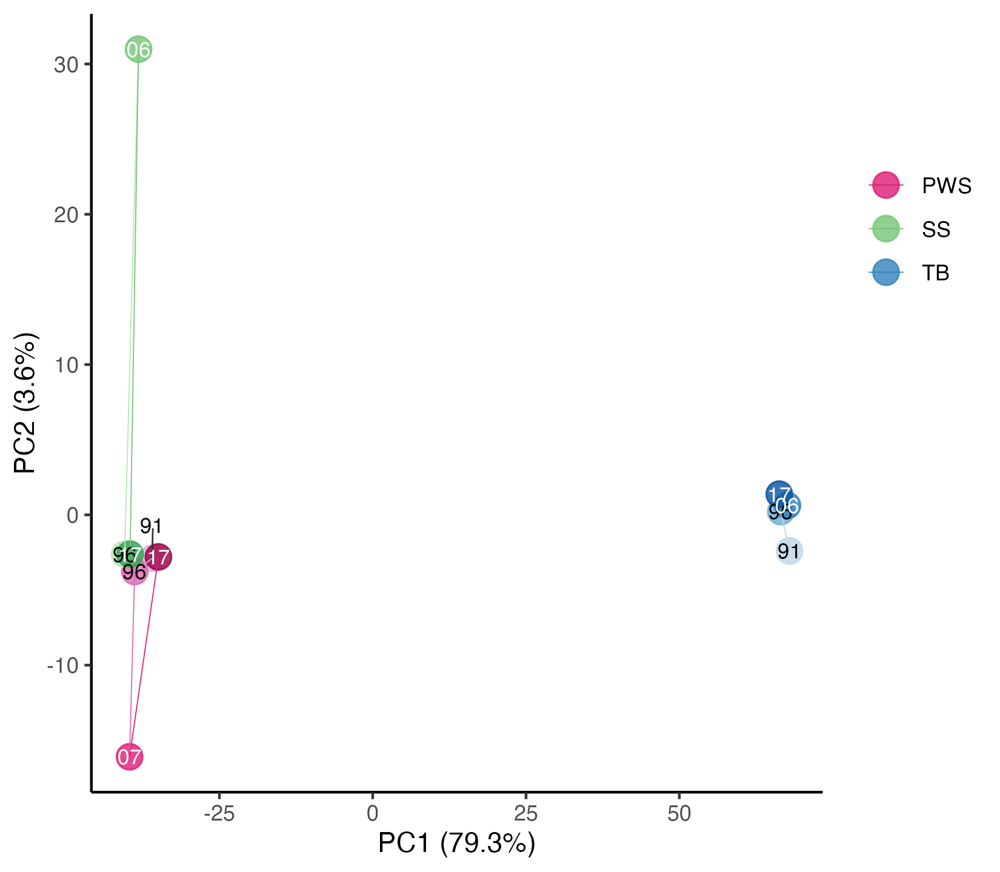
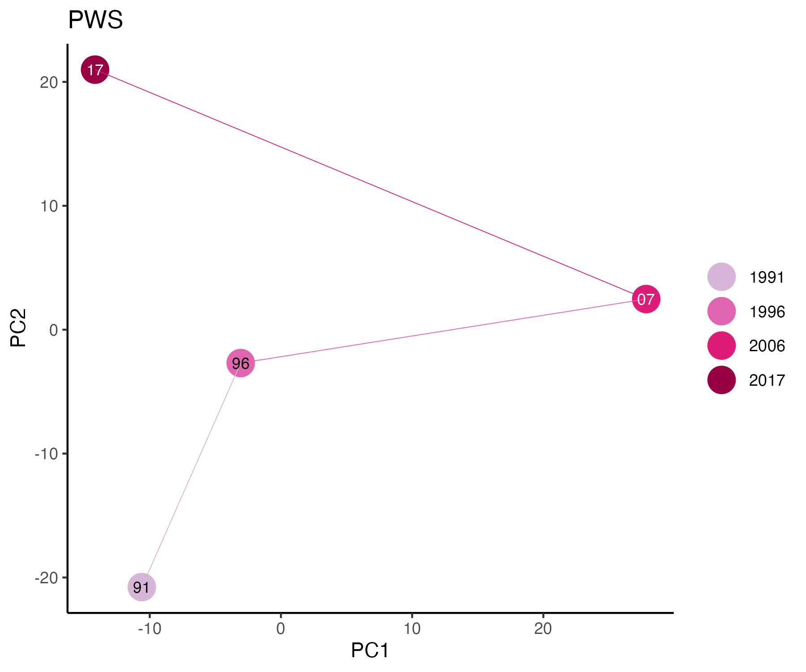
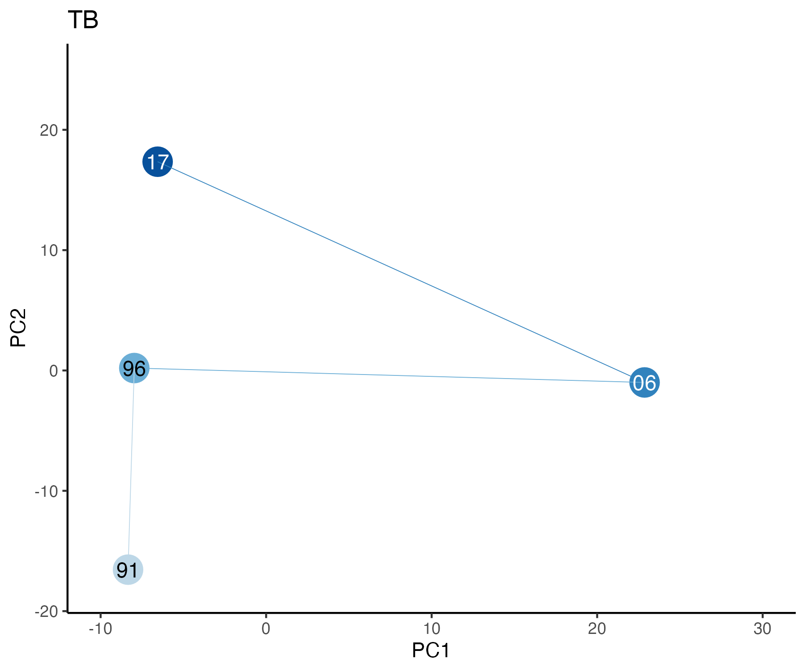
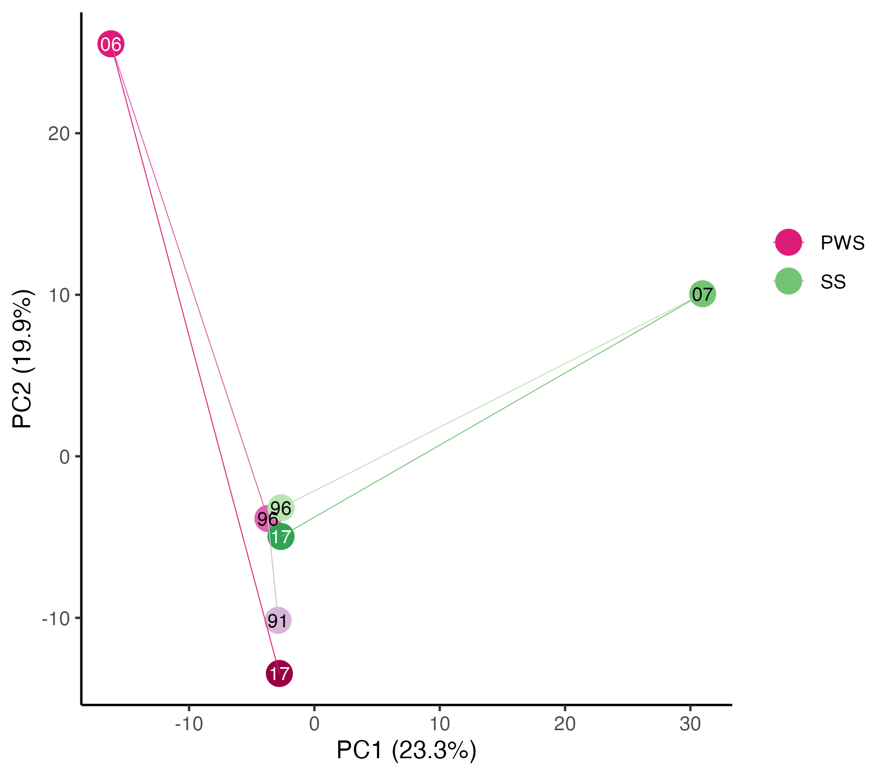

```{r eval=FALSE, message=FALSE, warning=FALSE}
source("BaseScripts.R")
library(scales)
library(data.table)
```


# Prepare allele frequency files for PCA  
## Read frequency files from ANGSD  
```{r eval=FALSE, message=FALSE, warning=FALSE}
pops<-c("PWS91","PWS96","PWS07","PWS17","SS96","SS06","SS17","TB91","TB96","TB06","TB17")
freqs<-data.frame(r=1:351820)
for (i in 1: length(pops)){
    df<-fread(paste0("../Data/vcf/AF/",pops[i],"_MD2000_maf05.mafs.gz"))

    df<-df[, "knownEM"]
    colnames(df)<-pops[i]
    freqs<-cbind(freqs, df)
}
#convert it to major allele freq table
freqs<-freqs[,-1]
f2<-1-freqs

# freq=0 cannot be processed for standardization
# 1. replace 0 with a small number
f2[f2==0]<-0.0000000001
write.csv(f2,       "../Data/vcf/AF/major_freqs_zeroReplaced.csv", row.names=F)
write.csv(f2[,1:4], "../Data/vcf/AF/major_freqs_PWS_zeroReplaced.csv", row.names=F)
write.csv(f2[,5:7], "../Data/vcf/AF/major_freqs_SS_zeroReplaced.csv", row.names=F)
write.csv(f2[,8:11],"../Data/vcf/AF/major_freqs_TB_zeroReplaced.csv", row.names=F)
write.csv(f2[,1:7], "../Data/vcf/AF/major_freqs_PWSSS_zeroReplaced.csv", row.names=F)

```


## Run pca.py from cvtkpy 
* The pca.py runs PCA on allele freqency data after standardization. 
* Results from zero-replaced vs. zero-removed did not change much, so using the zeroreplaced version.  

# Read the PCA results   

## All populations together  
```{r eval=FALSE, message=FALSE, warning=FALSE}
pops<-c("PWS91","PWS96","PWS07","PWS17","SS96","SS06","SS17","TB91","TB96","TB06","TB17")
df1<-read.csv("../Data/pca/newMD2000_pca_df_zeroReplaced.csv")

df1$id<-pops
df1$id<-factor(df1$id, levels=pops)
colgrad<-c("#d7b5d8","#df65b0","#dd1c77","#980043","#bae4b3","#74c476","#31a354", "#bdd7e7","#6baed6","#3182bd","#08519c")

# % explained by PC1 and PC2
var<-read.csv("../Data/pca/PCA_var_explained.csv", header = FALSE)
prop_explained <- c()
for (s in var) {
    #print(s / sum(e$values))
    #prop_explained <- c(prop_explained,round(((s / sum(e$values))*100),2))
    prop_explained <- c(prop_explained,round(((s / sum(var))*100),2))
}
prop_explained
#79.26  3.64  3.07  2.54  2.41  2.07  2.00  1.82  1.64  1.56  0.00 

# PWS91 and PWS17 are close -> add jitter for visibility
df1$pc1[df1$id=="PWS17"]<-df1$pc1+1

ggplot(df1,aes(x=pc1, y=pc2, color=id))+
    geom_point(size=4.5, alpha=0.8)+
    geom_path(aes(x=pc1, y=pc2,group=pop),linetype = 1, size=0.2)+
    theme_classic()+
    scale_color_manual(values=colgrad,labels=c("PWS","SS", "TB", rep("",times=8)))+
    theme(legend.title = element_blank())+
    xlab("PC1 (79.3%)")+ylab("PC2 (3.6%)")+
    guides(color = guide_legend(override.aes = list(color=c(colgrad[3],colgrad[6],colgrad[10],rep("white", times=8))), title=element_blank()))+
    annotate(geom="segment", x=df1$pc1[df1$id=="PWS91"]-0.02,xend=(df1$pc1[df1$id=="PWS91"]+0.09), y=df1$pc2[df1$id=="PWS91"], yend=(df1$pc2[df1$id=="PWS91"]+2),color ='gray20',size=0.3)+
    annotate(geom="text", x=df1$pc1[df1$id=="PWS91"], y=df1$pc2[df1$id=="PWS91"]+2.2, label="91",color ='black',size=3)+
    annotate(geom="text", x=df1$pc1[df1$id=="PWS96"], y=df1$pc2[df1$id=="PWS96"], label="96",color ='black', size=3)+
    annotate(geom="text", x=df1$pc1[df1$id=="PWS07"], y=df1$pc2[df1$id=="PWS07"], label="07",color ='white', size=3)+
    annotate(geom="text", x=df1$pc1[df1$id=="PWS17"], y=df1$pc2[df1$id=="PWS17"], label="17",color ='white', size=3)+
    annotate(geom="text", x=df1$pc1[df1$id=="SS96"], y=df1$pc2[df1$id=="SS96"], label="96",color ='black',   size=3)+
    annotate(geom="text", x=df1$pc1[df1$id=="SS06"], y=df1$pc2[df1$id=="SS06"], label="06",color ='white',   size=3)+
    annotate(geom="text", x=df1$pc1[df1$id=="SS17"], y=df1$pc2[df1$id=="SS17"], label="17",color ='white',   size=3)+
    annotate(geom="text", x=df1$pc1[df1$id=="TB91"], y=df1$pc2[df1$id=="TB91"], label="91",color ='black',   size=3)+
    annotate(geom="text", x=df1$pc1[df1$id=="TB96"], y=df1$pc2[df1$id=="TB96"], label="96",color ='black',   size=3)+
    annotate(geom="text", x=df1$pc1[df1$id=="TB06"], y=df1$pc2[df1$id=="TB06"], label="06",color ='white',   size=3)+
    annotate(geom="text", x=df1$pc1[df1$id=="TB17"], y=df1$pc2[df1$id=="TB17"], label="17",color ='white',   size=3)
ggsave("../Output/PCA/MD2000_3pops_AF_standardized_pca.png", width = 5.5, height = 4.8, dpi=300)

```


## Run PCA separately and Plot the results  

```{r eval=FALSE, message=FALSE, warning=FALSE}
dfpws<-read.csv("../Data/pca/newMD2000_pca_df_zeroReplaced_PWS.csv")

dfpws$id<-pops[1:4]
dfpws$id<-factor(dfpws$id, levels=pops[1:4])
colgrad<-c("#d7b5d8","#df65b0","#dd1c77","#980043","#bae4b3","#74c476","#31a354", "#bdd7e7","#6baed6","#3182bd","#08519c")

ggplot(dfpws,aes(x=pc1, y=pc2, color=id))+
    geom_point(size=6.5)+
    geom_path(aes(x=pc1, y=pc2,group=pop),linetype = 1, size=0.2)+
    theme_classic()+ggtitle("PWS")+
    scale_color_manual(values=colgrad, labels=c("1991","1996","2006","2017"))+
    theme(legend.title = element_blank())+
    xlab("PC1")+ylab("PC2")+
    annotate(geom="text", x=dfpws$pc1[dfpws$year==1991], y=dfpws$pc2[dfpws$year==1991], label="91",color ='black', size=3)+
    annotate(geom="text", x=dfpws$pc1[dfpws$year==1996], y=dfpws$pc2[dfpws$year==1996], label="96",color ='black', size=3)+
    annotate(geom="text", x=dfpws$pc1[dfpws$year==2006], y=dfpws$pc2[dfpws$year==2006], label="07",color ='white', size=3)+
    annotate(geom="text", x=dfpws$pc1[dfpws$year==2017], y=dfpws$pc2[dfpws$year==2017], label="17",color ='white', size=3)
ggsave("../Output/PCA/newMD2000_AF_standardized_pca_PWS.png", width = 6, height = 5, dpi=300)

#TB
dftb<-read.csv("../Data/pca/newMD2000_pca_df_zeroReplaced_TB.csv")

dftb$id<-pops[8:11]
dftb$id<-factor(dftb$id, levels=pops[8:11])

ggplot(dftb,aes(x=pc1, y=pc2, color=id))+
    geom_point(size=7)+
    geom_path(aes(x=pc1, y=pc2,group=pop),linetype = 1, size=0.2)+
    theme_classic()+ggtitle("TB")+
    scale_color_manual(values=colgrad[8:11], guide='none')+
    theme(legend.title = element_blank())+
    xlab("PC1")+ylab("PC2")+
     annotate(geom="text", x=dftb$pc1[dftb$pop=="TB"&dftb$year==1991], y=dftb$pc2[dftb$pop=="TB"&dftb$year==1991], label="91",color ='black', size=4)+
    annotate(geom="text", x=dftb$pc1[dftb$pop=="TB"&dftb$year==1996], y=dftb$pc2[dftb$pop=="TB"&dftb$year==1996], label="96",color ='black', size=4)+
    annotate(geom="text", x=dftb$pc1[dftb$pop=="TB"&dftb$year==2006], y=dftb$pc2[dftb$pop=="TB"&dftb$year==2006], label="06",color ='white', size=4)+
    annotate(geom="text", x=dftb$pc1[dftb$pop=="TB"&dftb$year==2017], y=dftb$pc2[dftb$pop=="TB"&dftb$year==2017], label="17",color ='white', size=4)+
    xlim(-10,30)+ylim(-18,25)
ggsave("../Output/PCA/newMD2000_AF_standardized_pca_TB.png", width = 6, height = 5, dpi=300)

#SS
dfss<-read.csv("../Data/pca/newMD2000_pca_df_zeroReplaced_SS.csv")
dfss$id<-pops[5:7]
dfss$id<-factor(dfss$id, levels=pops[5:7])

ggplot(dfss,aes(x=pc1, y=pc2, color=id))+
    geom_point(size=3)+
    geom_path(aes(x=pc1, y=pc2,group=pop),linetype = 1, size=0.2)+
    theme_classic()+ggtitle("SS")+
    scale_color_manual(values=colgrad[5:7], labels=c("1996","2006","2017"))+
    theme(legend.title = element_blank())+
    xlab("PC1")+ylab("PC2")
ggsave("../Output/PCA/newMD2000_AF_standardized_pca_SS.png", width = 6, height = 5, dpi=300)


#PWS&SS
dfpwss<-read.csv("../Data/pca/newMD2000_pca_df_zeroReplaced_PWS.SS.csv")
dfpwss$id<-pops[1:7]
dfpwss$id<-factor(dfpwss$id, levels=pops[1:7])

# % explained by PC1 and PC2
var2<-read.csv("../Data/pca/PCA_pwsss_var_explained.csv", header = FALSE)
prop_explained2 <- c()
for (s in var2) {
    #print(s / sum(e$values))
    #prop_explained <- c(prop_explained,round(((s / sum(e$values))*100),2))
    prop_explained2 <- c(prop_explained2,round(((s / sum(var2))*100),2))
}
prop_explained2 
#[1] 23.27 19.85 16.36 15.60 13.22 11.70  0.00  

ggplot(dfpwss,aes(x=pc1, y=pc2, color=id))+
    geom_point(size=5)+
    geom_path(aes(x=pc1, y=pc2,group=pop),linetype = 1, size=0.2)+
    theme_classic()+
    scale_color_manual(values=colgrad[1:7], labels=c("PWS","SS", rep("",times=5)))+
    theme(legend.title = element_blank())+
    xlab("PC1 (23.3%)")+ylab("PC2 (19.9%)")+
    guides(color = guide_legend(override.aes = list(color=c(colgrad[3],colgrad[6],rep("white", times=5))), title=element_blank()))+
    annotate(geom="text", x=dfpwss$pc1[dfpwss$pop=="PWS"&dfpwss$year==1991], y=dfpwss$pc2[dfpwss$pop=="PWS"&dfpwss$year==1991], label="91",color ='black', size=3)+
    annotate(geom="text", x=dfpwss$pc1[dfpwss$pop=="PWS"&dfpwss$year==1996], y=dfpwss$pc2[dfpwss$pop=="PWS"&dfpwss$year==1996], label="96",color ='black', size=3)+
    annotate(geom="text", x=dfpwss$pc1[dfpwss$pop=="PWS"&dfpwss$year==2006], y=dfpwss$pc2[dfpwss$pop=="PWS"&dfpwss$year==2006], label="06",color ='white', size=3)+
    annotate(geom="text", x=dfpwss$pc1[dfpwss$pop=="PWS"&dfpwss$year==2017], y=dfpwss$pc2[dfpwss$pop=="PWS"&dfpwss$year==2017], label="17",color ='white', size=3) +
        annotate(geom="text", x=dfpwss$pc1[dfpwss$pop=="SS"&dfpwss$year==1996], y=dfpwss$pc2[dfpwss$pop=="SS"&dfpwss$year==1996], label="96",color ='black', size=3)+
    annotate(geom="text", x=dfpwss$pc1[dfpwss$pop=="SS"&dfpwss$year==2006], y=dfpwss$pc2[dfpwss$pop=="SS"&dfpwss$year==2006], label="07",color ='black', size=3)+
    annotate(geom="text", x=dfpwss$pc1[dfpwss$pop=="SS"&dfpwss$year==2017], y=dfpwss$pc2[dfpwss$pop=="SS"&dfpwss$year==2017], label="17",color ='white', size=3) 
ggsave("../Output/PCA/newMD2000_AF_standardized_pca_PWS_SS.png", width = 5.5, height = 4.8, dpi=300)

    


```








