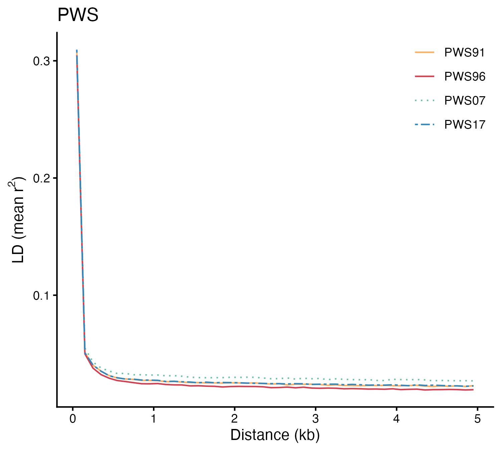
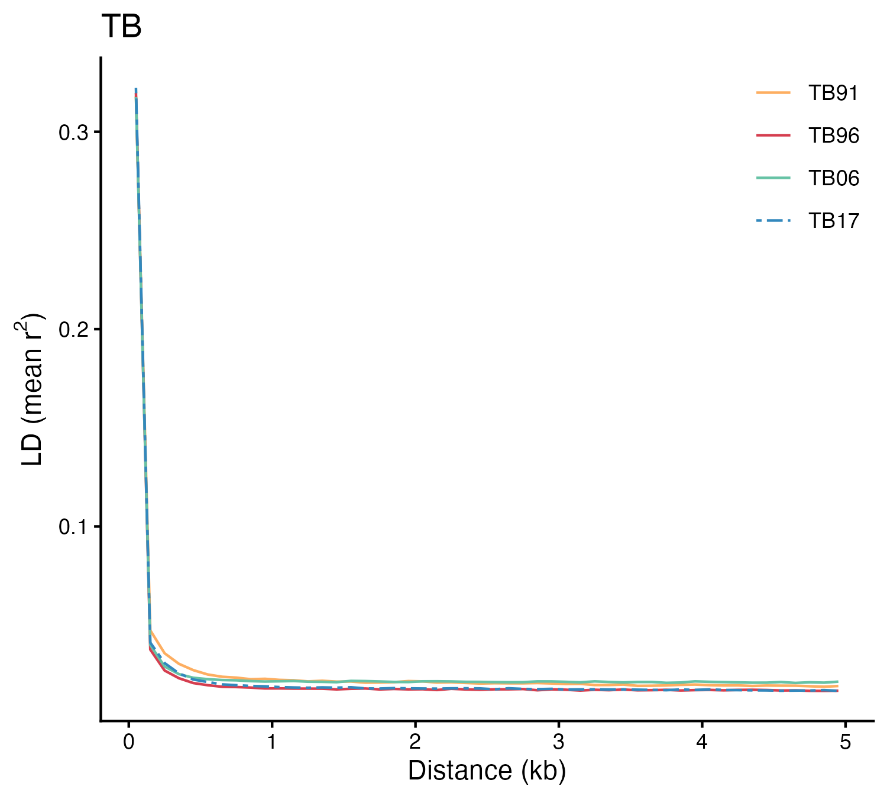
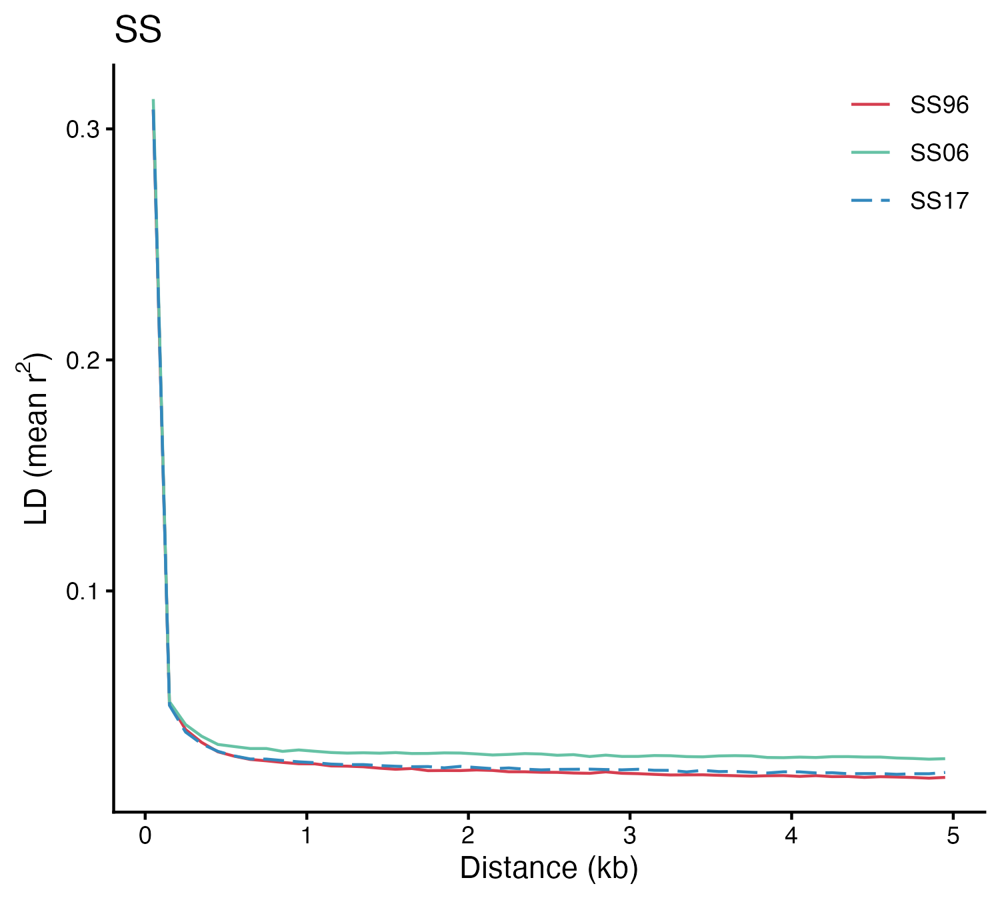
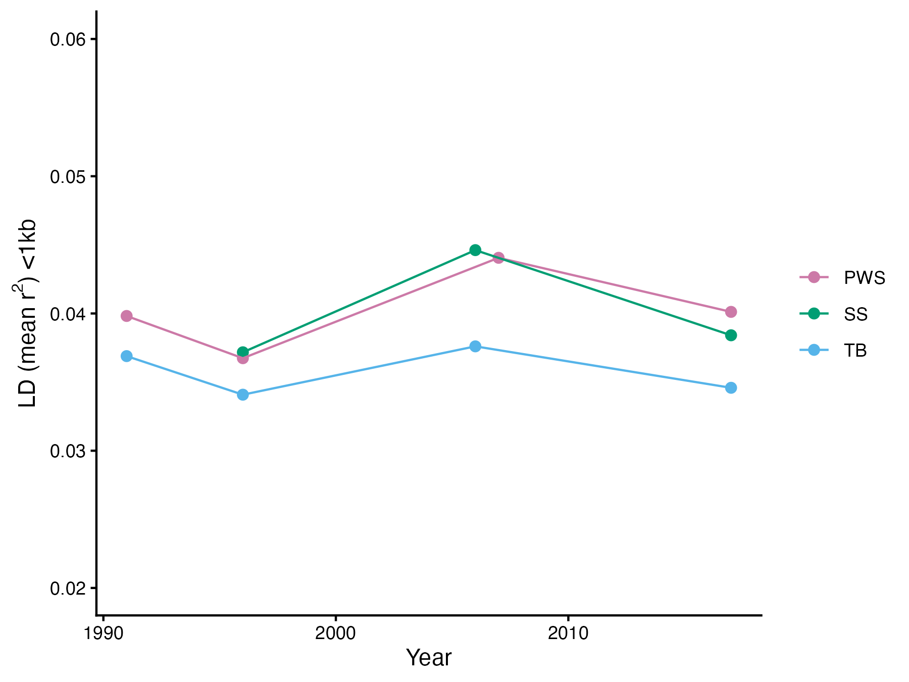
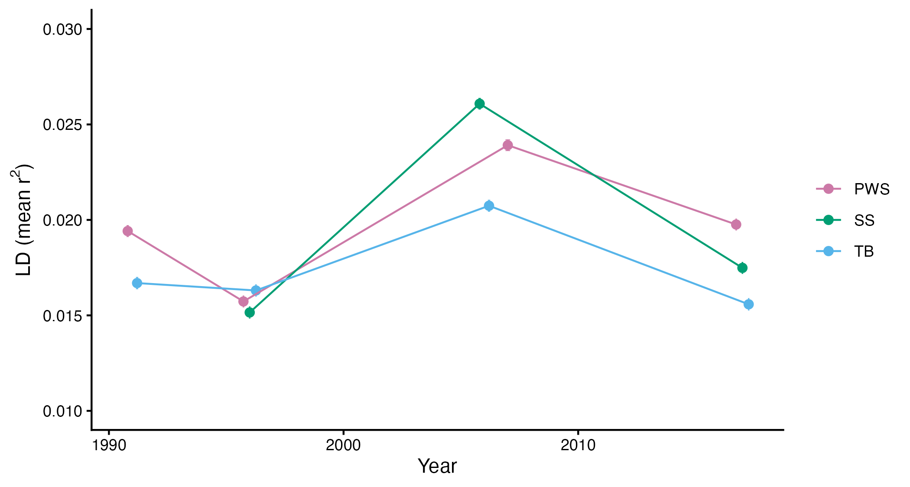
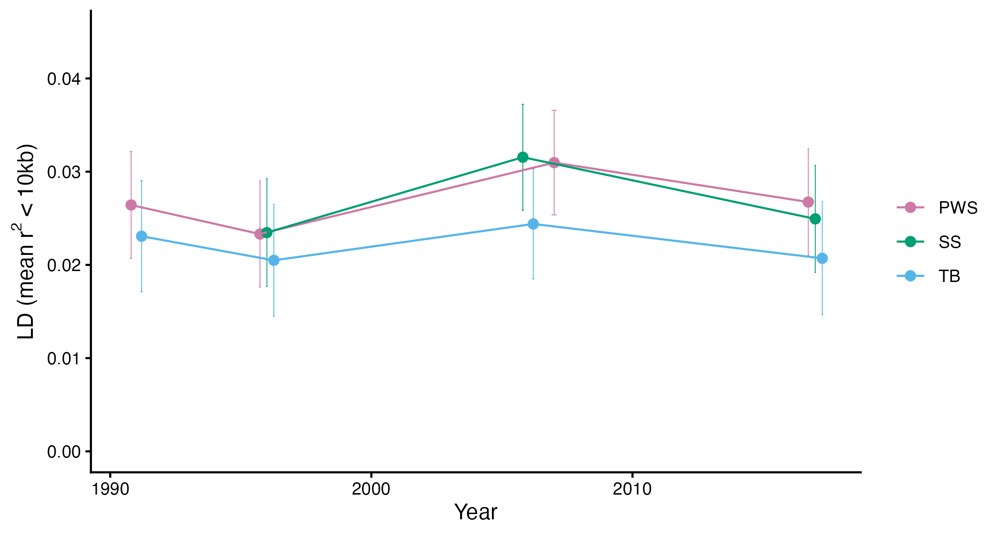
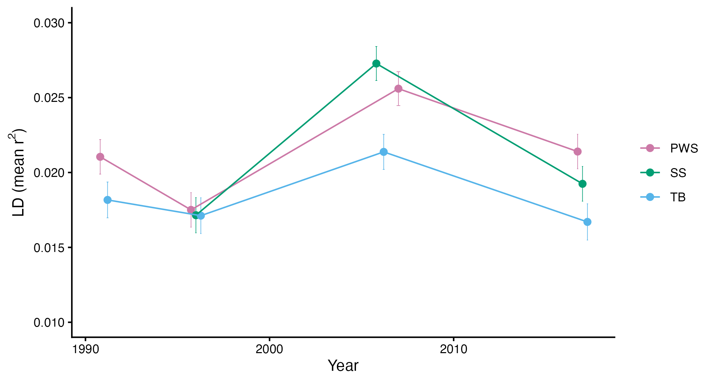
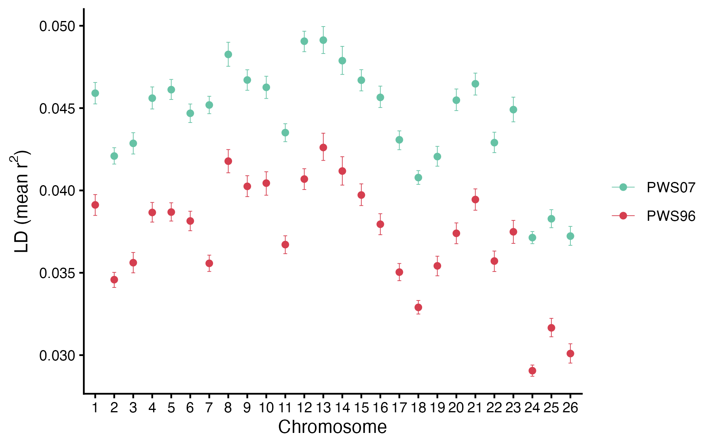

```{r eval=FALSE, message=FALSE, warning=FALSE, include=FALSE}
source("BaseScripts.R")
library(dplyr)
library(data.table)
library(RColorBrewer)
pal<-colorRampPalette(brewer.pal(8, "Spectral"))(8)
colors<-pal[c(3,1,7,8)]
    "#D53E4F" "#FDAE61" "#FEE08B" "#66C2A5"
```

# LD Decay Curve Analysis with ngsLD 

## Convert VCF to the beagle format 

```{r eval=FALSE, message=FALSE, warning=FALSE}
# vcf files not in the repository are available at: OSF Storage: https://osf.io/wrca4 Data/vcf/

# Craete a slurm script file to create beagle files
sink(paste0("../Scripts/create_beagle_file.sh"))
cat("#!/bin/bash -l\n")
cat(paste0("#SBATCH --job-name=beagle2 \n"))
cat(paste0("#SBATCH --mem=24G \n")) 
cat(paste0("#SBATCH --time=24:00:00  \n"))
cat(paste0("#SBATCH -p low  \n"))
cat("\n\n")
cat("module load vcftools")     
cat("\n\n")
    
for (i in 1:26){
    cat(paste0("vcftools --gzvcf /home/ktist/ph/3pops.MD2000_new.maf05.vcf.gz  --chr chr",i))
    cat(paste0(" --out /home/ktist/ph/beagle/3pops_c",i," --BEAGLE-PL \n"))
}

cat("\n")

#remove the head line and cat beagle files
for (i in 2:26){
    cat(paste0("sed -e '1, 1d' < /home/ktist/ph/beagle/3pops_c",i,".BEAGLE.PL > /home/ktist/ph/beagle/3pops_c",i,".2.BEAGLE.PL \n"))
}
cat("\n")

cat("cat /home/ktist/ph/beagle/3pops_c1.BEAGLE.PL ") 
for (i in 2:26){
    cat(paste0("/home/ktist/ph/beagle/3pops_c",i,".2.BEAGLE.PL "))
}
cat(paste0(" > /home/ktist/ph/beagle/3pops.BEAGLE.PL \n"))
cat("gzip /home/ktist/ph/beagle/3pops.BEAGLE.PL \n\n")

sink(NULL)

# Position information
bcftools query -f '%CHROM\t%POS\n' 3pops.MD2000_new.maf05.vcf.gz > 3pops.snps.pos
```


## Divide the bealgle files to each population group and run ngsLD
```{r eval=FALSE, message=FALSE, warning=FALSE}

# BEAGLE.PL.gz files available upon request
bea<-fread("~/Projects/PacHerring/plink/3pops.BEAGLE.PL") 
pop_size<-read.csv("../Data/popsize.csv")
pops<-pop_size$pop.yr

for (i in 1:length(pops)){
    colums<-grep(pops[i], colnames(bea))
    vec<-c(1:3, colums)
    df<-bea[,..vec]
    #drop the first 3 columns
    df<-df[, -c(1:3)]
    write.table(df, file=gzfile(paste0("~/Projects/PacHerring/plink/", pops[i],".geno.gz")), sep="\t", quote = F, row.names = FALSE, col.names = FALSE )
    print(i)
}

pos<-read.table("~/Projects/PacHerring/plink/3pops.snps.pos", sep="\t")

# Create scripts to run ngsLD
gfiles<-list.files("~/Projects/PacHerring/plink/", pattern="geno.gz")
sink("../Scripts/ngsLD.sh")
cat("#!/bin/bash -l")
cat("\n")
for (i in 1:length(pops)){
  cat(paste0("./ngsLD --geno ~/Projects/PacHerring/plink/", gfiles[i]," --probs --n_ind ",pop_size$Freq[i]," --pos ~/Projects/PacHerring/plink/3pops.snps.pos --max_kb_dist 200 --n_sites 351820 --n_threads 4 --out ~/Projects/PacHerring/plink/", pops[i],".ngsld 
 \n"))
}
sink(NULL)

#  --max_kb_dist is reduced to 200kb as we know LD decays radpidly in Pacific herring. 
```


## Create summary files for the output 
 * The output files are too big to read in R. Create bin summary files using awk first (See ngsLD_output_summarize.sh). 

```{r eval=FALSE, message=FALSE, warning=FALSE}
# Calculate mean r2 with a bin size of 100 kb and 1000 kb
sink("../Scripts/ngsLD_summarize.output.sh")
cat("#!/bin/bash -l")
cat("\n")
for (i in 1:length(pops)){
    cat("awk -v BIN=100 '  \n")
    cat('BEGIN{OFS=\"\\t\"} \n')
    cat("{")
    cat("  d = $3; r2 = $4;\n")
    cat('  if (d=="" || r2=="" ) next;\n')
    cat("  b = int(d/BIN)*BIN;\n")
    cat("  sum[b] += r2; n[b] += 1\n")
    cat("}\n")
    cat("END{ \n")
    cat("for (b in n) print b + BIN/2, n[b], sum[b]/n[b] \n")
    cat(paste0("}' /Volumes/Kaho_Data/PacHerring/plink/",pops[i],".ngsld | sort -n > ",pops[i],".lddecay100.tsv \n\n"))
}
sink(NULL)

```

# LD Decay Curve: 

## Plot LD using the binned summary 
```{r eval=FALSE, message=FALSE, warning=FALSE}

######################
# Plot LD decay
######################

pop_size<-read.csv("../Data/popsize.csv")
pops<-pop_size$pop.yr

# Read thes summary file
#1. 1000 bin size 
Bin.sum1<-data.frame()
for (i in 1:length(pops)){
    summary<-fread(paste0('~/Projects/PacHerring/plink/',pops[i],'.lddecay.tsv'), fill=TRUE)
    summary$pop<-pops[i]
    Bin.sum1<-rbind(Bin.sum1, summary)
}
names(Bin.sum1)[1:3]<-c("bin_mid","n","r2")

#2. 100 bin size
Bin.sum<-data.frame()
for (i in 1:length(pops)){
    # read in data
    summary<-fread(paste0('~/Projects/PacHerring/plink/',pops[i],'.lddecay100.tsv'), fill=TRUE)
    summary$pop<-pops[i]
    Bin.sum<-rbind(Bin.sum, summary)
}

names(Bin.sum)[1:3]<-c("bin_mid","n","r2")
summary(Bin.sum$n)
#   Min. 1st Qu.  Median    Mean 3rd Qu.    Max. 
#    204   20027   21273   22581   22930  208513

# Bin.sum1 for BIN=1000
#Min. 1st Qu.  Median    Mean 3rd Qu.    Max. 
# 204  199708  212843  224803  229227  806734 

# Remove those with less than 1000 loci
Bin.sum<-Bin.sum[n>=1000]

pws<-Bin.sum[grepl("PWS", Bin.sum$pop), ]
pws$pop<-factor(pws$pop, levels=c("PWS91","PWS96","PWS07","PWS17"))

#Plot with the 'smooth' function
ggplot(pws, aes(x = bin_mid/1000, y = r2, color=pop, linetype=pop)) +
    xlim(0,5)+ylim(0,0.07)+
    geom_smooth(method = "loess", se = FALSE, span = 0.2, linewidth=1) +
    labs( x = "Distance (kb)", y = expression("LD (mean " * r^2 * ")"),
          title = "PWS") +
    scale_linetype_manual(values = c(1,1,4,6))+
    theme_classic()+
    theme(legend.title = element_blank())+
    scale_color_manual(values=colors)
#ggsave(paste0("../Output/LD/LDdecay100.ngsLD.PWS.png"), width = 6, height = 4.5, dpi=300)

# Plot with a line function & only the distance <5000
pws<-pws[pws$bin_mid<5000,]
ggplot(pws, aes(x = bin_mid/1000, y = r2, color=pop, linetype=pop)) +
    geom_line() +
    labs( x = "Distance (kb)", y = expression("LD (mean " * r^2 * ")"),
          title = "PWS") +
    scale_linetype_manual(values = c(1,1,3,6))+
    theme_classic()+
    theme(legend.title = element_blank(),legend.position = c(1, 1), legend.justification = c(1, 1))+
    scale_color_manual(values=colors)
ggsave(paste0("../Output/LD/LDdecay100.ngsLD.PWS_line.png"), width = 5, height = 4.5, dpi=300)


# plot with those with distance < 600 only 
pws2<-pws[pws$bin_mid<600,]
ggplot(pws2, aes(x = bin_mid, y = r2, color=pop, linetype=pop)) +
    geom_line()+
    labs( x = "Distance (bp)", y = expression("LD (mean " * r^2 * ")"),
          title = "PWS") +
    scale_linetype_manual(values = c(1,1,1,6))+
    theme_classic()+
    theme(legend.title = element_blank())+
    scale_color_manual(values=colors)
ggsave(paste0("../Output/LD/LDdecay100.ngsLD.PWS_line.600.png"), width = 6, height = 4.5, dpi=300)


tb<-Bin.sum[grepl("TB", Bin.sum$pop), ]
tb$pop<-factor(tb$pop, levels=c("TB91","TB96","TB06","TB17"))
tb<-tb[tb$bin_mid<5000,]
ggplot(tb, aes(x = bin_mid/1000, y = r2, color=pop, linetype=pop)) +
    geom_line()+
    labs( x = "Distance (kb)", y = expression("LD (mean " * r^2 * ")"),
          title = "TB") +
    theme_classic()+
    scale_linetype_manual(values = c(1,1,1,6))+
     theme(legend.title = element_blank(),legend.position = c(1, 1), legend.justification = c(1, 1))+
    scale_color_manual(values=colors)
ggsave(paste0("../Output/LD/LDdecay100.ngsLD.TB_line.png"), width = 5, height = 4.5, dpi=300)

tb2<-tb[tb$bin_mid<600,]
ggplot(tb2, aes(x = bin_mid, y = r2, color=pop, linetype=pop)) +
    geom_line()+
    labs( x = "Distance (bp)", y = expression("LD (mean " * r^2 * ")"),
          title = "TB") +
    scale_linetype_manual(values = c(1,1,4,6))+
    theme_classic()+
    theme(legend.title = element_blank(),legend.position = c(1, 1), legend.justification = c(1, 1))+
    scale_color_manual(values=colors)
ggsave(paste0("../Output/LD/LDdecay100.ngsLD.TB_line.600.png"), width = 6, height = 4.5, dpi=300)


ss<-Bin.sum[grepl("SS", Bin.sum$pop), ]
ss$pop<-factor(ss$pop, levels=c("SS96","SS06","SS17"))
ss<-ss[ss$bin_mid<5000,]

ggplot(ss, aes(x = bin_mid/1000, y = r2, color=pop, linetype=pop)) +
    geom_line() +
    scale_linetype_manual(values = c(1,1,5))+
    #geom_smooth(method = "loess", se = FALSE, span = 0.2, linewidth=0.7) +
    labs( x = "Distance (kb)", y = expression("LD (mean " * r^2 * ")"),
          title = "SS") +
    theme_classic()+
    theme(legend.title = element_blank(),legend.position = c(1, 1), legend.justification = c(1, 1))+
    scale_color_manual(values=colors[2:4])
ggsave(paste0("../Output/LD/LDdecay100.ngsLD.SS_line.png"), width = 5, height = 4.5, dpi=300)

ss2<-ss[ss$bin_mid<600,]
ggplot(ss2, aes(x = bin_mid, y = r2, color=pop, linetype=pop)) +
    geom_line() +
    scale_linetype_manual(values = c(1,1,5))+
    labs( x = "Distance (bp)", y = expression("LD (mean " * r^2 * ")"),
          title = "SS") +
    theme_classic()+
    theme(legend.title = element_blank())+
    scale_color_manual(values=colors[2:4])
ggsave(paste0("../Output/LD/LDdecay100.ngsLD.SS_line.600.png"), width = 6, height = 4.5, dpi=300)


```








## Plot all points from ngsLD (without binning)
### PWS
```{r eval=FALSE, message=FALSE, warning=FALSE}
# Select the 3rd and 4th columns (distance and r2) from the ngsLD outouts using using awk at terminal
# e.g.
# awk 'BEGIN{OFS="\t"} {print $3, $4}' PWS91.ngsld > PWS91.c3c4.tsv
# awk 'BEGIN{OFS="\t"} {print $3, $4}' PWS07.ngsld > PWS07.c3c4.tsv
# awk 'BEGIN{OFS="\t"} {print $3, $4}' PWS17.ngsld > PWS17.c3c4.tsv
pop_names = c("PWS91","PWS96","PWS07","PWS17")

f<-fread("~/Projects/PacHerring/plink/PWS91.c3c4.tsv")
names(f)<- c("distance","r2")
f<-f[f$distance<600,]

{png("../Output/LD/PWS_LDdeacy_ngsLD_all_d600.png", width=5.5, height=5.5, units="in",res=300)
par(mar = c(5.1, 5.1, 4.1, 2.1)) 
plot(f$distance, f$r2, type="n", xlab = "Distance (bp)" ,ylab =  expression("LD (" * r^2 * ")"), main="PWS")
smooth_ld <-smooth.spline(f$distance, f$r2, spar = .15)
lines(smooth_ld, lwd = 1,lty = 1, col = colors[1])
for (i in c(2:length(pop_names))){
    df <- fread(paste0("/Users/kahotisthammer/Projects/PacHerring/plink/",pop_names[i],".c3c4.tsv"))
    setnames(df, c("distance","r2"))
    df<-df[df$distance <600,]
    smooth_ld <-smooth.spline(df$distance, df$r2, spar = .15)
    lines(smooth_ld, lwd = 1,lty = 1, col = colors[i])
}
legend("topright", # Position
       legend = c("1991", "1996","2007","2017"),
       col = colors, 
       lty = 1) 
dev.off()
}


# Create a table with means and medians 
pws.sum<-data.frame(matrix (nrow=4, ncol=0))
row.names(pws.sum)<-pop_names
for (i in 1:4){
    dt<-decay[decay$pop==pop_names[i],]
    pws.sum$mean100[i]<-mean(dt$r2[dt$distance<=100], na.rm = T)
    pws.sum$median100[i]<-median(dt$r2[dt$distance<=100], na.rm = T)
    pws.sum$mean200[i]<-mean(dt$r2[dt$distance<=200& dt$distance>100], na.rm = T)
    pws.sum$median200[i]<-median(dt$r2[dt$distance<=200& dt$distance>100], na.rm = T)
    pws.sum$mean500[i]<-mean(dt$r2[dt$distance<=600& dt$distance>200], na.rm = T)
    pws.sum$median500[i]<-median(dt$r2[dt$distance<=600& dt$distance>200], na.rm = T)
    pws.sum$mean[i]<-mean(dt$r2[dt$distance>600], na.rm = T)
    pws.sum$median[i]<-median(dt$r2[dt$distance>600], na.rm = T)
}
write.csv(pws.sum,"../Output/LD/LDdecay.summary.pws.csv")


# plotting with ggplot takes forever  due to too many points 
decay300<-decay[decay$distance<300,]
#ggplot(decay, aes(x=distance, y=r2, color=pop))+
#    geom_smooth(method = "loess", se = FALSE, span = 1)+
#     theme_minimal()+
#    scale_color_manual(values=colors)+
#    ylim(0,1)+xlab("Distance (bp)")+ylab('LD')+
#    theme(legend.title=element_blank())
#ggsave("../Output/LD/ngsLD.fulldecay_to_600bp.PWS.png", width = 6, height = 4.5, dpi=300)
```


### TB
```{r eval=FALSE, message=FALSE, warning=FALSE}
# Select the 3rd and 4th columns only by using awk at terminal
# awk 'BEGIN{OFS="\t"} {print $3, $4}'TB91.ngsld > TB91.c3c4.tsv

pop_names2<-c("TB91","TB96","TB06","TB17")
f2<- fread("~/Projects/PacHerring/plink/TB91.c3c4.tsv")
names(f2)<- c("distance","r2")
f2<-f2[f2$distance<600,]

{png("../Output/LD/TB_LDdeacy_ngsLD_all_d600.png", width=5.5, height=5.5, units="in",res=300)
par(mar = c(5.1, 5.1, 4.1, 2.1)) 
plot(f2$distance, f2$r2, type="n", xlab = "Distance (bp)" ,ylab =  expression("LD (" * r^2 * ")"), main="TB")
smooth_ld <-smooth.spline(f2$distance, f2$r2, spar = .15)
lines(smooth_ld, lwd = 1,lty = 1, col = colors[1])
for (i in c(2:length(pop_names2))){
    df <- fread(paste0("/Users/kahotisthammer/Projects/PacHerring/plink/",pop_names2[i],".c3c4.tsv"))
    setnames(df, c("distance","r2"))
    df<-df[df$distance <600,]
    smooth_ld <-smooth.spline(df$distance, df$r2, spar = .15)
    lines(smooth_ld, lwd = 1,lty = 1, col = colors[i])
}
legend("topright", # Position
       legend = c("1991", "1996","2006","2017"),
       col = colors, 
       lty = 1) 
dev.off()
}

```


### SS
```{r eval=FALSE, message=FALSE, warning=FALSE}
# Select the 3rd and 4th columns only by using awk at terminal
# awk 'BEGIN{OFS="\t"} {print $3, $4}' SS96.ngsld > SSS96.c3c4.tsv

pop_names3<-c("SS96","SS06","SS17")
f3<- fread("~/Projects/PacHerring/plink/SS96.c3c4.tsv")
names(f3)<- c("distance","r2")
f3<-f3[f3$distance<600,]

{png("../Output/LD/SS_LDdeacy_ngsLD_all_d600.png", width=5.5, height=5.5, units="in",res=300)
par(mar = c(5.1, 5.1, 4.1, 2.1)) 
plot(f3$distance, f3$r2, type="n", xlab = "Distance (bp)" ,ylab =  expression("LD (" * r^2 * ")"), main="SS")
smooth_ld <-smooth.spline(f3$distance, f3$r2, spar = .15)
lines(smooth_ld, lwd = 1,lty = 1, col = colors[2])
for (i in c(2:length(pop_names3))){
    df <- fread(paste0("/Users/kahotisthammer/Projects/PacHerring/plink/",pop_names3[i],".c3c4.tsv"))
    setnames(df, c("distance","r2"))
    df<-df[df$distance <600,]
    smooth_ld <-smooth.spline(df$distance, df$r2, spar = .15)
    lines(smooth_ld, lwd = 1,lty = 1, col = colors[i+1])
}
legend("topright", # Position
       legend = c("1996","2006","2017"),
       col = colors[2:4], 
       lty = 1) 
dev.off()
}
```


## Compare the LD decat curves between populations
```{r eval=FALSE, message=FALSE, warning=FALSE}

pop_names4<-c("TB17","PWS17","SS17")
f4<- fread("~/Projects/PacHerring/plink/TB17.c3c4.tsv")
names(f4)<- c("distance","r2")
f4<-f4[f4$distance<600,]

{png("../Output/LD/LDdeacy_ngsLD_all_d600_3pops.2017.png", width=5.5, height=5.5, units="in",res=300)
par(mar = c(5.1, 5.1, 4.1, 2.1)) 
plot(f4$distance, f4$r2, type="n", xlab = "Distance (bp)" ,ylab =  expression("LD (" * r^2 * ")"), main="2017")
smooth_ld <-smooth.spline(f4$distance, f4$r2, spar = .15)
lines(smooth_ld, lwd = 1,lty = 1, col = cols[1])
for (i in c(2:length(pop_names4))){
    df <- fread(paste0("/Users/kahotisthammer/Projects/PacHerring/plink/",pop_names4[i],".c3c4.tsv"))
    setnames(df, c("distance","r2"))
    df<-df[df$distance <600,]
    smooth_ld <-smooth.spline(df$distance, df$r2, spar = .15)
    lines(smooth_ld, lwd = 1,lty = 1, col = colors[i+1])
}
legend("topright", # Position
       legend = c("TB17","PWS17","SS17"),
       col = cols[1:3], 
       lty = 1) 
dev.off()
}

pop_names4<-c("TB06","PWS07","SS06")
f4<- fread("~/Projects/PacHerring/plink/TB06.c3c4.tsv")
names(f4)<- c("distance","r2")
f4<-f4[f4$distance<600,]

{png("../Output/LD/LDdeacy_ngsLD_all_d600_3pops.2006.png", width=5.5, height=5.5, units="in",res=300)
par(mar = c(5.1, 5.1, 4.1, 2.1)) 
plot(f4$distance, f4$r2, type="n", xlab = "Distance (bp)" ,ylab =  expression("LD (" * r^2 * ")"),  main="2006/07")
smooth_ld <-smooth.spline(f4$distance, f4$r2, spar = .15)
lines(smooth_ld, lwd = 1,lty = 1, col = cols[1])
for (i in c(2:length(pop_names4))){
    df <- fread(paste0("/Users/kahotisthammer/Projects/PacHerring/plink/",pop_names4[i],".c3c4.tsv"))
    setnames(df, c("distance","r2"))
    df<-df[df$distance <600,]
    smooth_ld <-smooth.spline(df$distance, df$r2, spar = .15)
    lines(smooth_ld, lwd = 1,lty = 1, col = colors[i+1])
}
legend("topright", # Position
       legend = pop_names4,
       col = cols[1:3], 
       lty = 1) 
dev.off()
}


pop_names4<-c("TB96","PWS96","SS96")
f4<- fread("~/Projects/PacHerring/plink/TB96.c3c4.tsv")
names(f4)<- c("distance","r2")
f4<-f4[f4$distance<600,]

{png("../Output/LD/LDdeacy_ngsLD_all_d600_3pops.1996.png", width=5.5, height=5.5, units="in",res=300)
par(mar = c(5.1, 5.1, 4.1, 2.1)) 
plot(f4$distance, f4$r2, type="n", xlab = "Distance (bp)" ,ylab =  expression("LD (" * r^2 * ")"), main="1996")
smooth_ld <-smooth.spline(f4$distance, f4$r2, spar = .15)
lines(smooth_ld, lwd = 1,lty = 1, col = cols[1])
for (i in c(2:length(pop_names4))){
    df <- fread(paste0("/Users/kahotisthammer/Projects/PacHerring/plink/",pop_names4[i],".c3c4.tsv"))
    setnames(df, c("distance","r2"))
    df<-df[df$distance <600,]
    smooth_ld <-smooth.spline(df$distance, df$r2, spar = .15)
    lines(smooth_ld, lwd = 1,lty = 1, col = colors[i+1])
}
legend("topright", # Position
       legend = pop_names4,
       col = cols[1:3], 
       lty = 1) 
dev.off()
}

```


# Mean R2 comparison between populations and over time

## Summarize R2 based on raw numbers -no CIs

```{r eval=FALSE, message=FALSE, warning=FALSE}

pop_info<-read.csv("../Data/Sample_metadata_892pops.csv")
pop_info<-pop_info[,c("Sample","Population.Year","pop","Year.Collected")]
colnames(pop_info)[4]<-"Year"
pops<-unique(pop_info$Population.Year[grep("PWS|SS|TB",pop_info$Population.Year)])
popsinfo<-pop_info[!duplicated(pop_info[c(2,3,4)]),2:4]
popsinfo<-popsinfo[grepl("PWS|SS|TB", popsinfo$pop),]

Summary<-popsinfo
for (i in 1:length(pops)){
    dt <- fread(paste0("~/Projects/PacHerring/plink/",pops[i],".c3c4.tsv"), header = FALSE)
    setnames(dt, c("distance","r2"))
    Summary$mean100[i]  <-mean  (dt$r2[dt$distance<=100], na.rm = T)
    Summary$median100[i]<-median(dt$r2[dt$distance<=100], na.rm = T)
    Summary$mean200[i]  <-mean  (dt$r2[dt$distance<=200& dt$distance>100], na.rm = T)
    Summary$median200[i]<-median(dt$r2[dt$distance<=200& dt$distance>100], na.rm = T)
    Summary$mean500[i]  <-mean (dt$r2[dt$distance<=600& dt$distance>200], na.rm = T)
    Summary$median500[i]<-median(dt$r2[dt$distance<=600& dt$distance>200], na.rm = T)
    Summary$mean.above600[i]     <-mean  (dt$r2[dt$distance>600], na.rm = T)
    Summary$median.above600[i]   <-median(dt$r2[dt$distance>600], na.rm = T)
    Summary$mean.1000[i]<- mean  (dt$r2[dt$distance<=1000], na.rm = T)
    Summary$median.1000[i]<- median  (dt$r2[dt$distance<=1000], na.rm = T)
    Summary$mean.10000[i]<- mean  (dt$r2[dt$distance<=10000], na.rm = T)
    Summary$median.10000[i]<- median  (dt$r2[dt$distance<=10000], na.rm = T)
    Summary$mean[i]  <-mean  (dt$r2, na.rm = T)
    Summary$median[i]<-median(dt$r2, na.rm = T)
}
write.csv(Summary, "../Output/LD/LD_R2.mean.summary.csv")
Summary<- read.csv("../Output/LD/LD_R2.mean.summary.csv", row.names = 1)

ggplot(Summary, aes(x=Year, y=mean.1000, color=pop ))+
    geom_point(size=2)+
    geom_line()+
    theme_classic()+ 
    scale_color_manual(values=cols[c(2,3,1)])+theme(legend.title=element_blank())+
    labs(y = expression("LD (mean " * r^2 * ") <1kb"), x='Year')+
    ylim(0.09, 0.12)
ggsave("../Output/LD/LD.summary.r2_1000.png", width = 6, height = 4.5, dpi=300)

ggplot(Summary, aes(x=Year, y=mean.10000, color=pop ))+
    geom_point(size=2)+
    geom_line()+
    theme_classic()+ 
    scale_color_manual(values=cols[c(2,3,1)])+theme(legend.title=element_blank())+
    labs(y = expression("LD (mean " * r^2 * ") <1kb"), x='Year')+
    ylim(0.02, 0.06)
ggsave("../Output/LD/LD.summary.r2_10000.png", width = 6, height = 4.5, dpi=300)


ggplot(Summary, aes(x=Year, y=mean, color=pop ))+
    geom_point(size=2)+
    geom_line()+
    theme_classic()+ 
    scale_color_manual(values=cols[c(2,3,1)])+theme(legend.title=element_blank())+
    labs(y = expression("LD (mean " * r^2 * ") <1kb"), x='Year')
    ylim(0.02, 0.06)
ggsave("../Output/LD/LD.summary.r2_10000.png", width = 6, height = 4.5, dpi=300)

```

Distance <10000

Using all data points



## Summary based on bin to calculate CIs
```{r eval=FALSE, message=FALSE, warning=FALSE}

mean_ci <- function(x, conf = 0.95){
  x <- x[is.finite(x)]
  m <- mean(x)
  se <- sd(x) / sqrt(length(x))
  alpha <- 1 - conf
  tcrit <- qt(1 - alpha/2, df = length(x) - 1)
  c(mean = m, lwr = m - tcrit*se, upr = m + tcrit*se, n = length(x))
}

Summary.bin<-popsinfo
for (i in 1:length(pops)){
    dt <- Bin.sum[Bin.sum$pop==pops[i],]
    ci<-mean_ci(dt$r2, conf=0.95)
    Summary.bin$mean[i]  <-ci[1]
    Summary.bin$lwr.CI[i]<-ci[2]
    Summary.bin$upr.CI[i]<-ci[3]
    
    ci<-mean_ci(dt$r2[dt$bin_mid<1000], conf=0.95)
    Summary.bin$mean1000[i]  <-ci[1]
    Summary.bin$lwr.CI1000[i]<-ci[2]
    Summary.bin$upr.CI1000[i]<-ci[3]
    
    ci<-mean_ci(dt$r2[dt$bin_mid<10000], conf=0.95)
    Summary.bin$mean10000[i]  <-ci[1]
    Summary.bin$lwr.CI10000[i]<-ci[2]
    Summary.bin$upr.CI10000[i]<-ci[3]
    
    ci<-mean_ci(dt$r2[dt$bin_mid<50000], conf=0.95)
    Summary.bin$mean50000[i]  <-ci[1]
    Summary.bin$lwr.CI50000[i]<-ci[2]
    Summary.bin$upr.CI50000[i]<-ci[3]
}
write.csv(Summary.bin, "../Output/LD/LD.100bin.summary.csv")

ggplot(Summary.bin, aes(x=Year, y=mean10000, color=pop, group=pop))+
    geom_point(size=2,position=position_dodge(width=0.8))+
    geom_errorbar(aes(ymin=lwr.CI10000, ymax=upr.CI10000), width=.2, size=.2,position=position_dodge(width=0.8))+
    geom_line(position=position_dodge(width=0.8))+
    theme_classic() +
    scale_color_manual(values=cols[c(2,3,1)])+theme(legend.title=element_blank())+
    labs(y = expression("LD (mean " * r^2 * " < 10kb)"), x='Year')+
    ylim(0, 0.045)
ggsave("../Output/LD/LD.bin.summary.r2_10000.png", width = 7, height = 3.75, dpi=300)

ggplot(Summary.bin, aes(x=Year, y=mean50000, color=pop, group=pop))+
    geom_point(size=2,position=position_dodge(width=0.8))+
    geom_errorbar(aes(ymin=lwr.CI50000, ymax=upr.CI50000), width=.2, size=.2,position=position_dodge(width=0.8))+
    geom_line(position=position_dodge(width=0.8))+
    theme_classic() +
    scale_color_manual(values=cols[c(2,3,1)])+theme(legend.title=element_blank())+
    labs(y = expression("LD (mean " * r^2 * ")"), x='Year')+
    ylim(0.01, 0.03)
ggsave("../Output/LD/LD.bin.summary.r2_50000.png", width = 7, height = 3.75, dpi=300)

ggplot(Summary.bin, aes(x=Year, y=mean, color=pop, group=pop))+
    geom_point(size=2,position=position_dodge(width=0.8))+
    geom_errorbar(aes(ymin=lwr.CI, ymax=upr.CI), width=.2, size=.2,position=position_dodge(width=0.8))+
    geom_line(position=position_dodge(width=0.8))+
    theme_classic() +
    scale_color_manual(values=cols[c(2,3,1)])+theme(legend.title=element_blank())+
    labs(y = expression("LD (mean " * r^2 * ")"), x='Year')+
    ylim(0.01, 0.03)
ggsave("../Output/LD/LD.bin.summary.r2.png", width = 7, height = 3.75, dpi=300)

## Using 1000 bin
Summary.bin1<-popsinfo
for (i in 1:length(pops)){
    dt <- Bin.sum1[Bin.sum1$pop==pops[i],]
    ci<-mean_ci(dt$r2, conf=0.95)
    Summary.bin1$mean[i]  <-ci[1]
    Summary.bin1$lwr.CI[i]<-ci[2]
    Summary.bin1$upr.CI[i]<-ci[3]
    
    ci<-mean_ci(dt$r2[dt$bin_mid<1000], conf=0.95)
    Summary.bin1$mean1000[i]  <-ci[1]
    Summary.bin1$lwr.CI1000[i]<-ci[2]
    Summary.bin1$upr.CI1000[i]<-ci[3]
    
    ci<-mean_ci(dt$r2[dt$bin_mid<10000], conf=0.95)
    Summary.bin1$mean10000[i]  <-ci[1]
    Summary.bin1$lwr.CI10000[i]<-ci[2]
    Summary.bin1$upr.CI10000[i]<-ci[3]
    
    ci<-mean_ci(dt$r2[dt$bin_mid<50000], conf=0.95)
    Summary.bin1$mean50000[i]  <-ci[1]
    Summary.bin1$lwr.CI50000[i]<-ci[2]
    Summary.bin1$upr.CI50000[i]<-ci[3]
}
write.csv(Summary.bin1, "../Output/LD/LD.1000bin.summary.csv")

ggplot(Summary.bin1, aes(x=Year, y=mean50000, color=pop, group=pop))+
    geom_point(size=2,position=position_dodge(width=0.8))+
    geom_errorbar(aes(ymin=lwr.CI50000, ymax=upr.CI50000), width=.2, size=.2,position=position_dodge(width=0.8))+
    geom_line(position=position_dodge(width=0.8))+
    theme_classic() +
    scale_color_manual(values=cols[c(2,3,1)])+theme(legend.title=element_blank())+
    labs(y = expression("LD (mean " * r^2 * " < 10kb)"), x='Year')+
    ylim(0, 0.04)
ggsave("../Output/LD/LD.1kbin.summary.r2_50000.png", width = 7, height = 3.75, dpi=300)

ggplot(Summary.bin1, aes(x=Year, y=mean, color=pop, group=pop))+
    geom_point(size=2,position=position_dodge(width=0.8))+
    geom_errorbar(aes(ymin=lwr.CI, ymax=upr.CI), width=.2, size=.2,position=position_dodge(width=0.8))+
    geom_line(position=position_dodge(width=0.8))+
    theme_classic() +
    scale_color_manual(values=cols[c(2,3,1)])+theme(legend.title=element_blank())+
    labs(y = expression("LD (mean " * r^2 * ")"), x='Year')+
    ylim(0.0, 0.032)

```


Distance <10000 with bin =100


 Distance <50000



* CIs get smaller as we include more data points as CIs are calculated based on summerzied data as mean +- t*s/sqrt(n) but this ignores strong dependence between bin.genomic regions


## Chromosome level LD + CIs in PWS96 and PWS 07

```{r eval=FALSE, message=FALSE, warning=FALSE}
# Divide the ngsLd results into chromosomes

#awk -F'\t' 'BEGIN{OFS="\t"}
#{
#  split($1,a,":"); chr=a[1];
#  print $1, $3, $4 > (chr ".PWS96.ngsld.txt")
#}
#' /Volumes/Kaho_Data/PacHerring/plink/PWS96.ngsld
#
#
#awk -F'\t' 'BEGIN{OFS="\t"}
#{
#  split($1,a,":"); chr=a[1];
#  print $1, $3, $4 > (chr ".PWS07.ngsld.txt")
#}
#' /Volumes/Kaho_Data/PacHerring/plink/PWS07.ngsld

# Read divided files and bootstrap to get 95% CIs

bootCI<-data.frame()
for (i in 1:26){
    dt <- fread(paste0("~/Projects/PacHerring/plink/chr",i,".PWS96.ngsLD.txt"), col.names = c("chr","distance","r2"))
    dt <- dt[is.finite(r2) & is.finite(distance)]
    X <- 10000  # distance cutoff in bp (e.g., 1 kb)
    per_chr <- dt[distance <= X, .(mean_r2 = mean(r2), n_pairs = .N), by = chr]

    set.seed(1)
    B <- 2000
    chrs <- per_chr$chr

    boot_means <- replicate(B, {
      samp <- sample(chrs, size = length(chrs), replace = TRUE)
      tmp <- per_chr[chr %in% samp]
      weighted.mean(tmp$mean_r2, w = tmp$n_pairs)
    })

    ci <- quantile(boot_means, c(0.025, 0.975))
    result<-c(mean = weighted.mean(per_chr$mean_r2, per_chr$n_pairs), lwr = ci[[1]], upr = ci[[2]])
    result$chr<-i
    bootCI<-rbind(bootCI, result)
    
}

ggplot(bootCI.pws07, aes(x=factor(chr), y=mean))+
    geom_point()+
    geom_errorbar(aes(ymin=lwr, ymax=upr), width=.2, size=.3)


bootCI.pws07<-data.frame()
for (i in 1:26){
    dt2 <- fread(paste0("~/Projects/PacHerring/plink/chr",i,".PWS07.ngsLD.txt"), col.names = c("chr","distance","r2"))
    dt <- dt[is.finite(r2) & is.finite(distance)]
    X <- 10000  # distance cutoff in bp (e.g., 1 kb)
    per_chr <- dt[distance <= X, .(mean_r2 = mean(r2), n_pairs = .N), by = chr]

    set.seed(1)
    B <- 2000
    chrs <- per_chr$chr

    boot_means <- replicate(B, {
      samp <- sample(chrs, size = length(chrs), replace = TRUE)
      tmp <- per_chr[chr %in% samp]
      weighted.mean(tmp$mean_r2, w = tmp$n_pairs)
    })

    ci <- quantile(boot_means, c(0.025, 0.975))
    result<-c(mean = weighted.mean(per_chr$mean_r2, per_chr$n_pairs), lwr = ci[[1]], upr = ci[[2]])
    result$chr<-i
    bootCI.pws07<-rbind(bootCI.pws07, result)
    print(i)
}

bootCI$Year<-"PWS96"
bootCI.pws07$Year<-"PWS07"

bootCI<-rbind(bootCI,bootCI.pws07)

ggplot(bootCI, aes(x=factor(chr), y=mean, color=Year, group=Year))+
    geom_point(size=1.5)+
    geom_errorbar(aes(ymin=lwr, ymax=upr), width=.2, size=.2)+
    theme_classic() +
    scale_color_manual(values=colors[c(3,2)])+theme(legend.title=element_blank())+
    labs(y = expression("LD (mean " * r^2 * ")"), x='Chromosome')
ggsave("../Output/LD/Chr.level.comparison.PWS96_07.png", width = 6, height = 3.75, dpi=300)

    
    
    
    
```




# LD from Plink
## Create summary files by bin and plot them with ggplot
```{r eval=FALSE, message=FALSE, warning=FALSE}

# LD R2 from Plink
# e.g.
# plink --bfile PWS91 --r2 gz --ld-window 99999 --ld-window-kb 2000 --ld-window-r2 0 --out PWS91_r2
# -> Ooutput files are big and LD decay happens very quickly. Adjusted the --ld-window-kb 200, as the results didn't change.
# Used code
#plink --bfile PWS91 --r2 gz --ld-window 99999 --ld-window-kb 200 --ld-window-r2 0 --out PWS91_r2_200


pop_names = c("PWS91","PWS96","PWS07","PWS17")
# ---- choose binning ----
bin_size_bp <- 500      # 1 kb bins (change to 5000, 10000, etc.)
max_dist_bp <- 1000000       # match your --ld-window-kb (1 Mb)
Summary<-data.frame()
for (i in 1:length(pop_names)){
    l <- fread(paste0("~/Projects/PacHerring/plink/",pop_names[i],"_r2_200.ld.gz"), header = TRUE)
    l$distance <- l$BP_B-l$BP_A
    l <- l[distance <= max_dist_bp & !is.na(R2) & is.finite(R2)]
    l[, bin := floor(distance / bin_size_bp) * bin_size_bp]
    l[, bin_mid := bin + bin_size_bp/2]
    l <- l[get("CHR_A") == get("CHR_B")]
    
    summ <- l[, .(
        n_pairs = .N,
        mean_r2 = mean(R2),
        median_r2 = median(R2),
        q25 = quantile(R2, 0.25),
        q75 = quantile(R2, 0.75)
    ), by = bin_mid][order(bin_mid)]
    
    ggplot(summ, aes(x = bin_mid/1000, y = mean_r2)) +
        geom_ribbon(aes(ymin = q25, ymax = q75), alpha = 0.2) +
        geom_line(linewidth = 0.7) +
        xlim(0,5)+
        geom_smooth(method = "loess", se = FALSE, span = 0.2, linewidth=0.5, color=red,linetype=4) +
        labs( x = "Distance (kb)", y = expression("LD (mean " * r^2 * ")"),
             title = paste0(pop_names[i]," LD decay Mean")) +
        theme_classic()
    ggsave(paste0("../Output/LD/LD.decay.",pop_names[i],".Bin500.Win200,mean.png"), width = 6, height = 5, dpi=300)
    
    ggplot(summ, aes(x = bin_mid/1000, y = median_r2)) +
        geom_ribbon(aes(ymin = q25, ymax = q75), alpha = 0.2) +
        geom_line(linewidth = 0.7) +
        xlim(0,5)+
        geom_smooth(method = "loess", se = FALSE, span = 0.2, linewidth=0.5, color=red,linetype=4) +
        labs( x = "Distance (kb)", y = expression("LD (mean " * r^2 * ")"),
              title = paste0(pop_names[i]," LD decay Median")) +
        theme_classic()
    ggsave(paste0("../Output/LD/LD.decay.",pop_names[i],".Bin500.Win200.median.png"), width = 6, height = 5, dpi=300)
    
    summ$pop<-pop_names[i]        
    Summary<-rbind(Summary, summ)
}

# Plot all years together

Summary$pop<-factor(Summary$pop, levels=pop_names)
library(RColorBrewer)
ggplot(Summary, aes(x = bin_mid/1000, y = mean_r2, color=pop)) +
    #geom_ribbon(aes(ymin = q25, ymax = q75), alpha = 0.2) +
    geom_line(linewidth = 0.7) +
    xlim(0,5)+
    #geom_smooth(method = "loess", se = FALSE, span = 0.2, linewidth=0.5, color=red,linetype=4) +
    labs( x = "Distance (kb)", y = expression("LD (mean " * r^2 * ")"),
          title = "PWS") +
    theme_classic()+
    theme(legend.title = element_blank())+
    scale_color_manual(values=pal[c(9, 7,6, 4)])
ggsave(paste0("../Output/LD/LD.decay.PWSall.Bin500.Win200,mean.png"), width = 6, height = 5, dpi=300)

```


## Plot the all points (without binning)
```{r eval=FALSE, message=FALSE, warning=FALSE}
pal2<-colorRampPalette(brewer.pal(8, "YlGnBu"))(10)
col2<-pal2[c(9,7,5,4)]
"#1D52A0" "#289DC1" "#78CABB" "#AFDFB6"

### Basic plots with all points ###

ld91<-fread("~/Projects/PacHerring/plink/PWS91_r2_200.ld.gz", header=TRUE)
ld91$distance <- ld91$BP_B-ld91$BP_A
ld91 <- ld91[get("CHR_A") == get("CHR_B")]

#cut the data to distance <1500 b
ld91.2<-ld91[ld91$distance <1500,]

{png("../Output/LD/PWS.LDdecay.basic.png", width=6.5, height=5.5, units="in",res=300)
plot(ld91.2$distance, ld91.2$R2, type="n", xlab = "Distance (bp)", main="PWS", ylab =  expression("LD (" * r^2 * ")"))
smooth_ld <-smooth.spline(ld91.2$distance, ld91.2$R2, spar = .15)
lines(smooth_ld, lwd = 1,lty = 1, col = col2[1])
colors2<-pal[c(9,7,5,4)]
for (i in c(3:length(pop_names))){
    ld <- fread(paste0("~/Projects/PacHerring/plink/",pop_names[i],"_r2_200.ld.gz"), header = TRUE)
    ld$distance <- ld$BP_B-ld$BP_A
    ld<-ld[ld$distance <1500,]
    smooth_ld <-smooth.spline(ld$distance, ld$R2, spar = .15)
    lines(smooth_ld, lwd = 1,lty = 1, col = col2[i])
}
legend("topright", # Position
       legend = c("1991", "1996","2007","2017"), 
       col = col2, 
       lty = 1) 
dev.off()
}

### TB
pop_names2<-c("TB91","TB96","TB06","TB17")

ld1<-fread("~/Projects/PacHerring/plink/TB91_r2_200.ld.gz", header=TRUE)
ld1$distance <- ld1$BP_B-ld1$BP_A
ld1 <- ld1[get("CHR_A") == get("CHR_B")]

#cut the data to distance <1500 b
ld1.2<-ld1[ld1$distance <1500,]

{png("../Output/LD/TB.LDdecay.basic.png", width=6.5, height=5.5, units="in",res=300)

plot(ld1.2$distance, ld1.2$R2, type="n", xlab = "Distance (bp)", main="TB", ylab =  expression("LD (" * r^2 * ")"))
smooth_ld <-smooth.spline(ld91.2$distance, ld91.2$R2, spar = .15)
lines(smooth_ld, lwd = 1,lty = 1, col = col2[1])
for (i in c(2:length(pop_names2))){
    ld <- fread(paste0("~/Projects/PacHerring/plink/",pop_names2[i],"_r2_200.ld.gz"), header = TRUE)
    ld$distance <- ld$BP_B-ld$BP_A
    ld<-ld[ld$distance <1500,]
    smooth_ld <-smooth.spline(ld$distance, ld$R2, spar = .15)
    lines(smooth_ld, lwd = 1,lty = 1, col = col2[i])
}
legend("topright", # Position
       legend = c("1991", "1996","2007","2017"), # Labels for the data series
       col = col2, # Colors matching the plot
       lty = 1) 
dev.off()
}
```

** PWS


** TB


